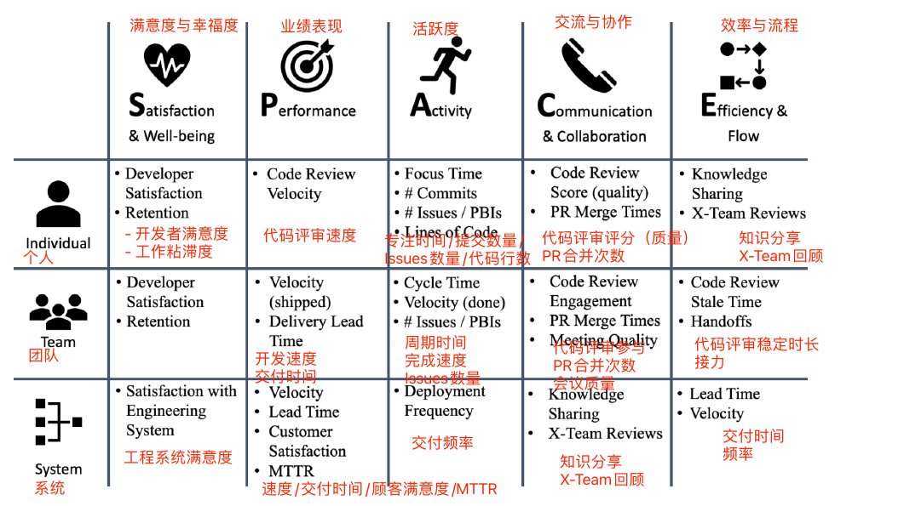
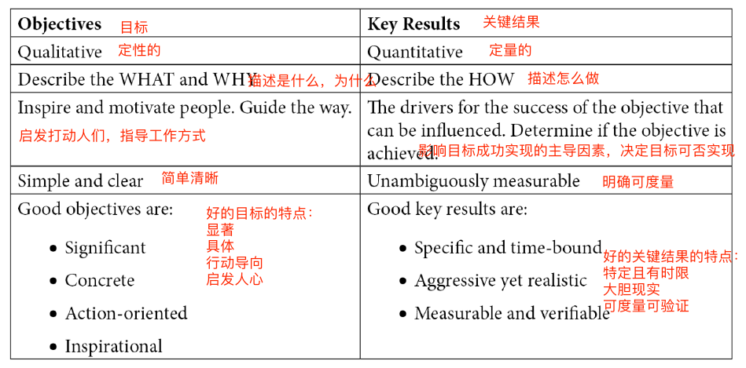

# 第1章 重要的指标

实现DevOps最困难的部分是通过与管理层交流产生的思想转变。管理层通常会问以下几个问题：

- 实施它消耗多少成本？
- 实施它我们从中能收益多少？

从管理者的角度来看，这些都是很合理的问题。但是在DevOps的世界中，如果在错误的时间以错误的方式回答这些问题，这些问题可能是有害的，并可能导致产生大量的预先计划工作。在本章中将介绍可以与管理层开展从传统努力到一般的工程速度和开发者生产力的转变讨论的度量标准。

本章同时解释如何度量工程速度和开发者生产力，并且如何让DevOps加速变得可衡量。

本章包括如下主题：

- 为什么要加速？
- 工程速度
- 高绩效公司
- 重要的指标
- SPACE开发者生产力框架
- 目标和主要成果

## 为什么要加速？

企业的预期寿命正在迅速缩短。耶鲁大学管理学院的Richard Foster表示，100年前 **标准普尔500指数（S&P 500）** 上市公司的平均寿命为67年，而现在是15年，并且每两周就有一家标普上市公司退出市场。到2027年，预计500强企业中75%将被新企业取代。Santa Fe 研究所的另一项研究《公司的死亡率》得出的结论是，美国所有行业公司的平均寿命约为10年。

为了保持竞争力，公司不仅要解决客户的问题，还需要提供让客户满意的产品和服务，并且必须能够与市场互动，对不断变化的需求做出快速反应。**上市时间**是业务敏捷性最重要的驱动因素。

在任何行业，软件都是各个产品和服务的核心，这不仅是因为数字体验已经变得和物理体验一样重要（甚至可能比物理体验更重要）。软件涉及产品生命周期的每个部分，例如：

- 产品
  - 供应链管理
  - 成本优化/预测性维护/机器人技术
  - 产品个性化？？？（lot size 1）
- 售前售后服务
  - 在线商店
  - 顾客服务与支持
  - 社交媒体
  - 数字助理
- 数字产品
  - 附属应用
  - 应用集成
  - 移动体验
  - 新商业模式（按使用支付，租借，等等）

以上只是一些例子来说明客户与公司是数字化的。例如你最近想买一辆车，你已经从社交媒体和报道中了解到这个品牌。你可以在网站上购买和配置车辆，也可以在线下有销售人员的商店，当然是通过看平板电脑。机器人技术和 **人工智能（AI）** 对装配线的优化会影响到汽车的价格。你在车上要做的第一件事就是连接你的手机。开车时，你可以听音乐、打电话或使用语音回复短信。如果车辆前方有障碍物，驾驶助手会为你刹车，以保证你的安全，并确保你在自己的车道上行驶。很快，汽车将自动完成大部分驾驶任务。如果你的汽车或应用程序出了问题，很大概率你会使用应用程序或电子邮件联系售后服务，尤其是对年轻一代来说。汽车成为了一个数字产品。不仅有数百万行代码在汽车中运行，还有数百万行代码为汽车的应用程序、网站和装配线提供动力（图1.1）。

图1-1 软件和数据成为顾客体验的核心

软件的优势在于更新速度比硬件快得多。为了加快上市时间和业务敏捷性，软件是关键的驱动因素。它比硬件组件灵活得多，可以在几天或几周内更换，而不是几个月或几年。它还可以更好地与客户联系。使用应用程序的客户比在实体商店的客户更有可能对调查做出回应。此外，硬件也不能遥测产品的使用情况。

要想成为经营时间超过10年的公司之一，你的公司必须利用软件的力量来加速市场反应，并以出色的数字体验取悦客户。

## 工程速度

你的公司是如何衡量开发速度的？最常见的方法评估努力。曾经有一些公司使用诸如代码行数或代码测试覆盖率之类的度量标准，但这些显然是糟糕的选择，不知道现在还有哪家公司还在这么做。如果可以通过1行代码或100行代码解决一个问题，那么1行显然更可取，因为每一行代码都有维护成本，代码测试覆盖率也是如此。覆盖率本身并没有说明测试的质量，而且糟糕的测试还会带来额外的维护成本。

> 作者示
> 
> 我尽量保持用词与开发方法无关。我
我见过团队采用DevOps实践，包括敏捷、Scrum、 **规模化敏捷框架（SAFe）** 和看板，也有使用瀑布法。但每个系统都有自己的术语，我尽量保持中立。例如，我谈论的是需求，而不是用户故事或产品积压项目，但我使用的大多数示例都是基于Scrum的。

衡量开发人员速度的最常用方法是估计需求。将需求分解成小的项目（例如用户故事），然后由产品经理评估业务价值。接下来开发团队评估故事，并为其工作分配一个值。不管使用的是故事点、小时、天还是其他数字，基本上都是交付需求所需工作的表示。

### 用成就衡量速度

如果您将这些数字报告给管理层，那么用估计的工作量和业务价值来衡量速度可能会产生副作用。这会存在某种*观察者效应*：人们试图提高数字。在以成就和业务价值为衡量的情况下，很容易为故事分配更大的数字。这是通常会产生的情况，特别是当您比较不同团队的数字时：开发人员将为故事分配更大的数值，产品经理将分配更大的业务价值。

虽然这不是衡量开发人员速度的最佳方法，但如果在团队和产品经理之间的正常对话中进行评估，也没有太大的危害。但是，如果评估过程是在正常的开发过程之外进行的，这甚至可能是有害的，并会产生非常负面的副作用。

### 有害的估计

对于更大的功能或计划，寻找“这将消耗多少成本？”这个问题的答案通常会在正常开发过程之外进行评估，并在决定实施之前进行完善。但是我们如何评估一个复杂的特性和计划呢？

我们在软件开发中所做的一切都是全新的。如果软件已经开发完成，你可以使用该软件，而不是重新编写它，因此即使是完全重写现有模块仍然是全新的工作，因为它使用了新的架构或新的框架。以前从来没有人做过的事情只能以有限的确定性来估计。这是一种猜测，而且复杂度越大，不确定性也越大（图1.2）。

图1-2 不确定性

不确定性锥形图用于项目管理，使用前提是在项目开始时，成本估计具有一定程度的不确定性，随着计划的不断更新而降低，直到项目结束时为零。x轴通常是所花费的时间，它也可以与问题的复杂性和抽象性有关：需求越抽象越复杂，估计中的不确定性就越大。

为了更好地估计复杂的功能或计划，可以将其分解为更便于估计的小模块。并且需要提出一个解决方案架构，作为工作分解的一部分。由于这是在正常的开发过程之外完成的，而且时间上也超出了预期，因此它有一些不必要的副作用，如下所示：

- 通常情况下，团队不可能全员在场。这会导致沟通多样性减少，从而在解决问题时创造力会降低。
- 主要精力放在发现问题。提前发现的问题越多，估计的结果可能就越准确。特别是如果稍后处理评估以衡量性能，人们很快就会知道，如果能发现更多的问题就可以争取更多的时间，因此人们可以在需求中添加对需求更高的估计。
- 如果有疑问，被分配估算任务的工程师就采用更复杂的解决方案。例如，如果他们不确定是否可以用现有的框架解决问题，他们可能会考虑编写自己的解决方案，以防万一。

如果管理层仅使用这些数字来决定某个功能的实现，则不会造成太大的损害。但是通常情况下，需求（包括评估和解决方案体系结构）不会被丢弃，稍后才会用于实现功能。在这种情况下，还有一个不那么有创造性的解决方案，它是针对问题而不是解决方案进行优化的。这不可避免地导致在实现功能时缺乏创造性和创造性思维。

> **拒绝评估**
> 
> 评估并不是一件坏事，如果应用在正确的场合，它会很有价值。如果开发团队和产品经理讨论下一个用户故事，评估可以帮助推动对话。例如，如果团队计划玩扑克来评估用户故事，而评估结果不一致，这表明人们对如何实现它有不同的想法。这可以引发有价值的讨论，并可能更有成效，因为可以跳过一些具有共识的故事。对于业务价值来说也是如此。如果团队不理解为什么产品经理分配了一个非常高或者非常低的数字，这也可以导致重要的讨论。也许团队已经知道如何取得成功的结果，或者在不同角色的感知上存在差异。
>
> 但是很多团队在完全不评估需求的情况下会感觉更舒服。这通常在标签 #拒绝评估 下被提及。特别是在高度实践化的环境中，评估通常被认为是浪费时间的行为。远程和分布式团队通常也不喜欢进行评估，他们经常会进行面对面的会议或发起关于问题和Pull Requests（PR）的讨论。这也有助于记录讨论，并帮助团队以一种更异步的方式工作，这也有利于跨越不同时区进行协作。
>
> 在开发人员开发速度不被讨论的情况下，团队应该被允许自行决定是否要进行评估。这也可能随着时间的推移而改变。一些团队从中获得了价值，而另一些则没有。让团队决定什么对他们有效，什么无效。

### 评估高级别计划的正确方法

那么，评估更复杂的功能或计划的最佳方法是什么，以便产品负责人可以决定这些是否值得实现？可以将整个团队聚集在一起，问以下问题：这能在几天、几周或几个月内完成吗？另一个选择是使用类比估计，并将计划与已经交付的东西进行比较。那么问题来了：这个计划是比之前交付的计划更容易、相同，还是更复杂？

最重要的事情是不要打破需求或已经布局一个解决方案架构——重要的是所有工程师的直觉。然后，让每个人为单元分配一个最小和最大的数字。对于类比估计，使用相对于原始计划的百分比，并使用历史数据计算结果。

最简单的报告方法可以这样：

> 目前的团队，
> 
> 如果我们优先考虑“项目名称”的项目，
>
> 该团队有信心在最小值和最大值之间交付功能。

取最小值和最大值是最安全的方法，但如果悲观和乐观的估计相差太远，也可能导致数字失真。在这种情况下，平均值可能是更好的选择，如以下所示：

> 目前的团队，
> 
> 如果我们优先考虑“项目名称”的项目，
>
> 该团队有信心在平均最小和平均最大之间交付功能。

但是取平均值（算术平均值，在Excel中使用=AVERAGE()）意味着有更高或更低的偏差，这取决于单个估计的分布。偏差越高，越不能相信能在此期间交付该功能。要了解估计值是如何分布的，可以计算标准偏差（在Excel中使用STDEV.P()）。你可以查看最小值和最大值的偏差，也可以查看每个成员的估计。偏差越小，说明数值越接近平均值。由于标准差是绝对值，因此不能与其他估计进行比较。要得到一个相对的数字，可以使用 **变异系数（CV）** ：用标准偏差除以平均值，通常以百分比表示（在Excel中使用 STDEV.P()/AVERAGE()）。数值越高，说明数值越偏离平均值，数值越低，每个团队成员对他们的估计或整个团队对最小和最大的估计就越有信心。示例如下表所示：

表1-1 计算评估的例子

为了表示值偏差的不确定性，可以向估计添加一个置信度。可以使用文本（例如低、中或高）或百分比级别，如下所示：

> 目前的团队，
> 
> 如果我们优先考虑“项目名称”的项目，
>
> 该团队有“信心程度”的信心在“算术平均值”内交付功能。

在这里没有使用固定的公式，因为这涉及到需要了解团队。看看例子中的数据（表1- 1），你会发现最小值平均2.7和最大值平均6.3相差不大。如果你观察单个团队成员，你会发现有更悲观和更乐观的成员。如果过去的估计证实了这一点，那么即使最小值和最大值的CV值非常高，你也可以非常自信地认为平均值是真实的。你的估计可能是这样的：

> 目前的团队，
> 
> 如果我们优先考虑新奇计划项目，
>
> 该团队有85%的信心在4.5月内交付功能。

这种估计不是火箭科学。它与复杂的估计和预测系统没有关系，例如三点估计技术(https://en.wikipedia.org/wiki/Three-point_estimation)、PERT分布(https://en.wikipedia.org/wiki/PERT_distribution)或蒙特卡洛模拟方法(https://en.wikipedia.org/wiki/Monte_Carlo_method)，它们都依赖于需求的详细分解和对任务（工作）级别的估计。这个想法是为了避免提前计划和分解需求，更多地依赖于工程团队的直觉。这里的技术只是了解自己在整个团队中收集的数据点。这还只是猜测。

### 从开发人员到工程人员

努力并不是衡量开发人员速度的一个很好的指标，特别是如果它基于估计，并且在跨职能团队中，速度不仅仅取决于开发人员。那么，如何从开发人员速度转变为工程人员速度呢？

## 高效能公司

具有高工程速度的组织会超越竞争对手并扰乱市场。但高性能公司究竟是什么？

### 开发者速度指数

2020年4月，麦肯锡发布了关于 **开发者速度指数（DVI）** 的研究。这是一项对来自12个行业的440家大型组织的研究，考虑了13种能力下46个驱动因素。驱动因素不仅仅是工程能力——它们还包括工作实践和组织实现，比如公司文化。该研究显示，DVI排名前四分之一的公司的表现比所在市场的其他公司高出4至5倍，而且不仅是在整体业务表现上。排名前四分之一的公司在以下领域的得分高出40%至60%：

- 创新
- 顾客满意度
- 品牌影响力
- 人才管理

该研究采访了来自12个行业440家大型组织的100多名高级工程领导。此次访谈涵盖了3类13种能力的46名司机，概述如下：

- **技术：** 体系结构；基础设施和云应用；测试；工具
- **工作实践：** 工程实践；安全和合规；开源采用；敏捷团队实践
- **组织实现：** 团队特征；产品管理；组织敏捷性；文化；人才管理

因此，DVI远远超出了纯粹的开发人员速度。它分析了工程速度和所有影响它的因素，并将它们与业务结果联系起来，如收入、股东回报、营业利润率和非财务绩效指标，如创新、客户满意度和品牌认知。

### DevOps的状态

这些发现与 **DevOps研究和评估（DORA）** 发布的DevOps状态报告(https://www.devops-research.com/research)的结果一致。但是通过添加业务结果，可以更进一步。2019年DevOps报告阐述了精英人员如何与低绩效人员进行比较，概述如下：

- **更快的价值交付：** 从提交到部署，交付时间（LT）快了106倍。
- **先进的稳定性和质量：** 故障恢复速度快2604倍，变更故障率（CFR）低7倍。
- **更高的吞吐量：** 代码部署的频率提高了208倍。

高绩效公司不仅在吞吐量和稳定性方面表现出色，而且更具有创新性，客户满意度更高，经营业绩也更好（图1.3）。

图1-3 高效益公司

专注于突出区分高性能公司和中低性能公司的能力的度量，您可以使您的转换可见，并向管理层提供比代码行或基于估计的速度更重要的度量。

## 衡量重要的指标

> *成功变更的关键是衡量和理解正确的事情，并关注能力。*

要衡量你在转型过程中所处的位置，最好关注DORA中使用的四个指标，两项为性能，两项为稳定性，如下：

- 交付性能指标：
  - 交付周期
  - 部署频率
- 稳定性指标：
  - 平均故障恢复时间
  - 变更失败率

### 交付周期

交付周期（DLT）是指从工程师开始开发某个功能到最终用户可以使用该功能的时间。可以说“从代码提交到生产环境”，但通常情况下，从团队开始处理某个需求并将状态变为“正在执行”或类似的时候开始计时。

从系统中自动获取这个指标并不容易。本书在第7章-运转你的工作流中展示如何使用GitHub Actions和Projects来自动化度量。如果你没有从系统中获取指标，可以使用以下选项设置调查：

- 少于1小时
- 少于1天
- 少于1周
- 少于1个月
- 少于半年
- 超过半年

根据你在量表上的位置，你或多或少会进行调查。当然，更可取的是系统生成的值，但如果您是在这个规模的上层（月），那就没关系了。如果以小时或天为单位，就更有趣了。

> 为什么不是研发周期？
> 从精益管理的角度来看，研发周期将是更好的指标：从客户反馈中学习在整个系统中需要多长时间？但是软件工程中的需求是困难的，在实际工程工作开始之前，通常会涉及许多步骤。结果可能是如果你必须依赖调查数据，那么变化很大，指标很难猜测。有些需求可以排上几个月的队，有些只需要几个小时。从工程角度来看，专注于交付周期要好得多。第18章会详细介绍精益产品开发和精益管理。

### 部署频率

部署频率侧重于速度。交付变更需要多长时间？更关注吞吐量的指标是部署频率。多久部署一次变更到生产环境？部署频率表示批量大小规模。在精益制造中，人们希望减少批量的规模大小。部署频率越高，批次大小越小。

乍一看，在系统中测量部署频率看起来很容易。但仔细观察一下，有多少部署真正部署到生产环境中了呢？在第7章中，我将解释如何使用GitHub Actions获取指标。

如果你还不能测量指标，你也可以使用调查。使用以下选项：

- 灵活（每天多次）
- 每小时一次到每天一次
- 每天一次到每周一次
- 每周一次到每月一次
- 每月一次到每半年一次
- 小于半年一次

### 平均故障恢复时间

平均鼓掌恢复时间（MTTR）是衡量稳定性的一个很好的指标。这衡量了在出现中断时恢复产品或服务所需的时间。如果你测量正常运行时间，它基本上就是你的服务不可用的时间跨度。要测量正常运行时间，你可以使用冒烟测试。例如，在Application Insights（https://docs.microsoft.com/en-us/azure/azure-monitor/app/monitor-web-app-availability）。如果您的应用程序安装在客户端机器上，并且不可访问，那么情况就更复杂了。通常，您可以在帮助台系统中返回特定票证类型的时间。

如果你根本无法测量，你仍然可以使用以下选项进行调查：

- 少于1小时
- 少于1天
- 少于1周
- 少于1个月
- 少于半年
- 超过半年

但这应该是最后的手段。MTTR应该是一个很容易从系统中得到的指标。

### 变更失败率

与交付周期用于衡量性能一样，平均故障恢复时间是衡量稳定性的时间指标。部署频率与吞吐量相关的特性是变更失败率（CFR）：在生产环境中有多少次部署会导致失败？CFR被指定为一个百分比。要决定哪些部署应该计入该指标，你应该使用与部署频率相同的定义。

### 四个关键指标仪表盘

这四个基于DORA研究的指标是衡量你在DevOps旅程中所处位置的好方法。它们是改变你与管理层对话的一个很好的起点。把它们放在仪表盘上，并为它们感到自豪。别担心你还不是一个优秀的员工，最重要的是要不断进步。

从基于调查的价值观开始很简单。但如果你想使用自动生成的系统数据，可以使用“Four Keys Project“在漂亮的仪表板上显示数据（图1-4）。

图1-4 四关键指标仪表盘

该项目是开源的，基于谷歌云（https://github.com/GoogleCloudPlatform/fourkeys），但它依赖于 webhooks 从你的工具中获取数据。你将在第7章学习如何使用 webhooks 将数据发送到仪表板。

### 你不应该做什么

重要的是，这些指标不用于相互比较团队。您可以汇总它们以获得组织概述，但不要比较单个团队！每个团队都有不同的情况。重要的是度量标准朝着正确的方向发展。

此外，度量不应该成为目标。仅仅获得更好的指标是不可取的。重点应该始终放在我们在本书中讨论的导致这些指标的功能上。专注于这些功能，度量标准将紧随其后。

## 提升开发者效率的SPACE框架

DORA指标是一个完美的起点。它们很容易实施，而且有大量的数据可供比较。如果您想更进一步，添加更多的指标，您可以使用SPACE框架提高开发人员的工作效率。

开发人员的生产力是实现高工程速度和高DVI的关键因素。开发人员的生产力与开发人员的整体幸福感和满意度高度相关，因此，它是在人才争夺战中蓬勃发展和吸引优秀工程师的最重要因素之一。

但是开发人员的生产力不仅仅是活动。相反的情况往往是：在救火和赶截止日期的时候，活动通常是很高的，但由于频繁切换任务和缺乏创造力，工作效率会下降。这就是为什么衡量开发人员生产力的指标永远不应该孤立地使用，也永远不应该惩罚或奖励开发人员。

另外，开发人员的生产力不仅仅是关于个人的表现。就像团队运动一样，个人表现很重要，但只有团队作为一个整体才能获胜。衡量个人和团队表现的平衡至关重要。

SPACE是一个多维框架，它将开发人员生产力的指标分为以下几个维度：

- 满足度和幸福感
- 业绩
- 活跃度
- 沟通力和合作力
- 流动效率

所有维度都适用于个人、团队和整个系统。

### 满足度和幸福感

满意和幸福是关于我们有多快乐和满足。身心健康也属于这一范畴。这里给出了一些度量示例:

- 开发者满足度
- 团队的净推荐分数(NPS)(某人向其他人推荐他们的团队的可能性)
- 保持力
- 对工程系统的满意度

### 业绩

绩效是系统或过程的结果。单个开发人员的表现很难衡量。但是对于团队或系统级别，我们可以使用LT、DLT或MTTR这样的度量。其他示例可能是正常运行时间或服务运行状况。其他好的指标是客户满意度或产品的NPS(有人向其他人推荐产品的可能性)。

### 活跃度

活跃度可以为生产力提供有价值的见解，但很难正确衡量它。一个衡量个人活动的好方法是集中时间:开发人员有多少时间没有花在会议和交流上?度量的其他例子是完成的工作项、问题、pr、提交或错误的数量。

### 沟通力和合作力

沟通和协作是提高开发人员生产力的关键因素。衡量它们是困难的，但是观察pr和问题会让你对沟通的进展有一个很好的印象。这个维度的指标应该集中在PR参与度、会议质量和知识共享上。同样，跨团队级别(跨团队或x团队)的代码审查是一种很好的度量方法，可以看出团队之间存在哪些界限。

### 流动效率

效率和流程度量有多少移交和延迟增加了您的总体lt。好的度量标准是移交、阻塞的工作项和中断的数量。对于工作项，您可以度量总时间、增值时间和等待时间。

## 如何使用SPACE框架

> 间接了解组织中什么是重要的一种方法是看什么是被衡量的，因为它经常传达什么是有价值的，并影响人们的行为和反应方式。

所有维度对个人、团队、组和系统级别都有效（图1.5）。

图1-5 SPACE指标示例

重要的是，不仅要看维度，还要看范围。有些指标在多个维度上都有效。

仔细选择要测量的指标也是非常重要的。度量标准塑造行为，某些度量标准可能会产生您一开始没有考虑到的副作用。我们的目标是只使用少数指标，但要有最大的积极影响。

您应该从三个维度中选择至少三个指标。您可以混合个人、团队和系统范围的度量标准。对单个指标要谨慎——它们可能会产生难以预见的最大副作用。

为了尊重开发人员的隐私，数据应该匿名化，并且您应该只报告团队或组级别的汇总结果。

## 目标与关键成果法

许多正在实践DevOps的公司正在使用目标和关键结果（OKRs），其中包括谷歌、微软、Twitter和Uber。

OKR是公司定义和跟踪目标及其结果的灵活框架。

OKR方法可以追溯到20世纪70年代，当时OKR之父安德鲁·格鲁夫将该方法介绍给了英特尔。这种方法被称为iMBO，即英特尔目标管理。他在《高产出管理》(Grove, A. S.(1983))一书中描述了这种方法。

1999年，John Doerr将OKR引入谷歌。安德鲁·格罗夫(Andrew Grove)将iMBO引入英特尔时，他曾在英特尔工作。OKR很快成为谷歌文化的核心部分。约翰·多尔(John Doerr, J.(2018))出版了《衡量重要的事情》(Measure What Matters)一书，使OKR声名大噪。如果你想更多地了解OKR，我强烈推荐你读这本书。

### 什么是OKRs

OKR是一个帮助组织实现战略目标的高度一致性的框架，同时为团队和个人保持最大程度的自主权。目标是定性的目标，能给人指明方向，激励和激励人们。每个目标都与明确可测量的定量指标相关，即关键结果。关键结果应侧重于结果，而不是活动，如下表所示：

表1-2 OKRs的特点

OKRs绝不应与公司的绩效管理体系或员工奖金挂钩!我们的目标不是实现OKRs的100%成功率——这意味着OKRs不够激进。

OKRs的格式如下：

> 我们将（目标内容）
> 由（一组关键结果）衡量

okr关注的是结果，而不是活动，这很重要。一个很好的例子就是谷歌的首席执行官桑达尔·皮查伊在2008年谷歌推出他们的Chrome浏览器时设定的目标。OKR是这样说的:

> 我们将打造最好的浏览器
> 截至2008年底，有2000万用户

这是一个大胆的新浏览器的目标，谷歌在2008年未能实现这一目标，只有不到1000万用户。2009年，关键结果增加到5000万用户，谷歌同样未能实现这一目标，只有大约3700万用户。但它并没有放弃，而是在2010年再次实现了增长——这一次，用户达到了1亿!这一次，谷歌超额完成了他们的目标，拥有1.11亿用户!

### OKRs的原理

要让okr发挥作用，公司需要一个好的愿景和使命来定义WHY:我们为什么为这家公司工作?然后将愿景分解为中期目标(称为MOALS)。moal本身也是okr。它们被分解为OKR周期，通常在3到4个月之间。在OKR计划和调整中，OKR在组织中被分解，以便每个个体和每个团队都有自己的okr，为实现更大的目标做出贡献。然后对okr进行持续监测，通常每周进行一次。在OKR周期结束时，对OKR进行回顾，并庆祝所取得的成就(希望如此)。随着从周期中学习，MOALS得到更新，一个新的周期开始(见图1.6)。

图1-6 OKR环

OKR在理论上很简单，但实现起来却很困难。写出好的okr尤其困难，需要大量的练习。它还强烈依赖于企业文化、现有的度量标准和关键绩效指标(kpi)。

### OKRs与DevOps

一旦正确实现，okr可以让您在团队之间保持强大的一致性，通过保留他们自己决定他们正在构建什么，而不仅仅是他们如何构建的自主权(参见图1.7)。当我们在第19章“GitHub实验和A/B测试”中讨论实验时，这一点很重要。您的团队可以定义自己的实验并测量输出。基于此，他们决定哪些代码保留在项目中，哪些不保留。

图1-7 OKRs帮助实现一致性和自治性

现在让我们看一个例子。

贵公司的愿景是成为在线可视化项目管理工具的市场领导者。你们的产品目前的市场份额是12%。公司MOAL如下：

> 我们将构建最好的可视化项目管理工具
> 到2025年底，市场份额将达到75%

您的产品由两个团队构建:一个团队专注于产品的核心，并为项目管理构建视觉效果。他们专注于现有的客户，打造客户喜爱的产品。他们同意以下OKR:

> 我们将构建深受客户喜爱的可视化项目管理工具
> NPS高于9

NPS目前是7.9，所以团队必须自己找出为了取悦顾客他们能做什么。在与一些客户进行了几次面谈之后，他们提出了一个假设，即所有的项目管理工具都是基于旧的项目管理技术，并且在面向敏捷的项目世界中过于复杂。他们决定对部分客户进行一个实验，用一个全新的概念来验证或否定这个假设。

第二个团队是共享服务团队。它们主要关注用户管理、企业集成和计费。产品需要更多的新用户来实现MOAL，而不仅仅是让现有用户满意。因此，OKR周期的重点是为产品带来新客户，如下图所示:

> 我们将构建一个新客户易于使用的项目管理工具
> 每月新注册用户增长20%

目前，新注册用户已经趋于平缓，所以他们的目的是重新开始增长。该团队查看了这些数字，发现许多新客户在详细信息页面上退出了注册过程，在那里他们必须输入自己的地址和银行详细信息。他们有一个假设，如果注册过程更简单，就会有更多的客户尝试该产品，并希望留在平台上。他们决定进行一项实验，并将注册减少到认证所需的最低限度。他们为新用户提供30天的免费试用，并要求在此之后支付详细信息。

我将在第18章“精益产品开发和精益创业”和第19章“GitHub实验和A/B测试”中解释假设驱动的开发和实验是如何工作的。这是独立于OKR的，但两者都能很好地协同工作。

如果您对真实世界的okr感兴趣，GitLab可以公开分享他们的okr (https:// about.gitlab.com/company/okrs/)。他们还分享了他们的整个过程，以及他们如何将okr与史诗和问题联系起来。

okr不是DevOps的先决条件。但与敏捷实践一样，它们只是天生的匹配。如果你不是以敏捷的方式工作，而是从DevOps开始，那么你的工作方式无论如何都会变得敏捷，你可以从Scrum等框架中受益，不必再次发明轮子。okr也是如此:当你在大型组织中扩展DevOps，并且你希望通过保持与全球目标的一致来为团队提供极大的自主权时，他们就会自然而然地出现。

## 小结

在这一章中，我解释了软件是如何接管世界的，它对公司生命周期的影响，以及如果你的公司想要继续经营下去，就需要加速软件交付。这可以帮助你改变与管理团队的对话，使你的工程速度可见。

衡量对公司重要的度量标准，并关注能力。从DORA的四个关键指标开始，并从SPACE框架的不同维度添加更多指标。但请记住，度量标准会影响行为，所以要小心选择哪种度量标准。

通过选择正确的度量标准，你可以让DevOps的转换和加速变得可衡量和透明。

本章的大部分内容都集中在效率上:正确做事。只有OKR还关注有效性:做正确的事情。OKR也与精益产品开发相关，在第18章“精益产品开发和精益创业”中有所提及。

在下一章中，你将学习如何计划、跟踪和可视化你的工作。

## 案例学习

顺风齿轮是一家制造公司，生产许多不同的部件集成到其他产品。他们有五个不同的以产品为中心的部门，共有600多名开发人员。每个部门都有自己的发展过程。一些人使用Scrum，一些人使用SAFe，还有一些人使用经典的瀑布方法(验证模型，或V-Model)。五个部门中有两个部门构建组件，其中包括用于关键系统的软件，因此受到高度监管(国际标准化组织(ISO) 26262和通用良好实践(GxP))。该软件使用的编程语言包括硬件和芯片上的嵌入式C和c++代码，以及移动应用程序(Java;Swift)到web应用程序(JavaScript;net)。

与开发过程一样，工具领域是非常不同的。这里有一些旧的Team Foundation Server (TFS)安装;一些团队使用Jira、Confluence和Bitbucket，还有一些使用GitHub和Jenkins。一些团队已经有了一些持续集成/持续部署(CI/CD)实践，而其他团队仍然手动构建、打包和部署。一些团队已经开始工作
以DevOps的方式运营他们自己的产品，而其他团队仍然将生产版本移交给单独的运营团队。

Tailwind Gears面临以下问题:

- 高层管理人员无法看到开发进展如何。由于所有团队的工作方式不同，因此没有通用的方法来测量速度。
- 各部门报告发布周期较慢(在几个月和几年之间)和高失败率。
- 每个部门都有自己的团队来支持自己的工具链，所以有很多冗余。模板和管道之类的东西是不共享的。
- 很难将开发人员和团队分配到具有最大商业价值的产品上。工具链和开发实践差异太大，而且入职时间太长。
- 开发人员对自己的工作不满意，效率低下。一些人已经离开了公司，很难在市场上招募到新的人才。

为了解决这些问题，公司决定实现一个通用的工程平台。这也打算统一开发过程。这些是我们的目标倡议:

- 在所有部门加速软件交付。
- 提高软件质量，降低故障率。
- 通过提高协同效应来节省时间和金钱，并且只有一个平台团队负责一个工程系统。
- 通过将开发人员和团队分配到具有更高价值主张的产品上，增加正在构建的软件的价值。
- 提高开发人员的满意度，以留住现有人才，并使其更容易雇用新的开发人员。

为了让这种转变显而易见，该公司决定衡量DORA的以下四个关键指标:

- DLT
- DF
- MTTR
- CFR

由于目前还没有统一的平台，所以这些指标将通过调查来收集。我们的计划是将一个又一个团队转移到新的统一平台，并在那里使用系统指标。

开发人员的满意度是转换的一个重要部分。因此，增加两个指标，如下所示:

- 开发者满意度
- 对工程体系满意

这是来自至少三个空间维度的六个指标的混合。目前还没有衡量沟通和协作的标准。随着转换的发展，这将被添加到系统中。