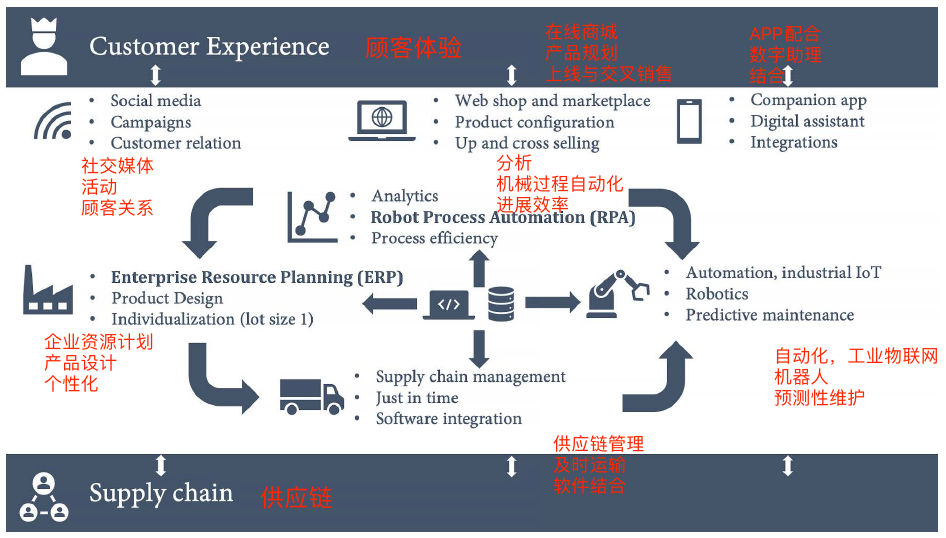
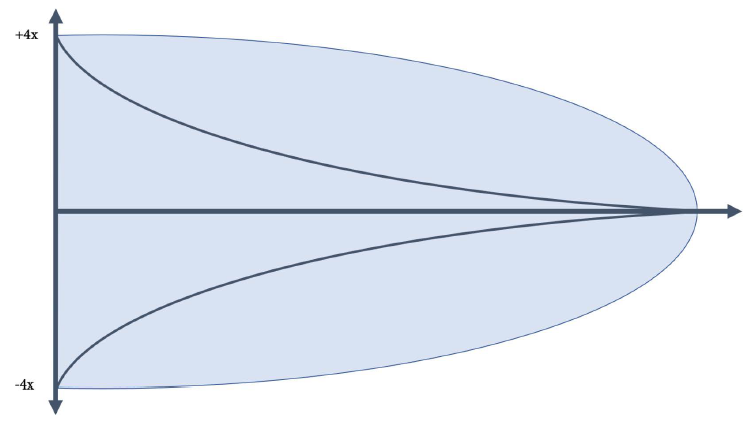
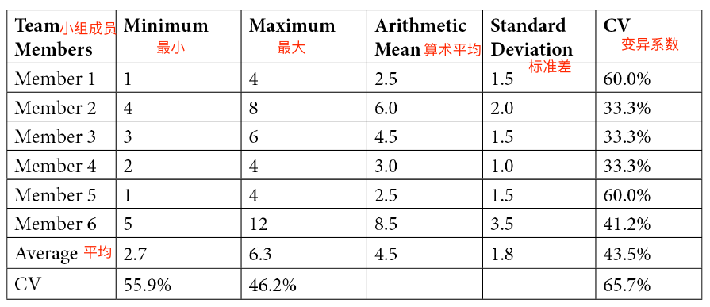
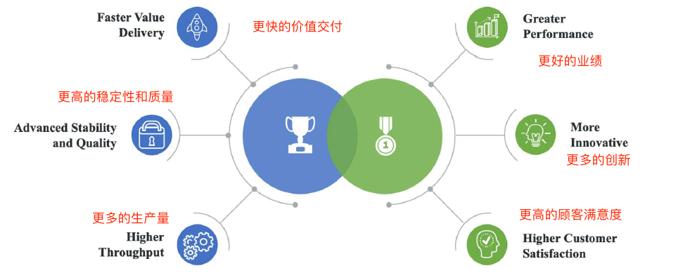
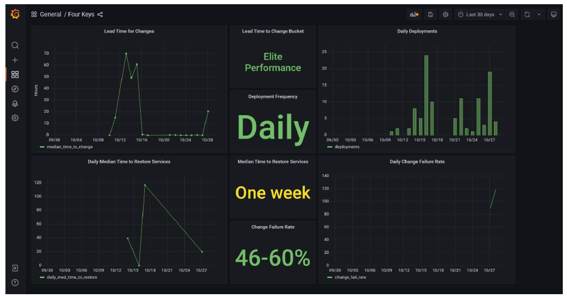
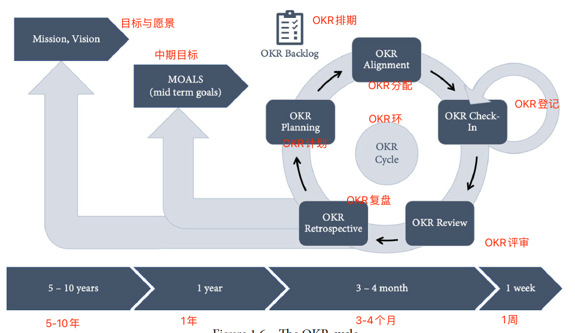
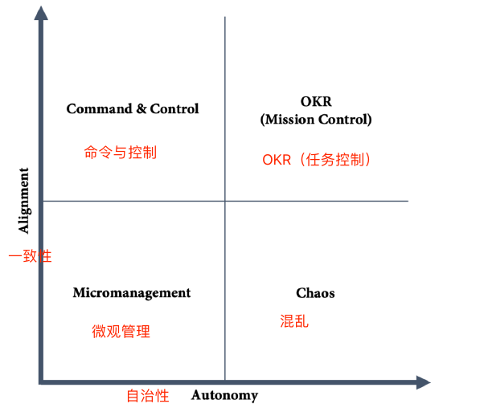

# 第1章 重要的指标

实现DevOps最困难的部分是与管理层交流，转变他们的思想。管理层通常会产生如下几个问题：

- 实施这个方案成本是多少？
- 实施这个方案我们能收益多少？

从管理者的角度来看，这些都是很合理的问题。但是在DevOps的世界中，如果在错误的时间以错误的方式回答这些问题，这些问题对于组织而言可能是有害的，并可能导致产生大量的预备工作。本章将介绍一些指标，这些指标可以使读者与管理层的讨论不再局限于努力提高工程效率和开发者生产力。

本章还将介绍如何衡量工程效率和开发者生产力，并且如何让DevOps带来的加速变得可衡量。

本章包括如下主题：

- 为什么要加速？
- 工程效率
- 高效能企业
- 重要的指标
- SPACE开发者生产力框架
- OKRs

## 为什么要加速？

企业的预期寿命正在迅速缩短。耶鲁大学管理学院的Richard Foster表示，100年前在 **标准普尔500指数（S&P 500）** 上市企业的平均寿命为67年，而现在是15年，并且每两周就有一家标普上市企业退出市场。到2027年，预计500强企业中75%的企业将被新企业取代。Santa Fe 研究所的另一项研究《企业的死亡率》得出的结论是，美国所有行业企业的平均寿命约为10年。

为了保持竞争力，企业不仅要解决客户的问题，还需要提供让客户满意的产品和服务，并且必须能够与市场互动，以对不断变化的需求做出快速反应。**上市时间**是业务敏捷性最重要的驱动因素。

在任何行业，软件都是各个产品和服务的核心，不仅因为数字体验已经变得和物理体验一样重要（甚至可能比物理体验更重要），而且软件涉及产品生命周期的各个部分，例如：

- 产品
  - 供应链管理
  - 成本优化/预测性维护/机械化
  - 产品个性化（每次生产的产品批量为1）
- 售前售后服务
  - 在线商店
  - 顾客服务与支持
  - 社交媒体
  - 数字助理
- 数字产品
  - 附属应用
  - 应用集成
  - 移动体验
  - 新商业模式（按使用付费、租借等等）

以上只是一些例子来说明客户与企业是数字化的。例如一名顾客最近想买一辆车，他已经从社交媒体和报道宣传中了解到这个品牌。顾客可以在网站上购买和配置车辆，也可以去线下有销售人员的实体店，但销售也是通过平板电脑来进行操作。机械化和 **人工智能（AI）** 对装配线生产的优化会影响到汽车的价格。顾客在车上要做的第一件事就是连接手机。开车时可以听音乐、打电话或使用语音回复短信。如果车辆前方有障碍物，驾驶助理程序会刹车以保证顾客的安全，并确保在原先的车道。很快，汽车将自动进行大部分的驾驶任务。如果汽车或应用程序出了问题，尤其是对年轻一代的顾客会优先使用应用程序或电子邮件联系售后服务。汽车已经成为了一个数字产品，不仅有数百万行代码的程序在汽车中运行，同时还有数百万行代码为汽车的应用程序、网站运行和装配线生产提供动力（图1.1）。

图1-1 软件和数据成为顾客体验的核心

软件的优势在于其更新速度比硬件快得多。为了加快上市时间和业务敏捷性，软件是关键的驱动因素。它比硬件组件灵活得多，可以在几天或几周内更换，而不是几个月或几年。它还可以更好地与客户保持联系，使用应用程序的客户比在实体商店的客户更有可能对调查做出回应。此外，硬件也不能遥测产品的使用情况。

要想成为经营时间超过10年的企业之一，企业必须利用软件的力量来加速对市场的反应，并以出色的数字体验来取悦客户。

## 工程效率

企业是如何衡量开发效率的？最常见的方法是通过工作量来衡量。曾经有一些企业使用诸如代码行数或代码测试覆盖率之类的度量标准，但这些显然是糟糕的选择，不知道现在还有哪些企业还在这么做。如果可以通过1行代码或100行代码解决一个问题，那么1行显然更可取，因为每一行代码都有维护成本，代码测试覆盖率也是如此。覆盖率本身并没有说明测试的质量，而且糟糕的测试还会带来额外的维护成本。

> 作者示
> 
> 本书尽量保持用词与开发模式无关。作者见过采用DevOps实践的企业，包括敏捷模型、Scrum模型、 **规模化敏捷框架（SAFe）** 、看板和瀑布法等等。但每个系统都有自己的术语，作者尽量保持中立。例如，本书使用“需求”，而不是“用户故事”或“产品待办事项”，但本书使用的大多数示例都是基于Scrum的。

衡量开发者效率的最常用方法是估计需求。将需求分解成小的项目（例如用户故事），然后由产品经理评估业务价值。接下来开发团队评估故事，并对其工作量估测出一个值。不管使用的是故事点、小时、天还是其他数字，基本上都是交付需求所需工作量的表示。

### 用工作量衡量效率

如果读者将这些数字报告给管理层，那么用估计的工作量和业务价值来衡量效率可能会产生副作用。这会存在某种*观察者效应*：人们试图提高数值。在以工作量和业务价值为衡量标准的情况下，人们很容易为“故事”分配更大的数字。这是通常会产生的情况，特别是在比较不同团队的数值时：开发者将为“故事”分配更大的数值，产品经理将同时分配更大的业务价值。

虽然这不是衡量开发者效率的最佳方法，但如果在开发团队和产品经理之间的日常交流中进行评估，也没有太大的危害。但是，如果评估过程是在正常的开发过程之外进行的，这甚至可能是有害的，并会产生非常负面的副作用。

### 有害的估计

对于实现更大的功能或计划，“成本是多少？”这个问题的答案通常会在正常开发过程之外进行评估，并在决定实施之前进行完善。但是如何评估一个复杂的功能和计划呢？

在软件开发中所做的一切都是全新的。如果软件已经开发完成，可以直接使用该软件而不是重新编写它，因此即使是完全重写现有模块仍然是全新的工作，因为使用了新的架构或新的框架。以前从来没有人做过的事情只能以有限的确定性来估计：这是一种猜测，而且复杂度越大，不确定性也越大（图1.2）。

图1-2 不确定性

不确定性锥形图经常用于项目管理，使用前提是在项目开始时，成本估计具有一定程度的不确定性，但随着计划的不断进展而降低，直到项目结束时为零。x轴通常是所花费的时间，它也可以与问题的复杂性和抽象性有关：需求越抽象越复杂，估计中的不确定性就越大。

为了更好地估计复杂的功能或计划，可以将其分解为更便于估计的小模块，并且需要提出一个解决方案架构，作为工作分解的一部分。由于这是在正常的开发过程之外完成的，而且时间上也超出了预期，因此它有一些不必要的副作用，例如：

- 一般情况下，开发团队不可能全员在场。这会导致沟通多样性降低，从而在解决问题时创造力会下降。
- 主要精力集中在发现问题。提前发现的问题越多，估计的结果可能就越准确。特别是如果稍后处理评估以优先衡量性能，人们很快就会发现如果能发现更多的问题就可以争取更多的时间，因此可以增加对需求更高的估计。
- 如果有疑问，被分配估算任务的工程师就采用更复杂的解决方案。例如，如果他们不确定是否可以用现有的框架解决问题，他们可能会考虑编写自己的解决方案，以防万一。

如果管理层仅使用这些数字来决定某个功能是否去实现，则不会造成太大的损害。但是一般情况下，需求（包括评估和解决方案体系结构）不会被取消，或者稍晚才会进行功能实现。在这种情况下，还有一个创造性稍低的解决方案，它是针对问题而不是解决方案进行优化的，这不可避免地导致在实现功能时缺乏创造性和创造性思维。

> **无需评估**
> 
> 评估并不是一件坏事，如果应用在正确的场合，它会很有价值。如果开发团队和产品经理讨论下一个用户故事，评估可以帮助推动交流。例如，如果团队使用“扑克规划”评估用户故事但是评估结果不一致，表明人们对如何实现它有不同的想法。这可以引发有价值的讨论，并可能更有成效，因为可以跳过一些具有共识的讨论。对于业务价值来说也是如此。如果团队不理解为什么产品经理分配了一个非常高或者非常低的估计数字，这也可以引起重要的讨论。也许团队已经知道如何取得成功的结果，或者在不同角色的感知上存在差异。
>
> 但是很多团队在完全不评估需求的情况下会感觉更合适。这通常在标签 #无需评估 下被提及。特别是在高度实践化的环境中，评估通常被认为是浪费时间的行为。远程和分布式团队通常也不喜欢进行评估，他们经常会进行面对面的会议或发起关于问题和Pull Requests（PR）的讨论。这也有助于记录交流过程，并帮助团队以一种更异步的方式工作，这也有利于跨越不同时区的开发者进行协作。
>
> 不讨论开发者开发效率的情况下，开发团队应该被允许自行决定是否需要进行评估。这也可能随着时间的推移而改变。一些团队从中获得价值，而另一些则没有，让团队决定什么对他们有效，什么无效。

### 评估高优先级计划的正确方法

评估更复杂的功能或计划的最佳方法是什么，以便产品负责人可以决定这些是否值得实现？可以召集整个团队成员，询问以下问题：这能在几天、几周或几个月内完成吗？另一个选择是使用类比估计，并将计划与已经交付的产品进行比较。接下来的问题是：这个计划是比之前交付的产品更容易、相同，还是更复杂？

最重要的是不要分解需求或预先制定解决方案架构，而是所有工程师的直觉感觉。然后，让每个人为单元分配一个最小和最大的数值。对于类比估计，使用相对于原始计划的百分比，并使用历史数据计算结果。

最简单的报告方法如下所示：

> 目前的团队，
> 
> 如果我们优先考虑“项目名称”的项目，
>
> 该团队有信心在“最小值”和“最大值”之间交付功能。

取最小值和最大值是最安全的方法，但如果悲观值和乐观值的估计相差太远，也可能导致数字失真。在这种情况下，取平均值可能是更好的选择，如下所示：

> 目前的团队，
> 
> 如果我们优先考虑“项目名称”的项目，
>
> 该团队有信心在“平均最小”和“平均最大”之间交付功能。

但是取平均值（算术平均值，在Excel中使用=AVERAGE()）意味着存在更高或更低的偏差，这取决于单个估计的分布。偏差越高，越不能相信能在此期间交付该功能。要了解估计值是如何分布的，可以计算标准偏差（在Excel中使用STDEV.P()），查看最小值和最大值的偏差，也可以查看每个成员的估计。偏差越小，说明数值越接近平均值。由于标准差是绝对值，因此不能与其他估计进行比较。要得到一个相对的数字，可以使用 **变异系数（CV）** ：用标准偏差除以平均值，通常以百分比表示（在Excel中使用 STDEV.P()/AVERAGE()）。数值越高，说明数值越偏离平均值，数值越低，每个团队成员对他们的估计或整个团队对最小和最大的估计就越有信心。示例如下表所示：

表1-1 计算评估的例子

为了表示估计值偏差的不确定性，可以添加一个置信度指标。使用文本（例如低、中或高）或百分比级别，如下所示：

> 目前的团队，
> 
> 如果我们优先考虑“项目名称”的项目，
>
> 该团队有“信心程度”的信心在“算术平均值”内交付功能。

在这里没有使用固定的公式，因为这涉及到需要根据团队实际情况确定。例子中的数据（表1-1），发现最小值平均2.7和最大值平均6.3相差不大。如果观察单个团队成员，会发现有更悲观和更乐观的成员。如果以前的估计证实了这一点，那么即使最小值和最大值的CV值非常高，也可以非常自信地认为平均值是真实的。那么估计可能是这样的：

> 目前的团队，
> 
> 如果我们优先考虑新奇计划项目，
>
> 该团队有85%的信心在4.5个月内交付功能。

这种估计不是什么高深的科学。它与复杂的估计和预测系统没有关系，例如三点估计技术(https://en.wikipedia.org/wiki/Three-point_estimation)、PERT分布(https://en.wikipedia.org/wiki/PERT_distribution)或蒙特卡洛模拟方法(https://en.wikipedia.org/wiki/Monte_Carlo_method)，它们都依赖于需求的详细分解和对任务（工作）级别的估计。这个想法是为了避免提前计划和分解需求，更多地依赖于工程团队的直觉。这里的技术只是了解自己在整个团队中收集的数据点。这还只是猜测。

### 从开发者到工程效率

工作量并不是衡量开发者效率的一个很好指标，尤其是如果是基于估计，并且在跨职能团队中，这不仅仅取决于开发者。那么，如何从开发者效率转变为工程人员效率呢？

## 高效能企业

具有高工程效能的组织会超越竞争对手并冲击市场，但高效能企业究竟是什么样的？

### 开发者效率指数

2020年4月，麦肯锡发布了关于 **开发者速度指数（DVI）** 的研究。这是一项对来自12个行业的440家大型组织的研究，考虑了13种能力下46个驱动因素。驱动因素不仅仅是工程能力——它们还包括工作实践和组织实现，比如企业文化。该研究显示，DVI排名前四分之一的企业的表现比所在市场的其他企业高出4至5倍，而且不仅是在整体业务表现上。排名前四分之一的企业在以下领域的得分比其他企业高出40%至60%：

- 创新性
- 顾客满意度
- 品牌影响力
- 人才管理

该研究采访了来自12个行业440家大型组织的100多名高级工程领导。此次访谈涵盖了3类13种能力的46个驱动因素，概述如下：

- **技术：** 体系结构；基础设施和云应用；测试；工具
- **工作实践：** 工程实践；安全和合规；开源采用；敏捷团队实践
- **组织实现：** 团队特征；产品管理；组织敏捷性；文化；人才管理

因此，DVI指标的效果远远超出了纯粹的开发者效率。它分析了工程效率和所有影响它的因素，并将它们与业务结果联系起来，如收入、股东回报、营业利润率和非财务绩效指标，如创新、客户满意度和品牌认知。

### DevOps的状态

这些发现与 **DevOps研究和评估（DORA）** 组织发布的*DevOps状态报告*(https://www.devops-research.com/research)的结果一致。但是通过添加业务结果，可以更进一步。2019年DevOps报告阐述了精英人员如何与低绩效人员进行比较，概述如下：

- **更快的价值交付：** 从提交到部署，前置时间（LT）快了106倍。
- **先进的稳定性和质量：** 故障恢复速度快2604倍，变更故障率（CFR）低7倍。
- **更高的吞吐量：** 代码部署的频率提高了208倍。

高效能企业不仅在吞吐量和稳定性方面表现出色，而且更具有创新性，客户满意度更高，经营业绩也更好（图1.3）。

图1-3 高效能企业

专注于突出区分高效能企业和中低效能企业能力的度量，可以使得企业转型可见，并向管理层提供比代码行或基于估计的效率数值更重要的度量方式。

## 衡量重要的指标

> *成功转型的关键是衡量和理解正确的事情，并关注能力。*

要衡量在转型过程中所处的位置，最好关注DORA中使用的四个指标，两项为性能，两项为稳定性：

- 交付性能指标：
  - 交付前置时间
  - 部署频率
- 稳定性指标：
  - 平均故障恢复时间
  - 变更失败率

### 交付前置时间

交付前置时间（delivery lead time，DLT）是指从工程师开始开发某个功能到最终用户可以使用该功能的时长。可以说“从代码提交到生产环境”，但通常情况下，从团队开始处理某个需求并将状态变为“正在执行”或类似的时候开始计时。

从系统中自动获取这个指标并不容易。本书在第7章：运转工作流中展示如何使用GitHub Actions和Projects来自动化度量。如果没有从系统中获取指标，可以使用以下选项进行调查：

- 少于1小时
- 少于1天
- 少于1周
- 少于1个月
- 少于半年
- 超过半年

根据实际在量表上的位置，或多或少会进行调查。当然，更可取的是系统生成的值，但如果实际情况以月份为单位甚至更长，那就无所谓了。如果以小时或天为单位，就更有趣了。

> 为什么不是前置时间（lead time，LT）？
> 
> 从精益管理的角度来看，前置时间将是更好的指标：从理解客户反馈到整个系统需要多长时间？但是软件工程中的需求是困难的，在实际工程工作开始之前，通常会涉及许多步骤。结果可能是如果读者必须依赖调查数据，那么变化会很大，指标很难猜测。有些需求可以排期至几个月后，有些只需要几个小时。从工程角度来看，专注于交付前置周期要好得多。第18章会详细介绍精益产品开发和精益创业。

### 部署频率

部署频率侧重于速度。交付变更需要多长时间？更关注吞吐量的指标是部署频率。多久部署一次变更到生产环境？部署频率表示批量大小规模。在精益制造中，人们希望减少批量的规模大小。部署频率越高，批次大小越小。

乍一看，在系统中测量部署频率看起来很容易。但仔细观察一下，有多少部署真正部署到生产环境中了呢？在第7章中将解释如何使用GitHub Actions获取指标。

如果暂时不能自动进行指标测量，也可以使用调查表，使用以下选项：

- 灵活（每天多次）
- 每小时一次到每天一次
- 每天一次到每周一次
- 每周一次到每月一次
- 每月一次到每半年一次
- 小于半年一次

### 平均故障恢复时间

平均故障恢复时间（MTTR）是衡量稳定性的一个很好的指标。这衡量了在出现中断时恢复产品或服务所需的时间。如果测量上线时间，它基本上就是服务不可用的时间跨度。要测量上线时间，可以使用冒烟测试。例如Application Insights（https://docs.microsoft.com/en-us/azure/azure-monitor/app/monitor-web-app-availability）。如果应用程序安装在客户终端上，并且不可远程访问，那么情况就更复杂了。通常，可以查看帮助台系统中特定工单类型的处理时间来进行评估。

如果无法自动测量，仍然可以使用以下选项进行调查：

- 少于1小时
- 少于1天
- 少于1周
- 少于1个月
- 少于半年
- 超过半年

但这应该是最后的手段。MTTR应该是一个很容易从系统中自动得到的指标。

### 变更失败率

与交付前置时间用于衡量性能一样，平均故障恢复时间是衡量稳定性的时间指标。部署频率与吞吐量相关的特性是变更失败率（CFR）：在生产环境中有多少次部署会导致失败？CFR使用百分比呈现。要决定哪些部署应该计入该指标，应该与部署频率计入的部署相同。

### 关键指标仪表盘

这四个基于DORA研究的指标是衡量在DevOps实施过程中所处位置的好方法。把这些指标放在仪表盘上可视化，是改变与管理层交流方式的一个很好的起点。别担心自己还不是一个优秀的员工，最重要的是要不断进步。

从基于调查获取的数值开始很简单。但如果想使用自动生成的系统数据，可以使用“Four Keys Project”在仪表板上美观地显示数据（图1-4）。

图1-4 四关键指标仪表盘

该项目基于谷歌云，并且是开源的，（https://github.com/GoogleCloudPlatform/fourkeys），但它依赖于 webhooks 从项目中获取数据。本书第7章将学习如何使用 webhooks 将数据发送到仪表板。

### 不应该做什么

需要注意的是，这些指标不能用于进行团队相互比较。可以汇总这些指标以概述组织情况，但不要用于比较单个团队！每个团队都有不同的实际情况。重要的是使用的度量标准朝着正确的方向发展。

此外，度量不应该成为目标，仅仅为了获得更好的指标是不可取的。重点应该始终放在在本书中讨论的指向这些指标的能力上。专注于发展能力，将度量标准紧随其后。

## 提升开发者效率的SPACE框架

DORA指标是一个完美的开始。它们很容易实施，而且有大量的数据可供比较。如果想进一步添加更多的指标，可以使用SPACE框架以提高开发者的工作效率。

开发者的生产力是实现高工程效率和高DVI的关键因素。开发者的生产力与开发者的整体幸福感和满意度高度相关，因此，它也是在人才争夺战中蓬勃发展和吸引优秀工程师的最重要因素之一。

但是开发者的生产力不仅仅包括活跃度。相反的情况往往是：在紧急事件和接近截止日期的时候，活跃度通常是很高的，但由于频繁切换任务和缺乏创造力，工作效率会下降。这就是为什么衡量开发者生产力的指标永远不应该孤立地使用，也永远不应该用于惩罚或奖励开发者。

另外，开发者的生产力不仅仅要考虑个人的表现，就像团队运动一样，个人表现固然重要，但只有团队作为一个整体才能获胜。衡量个人和团队表现的平衡至关重要。

SPACE是一个多维框架，它将开发者生产力的指标分为以下几个维度：

- 满足度和幸福感
- 业绩
- 活跃度
- 沟通力和合作力
- 流动效率

所有维度都适用于个人、团队和整个系统。

### 满足度和幸福感

满足度和幸福感描述了开发者有多快乐和多满足。身心健康也属于这一范畴，例如:

- 开发者满足度
- 团队的净推荐分数(NPS)(某人向其他人推荐他们的团队的可能性)
- 保持力
- 对工程系统的满意度

### 业绩

业绩是系统或过程的产出。单个开发者的业绩很难衡量，但是对于团队或系统级别，可以使用LT、DLT或MTTR这样的指标，还可能是上线时间或服务健康度。其他好的指标是客户满意度或产品的NPS。

### 活跃度

活跃度可以为生产力提供有价值的见解，但很难正确衡量它。一个衡量个人活跃度的好方法是关注时间：开发者有多少时间没有花在会议和交流上？还有可能使用完成的工作项目、问题、PR、提交或错误的数量。

### 沟通力和协作力

沟通和协作是提高开发者生产力的关键因素。衡量它们是困难的，但是观察PR和问题会对了解沟通的进展有良好的印象。这个维度的指标应该集中在PR参与度、会议质量和知识共享上。同样，跨团队级别(跨团队或x团队)的代码审查是一种很好的度量方法，可以看出团队之间存在哪些界限。

### 流动效率

效率和流程度量有多少移交和延迟增加了总体前置时间。好的度量标准是移交、阻塞的工作项和中断的数量。对于工作项，可以度量总时间、增值时间和等待时间。

## 如何使用SPACE框架

> 间接了解组织中，什么是重要因素的一种方法是看什么是被衡量的，因为它经常传达什么是有价值的，并影响人们的行为和反应方式。

所有维度对个人、团队、组和系统级别都有效（图1.5）。

图1-5 SPACE指标示例

重要的是，不仅要看维度，还要看范围。有些指标在多个维度上都有效。

仔细选择要衡量的指标也是非常重要的。度量标准塑造行为，某些度量标准可能会产生一开始没有考虑到的副作用。目标是只使用少数指标，但要能产生最大的积极影响。

读者应该从三个维度中选择至少三个指标，可以混合个人、团队和系统范围的度量标准。对单个指标要谨慎——它们可能会产生难以预见的最大程度副作用。

为了尊重开发者的隐私，数据应该匿名化，并且应该只以团队或组级别的汇总结果进行报告。

## 目标与关键成果法

许多正在实践DevOps的企业正在使用目标和关键结果（OKRs），其中包括谷歌、微软、Twitter和Uber。

OKR是企业定义和跟踪目标及其结果的灵活框架。

OKR方法可以追溯到20世纪70年代，当时OKR之父安德鲁·格鲁夫将该方法介绍给了英特尔。这种方法被称为iMBO，即英特尔目标管理。他在《高产出管理》(Grove, A. S.(1983))一书中描述了这种方法。

1999年，John Doerr将OKR引入谷歌。安德鲁·格罗夫(Andrew Grove)将iMBO引入英特尔时，他曾在英特尔工作。OKR很快成为谷歌文化的核心部分。约翰·多尔(John Doerr, J.(2018))出版了《Measure What Matters》一书，使OKR声名大噪。如果读者想更多地了解OKR，强烈推荐阅读这本书。

### 什么是OKRs

OKR是一个帮助组织实现战略目标的高度一致性的框架，同时为团队和个人保持最大程度的自主权。目标是定性的目标，能给人指明方向并且启发和激励人们。每个目标都与明确可测量的定量指标相关，即关键结果。关键结果应侧重于结果，而不是活动，如下表所示：

表1-2 OKRs的特点

OKRs绝不应与企业的绩效管理体系或员工奖金挂钩！企业的目标不是实现OKRs的100%成功率——这意味着OKRs不够具有挑战性。

OKRs的格式如下：

> 我们将（目标内容）
> 由（一组关键结果）衡量

很重要的是OKR关注的是结果，而不是具体过程。一个很好的例子就是谷歌的首席执行官桑达尔·皮查伊在2008年推出Chrome浏览器时设定的目标。OKR是这样说的：

> 我们将打造最好的浏览器
> 截至2008年底，有2000万用户这个结果来衡量

这是一个大胆的新浏览器的目标，谷歌在2008年未能实现这一目标，实际只有不到1000万用户。2009年，关键结果增加到5000万用户，谷歌同样未能实现这一目标，只有大约3700万用户。但它并没有放弃，而是在2010年目标再次实现了增长——用户达到了1亿!这一次，谷歌超额完成了他们的目标，拥有1.11亿用户!

### OKRs的原理

要让OKR发挥作用，企业需要一个好的愿景和使命来定义“WHY”:我们为什么为这家企业工作？然后将愿景分解为中期目标(称为MOALS)。MOALS本身也是OKR。它们被分解为OKR周期，通常在3到4个月之间。在OKR计划和调整中，OKR在组织中被分解，以便个人和每个团队都有自己的OKR，为实现更大的目标做出贡献。然后对OKR进行持续监测，通常每周进行一次。在OKR周期结束时，对OKR进行回顾，并庆祝所取得的成就。随着在周期中获取经验，MOALS得到更新，开始一个新的周期(图1.6)。

图1-6 OKR周期

OKR在理论上很简单，但实现起来却很困难。制定好的OKR尤其困难，需要大量的练习。它还强烈依赖于企业文化、现有的度量标准和关键绩效指标(KPI)。

### OKRs与DevOps

一旦正确实行，OKRs可以让读者在团队之间保持强大的一致性，通过保留他们自己决定他们做什么，而不仅仅是他们如何做的自主权(图1.7)。在第19章“利用GitHub实验和A/B测试”中讨论实验时，这一点很重要。团队可以定义自己的实验并衡量输出。基于此他们决定哪些代码保留在项目中，哪些不保留。

图1-7 OKRs帮助实现一致性和自治性

现在请看一个案例。

某企业的愿景是成为在线可视化项目管理工具的市场领导者。企业产品目前的市场份额是12%。企业MOAL如下：

> 我们将构建最好的可视化项目管理工具
> 目标是到2025年底，市场份额将达到75%

产品由两个团队构建：一个团队专注于产品的核心，并开发项目管理可视化的功能。他们专注于现有的客户，打造客户喜爱的产品。他们同意接受以下OKR:

> 我们将构建深受客户喜爱的可视化项目管理工具
> 目标是NPS高于9

NPS目前是7.9，所以团队必须自己找出为了取悦顾客他们能做什么。在与一些客户进行了几次面谈之后，提出了一个假设，即所有的项目管理工具都是基于旧的项目管理技术，并且在面向敏捷的项目的情景中过于复杂。团队决定对部分客户进行实验，用一个全新的概念来验证或否定这个假设。

第二个团队是共享服务团队。主要关注用户管理、企业集成和计费。产品需要更多的新用户来实现MOAL，而不仅仅是让现有用户满意。因此，OKR周期的重点是为产品带来新客户，如下所示:

> 我们将构建一个新客户易于使用的项目管理工具
> 目标是每月新注册用户增长20%

目前，新注册用户已经趋于平缓，所以团队的目的是重启增长趋势。该团队查看了这些数字，发现许多新客户在详细信息页面上退出了注册过程，因为客户必须输入自己的地址和银行详细信息。团队假设如果注册过程更简单，就会有更多的客户尝试该产品，并希望留在平台上。团队决定进行一项实验，并将注册过程减少到认证所需的最低限度，并为新用户提供30天的免费试用，并要求在此期限后提供付款详情。

第18章“精益产品开发和精益创业”和第19章“GitHub实验和A/B测试”中将解释假设驱动的开发和实验是如何进行的。这独立于OKR，但两者都能很好地协同工作。

如果读者对真实世界的OKR感兴趣，GitLab公开分享了他们的OKR (https:// about.gitlab.com/company/OKRs/)。他们还分享了他们建立OKRs的整个过程，以及如何将OKRs与史诗和问题联系起来。

OKRs不是DevOps的先决条件，但与敏捷开发一样，只是天生匹配。如果团队不是以敏捷开发，而是从DevOps开始，那工作方式无论如何都会变得高效，可以从Scrum等框架中受益，不必再次发明轮子。OKRs也是如此:当在大型组织中扩展DevOps，并且希望通过保持与全局目标的一致来为团队提供极大的自主权时，就会自然而然地产生。

## 小结

本章讲解了软件是如何影响世界的，它对企业生命周期的影响。如果企业想要持续经营，就需要加速软件交付。明确工程效率将可以帮助改变与管理团队的沟通。

本章讲解了对企业重要的度量标准，同时关注能力。从DORA的四个关键指标开始，并从SPACE框架的不同维度添加更多指标。但请记住，度量标准的选择会影响实际行为，所以要小心选择哪种度量标准。

通过选择正确的度量标准，可以让DevOps的转换和加速变得可衡量和透明。

本章的大部分内容都集中在效率上:正确做事。只有OKR还关注有效性:做正确的事情。OKR也与精益产品开发相关，在第18章“精益产品开发和精益创业”中有所提及。

下一章将学习如何计划、跟踪和可视化工作。

## 案例学习

Tailwind Gears是一家软件制造商，生产许多不同的部件并集成到其他产品。企业有五个不同的以产品为中心的部门，共有600多名开发者。每个部门都有自己的开发流程。有的使用Scrum，有的使用SAFe，还有的使用经典的瀑布方法(验证模型，V-Model)。有两个部门构建组件，其中包括用于关键系统的软件，因此受到高度监管(国际标准化组织(ISO) 26262和优质制造规范（GxP）)。硬件和芯片上的嵌入式软件使用的编程语言包括C和C++，以及移动应用程序(Java;Swift)、Web应用程序(JavaScript;.NET)。

与开发过程一样，工具领域是非常不同的。有一些安装了旧的集中式版本控制系统(TFS);一些团队使用Jira、Confluence和Bitbucket，还有一些使用GitHub和Jenkins。一些团队已经有了一些持续集成/持续部署(CI/CD)实践，而其他团队仍然手动构建、打包和部署。一些团队已经开始以DevOps的方式运营他们自己的产品，而其他团队仍然将生产版本移交给单独的运营团队。

Tailwind Gears面临以下问题:

- 高层管理人员无法看到开发进展如何。由于所有团队的工作方式不同，因此没有通用的方法来衡量效率。
- 各部门声称存在发布周期较慢(在几个月和几年之间)和高失败率的问题。
- 每个部门都有自己的团队来支持自己的工具链，所以有很多冗余。模板和管道之类是不共享的。
- 很难将开发者和团队分配到具有最大商业价值的产品上。工具链和开发实践差异太大，而且上线时间太长。
- 开发者对自己的工作不满意，效率低下。一些人已经离开了企业，很难在市场上招募到新的人才。

为了解决这些问题，企业决定实现一个通用的工程平台，同时打算统一开发过程。以下是一些建议:

- 在所有部门加速软件交付。
- 提高软件质量，降低故障率。
- 通过提高协同效应来节省时间和金钱，并且只有一个平台团队负责一个工程系统。
- 通过将开发者和团队分配到具有更高价值主张的产品上，增加正在构建的软件的价值。
- 提高开发者的满意度，以留住现有人才，并使其更容易雇用新的开发者。

为了让这种转变显而易见，该企业决定衡量DORA的以下四个关键指标:

- DLT
- DF
- MTTR
- CFR

由于目前还没有统一的平台，所以这些指标将通过调查来收集。计划是将逐个团队转移到新的统一平台，并在那里使用系统指标。

开发者的满意度是开发模式转换的一个重要部分。因此增加两个指标，如下所示:

- 开发者满意度
- 对工程系统的满意度

这是来自至少三个SPACE维度的六个指标的混合。目前还没有衡量沟通度和协作度的标准。随着开发模式转换的进行，这些将被添加到评估系统中。

## 扩展阅读
- Srivastava S., Trehan K., Wagle D. & Wang J. (April 2020). Developer Velocity: How software excellence fuels business performance: https://www.mckinsey.com/industries/technology-media-and-telecommunications/our-insights/developer-velocity-how-software-excellence-fuels-business-performance
- Forsgren N., Smith D., Humble J. & Frazelle J. (2019). DORA State of DevOps Report: https://www.devops-research.com/research.html#reports
- Brown A., Stahnke M. & Kersten N. (2020). 2020 State of DevOps Report: https://puppet.com/resources/report/2020-state-of-devops-report/
- Forsgren N., Humble, J. & Kim, G. (2018). Accelerate: The Science of Lean Software and DevOps: Building and Scaling High Performing Technology Organizations (1st ed.) [E-book]. IT Revolution Press.
- To read more on the four key projects, see Are you an Elite DevOps performer? Find out with the Four Keys Project (Dina Graves Portman, 2020): https://cloud.google.com/blog/products/devops-sre/using-the-four-keys-to-measure-your-devops-performance
- Forsgren N., Storey M.A., Maddila C., Zimmermann T., Houck B. & Butler J. (2021). The SPACE of Developer Productivity: https://queue.acm.org/detail.cfm?id=3454124
- Grove, A. S. (1983). High Output Management (1st ed.). Random House Inc.
- Grove, A. S. (1995). High Output Management (2nd ed.). Vintage.
- Doerr, J. (2018). Measure What Matters: OKRs: The Simple Idea that Drives 10x Growth. Portfolio Penguin