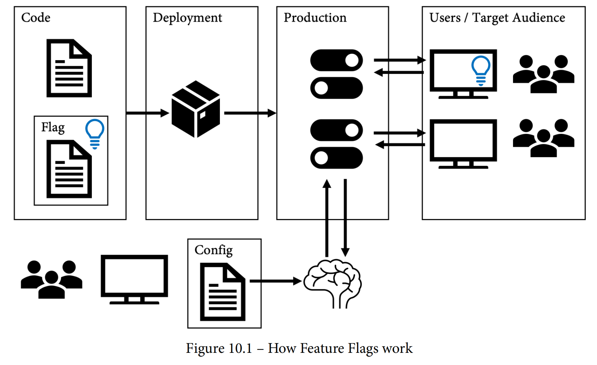
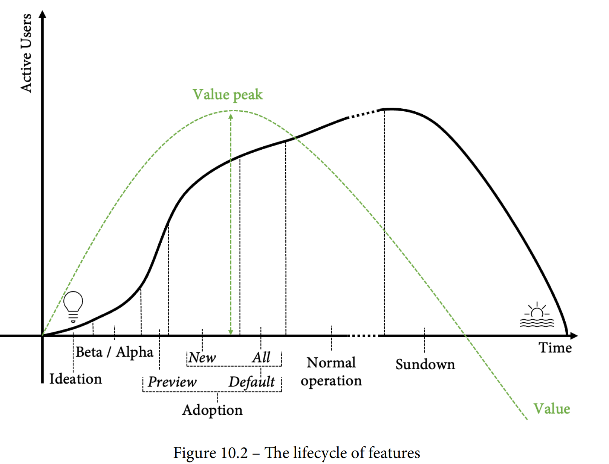
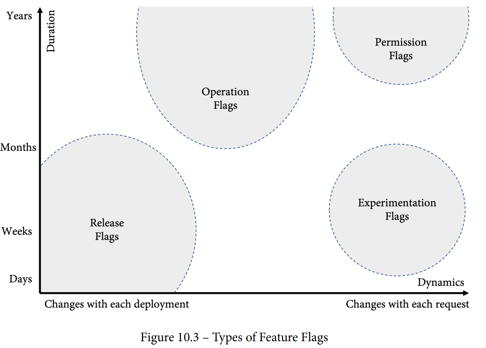
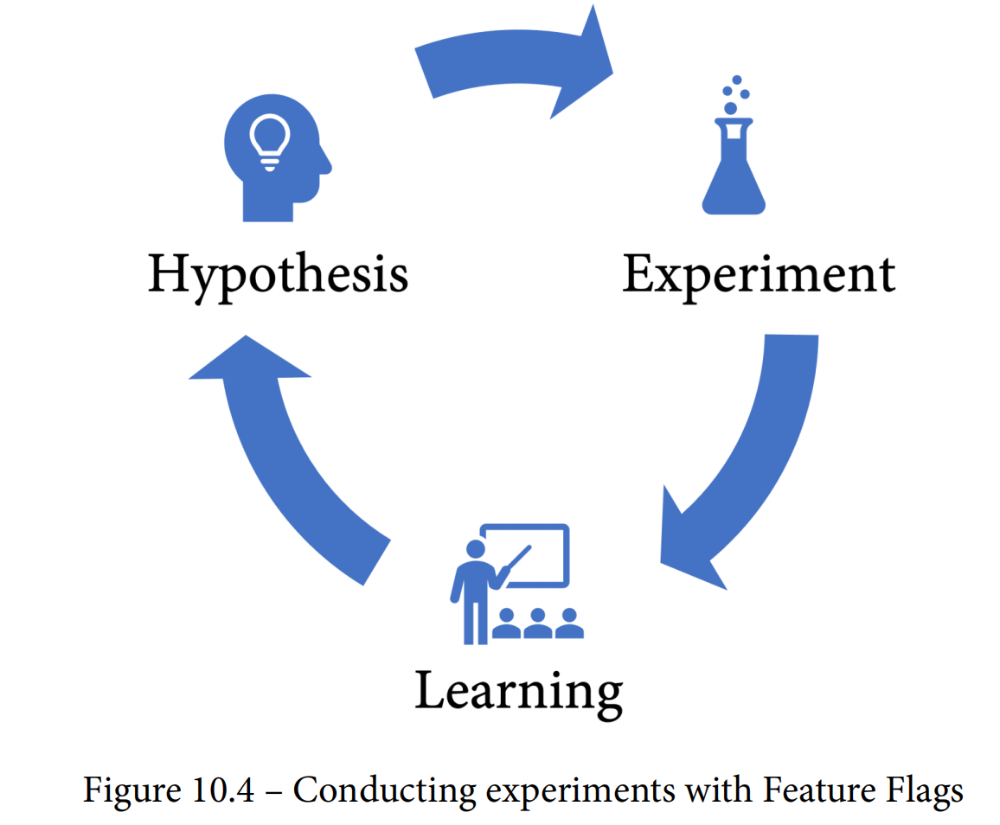

# 第10章 功能标记和功能生命周期

功能标记是我多年团队合作时见过的最具有改变游戏规则的功能之一。它们有许多不同的用例，可以帮助开发者通过尽早合并代码来减少开发工作流程中的复杂性，而且可以帮助执行零停机部署。功能标记通过管理整个功能生命周期，帮助开发者更好地利用功能。

本章中将解释什么是功能标记-也称为功能切换，以及开发者可以使用它们做什么，但GitHub中没有本地解决方案可帮助实现功能标记。有太多可用的框架和服务，开发者可以使用它们来引入功能标记。接下来将为读者提供有关如何为自己的用例选择最佳工具的指导。

本章主题如下：

- 什么是功能标记？ 
- 功能的生命周期
- 功能标记的好处
- 开始使用功能标记
- 功能标记与技术债务
- 使功能标记进行实验

## 什么是功能标记？

功能标记（Feature Flags）是一种软件开发技术，允许在不改变代码的情况下修改运行时行为。它把最终用户功能的发布与二进制文件的推出分离开来。 功能标记的工作原理类似于开关或切换，由于其布尔性质，因此通常被称为功能切换或功能开关。但是功能标记可以有许多不同的用例，并且可能比切换更复杂，因此功能标记这个术语更加适合。 功能标记允许开发者把新代码封装在功能标记后，将其推出到生产系统，然后可以根据给定目标受众的上下文启用该功能（参见图10.1）：



Code 代码

Deployment 部署

Production 生产

Users/Target Audience 用户/目标群体

Flag 标记

Config 配置

图片10.1 功能标记如何工作

对于开发人员来说，如果具有持续交付和负责基础架构的独立团队，Feature Flags是一种非常地道有用的技术。将标记添加到代码比更改基础架构更容易，因此开发者通常会使用标记允许测试人员执行与普通用户不同的操作，或者允许某些测试版用户测试某些内容。问题是，如果没有明确指定功能标记，配置通常会分散在不同的位置：配置文件、组成员身份和应用程序数据库中。明确使用功能标记可以帮助提高团队的透明度，并确保方法统一，可以启用更高级别的用例并确保安全性和可扩展性。

## 功能的生命周期

直到几年前，大多数软件每1到2年发布一个主要版本，这些版本必须单独购买或者与先前的订阅许可版本密切耦合。所有新功能都被加载进这些新版本中。新版本通常配备培训资料、书籍和在线课程，以教用户使用新功能。

这些销售模式今天基本上已经不存在了。客户想要软件作为服务存在。无论是Facebook或WhatsApp之类的移动应用，还是Office或Windows之类的桌面软件，软件都会持续更新和优化，不断添加新功能。这带来了一个挑战，即如何指导终端用户正确使用新功能。直观的用户体验和易于发现的新功能比旧的销售模式更重要。功能必须能够自我解释，并且简单的屏幕对话框必须足以指导用户如何使用新功能。

此外，价值创造完全不同。客户不会每几年做出购买决策，他们每天都决定是否将软件用于手头的任务。因此，重点是通过删除未使用的功能或将它们优化至高价值，来提供少量具有高价值的功能，而不是在新版本中添加大量新功能以影响购买决策。

这意味着每个功能都有其生命周期。一个功能的生命周期可能如图10.2所示：



Active Users 活跃用户数量

Ideation 想法提出

Beta/Alpha

Preview 预览

Default 默认

New 新用户默认设置

All 所有用户默认设置

Normal operation 正常运行

Sundown 日落期

Value Peak 价值顶峰

Value 价值

Time 时间

图10.2-功能的生命周期 

生命周期包括以下阶段：

- 构思和开发：在想出新功能之后，使用少量内部用户进行实现，这些用户的反馈被用于改进功能。
- Alpha或beta：在Alpha和/或beta阶段，将该功能提供给更广泛但仍非常有限的观众。观众可以是内部或选择的外部客户。Alpha或beta阶段可以是封闭（私有）或开放（公开），但是该阶段的功能仍非常动态，可能会发生巨大变化。
- 采用：如果该功能足够成熟以面向市场，那么它将逐渐暴露给更广泛的受众。采用阶段可以分为以下子阶段：
  - 预览：用户可以选择加入并启用预览功能。
  - 新用户默认设置：该功能是新用户的默认设置，但如果用户不想使用它，仍然可以选择退出。
  - 所有用户默认设置：该功能对所有用户启用，但用户仍然可以选择退出。
- 正常运行：所有用户都使用该功能，不再可以选择退出。该功能的早期版本从系统中删除。正常运行可能持续多年。
- 日落期：该功能被新的、更好的功能取代。使用此功能的用户数量下降，维护该功能的成本超过了其价值。当所有用户都可以重定向到新功能时，该功能将从系统中删除。

请注意，该功能的价值在早期的采用阶段最大，因为它吸引了新用户来使用你的应用程序。在正常运营阶段，热度可能已经平稳下来，竞争对手也会从你的功能中学习并通过调整其软件做出反应。

## 功能标记的好处

不使用功能标记的话，管理功能的生命周期是不可能的。但是功能标记还有许多其他用例，可以为开发者的DevOps团队带来价值：

- 发布标记：这些标记用于在标记后发布代码。发布标记通常在功能完全发布之前保留在代码中，可能需要保留数周或数月的时间。发布标记随着每个部署或系统配置的更改而更改。这意味着它们可以通过仅读取配置值来非常容易地实现。但是，如果开发者想将发布标记用于金丝雀发布(Canary release)（逐渐向更多用户暴露该功能）或蓝绿部署(blue-green deployments)（交换分阶段和生产环境），它们就更具动态性。
- 实验标记：如果开发者发布多个版本的同一功能并将其暴露给不同的受众，称为A/B测试或实验。通常用于通过测量用户如何与功能版本交互的某些指标来确认或排除假设。实验标记非常动态，并依赖于许多上下文来使用它们以针对不同的目标受众。
- 权限标记：功能标记的一个常见用例是控制用户可以访问的内容。这可以是仅向特定受众暴露的管理功能或测试功能，或仅向付费客户暴露的高级功能。权限标记非常动态，通常会在代码中保留很长时间，有时甚至会持续到应用程序生命周期的结束。它们还会暴露出高风险的欺诈行为，因此必须小心使用。
- 操作标记：有些标记用于应用程序的运营方面，例如用于禁用某些功能的故障开关（也称为断路器），这些功能可能会成为其他功能的瓶颈。控制后端系统不同版本的标记也被认为是操作标记。多变量标记通常用于控制日志详细程度或其他操作方面。 

图10.3按动态性和其在系统中停留的时间分类的不同类型概述功能标记：



Years 年

Months 月

Weeks 周

Days 日

Duration 停留时间

Changes with each deployment 每次部署的变更

Changes with each request 每次请求的变更

Operation Flags 操作标记

Release Flags 发布标记

Permission Flags 权限标记

Experimentation Flags实验标记

Dynamics 动态性

图10-3-功能标记的类型

既然我们已经了解了功能标记是什么，以及可以使用它们做什么，下面本书将向读者展示如何在代码中实现它们。

## 开始使用Feature Flags

在代码中，Feature Flag只是一个if语句而已。假设读者已经有了一个当前的实现用于注册新用户的对话框：

```
function showRegisterDialog(){
 // current implementation
}
```

现在，你想使用Feature Flag创建一个新对话框，并能够在运行时打开新对话框：

```
function showRegisterDialog(){
 var newRegisterDialog = false;
 if( newRegisterDialog ){
 return showNewRegisterDialog();
 }else{
 return showOldRegisterDialog();
 }
}
function showNewRegisterDialog(){
 // new implementation
}
function showOldRegisterDialog(){
 // old implementation
}
```

要动态启用或禁用该功能，你必须将功能标记的验证提取到它自己的函数中：

```
function showRegisterDialog(){
 if( featureIsEnabled("new-register-user-dialog") ){
 return showNewRegisterDialog();
 }else{
  return showOldRegisterDialog();
 }
}
```

功能标记的配置有许多选项：

- 系统配置
- 用户配置
- 应用程序数据库
- 单独的数据库
- 单独的系统（通过 API 访问）

哪些位置是否适用取决于你的用例。

功能标记和技术债务

如果开始使用功能标记，通常会得到一个高度可配置的系统，可以在运行时更改其行为——通常是通过多个标记，这些标记分散在多个配置源中。这些标记彼此之间大概率存在依赖关系，因此启用或禁用标记会对系统的稳定性带来极大的风险。就算通过避免并行分支而成功逃避了合并地狱(merge hell)，但最终进入了功能标记地狱(feature flag hell)，即拥有成百上千个标记，但没有人知道这些标记的用途。

为了避免这种情况，应遵循以下最佳实践：

- 指标：即使功能标记在你的代码中提供了很大价值，它们仍然是某种技术债务。应该像测量代码覆盖率或其他代码相关的指标一样对它们进行测量。测量功能标记的数量、存在时间（持续时间）、在每个环境中的评估值（在生产中为 100% 的标记可能可以删除）以及标记的使用频率（调用次数）。
- 中央管理：在一个中央位置管理你的功能标记，特别是如果使用不同的方法来管理这些功能标记。每个标记应该有一个所有者和描述。记录功能标记之间的依赖关系。
- 集成到你的流程中：将功能标记的管理集成到你的流程中。例如，如果你使用Scrum，则可以在审查会议中整合特性标记的审查。确保所有经常使用标记的人都会浏览所有标记，并检查哪些标记可以从系统中删除。
- 命名约定：使用命名约定来命名你使用的所有类型的标记。可以使用 tmp- 作为临时标记的前缀，perm- 作为永久标记的前缀。不要太复杂，但标记的名称应能显而易见表明它是什么类型的标记以及它在代码库中存在的时间长短。

清理分支是一些团队喜欢，而另一些团队持相反态度的技术。你可以自行审视这项技术是否适合您。该技术的想法是，当创建标记并编写代码时，你最清楚如果有一天要删除标记，代码应该是什么样子。因此，需要创建一个清理分支和拉取请求，并保持拉取请求开放，直到标记被删除。这个技术最适合使用良好的命名约定。

以前面的例子为例，你有一个新功能对话框的标记。带有该标记的代码如下所示：

```
function showRegisterDialog(){
 if( featureIsEnabled("tmp-new-register-user-dialog") ){
 return showNewRegisterDialog();
 }else{
 return showOldRegisterDialog();
 }
}
```

代码是在 features/new-register-dialog 分支上开发的，你创建了拉取请求来合并代码。

当标记被删除时，代码的最终状态将仅使用新对话框，因此你创建一个新分支（例如，cleanup/new-register-dialog）并添加代码的最终版本： 

```
function showRegisterDialog(){
 return showNewRegisterDialog();
}
```

最后可以创建一个拉取请求，并保持开放状态，直到功能被完全推出并且你想要清理代码。

这个技术并不适合所有团队，在复杂的环境中维护清理分支可能是超大工作量，但可以尝试一下。

未清理并且未积极维护的功能标记是技术债务，但优点大于缺点。如果你从一开始就小心谨慎，就可以避免功能标记地狱，并只从它们提供的灵活功能中获益，这样就可以发布和操作你的应用程序。

## 框架和产品

在使用功能标记（Feature Flags）时，有许多可供利用的框架。最好的框架很大程度上取决于你的编程语言和用例。有些框架更注重UI集成，有些则更注重发布和操作。在选择框架时，应该考虑以下方面：

- 性能：特性标记必须快速，不能降低应用程序的性能。应使用适当的缓存，以及在数据存储无法及时到达时使用的默认值。
- 支持的编程语言：解决方案应适用于所有语言，特别是当使用客户端标记时，必须出于安全原因在服务器上进行评估，避免在不同位置配置标记。
- UI集成：如果想为用户提供选择加入或退出功能的能力，需要很好地将其集成到你的UI中。通常需要两个标记：一个控制可见性，一个用于启用或禁用特性。
- 上下文：当想使用特性标记进行A/B测试和实验时，需要大量的上下文信息来评估标记：用户、群组成员资格、地区和服务器等，这也是许多框架失败的地方。
- 中央管理：为每个环境单独配置的标记是不可能维护的，所以需要一个中央管理平台，可以在一个地方控制所有标记。
- 数据存储：有些框架将配置存储在应用程序数据库中。对于许多场景来说，这是有问题的。通常，在所有环境中你都有一个不同的数据库，因此跨环境管理设置是困难的。

建立一个可扩展、高效、成熟的解决方案需要大量的时间和精力，即使使用框架也是如此。但也有一些可以安装或作为服务使用的产品。一个已经存在多年且成熟的产品是LaunchDarkly(https://launchdarkly.com/)。现在有很多竞争对手，包括以下产品：

- Switchover(https://switchover.io/)
- VWO(https://vwo.com/)
- Split (https://www.split.io/)
- Flagship (https://www.flagship.io/)
- Azure App configuration (https://docs.microsoft.com/en-us/azure/azure-app-configuration/overview) 

值得一提的还有Unleash(https://www.getunleash.io/)。它有一个开放的核心(https://github.com/Unleash/unleash)，可以作为Docker容器免费自主托管。Unleash也是GitLab使用的解决方案。

这里没有找到一个好的资源来比较这些解决方案，因此本书在GitHub上添加了一个页面(https://wulfland.github.io/FeatureFlags/)，提供了这些解决方案的独立比较。 

在做出制作/购买决策时，大多数公司最好使用现有的服务或产品。构建和运行一个良好的功能呢标记解决方案是困难和耗时的，特别是对于新手，从一个好的产品开始。如果在一段时间后，你仍然觉得有必要构建自己的解决方案，至少你知道一个解决方案应该能够做什么。

## 使用功能标记进行实验

实验和A/B测试不仅可以使用功能标记来完成，还可以在不同的分支中开发容器，并使用Kubernetes在生产环境中运行不同的版本；但是，这将增加了Git中的复杂性，并且不易扩展，同时也没有用户的上下文信息，因此收集数据以证明或否定你的假设将变得更加困难。大多数功能标记的解决方案都内置了实验支持，因此这是最快速的开始方法。 要进行实验，首先需要定义一个假设、进行实验，然后从结果中学习。一个实验可以定义如下(参见图10.4)： 

- 假设: 我们相信{客户分层}, 需要{产品/特性}，因为{价值主张}。 
- 实验: 为了证明或否定上述假设，团队将进行一个实验。
- 学习：通过影响以下指标，实验将证明假设。



Hypothesis 假设

Experiment 实验

Learning 学习

图10.4-使用功能标志进行实验

请看一个例子：通过查看应用程序的使用数据，你发现新用户注册对话框的第一页的页面访问量要高于完成注册流程的人数，只有约20％的人完成注册。如果注册对话框太复杂，简化对话框后，完成注册的人数将大大增加。 

为了进行实验，你在应用程序中添加了两个新的指标：startedregistration（每当用户单击注册链接时增加），以及finished-registrations（用户成功注册后增加）。这两个指标使计算aborted-registrations（中止注册）变得容易。你在接下来的几周内收集数据，并确认中止注册率在这些周内平均为80％。你的团队使用新的register-dialog Feature Flag创建了一个新的简单对话框。它删除了所有不必要的必需字段，如地址和付款信息，这些字段对于注册本身并不必要，因为数据在结账前仍然需要验证，所以即使对于结账来说，简化的注册也可以使用，尽管这可能会是一个可用性问题。

 在生产环境中，你为50％的新用户打开标志，并比较两组的中止注册率。看到旧对话框的用户如预期地保持在70％至80％的中止率，而使用新对话框的用户仅具有55％的中止率。

结果仍然不完美，因此你开始添加新指标以找出人们在对话框中遇到问题的位置。这导致了下一个假设（见图10.5）：


Build 构建

Experiment 实验

Hypothesis 假设

Baseline 基线

Learn 学习

Assumption 假设

Analysis 分析

Measure 测量

Metrics 指标

图10.5-使用功能标记进行实验

要进行功能标记实验，你需要数据。只有正确的指标和将指标映射到具有特定标记的受众群体，才能真正执行基于证据的开发。在第19章“使用GitHub进行实验和A / B测试”中，我们将更详细地了解使用GitHub进行实验和A / B测试。

## 总结

功能标记是加速DevOps团队的最重要的能力之一。不幸的是，迄今为止GitHub没有内置解决方案。但是，有许多产品可以帮助您快速上手。 本章中读者学习了功能生命周期以及如何使用功能标记管理它，以及如何利用功能标记通过早期检查代码来降低复杂性。 在下一章中，读者将了解基于主干的开发以及支持快速DevOps团队的最佳Git工作流程。

## 拓展阅读

读者可以在以下链接获取更多有关这些主题的信息：

- Martin Fowler，“特性开关（Feature Toggles）”（又称特性标志），2017: https://martinfowler.com/articles/feature-toggles.html
- 特性标志解决方案的比较https://wulfland.github.io/FeatureFlags/ 
- LaunchDarkly: https://launchdarkly.com/ 
- Switchover: https://switchover.io/ 
- VWO: https://vwo.com/ 
- Split: https://www.split.io/ 
- Flagship: https://www.flagship.io/ 
- Unleash: https://www.getunleash.io/ 和 https://github.com/Unleash/unleash
