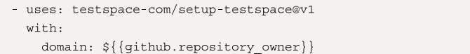

## 12 为提高质量的左移测试

测试和质量保证（QA）仍然是阻碍大多数公司的实践之一。本章将仔细研究QA和测试在开发人员速度方面所起的作用，以及如何左移测试。

本章将介绍以下主题：

- 利用测试自动化进行左移测试
- 根除不稳定的测试
- 代码覆盖率
- 右移——在生产中测试
- 故障注入和混沌工程
- 测试与合规性
- GitHub中的测试管理

### 利用测试自动化进行左移测试

如果开发者实行敏捷开发并尝试频繁交付，那么手动测试不是一种可扩展的选项。即使开发者没有实行CI/CD，仅按照迭代周期进行交付，运行所有必要的回归测试也需要巨大的人力资源和大量的时间和金钱。但是，做好测试自动化并不是一件容易的事情。例如，由QA部门或外包实体构建和维护的自动化测试与更高的工程速度没有关系（*Forsgren N., Humble, J., & Kim, G.,* *2018*, *第95页*）。为了注意到对速度的影响，开发者需要由团队创建和维护的可靠测试。这背后的理论是，如果开发者维护测试，他们会产生更多可测试的代码。

每个人都知道一个好的测试组合应该是什么样的：开发者有一个自动化单元测试的大基础（0级），较少的集成测试（1级），一些需要测试数据的集成测试（2级），以及很少的功能测试（3级）。这就是所谓的测试金字塔（参见图12.1）。

然而，在大多数公司，测试组合并不是这样的。有时，会有一些单元测试，但大多数测试仍处于很高的水平（参见图12.2）：

这些高水平测试可能是自动的，也可能是手动的。但是，它仍然不是一个能帮助开发者持续高质量发布的测试组合。为了实现持续的质量，开发者必须将测试左移（参见图12.3)：

这不是一件容易的任务。以下是一些有助于左移测试的原则：

- **所有权：**团队负责QA，测试与代码一起开发——最好是采用测试优先的方法。QA工程师应该被包括在这个团队中。
- **左移：**测试总是应该写在尽可能低的层次上。
- **编写一次——到处执行：**测试应该在所有的环境中执行，甚至在生产中。
- **测试代码就是生产代码：**适用于正常代码的质量标准同样适用于测试代码。这里不允许走捷径。
- **你编写它——你测试它：**开发者需要对代码质量负责，而且必须确保所有的测试都到位以保证这种质量。

2013年，一份描述QA角色转变的测试宣言被创建了（*Sam Laing, 2015*）:

- 贯穿始终的测试*胜过*最后的测试
- 预防错误*胜过*发现错误
- 测试理解*胜过*检查功能
- 建立最好的系统*胜过*破坏系统
- 团队对质量的责任*胜过*测试人员的责任

这听起来很容易，但它并不容易。开发人员必须学会像测试人员那样思考，测试人员必须像工程师那样思考。向人们展示愿景并确立变革的可持续性并不是一件容易的事情。

#### 测试驱动的开发

测试自动化的关键是拥有一个可测试的软件架构。为了得到这样一个架构，开发者必须尽可能早地开始——也就是说，在内循环中编写代码时就开始。

**测试驱动开发（TDD）**是一个软件开发过程，开发者先写自动化测试，然后写使得测试通过的代码。它已经存在了20多年，其质量优势已经在不同研究中得到证明（例如,  *Müller, Matthias M.; Padberg, Frank, 2017* 和 *Erdogmus, Hakan; Morisio,* *Torchiano, 2014*）。TDD不仅对花费在测试上的时间和整体代码质量有很大影响；它也对可靠和可测试的软件设计由很大影响。这就是为什么它也被称为测试驱动设计。

TDD很简单。其步骤如下：

1. **添加或修改一个测试：**总是从测试开始。在写测试的时候，开发者设计代码会是什么样子。有一段时间，开发者的测试将无法编译，因为所调用的类和函数还不存在。大多数开发环境支持从测试中直接创建必要的代码。一旦代码编译完成，测试就可以执行，这一步就完成了。测试应该是失败的。如果测试通过了，修改它或写一个新的测试，直到它失败。
2. **运行所有测试：**运行所有测试，并验证只有新的测试失败。
3. **编写代码：**编写一些简单的代码，使测试通过。始终运行所有测试，检查测试是否通过。在这个阶段，代码不需要很漂亮，走捷径是被允许的。只要让测试通过即可。糟糕的代码会让开发者知道下一步需要什么样的测试来确保代码变得更好。
4. **所有测试通过：**如果所有测试都通过了，开发者有两个选择：编写一个新的测试或者修改现有的测试。除此之外，开发者也可以重构代码和测试。
5. **重构：**重构代码和测试。因为开发者有一个可靠的测试工具，所以可以比没有TDD是做更多极端的重构。确保在每次重构后都运行所有的测试。如果一个测试失败，撤销最后一步并重试，直到重构步骤后测试继续通过。在成功的重构之后，开发者可以用一个新的失败测试开始一个新的迭代。

图12.4显示了TDD周期的情况：

一个好的测试遵循以下模式：

- **安排：**为测试和被测系统（SUT）本身设置必要的对象——通常，这是一个类。开发者可以使用mock和stub来模拟系统行为（要了解关于mock和stub的更多信息，请参见*Martin Fowler, 2007*）。
- **行动：**执行开发者想测试的代码。
- **断言：**验证结果，确保系统处于期望的状态，并确保该方法使用正确的参数调用了正确的方法。

每个测试都应该是完全自主的——也就是说，它不应该依赖于被之前的测试所操纵的系统状态，并且可以独立执行。

TDD也可以用在结对编程中。这被称为乒乓配对编程。在这种形式的结对编程中，一个开发者编写测试，另一个编写通过测试的代码。对于结对编程来说，这是一个很好的模式，也是向年轻同事传授TDD好处的好方法。

TDD已经存在了很久，实践它的团队获得了很多价值——然而我遇到过很多没有使用它的团队。一些人不使用它是因为他们的代码运行在嵌入式系统上，而另一些人不使用它是因为他们的代码依赖于难以模拟的SharePoint类。但这些都是借口。可能有一些无法测试的底层代码，但是开发者编写逻辑时，总是可以先测试它。

#### 管理测试组合

有了TDD，开发者应该很快就能得到一个可测试的设计。即使在既有系统中，自动化测试的数量也会快速增长。问题在于，测试质量通常不是最优的，而且随着测试组合的增加，执行时间往往会变得非常长，并且测试结果可能是不确定的（不稳定的）。最好是有较少的、质量较高的测试。长时间的执行阻碍了快速发布，而不稳定的测试用例会产生不可靠的质量信号，并降低对测试套件的信任（参见图12.5）。随着团队中QA的日益成熟，测试套件的质量不断提高，即使在第一个高峰之后测试的数量减少了：

要积极管理测试组合，开发者应该为测试定义基本规则，并不断监测测试的数量和执行时间。以 Microsoft 团队的测试组合为例看一下他们使用的分类法。

**单元测试（0级）**

这里，我们拥有没有外部依赖和不需要部署的内存单元测试。它们应该很快，平均执行时间少于60毫秒。单元测试与被测代码位于同一位置。

使用单元测试，开发者不能改变系统的状态（比如文件系统或它的注册表），不能查询外部数据源（web服务和数据库），也不能改变互斥体、信号量、秒表和Thread.sleep操作。

**集成测试（1级）**

这个级别涉及到更复杂需求的测试，这些测试可能依赖于轻量级的部署和配置。测试应该仍然非常快，每个测试必须在两秒内运行。

使用集成测试时，不能依赖于其他测试，并存储大量数据。开发者也不能在一个程序集中有太多测试，否则会阻止测试并行执行。

**使用数据的功能测试（2级）**

功能测试针对具有测试数据的可测试部署运行。对系统（如身份验证提供者）的依赖可以被提出？？可以进行桩模拟，并允许使用动态身份。这意味着每个测试都有一个独立的身份，这样测试可以针对部署并行执行，而不会相互影响。

**生产测试（3级）**

生产测试针对生产运行，需要完整的产品部署。

这只是一个示例，开发者的分类法可能会根据所用的编程语言和产品而有所不同。

如果开发者已经定义了分类法，就可以设置报告并开始转换测试组和。首先要确保编写和执行高质量的单元测试和集成测试变得容易。然后，开始分析遗留测试（手工的或自动化的）并检查哪些可以丢弃。将其他的转换成好的功能测试（2级）。最后一步是为生产编写测试。

Microsoft 团队最初有27,000个遗留测试（用橙色表示），在42个迭代周期（126 周）内将这些测试数量减少到了零。大多数测试都被单元测试所取代；有些被功能测试所取代。许多被简单地删除了，但是单元测试稳步增长，最终超过40，000个（参见图12.6）：

左移可以使测试更加快速和可靠，参阅之后的**进一步阅读**部分可以得到更多关于微软团队如何左移他们的测试组合的内容。

### 根除不稳定的测试

非确定性或不稳定的测试是指在相同的代码下有时通过，有时失败的测试（*Martin Fowler, 2011*）。不稳定的测试会破坏开发者对测试组合的信任。这可能会导致团队忽略红色测试结果，或者开发人员停用测试，从而降低测试组合的覆盖范围和可靠性。

有很多原因导致测试不稳定。通常情况下，它们是由于缺乏隔离的原因。许多测试在机器上的同一进程中运行，所以每次测试都必须找到并保留系统的干净状态。另一个常见的原因是异步行为。测试异步代码有其挑战，因为开发者永远不知道异步任务是以何种顺序执行的。其他原因可能包括资源泄漏或对远程资源的调用。

有不同的方法来处理不稳定的测试：

- **重试失败的测试：**一些框架允许重试失败的测试。有时，开发者甚至可以配置更高级别的隔离。如果一个测试在重新运行时通过了，它就被认为是不可靠的，开发者应该使用 git blame 提交一个可靠性缺陷报告。

- **可靠性运行：**开发者可以在代码经过成功构建的情况下执行工作流程。如果测试失败，那么说明有可能存在不稳定的问题，开发者可以使用 git blame 提交一个可靠性缺陷报告。

一些公司会隔离一些不稳定的测试，但是这也让开发者无法收集额外的数据，因为测试无法运行。最好的做法时继续执行不稳定的测试，但是将它们从报告里删除。

如果读者想了解GitHub或者谷歌是如何处理不稳定的测试的，请阅读*Jordan Raine,* *2020* or *John Micco, 2016*。

### 代码覆盖率

代码覆盖率是一个度量标准（百分比），它计算测试调用的代码元素的数量除以代码元素的总数。代码元素可以是任何东西，常见的是代码行、代码块或函数。

代码覆盖率是一个重要的指标，因为它向开发者展示了代码中哪些部分没有被测试套件覆盖。我喜欢在完成代码更改之前查看代码覆盖率，因为我经常忘记为边缘情况（如异常处理）或更复杂的语句（如lambda表达式）编写测试。在开发者编写代码的时候添加这些测试是没有问题的，稍后添加它们会困难的多。

但是开发者不应该关注绝对数字，因为代码覆盖率本身并不能说明测试的质量。高质量测试中70%的代码覆盖率比低质量中90%的代码覆盖率要好。根据开发者使用的编程语言和框架，可能会有一些测试工作量很大但价值很低的底层代码。通常，开发者可以从代码覆盖率计算中排除该代码，这就是为什么代码覆盖率的绝对值是有限的。然而，随着时间的推移，度量每个管道中的价值并关注新代码有助于提高自动化测试的质量。

### 右移——在生产中测试

如果开发者从自动化测试开始，很快会看到测试质量的提高和工程师调试工作的减少。但是在某个时候，开发者必须大幅增加努力才能看到质量上的显著影响。另一方面，测试执行所需的时间会减缓发布流程，尤其是当开发者将性能测试和负载测试添加到组合中时（参见图12.7）:

如果开发者的管道运行超过24小时，一天内不可能发布多次！管道执行时间的增加还会降低在生产中出现问题时快速前滚和部署修复的能力。

解决这个问题的方法很简单：将一些测试转移到生产中。开发者在生产中运行的所有测试都不会影响快速发布的能力，并且不需要性能或负载测试，因为代码已经有了生产负载。

然而，在生产环境中进行测试有一些前提条件，这些条件可以提高用户的性能质量，而不是降低它。让我们来看一下。？？为你的用户提高性能质量

#### 健康数据和监测

如果要在生产环境中进行测试，开发者必须时刻关注应用程序的健康状况。这超出了正常的日志记录。开发者需要深入了解应用程序是如何运行的。一个好的做法是让测试代码调用所有相关的系统——比如数据库、Redis缓存或相关的REST服务，并让这些测试对日志记录解决方案可用。这样，开发者就可以有一个持续的心跳，表明所有的系统都已启动、运行并协调工作。如果测试失败，开发者可以有一个警报器，立即通知团队有问题。开发者还可以自动化这些警报，并让它们出发某些功能，比如激活断路器。

断路器

断路器是一种防止应用程序重复尝试只能可能失败的操作的模式，允许应用程序继续改变功能，？？继续使用改变后的功能  而不必等待失败的操作成功（参见*Michael Nygard, 2018*)。

#### 功能标志和金丝雀发布

开发者不想在生产中进行测试，导致所有客户完全停工。这就是为什么开发者需要功能标志、金丝雀发布、基于环的部署，或这些技术的混合（见第9章和第10章）。重要的是要逐渐公开这些变化，这样，如果发生停机，开发者就不会使整个生产环境停止运行。

#### 业务连续性和灾难恢复

生产中的另一种测试形式是业务连续性和灾难恢复（BCDR）或故障转移测试。产品的每个服务或子系统都应该有一个BCDR，并且定期进行BCDR演习。如果系统停机，没有什么比灾难恢复不起作用更糟糕的了。只有定期测试，开发者才知道它在工作。

#### 探索性测试和可用性测试

自动化测试并不意味着开发者应该完全放弃手工测试。但手动测试的重点从验证功能和手动执行回归测试转向了可用性、快速和高质量反馈以及使用结构化测试方法难以发现的错误。

**探索性测试**是由Cem Kaner在1999年提出的（*Kaner C., Falk J., H. Q.* *Nguyen, 1999*） 。这是一种同时关注发现、学习、测试设计和执行的测试方法。它依赖个体测试人员来发现在其他测试中不容易发现的缺陷。

有许多工具可以促进探索性测试。它们会帮助开发者记录会话，获取带注释的屏幕截图，并且通常允许开发者从已经执行的步骤中创建一个测试用例。一些扩展集成了Jira，比如Zephyr和Capture，还有些浏览器扩展，比如Azure Test Plans的测试和反馈客户端。如果在独立模式下使用，后者是免费的。这些工具提供了利益相关者对开发人员的高质量反馈，不仅仅是在发现的缺陷方面。

收集反馈的其他方法包括使用**可用性测试**技术——如走廊测试或游击式可用性测试，通过对新的、没有偏见的用户进行测试来评估开发者的解决方案。A/B测试是可用性测试的一种特殊形式，本书将在第19章《用GitHub进行实验和A/B测试》中详细介绍。

这里重要的一点是，所有这些测试都可以在生产中执行。开发者不应该在CI/CD管道中有任何手动测试。快速发布并允许在生产环境中进行手动测试，可以使用功能标志和金丝雀发布。

### 故障注入和混沌工程

如果开发者想提高生产中的测试水平，可以练习故障注入（也称为混沌工程）。这意味着开发者将故障注入到生产系统中，以观察它在压力下的行为，以及故障转移机制和断路器是否工作。可能的故障包括CPU负载、高内存使用率、磁盘I/O压力、磁盘空间不足，或者服务器或整个机器被关闭或者重新启动。其他可能性包括进程被种植、系统时间被更改、网络流量被丢弃、延迟被注入以及DNS服务器被阻塞。

实践混沌工程使系统具有弹性。开发者不能将其与传统的负载或性能测试进行比较！

不同的工具可以帮助开发者进行混沌工程。例如Gremlin  (https://www.gremlin.com/)是一个基于代理的SaaS产品，支持大多数云提供商(Azure, AWS, 和Google Cloud)和所有操作系统。它也可以和Kubernetes一起使用。Chaos Mesh(https://chaos-mesh.org/)是专门为Kubernetes开发的开源解决方案。Azure Chaos Studio(https://azure.microsoft.com/en-us/services/chaos-studio)是一个专门针对Azure的解决方案。哪种工具最适合开发者取决于支持的平台。

混沌工程可以非常有效，并使系统具有弹性，但它应该仅限于对客户影响很小或没有影响的金丝雀环境。

### 测试和合规性

大多数合规标准，如汽车行业的ISO26262或制药行业的GAMP，都遵循V-Model作为开发流程。V-Model要求分解用户和系统需求，并在不同的细节层次上创建规范。这是V-Model的一方面。它还要求验证所有级别，以确保系统满足要求和规格。这是V-Model的另一方面。两边都可以在图12.8中看到：

这个模型必须与风险分析相结合，在每个细节层面都要进行风险分析。许多文件必须在发布阶段签署。这导致了一个缓慢的瀑布式流程，其中包含很长的规范、开发和发布阶段。

但是这些标准是基于良好的实践——如果开发者的实践比标准中的更好，可以在审核中证明这一点。这些标准不要求开发者手工进行验证，也没有对各阶段的时间做出规定。解决方案是自动化所有的验证逻辑，并在开发者修改测试时的pull请求中将批准作为代码审查添加进来（左移）。不能自动化的测试必须转移到生产中（右移）。这样，开发者就可以自动化整个V？？V型模型，并在一天中多次运行它：

1. 添加或修改需求（例如，一个issue）。
2. 创建一个pull请求，并将其链接到这个issue。
3. 在仓库中修改系统设计和架构（例如，在markdown中），或者在pull请求中声明不需要修改。
4. 编写单元测试（这是开发者的软件设计）和要实现的代码。
5. 编写或修改功能、系统和集成测试。
6. 确保所有必要的角色都批准了pull请求，并确保如果推送了新更改，则批准已过期。
7. 将所有的更改发布到生产环境中，并在那里运行最终测试。

开发者也可以用代码来管理风险。这样，开发者可以将它们集成到自动化过程中。如果没有，开发者仍然可以将文档附加到issue中。这样，开发者就可以对所有的变更、所有必要的批准以及所有完成的验证步骤进行端到端的可追溯性。而且，开发者仍然可以快速迭代，定期发布到生产中。

### GitHub中的测试管理

不幸的是，GitHub没有很好的方法来跟踪测试运行和代码覆盖率，也不能帮助开发者监测或隔离不稳定的测试。开发者可以将测试作为工作流的一部分来执行，并且可以将结果反馈回来，但是对报告来说，开发者必须依赖测试工具。

与GitHub很好集成的一个好的解决方案是Testspace (https://www.testspace.com/)。它是SaaS提供的，对开源项目是免费的。设置它很简单，只需从商城(http://github.com/marketplace/testspace-com)安装扩展即可，选择您想要的计划，并授予对存储库的访问权限。然后，将以下步骤添加到开发者的工作流中：

如果开发者的存储库是私有的，那么必须在Testspace中创建一个token，并将其作为该步骤的密钥加入该步骤中：token: ${{ secrets.TESTSPACE_TOKEN }}。

接下来，在执行测试的步骤之后，开发者必须添加一个步骤来将测试和代码覆盖率结果push到Testspace。开发者可以使用glob语法来指定动态文件夹中的文件。要确保开发者执行了该步骤，即使发生了错误（if: '!cancelled()'）：

Testspace 提供可靠的检测方法来检测不稳定的测试。他有一个Build Bot，如果有新的结果到来，会给开发者发送通知，开发者可以通过回复邮件对结果进行评论（参见图12.9）：

它会自动将检查整合到pull请求中（参见图12.10）：

Testspace的用户界面看起来并不多么好看，但它有非常丰富的报告和大量功能（参见图12.11）:

如果开发者还没有一个测试管理的解决方案，可以试试Testspace。如果已经有了一个，那么将它整合到工作流中一个是很简单的。

### 案例研究

Tailwind Gears的两个试点团队实现了更快的交付周期和部署频率，这要归功于已经应用的DevOps实践。恢复的平均时间也大为改善，业务发布管道有助于更快地发送修复程序。然而，变化地失败率却下降了。更频繁地发布也意味着更多的部署失败，并且很难找到代码中的错误。来自自动化测试套件的质量信号并不够可靠，修复一个bug往往会在另一个模块中引入另一个bug。应用程序中的许多部分仍然需要手工测试，但是对于团队中的以一个QA工程师来说，这不是一个选项。因此，这些部分中的一些已经被UI所取代，而另一些则被删除了。

为了评估测试组合，团队必须引入测试分类，并在它们的管道中包括报告。团队中的QA工程师负责分类，报告显示有太多的功能和UI测试，而没有足够的单元测试。许多工程师仍然不相信TDD会节省他们的时间，也不相信在某些情况下使用TDD进行开发是可能的，尤其是当团队正在开发嵌入式软件的时候。团队决定一起预定一个TDD培训课程来学习和实践TDD。

之后，所有新代码都用TDD编写，新代码的代码覆盖率至少为90%。团队还在每次迭代中花费30%的时间来根除不稳定的测试和重写较低层次的测试。

为了发现不稳定的测试，团队在绿色测试的管道上运行可靠性测试。不稳定的测试具有最高优先级。之后，团队挑选执行时间最长的测试，并决定对每个测试做什么。尽管有些被转换成集成测试，大多数测试被转换成单元测试。一些测试可以被删除，因为它们不会带来额外的价值。

探索性测试完全取代了结构化的手工测试。如果在这些会话中发现了什么，那么在修复之前会创建一个单元测试。

运行web应用程序的团队还包括一个新的测试类别，其中包含在生产环境中执行的测试。他们实施应用程序性能监控并收集许多指标，以便了解应用程序在所有环境中的运行状况。他们还在每次迭代中执行第一次BCDR训练，以开始生产和混沌工程中的测试。

### 摘要？？总结

在这一章中，读者学习了如何通过测试自动化将测试左移，然后在生产和混沌工程中将测试右移来加速软件交付。这样，开发者可以快速发布，而不会在质量方面做出妥协。最后，读者学习了如何管理测试组合，根除不可靠的测试，并通过注入错误和混乱使您的应用程序更有弹性。

在下一章中，读者将学习如何将安全性和实现DevSecOps实践转移到开发过程中。

### 进一步阅读

本章中使用了以下参考资料来帮助读者了解有关这些主题的更多信息：

- Forsgren N., Humble, J., & Kim, G. (2018). *Accelerate: The Science of Lean Software* *and DevOps: Building and Scaling High Performing Technology Organizations* (1st ed.) [E-book]. IT Revolution Press.

-  Eran Kinsbruner (2018), *Continuous Testing for DevOps Professionals: A Practical* *Guide From Industry Experts* (Kindle Edition). CreateSpace Independent Publishing Platform.

-  Sam Laing (2015), *The Testing Manifesto*, https://www.growingagile.co.za/2015/04/the-testing-manifesto/.

- Wolfgang Platz, Cynthia Dunlop (2019), *Enterprise Continuous Testing:* *Transforming Testing for Agile and DevOps* (Kindle Edition), Independently published.

- Tilo Linz (2014): *Testing in Scrum* (E-book), Rocky Nook.

- Kaner C., Falk J., H. Q. Nguyen (1999), *Testing Computer Software* (2nd Edition) Wiley.

- Roy Osherove (2009), *The Art of Unit Testing* (1st edition), Manning.

- Martin Fowler (2007), *Mocks Aren't Stubs* https://martinfowler.com/articles/mocksArentStubs.html.

- Müller, Matthias M.; Padberg, Frank (2017). *About the Return on Investment of Test**Driven Development* (PDF). Universität Karlsruhe, Germany.

- Erdogmus, Hakan; Morisio, Torchiano (2014). *On the Effectiveness of Test-first* *Approach to Programming*. Proceedings of the IEEE Transactions on Software Engineering, 31(1). January 2005. (NRC 47445).

- *Shift left to make testing fast and reliable*: https://docs.microsoft.com/en-us/devops/develop/shift-left-make-testing-fast-reliable.

- Martin Fowler (2011), *Eradicating Non-Determinism in Tests*, https://martinfowler.com/articles/nonDeterminism.html.

- Jordan Raine (2020). *Reducing flaky builds by 18x*. https://github.blog/2020-12-16-reducing-flaky-builds-by-18x/.

- John Micco (2016). *Flaky Tests at Google and How We Mitigate Them*. https://testing.googleblog.com/2016/05/flaky-tests-at-google-andhow-we.html.

- *Shift right to test in production*: https://docs.microsoft.com/en-us/devops/deliver/shift-right-test-production.

-  Michael Nygard (2018). *Release It! Design and Deploy Production-Ready Software*(2nd Edition). O'Reilly

