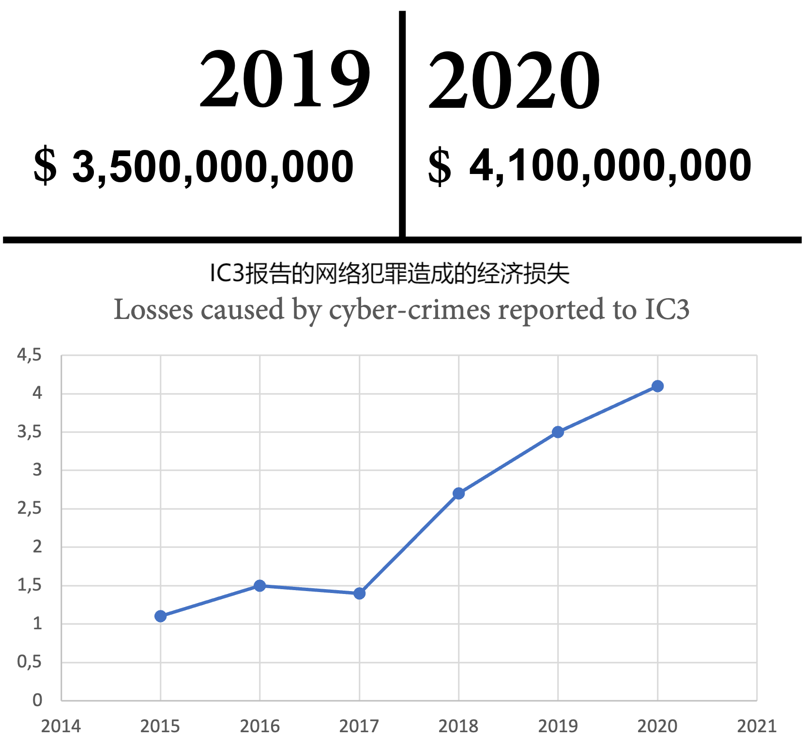

## 12 左移安全和DevSecOps

在美国联邦调查局（FBI）互联网犯罪投诉中心（IC3）报告的网络犯罪造成的损失总额已经达到历史最高水平，从2019年的35亿美元增加到2020年的41亿美元（IC3，2019和2020）。这一趋势在过去几年里一直呈现强劲增长（见图13.1）：



图13.1 IC3报道的由网络犯罪造成的总损失

受影响的公司包括初创企业和财富500强企业。受影响的科技巨头包括Facebook、Twitter、T-Mobile和Microsoft，以及旧金山国际机场等公共机构或像FireEye这样的安全公司。没有一家公司能声称网络犯罪对他们没有威胁！

在本章中，我们将更广泛地探讨安全在开发中的作用，以及如何将其融入到您的流程中并实现零信任文化。

以下是本章的要点：

- 左移安全

- 假定攻击、零信任和安全第一的思维方式
- 攻击模拟
- 红队蓝队演练
- 攻击场景
- GitHub Codespaces

### "左移安全"（shift-left security）

在传统的软件开发中，安全性通常被处理在下游阶段：当软件准备发布时，安全部门或外部公司会进行安全审查。这种方法的问题在于，在那个时间点上很难解决架构问题。一般来说，越晚修复安全漏洞，成本就会越高；而如果不修复漏洞，成本可能会达到数百万，这可能导致一些公司破产。在开发生命周期中越早修复安全漏洞，成本就越低（参见图13.2）：


开发  构建  部署  测试   违规检测

Figure13.2  在开发生命周期不同阶段修复安全漏洞的开销

这就是我们所说的“左移安全”：将安全性融入开发生命周期，使其成为所有活动的重要组成部分。问题在于，现在没有足够的安全专家能够加入每个工程团队。将安全向左转移是通过教育工程师和创造安全第一的思维方式来实现的。

### 假定攻击、零信任和安全第一的思维方式

传统的安全方法是预防漏洞。最重要的措施包括以下内容：

- 信任层：内部网络被认为是安全的，并由防火墙进行保护。仅允许公司拥有的设备和虚拟专用网络（VPN）隧道访问网络。公共互联网是不可信的，而在两者之间是非军事区（DMZ）。
- 风险分析：使用威胁建模进行风险分析
- 安全审核：由安全专家进行的架构和代码审核。
- 安全测试：具有特定范围的外部安全测试。

但是通过防范攻击的方法，基本上不能回答一个公司是否已经遭受攻击的问题。
在2012年的一次采访中，前国家安全局(NSA)和中央情报局(CIA)主管迈克尔·海登将军说:

​				*"从根本上讲，如果有人想进来，他们就会进来......接受这一点。"*

这是假设攻击范式的基础: 你很可能已经遭受了攻击，无论你是否知道。始终假设您已经遭到入侵。这种思考方式可以识别防范攻击方法中的漏洞。您如何做到以下几点?

- 攻击和入侵的**检测**?
- 对攻击做出**反应**?
- 从数据泄漏或篡改中**恢复**?

这导致了安全措施的转变，增加了全新的重点。采用“假定被攻破”范式后，需要以下措施：

- 集中的安全监控或安全信息和事件管理（SIEM）系统来检测异常。
- 持续的现场测试你的事件响应（IR）（火灾演练）。
- 战争游戏（红队-蓝队模拟）来检测漏洞，提高意识，学会像攻击者一样思考，并训练你的响应。
- 现场渗透测试：包括网络钓鱼、社交工程和物理安全等复杂的攻击模拟。
- 不要信任身份和设备，即使在你的网络中（零信任）。

如果你的安全主要基于层次结构，一旦黑客通过网络钓鱼、社交工程或物理攻击进入你的网络，他们就可以轻易地推进。在可信网络中，你通常会发现未受保护的文件共享、未经安全套接层（SSL）保护的未打补丁的服务器，弱密码，和使用单因素认证（SFA）的大多数系统中。在以云为先的世界中，这是毫无意义的。

随着零信任访问到您的服务，您始终验证身份--例如，通过多因素身份验证(MFA)，您验证参与交易的设备、访问和服务的身份。图13.3显示了如何为您的服务实现零信任访问的示例：


| 验证身份                   | 验证设备                     | 验证访问权限           | 验证服务     |
| -------------------------- | ---------------------------- | ---------------------- | ------------ |
| 强制实施身份验证           | 设备位置（新设备，异常位置） | 最低权限访问模型       | 服务健康监控 |
| 多要素身份验证（MFA）      | 设备健康状况                 | 某些访问的设备健康情况 | 受管理的身份 |
| 最低权限用户权限           | 使用数据（应用程序和服务）   | 未经管理的设备         | 密钥轮换     |
| 无密码访问（基于生物特征） | 设备管理                     | 信息保护               | 安全事件     |

-----------------------------------------用户和访问遥测---------------------------------------------->

Figure 13.3 公司服务的零信任访问

如果你的公司使用软件即服务（SaaS）云服务，你可能已经熟悉了零信任。你必须使用MFA进行身份验证，但可以信任你的浏览器和设备以获得更多的舒适性。如果你旅行，你会收到通知或必须批准来自不寻常位置的登录尝试。如果你安装第三方应用程序，你必须授予应用程序访问信息的权限，并且可能不允许从公共的、不受信任的设备访问高度机密的信息。

零信任意味着对所有服务应用相同的原则，独立于你是否从内部网络访问它们。

### 攻击模拟

为了在发生安全事件时知道如何应对，你应该定期进行演练，练习你的标准操作规程（SOP）并提高响应时间。就像在你的办公室进行消防演习一样，如果你不练习这些演习，你就不知道在真正的火灾事件中你的安全措施是否真正有效。
你应该尝试提高以下指标:

- **检测平均时间（MTTD）**
- **恢复平均时间（MTTR）**

在这样的演习中，你会模拟一个攻击场景，练习你的IR流程，并对演习的教训进行事后总结。
以下是一些攻击场景的示例：

- 服务被攻陷
- 内部攻击者
- 远程代码执行
- 恶意软件爆发
- 客户数据泄露
- **拒绝服务（DoS）**攻击

练习这些演习将让你有信心你的SOP有效，并让你在发生真正的安全事件时快速高效地应对。

### 红队-蓝队演习

红队-蓝队演习是一种特殊形式的演练，也被称为战争游戏。两支拥有内部知识的团队相互对抗。红队是攻击方，试图访问生产系统或者窃取用户数据，而蓝队则负责防御攻击。如果蓝队检测到攻击并能够阻止攻击，蓝队获胜。如果红队有证据表明他们能够访问生产系统或者窃取数据，红队获胜。

#### 团队组成

与普通的攻击模拟不同的是，红队-蓝队演习团队对你的系统有更深入的了解，因此更容易发现漏洞。相比于其他降低安全风险的措施，红队-蓝队演习是最复杂的攻击之一，具有最深入的洞察力（参见图13.4）。


从左往右

insights of the attacher 攻击者的洞察力  whitebox 白盒测试 
blackbox 黑盒测试 Audit 审计 code review 代码审查 code scans 代码扫描 infrastruction scaning 基础设施扫描 vulnerability scaning 漏洞扫描 
Dynamic Application Security Testing 动态应用程序安全测试 
Credential Scaning 凭据扫描 Dependency scaning 依赖关系扫描 
Red-Team / Blue-Team simulation 红队/蓝队模拟
Sophisticated attacks including phishing, social engineering, and physical security  包括钓鱼、社会工程和物理安全在内的复杂攻击
external attack simulation 外部攻击模拟
Depth of attack  攻击的深度

图13.4 - 由攻击者的洞察力和攻击深度降低风险

团队应该由不同的组织单位混合组成。不要仅仅选取一支红队和一支蓝队。团队的构成是游戏成功的关键。

对于红队，应该做到以下几点：

- 使用来自不同团队的有创造力的工程师，他们已经对安全感兴趣。
- 加入具有在组织内经验的安全专家，或寻求外部支持。

对于蓝队，应该做以下准备：
	选择具有日志记录、监控和网站可靠性方面经验的操作工程师。
	添加具有网络安全和身份验证方面知识的工程师。
两个团队都应该有寻求专家帮助的可能性。例如，当红队需要编写一个结构化查询语言（SQL）语句来执行复杂的SQL注入攻击时，他们可以向数据库管理员（DBA）团队寻求帮助；或者，当蓝队需要内部信息以了解应用程序的工作方式或需要应用程序记录额外的数据时，可以直接与构建和维护应用程序的团队联系。

#### 游戏规则

游戏的主要目标是所有参与者的学习——学习如何像攻击者一样思考，学习如何检测和应对事件，并学习哪些漏洞存在于公司中可以被利用。第二个目标是有趣。就像黑客马拉松一样，这个练习应该是一个团队建设活动，对所有参与者来说都是有趣的。

但是为了成功而不伤害任何人，你需要为游戏制定一些基本规则。

##### 持续时间

红队-蓝队演习可以持续数天、数周或甚至数月。选择攻击可能发生的时间段和攻击本身的持续时间。一个好的起点是3周时间和3天攻击。根据需要调整时间。

##### 准则和规则

为了使练习成功，你必须建立一些规则和参与者必须遵守的行为准则，如下所述：

- 两个团队都不能造成实际伤害。这也意味着红队不应做过多的事情来实现他们的目标，物理攻击应遵循常识（不要骚扰或威胁任何人，不要从同事那里偷钥匙或工作牌等）。
- 不要暴露被攻破人的名字。
- 不要为付费客户造成停机时间或侵犯其数据！
- 被攻破的数据必须加密存储和保护，并且不会暴露给真正的攻击者。
- 不能削弱生产系统的安全性以使客户面临风险。例如，如果红队可以修改源代码以禁用所有生产系统的身份验证，则可以在代码中留下注释并在部署完成时宣称胜利。但是，你不能禁用真正客户正在使用的生产系统的身份验证。

这可能看起来很明显，但是如果你有有竞争性的团队，他们可能会在游戏中失控。最好表明显而易见的事实，并制定一些基本规则。

##### 交付内容

在游戏结束时，团队要交付以下内容：

- 必须修复的漏洞清单。必须立即修复关键漏洞。
- 改善取证和分析能力的事项清单。
- 针对整个组织的关于练习所学内容的公开报告。

记住要让所有人都不承担责任，不要暴露被攻击者姓名。

#### 从哪里开始

我知道很多人认为红队-蓝队演习只适用于成熟度非常高的公司，但我相信红队-蓝队演习对每个公司来说都是创建意识、学习和成长的好方法，特别是当他们仍在防止入侵并认为他们的企业内部网络是安全的时候。如果您的成熟度水平不是很高，攻击就更容易。如果成熟度非常高，则攻击需要更加复杂，并且在不造成真正伤害的情况下成功攻击变得更加困难。
我更喜欢红队-蓝队演习而不是普通的攻击模拟——它们更有趣，也是更好的学习方式。如果您不知道从哪里开始，可以寻求外部帮助。
如果您在第一次演习中发现了很多问题，并且红队很容易获胜，您可能需要考虑更频繁地进行这些演习。如果没有这种情况，每年一次是我看到公司成功进行的好的节奏，但这在很大程度上取决于您的情况。
只需开始您的第一次演习——其余的就会自然而然地跟随。

### 攻击场景

在 DevOps 和 DevSecOps 的背景下，大多数人首先想到的攻击场景是使用漏洞（如 SQL 注入、跨站脚本（XSS）或内存泄漏，例如缓冲区溢出）在生产系统上执行代码。在第14章《保护您的代码》中，我们将更详细地了解如何搜索这些类型的漏洞以及如何将其集成到您的交付流程中。

但是，存在着更简单的攻击场景，例如以下几种：

- 未受保护的文件共享和存储库

- 存储在文本文件、配置文件和源代码中的机密信息（例如测试账户、个人访问令牌（PATs）、连接字符串等）
- 钓鱼攻击

钓鱼攻击是一种特别容易发动攻击的方式。根据2021年的一项研究，19.8%的钓鱼邮件接收者会在邮件中点击链接，14.4%的人会下载附件（见Terranova和Microsoft，2021）。在定期进行钓鱼活动的公司中，这些数字或多或少相同。在我所服务的一家客户公司中，在钓鱼活动期间收到电子邮件的员工中，近10%的人在点击钓鱼邮件中的链接后输入了他们的凭据！

钓鱼的问题在于一种心理效应，称为提示效应。即使你大体上知道钓鱼攻击的外观和检测它们的标志，但当你期望一封邮件或认为邮件属于你所处的某个情境时，你更有可能不去寻找那些标志。一个好的例子是在月末收到一封自你的人力资源（HR）部门发出的邮件，声称你的工资支付出现了问题。由于这是月底，你期望收到你的工资，所以这封邮件看起来并不奇怪。你可能之前也遇到过问题。也可能你刚刚检查，发现还没有收到钱。邮件还产生了一些紧迫感。如果你赶时间，你可能希望尽快解决这个问题，这样你的工资就能按时到账。如果你在月底发送这样一封钓鱼邮件，那么人们在接下来的一个月中就更有可能会点击。另一个例子是共享文档。如果你刚刚与一位同事通电话，他说要与你分享一个文件，你可能会想为什么他们选择这种方式，但你并不怀疑，因为你已经在期待收到一个文件了。发送的钓鱼邮件越多，就越有可能有人处于正确的情境中，并且会受到攻击。

一旦攻击者成功入侵第一个受害者并获取了公司凭证或访问受害者的计算机，游戏就完全改变了。现在，攻击由一名内部攻击者执行，他们可以从内部地址针对特定公司人员进行攻击。这被称为钓鱼式攻击，极其难以检测。 

钓鱼式攻击的好目标是管理员或工程师。如果您不实践最低特权用户权限，攻击者可能已经可以访问生产系统或是域管理员，游戏已经结束。但如果他们攻击了一名开发人员，他们也有各种选择，如下所述：

-  **开发环境**：开发环境是每个攻击者的梦想。大多数开发人员作为本地管理员工作，您已经可以找到许多预安装的工具，帮助攻击者进一步攻击。他们可以在文本文件中找到访问各种系统的秘密。或者，由于他们是管理员，他们可以使用一个叫做mimikatz的工具（请参阅https://github.com/gentilkiwi/mimikatz/wiki），从内存中读取凭据。 
- **测试环境**：许多开发人员可以作为管理员访问测试环境。攻击者可以登录并使用mimikatz窃取其他凭据。 
- **修改代码**：通常只需一行代码即可禁用身份验证。攻击者可以尝试修改代码或更改依赖项的版本，以使用已知漏洞进行攻击。 
- **执行脚本**：如果开发人员可以修改管道代码或在部署期间执行的脚本，攻击者可以插入代码，在部署期间执行。

这就是为什么在工程领域，特别是在安全方面，需要特别谨慎的原因。攻击面比组织中大多数其他部门都要大得多。 要从一个被攻陷的账户到域管理员，或至少是拥有生产访问权限的管理员，您可以使用一个称为**BloodHound**的工具（https://github.com/BloodHoundAD/BloodHound）。它支持**Active Directory（AD）**和**Azure AD（AAD）**并显示所有隐藏的关系：谁在哪些机器上拥有会话？谁是哪个组的成员？谁是某个机器的管理员？
蓝队和红队都可以使用此工具分析AD环境中的关系。

### GitHub Codespaces 

由于开发环境在安全方面存在很大问题，将它们虚拟化并为每个产品提供一个专用机器是个好主意。这样，您可以实现最小特权用户权限，并且您的工程师不必在其计算机上使用本地管理员权限进行工作。您还可以限制特定产品所需的工具数量并最小化攻击面。

当然，您可以使用传统的虚拟桌面基础架构（VDI）映像，但您也可以使用一种更轻量级的选项：dev 容器（请参见 https://code.visualstudio.com/docs/remote/containers，它是 VisualStudio Code（VS Code）的扩展，构建在其客户端-服务器架构之上）。您可以将 VS Code 连接到正在运行的容器或实例化一个新实例。完整的配置存储在存储库中（配置为代码），您可以与团队共享 dev 容器的相同配置。

一种特殊形式的 dev 容器是 GitHub Codespaces，它是在 Azure 中托管的虚拟开发环境。您可以选择不同的虚拟机（VM）大小，介于 2 核 / 4 GB RAM / 32 GB 存储和 32 核 / 64GB RAM / 128 GB 存储之间。虚拟机的启动时间非常快。默认映像超过 35 GB，启动时间少于 10 秒钟！

基础镜像包含了开发所需的所有内容，如Python、Node.js、JavaScript、TypeScript、C、C++、Java、.NET、PHP、PowerShell、Go、Ruby、Rust和Jekyll等。此外还包括了大量的其他开发工具和实用程序，例如git、Oh My Zsh、GitHub命令行界面(GitHub CLI)、kubectl、Gradle、Maven和vim。在你的codespace中运行`devcontainer-info content-url`命令，并打开它返回的URL，即可获得所有预安装工具的完整列表。

但你不必使用基础镜像，你可以完全自定义你的codespace，使用dev container来工作。你可以在浏览器中使用VS Code或者使用本地的VS Code实例或使用终端中的SSH来操作codespace。如果你在codespace中运行应用程序，你可以将端口转发到本地机器来进行测试。图13.5展示了GitHub Codespaces的架构：


Figure 13.5  GItHub Codespaces的架构

您可以在 Code|Codespaces|Newcodespace 下打开例如 https://github.com/wulfland/AccelerateDevOps 存储库，如果您的帐户启用了 Codespaces。（见图13.6）该存储库没有开发容器配置，因此它将加载默认图像：


Figure13.6   打开codespace中的一个存储库

在前面的截图中，您可以看到我已经在主分支上运行了一个 codespace。与其创建一个新的 codespace，我也可以打开现有的 codespace。选择 VM 大小（见图 13.7）:


Figure13.7   为您的codespace选择VM大小

在终端中，使用以下命令将目录更改为 `ch9_release/src/Tailwind.Traders.web` 并构建、运行应用程序：

```bash
cd ch9_release/src/Tailwind.Traders.Web
dotnet build
dotnet run
```

这将启动一个 Web 服务器，监听端口 5000 和 5001。Codespaces 自动检测到此并将端口 5000 转发到本地端口。只需单击“在浏览器中打开”即可在本地浏览器中查看在您的 codespace 中运行的应用程序（如图 13.8 所示）：


Figure 13.8 转发一个端口到您的机器

如果您想与同事共享链接,您还可以在“PORTS”选项卡中手动添加需要转发的端口，并更改可见性—例如，让他们尝试新功能（如图13.9所示）：


Figure 13.9   在GitHub Codespaces中配置端口转发

如果您希望更加掌控您的开发环境，您可以在 Codespaces 中创建一个开发容器（dev container）。在 VS Code 中打开命令面板，方法是单击左下角的绿色 Codespaces 按钮，或者在 Mac 上按 Shift + Command + P，或在 Windows 上按 Ctrl + Shift + P。选择 Codespaces: Add Development Container Configuration Files... 并按照向导选择要安装的语言和功能。向导将在仓库的根目录下创建一个 .devcontainer 文件夹，并在其中创建两个文件：一个是 devcontainer.json 文件，另一个是 Dockerfile 文件。

Dockerfile文件定义了当初始化代码空间时所创建的容器。Dockerfile文件可以非常简单--只需要包含一个FROM子句即可，指示从哪个基础镜像继承。

在devcontainer.json文件中，您可以传递参数以创建镜像，定义可与所有团队成员共享的VS Code设置，使用默认安装的VS Code扩展，并运行在容器创建后运行的命令（参见图13.10）：


Figure 13.10 Dockerfile文件和devcontainer.json文件示例

请参考 https://code.visualstudio.com/docs/remote/devcontainerjson-reference 以获取有关如何自定义devcontainer.json文件的完整参考文档。 
如果您更改了Dockerfile文件或devcontainer.json文件，则可以打开命令面板并执行"Rebuild Container"以重新构建容器。

如果您需要在codespace中使用秘密，您可以像所有其他秘密一样在组织或存储库级别的"Settings|Secrets|Codespaces"(settings/secrets/codespaces)下创建它们。秘密在codespace容器中作为环境变量可用。如果您添加了新的秘密，则必须停止当前的codespace—仅重新构建容器是不够的。

当然，GitHub Codespaces并非免费使用——您需要为实例的正常运行时间支付费用。使用时间以每日计费，并于每月结算。费率取决于您选择的VM规格（见表13.1）：


Table 13.1 GitHub Codespaces价格表

另外，你还需要支付每个月每 GB 的 $0.07 的存储费用。

如果你关闭了浏览器，Codespaces 不会立即终止。如果它们仍在后台运行，你可以更快地重新连接，但你仍然需要为其付费。默认空闲超时时间为 30 分钟，相当于 4 核机器的 $0.18。这非常便宜，但仍然是花费。如果你不再需要 Codespaces，你应该始终停止它们。你可以在设置 | Codespaces 下更改默认空闲超时时间。

GitHub Codespaces 不仅可以提高安全性，还可以缩短你的入门时间和提高生产率。GitHub 自己也使用它来进行开发，并将新工程师的入门时间从数天缩短到不到 10 秒！而这个代码库几乎占用 13GB 的磁盘空间，正常情况下需要 20 分钟来克隆（Cory Wilkerson，2021）。

Codespaces 可能并不适合所有产品，但对于 Web 应用程序来说，它是未来，并且将彻底改变我们思考如何管理开发人员机器的方式。它还可以帮助你关闭开发管道中的安全漏洞—即开发人员的本地开发机器。

### 小结

在本章中，您了解了安全对开发过程的重要性，以及如何开始向左转移安全并实施假设遭遇和零信任文化。本书向您介绍了攻击模拟和红队-蓝队演练，以提高安全意识，发现漏洞并练习您的IR。 此外，还向您展示了GitHub Codespaces如何帮助您降低本地开发环境的风险，使您更加高效。 在下一章中，您将学习如何保护您的代码和软件供应链。

### 进一步阅读

你可以使用本章中的以下参考资料来获得有关主题的更多信息:

- IC3(2020).Internet Crime Report 2020:https://www.ic3.gov/Media/PDF/AnnualReport/2020_IC3Report.pdf

-  IC3(2019).Internet Crime Report 2020:https://www.ic3.gov/Media/PDF/AnnualReport/2019_IC3Report.pdf

-  Data breaches in 2020:https://www.identityforce.com/blog/2020-data-breaches

- Data breaches in 2021:https://www.identityforce.com/blog/2021-data-breaches

- Terranova and Microsoft (2021). Gone Phishing Tournament - Phishing Benchmark Global Report 2021:https://terranovasecurity.com/gone-phishing-tournament/

- GitHub Codespaces: https://docs.github.com/en/codespaces/


- devcontainer.json reference:https://code.visualstudio.com/docs/remote/devcontainerjson-reference


- Introduction to dev containers: https://docs.github.com/en/codespaces/setting-up-your-project-for-codespaces/configuring-codespaces-for-your-project


- Cory Wilkerson(2021). GitHub’s Engineering Team has moved to Codespaces:https://github.blog/2021-08-11-githubs-engineering-team-moved-codespaces/

