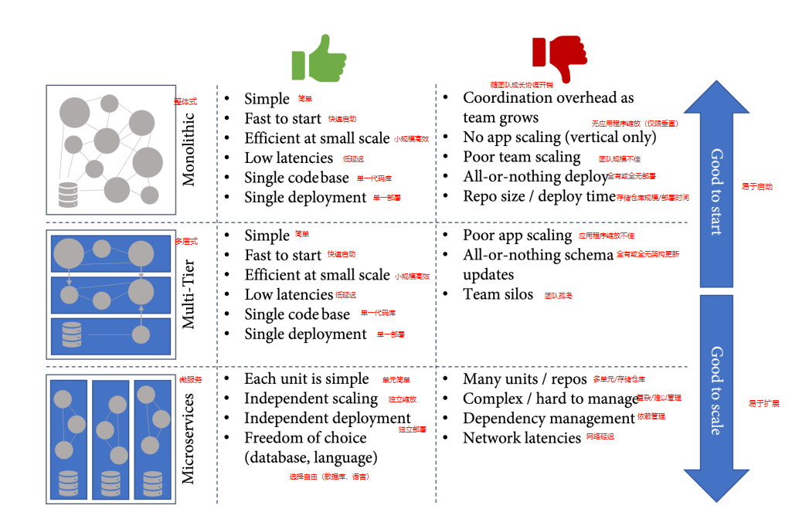

# 第16章 松散耦合架构和微服务

有趣的是，软件架构对软件交付性能的影响比开发者构建的系统类型更大。无论企业的产品是云服务、运行在制造硬件上的嵌入式软件、消费者应用、企业应用，甚至是大型机软件，这都不重要。如果产品架构具有某些特征，这对工程性能基本上没有影响(_Forsgren N., Humble, J., and Kim, G., 2018_)。每种系统类型都有高效和低效的区别。但架构的特点与工程速度明显相关，这使其成为关键加速因素之一。

在这一章将了解关于松散耦合系统的概述，以及如何发展软件和系统设计以实现高工程速度。

本章将涉及以下主题：

- 松散耦合系统
- 微服务
- 进化式设计
- 事件驱动架构

## **松散耦合系统**

所有曾经在紧耦合的单体应用上工作过一次的开发者都知道它所引起的问题：沟通的开销和执行更大变化所需的会议；在修复了应用程序的另一部分的错误之后，又出现了新的错误；其他开发者的改变破坏了原有的功能。所有这些问题都会导致对集成和部署的恐惧，并减慢开发者的速度。

在设计系统和软件时，开发者应该关注以下特点：

- **可部署性**：每个团队能否独立于其他应用或团队发布他们的应用？
- **可测试性**：每个团队能否可以在不需要必须同时部署来自其他团队的多个独立解决方案的测试环境的情况下完成大部分测试？

这里的团队规模是一个小型的**双披萨团队**（_见第17章，团队赋权_）。如果企业为小团队的可部署性和可测试性设计系统，它将自动引导成具有良好定义的接口的松散耦合系统。

## **微服务**

松散耦合系统最常见的架构模式是**微服务**模式，_“这是一种将单个应用开发为小型服务套件的方法，每个服务都在自己的进程中运行，并通过轻量级的机制进行通信，通常是HTTP资源API”_（_Lewis J. ??& Fowler M., 2014_）。

微服务从**面向服务的架构**（**SOA**）中演变而来，具有一些额外的特征。微服务具有**分散数据管理**的特点——意味着每个服务都完全拥有自己的数据。此外，微服务支持轻量级的消息传递，而不是用于服务间通信的复杂协议或中央编排——**智能端点**和**哑管**。

微服务的一个重要特征经常被忽略——它们是围绕着业务能力建立的。这也定义了一个服务应该有多小。为了定义服务的范围，开发者必须了解业务领域。在**领域驱动设计**中，一个微服务与一个**限界的上下文**相匹配（_Eric Evans，2003_）。

微服务的另一个特点是完全独立**部署**和**可测试性**的。这就是为什么它们与高工程速度有关的原因。

微服务有很多优点。它们的扩展性非常好，因为开发者可以独立地扩展每个服务。它们还允许每个团队用自己的编程语言和数据存储解决方案工作，以最好地满足其需求。最重要的是，它们允许大型复杂应用的团队在不干扰其他团队的情况下快速开发。

但这些优势是有代价的。基于微服务的应用程序很复杂，很难操作和排除故障。

有许多著名的基于微服务的解决方案——例如，网飞Netflix和亚马逊Amazon。它们运行全球级规模的服务，并有一个允许他们每天部署数千次的架构。

但也有很多企业试图实施微服务，但都失败了。失败的新兴项目的数量尤其多，其原因往往是缺乏对业务领域的了解，以及对每个服务的界限上下文的错误定义，特别是当应用程序是由外部企业开发的时候，他们还没有学会该领域的**普适语言**。另一个原因是，他们低估了操作服务的复杂性。

因此，与其实施微服务，不如关注架构的**可部署性**和**可测试性**特征，并根据需求调整方案设计。需求不是一成不变的，会随着时间的推移而变化——开发者的架构也应该如此。

## **进化式设计**

某些架构风格的优势和劣势因各种原因而转变。一个是开发者的应用程序的规模，另一个是对开发者的领域和客户的了解以及规模化运作的能力。根据这些因素，不同的架构风格更适合开发者（_见图16.1_）:

图16-1——优势和劣势随规模变化而变化

**进化式设计**即不断调整架构和系统设计以适应当前的需求。要启动全新产品，最好从单一方法和一个团队开始。这可以让开发者在没有太多开销的情况下快速行动。如果规模扩大了，对这个领域有了更多的了解，就可以开始使用编程语言的功能来模块化应用程序了。在某一时刻，复杂性和规模将变得非常高，以至于需要微服务来帮助保持产品的**可测试性**和**可部署性**。

此时读者一定想问——如何从已有的架构中得出需要的架构？完全重写是非常昂贵并且有风险的。更好的方法是逐步演化设计。Martin Fowler称之为**StranglerFigApplication**模式（_Martin Fowler, 2004_）。扼杀无花果是一种植物，它在树的上部树枝上播种，然后逐渐在树上向下生根，直到在土壤中生根。支撑的树在某个时候被勒死并死亡——留下一个支撑自己的有机结构。

开发者不是重写自己的应用程序，而是在它周围长出一个新的"扼杀无花果"的应用程序，让它逐渐成长，直到旧系统被扼杀并可以被关闭。

## **事件驱动架构**

除了微服务、整体式和多层应用程序之外，还有其他架构风格——例如，**事件驱动架构**（**EDA**）。事件驱动架构是一种围绕事件的发布、处理和持久化的模式。主干是消息代理——例如**Apache Kafka**——而各个服务或组件可以发布事件（**发布者**）或订阅事件（**订阅者**）。

事件驱动架构可以很好地适应基于微服务的方法——但它也可以与其他架构风格一起使用。它可以帮助开发者在松散耦合的组件或服务中保持一致性，由于事件的异步性质，它可以完美地水平扩展，因此非常适合处理大量动态数据的解决方案，例如近乎实时处理传感器数据的物联网解决方案。

特别是在云原生环境中，事件驱动架构可以帮助开发者快速行动，在很短的时间内建立松散耦合和全局可扩展的解决方案。

一个经常被用于事件驱动架构的模式是**事件溯源**。事件溯源不是持久化实体，而是将应用状态的所有变化（包括实体）作为一个事件序列来捕获（_见Martin Fowler, 2005_）。要检索一个实体，应用程序必须重放所有的事件以获得最新的状态。由于事件是不可改变的，这提供了一个完美的审计跟踪。开发者可以把事件流看作是一个不可变的事实流，它可以被看作是唯一的真相来源。除了可审计性之外，事件源在可扩展性和可测试性方面也有很多好处。

如果开发者需要捕获数据的意图、目的或原因，当避免更新冲突至关重要时，以及必须保留历史记录并经常回滚更改时，事件溯源是一种合适的模式。事件溯源与**命令和查询责任隔离**（CQRS）配合得非常好——这是一种分离读和写操作的模式。

但要注意的是，事件溯源非常复杂，大多数开发人员都不会自然而然地在事件中对域进行建模。如果上述标准不适合企业产品，那么事件源可能不是一个好模式。

一种更适合于简单领域的架构风格是**Web-Queue-Worker**。这是一种主要用于无服务器PaaS组件的模式，它由一个服务于客户端请求的 Web 前端和一个在后台执行长时间运行任务的工作程序组成。前端和后端是无状态的，并使用消息队列进行通信。该模式通常与其他云服务相结合，如身份提供者、数据库、Redis缓存和内容分发网络。Web-Queue-Worker是一个很好的模式，可以开始使用云原生应用程序。

无论选择什么样的架构风格，都要尽可能地保持简单。从简单的开始，并随着时间的推移和需求的增加而不断发展设计，要比过度设计并最终得到一个复杂的解决方案来拖累开发者要好。

## **总结**

如果读者正在采用CI/CD和DevOps实践，但没有产生效率提升，那么应该仔细看看自己的解决方案架构，这是工程速度的关键指标之一。关注可部署性和可测试性的特点，而不是关注架构风格。

这一章介绍了松散耦合系统的进化设计和一些相关的架构风格和模式。

下一章将讨论组织结构和软件架构之间的关联，以及如何在GitHub中实现这一切。

## **拓展阅读**

这些是本章的参考资料，读者还可以使用它们来获取有关这些主题的更多信息：

- Forsgren N., Humble, J., and Kim, G. (2018). _Accelerate: The Science of Lean Software and DevOps: Building and Scaling High Performing Technology Organizations_ (1st ed.) [E-book]. IT Revolution Press.
- Lewis J. and Fowler M. (2014). _Microservices_: <https://martinfowler.com/articles/microservices.html>.
- Eric Evans (2003). _Domain-Driven Design: Tackling Complexity in the Heart of Software_. Addison-Wesley Professional.
- Martin Fowler (2004). _StranglerFigApplication_: <https://martinfowler.com/bliki/StranglerFigApplication.html>.
- Michael T. Nygard (2017). _Release It!: Design and Deploy Production-Ready Software_.Pragmatic Programmers.
- Martin Fowler (2005). _Event Sourcing_: <https://martinfowler.com/eaaDev/EventSourcing.html>.
- Lucas Krause (2015). _Microservices: Patterns and Applications – Designing fine-grained services by applying patterns_ [Kindle Edition].
