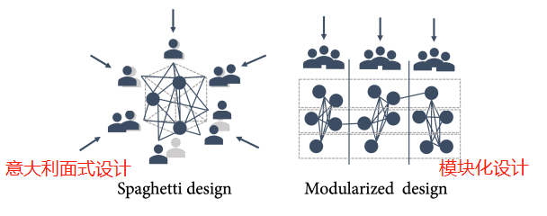
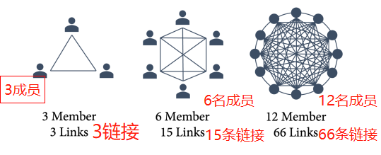
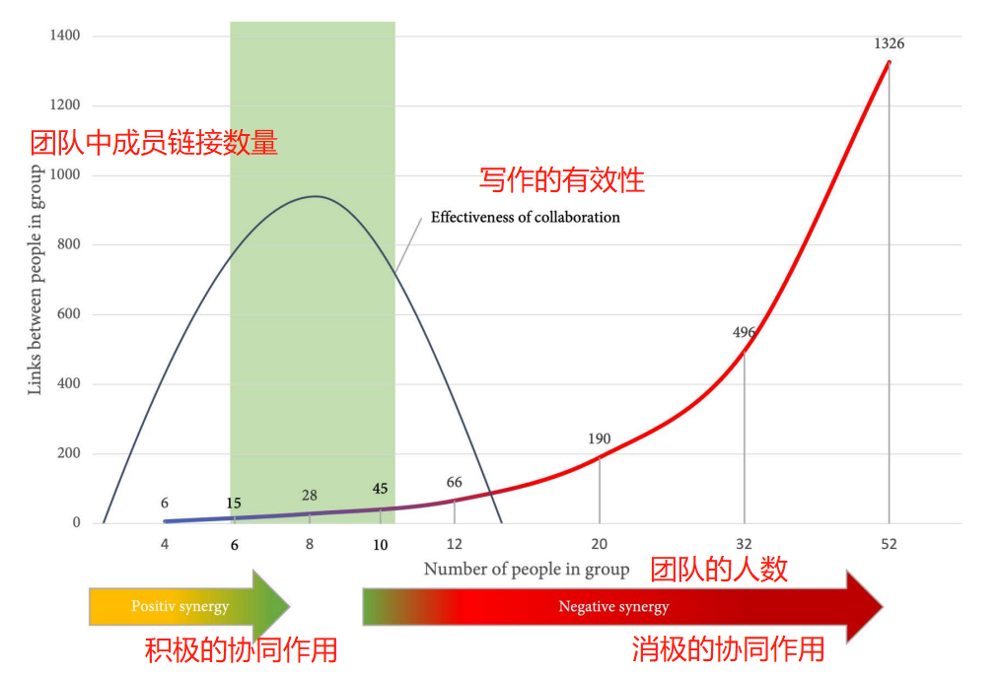
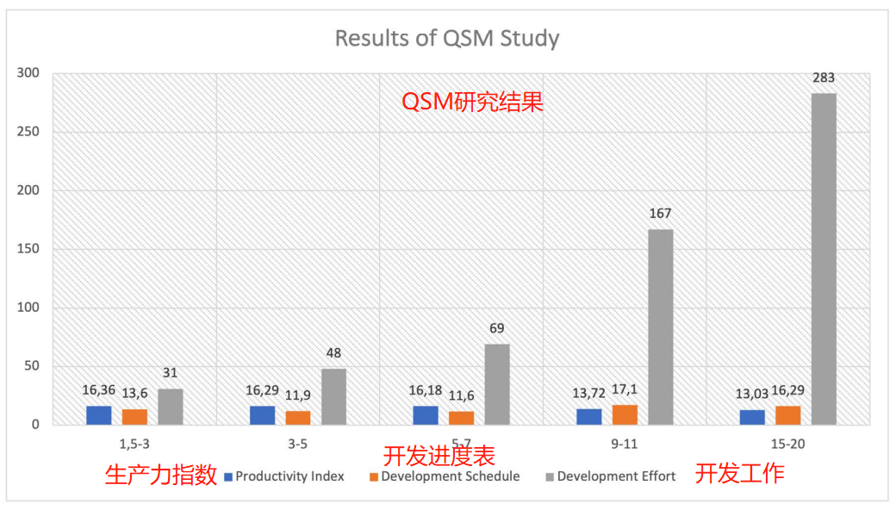
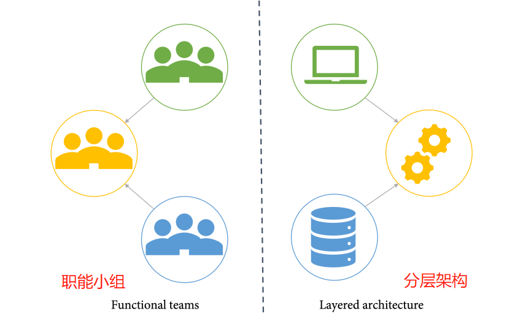
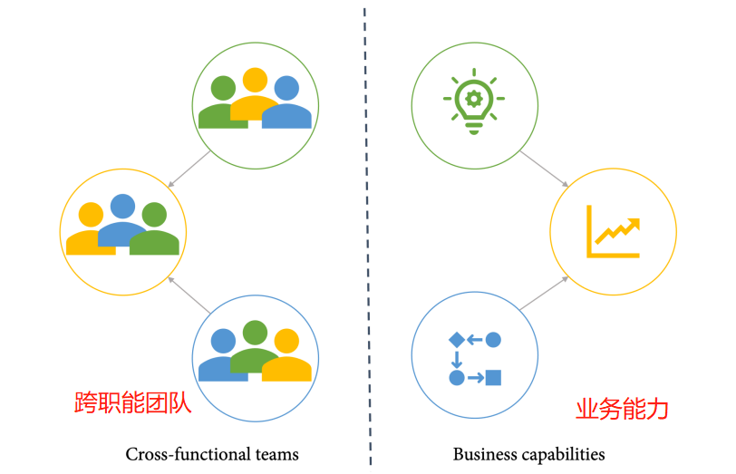
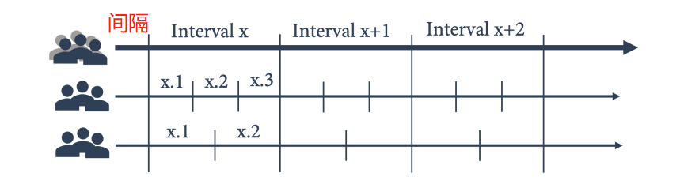
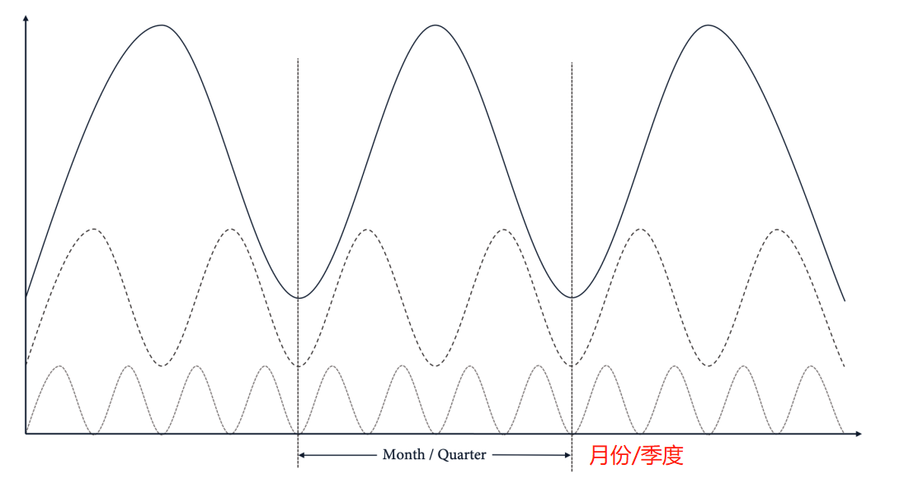
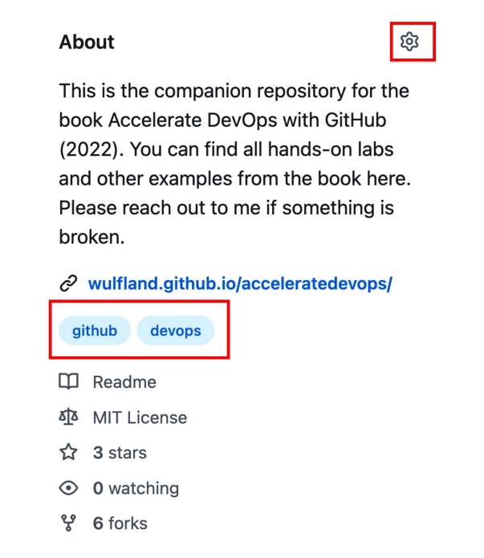
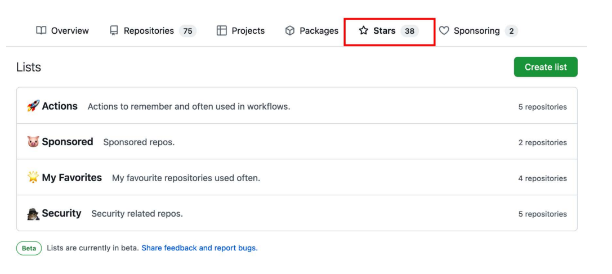

# 17 **团队赋权**

如果我的客户对他们的架构不满意，我就让他们解释他们产品的组织结构，并画出一张图。如果你把这个组织结构图和他们的架构图进行比较，你总能发现很多相似之处。这种组织结构和软件架构之间的关联性被称为**康威法则**。

在本章中，你将学习如何利用这种关联性来改善你的架构、组织结构和软件交付性能。以下是本章的核心主题:

- 康威法则
- 双人披萨团队
- 逆康威法则
- 交付节奏
- 单或多版本战略

## **康威法则**

康威法则可以追溯到1968年的一篇文章（Conway, Melvin, 1968, p31）:

_"设计系统的组织（...）被限制在生产设计上，这些设计是组织的通信结构的副本"。- Melvin E. Conway_

该法则并非专门针对软件或系统架构，而是针对任何系统的设计。请注意，它不是指一个组织的管理结构，而是指其沟通结构。这些可能是同一件事——但在某些情况下，却并非如此。通常情况下，如果组织结构图与软件设计不匹配，你可以寻找沟通流，它与组织结构图是不同的。

例如，如果你有许多小团队或个人开发者，他们从不同的客户或顾问那里获得需求，他们可能会没有任何组织界限地相互交谈。他们正在开发的系统将反映这一点，并由许多具有高度内聚力的模块组成，这些模块相互参考——这就是所谓的 _意大利面式架构_。而那些一起工作的团队，通过一个沟通渠道——例如产品负责人——接受他们的输入，将建立一个在团队工作的模块中具有高度内聚力的系统。但其他团队工作的系统部分将有较少的参考。用 _Eric S.Raymond的话来说:"如果三个团队都在做一个编译器，你会得到一个三通编译器"_（见 _Raymond, Eric S. 1996_, p124）。 _图17.1_ 直观地展示了这两个例子：



图17.1 - 基于通信结构的不同软件设计实例

但是，需要什么样的沟通结构才能促成有助于团队加快工程速度的系统设计？

## **双披萨团队**

**亚马逊Amazon**的架构是讨论最多的基于微服务的架构之一，它允许每天进行数千次大规模部署。他们在团队设置中使用**两个披萨规则**（_Amazon, 2020_）:

_"我们试图创建不超过两个比萨饼可以养活的团队。"。- 杰夫-贝佐斯_

但两个披萨究竟能养活多少人？在我们的用户组中，我们总是计算出一个聚会披萨可供三到四个人食用。这将使团队规模达到六到八个人。在美国的佐丹奴餐厅，他们使用3/8法则——你订购的披萨数量应该是人数的3倍除以8。

这将导致每个团队最多有5到6个人。因此，两块比萨的团队规模并没有很好的界定——我认为这与团队成员的饥饿感无关。这个规则只是意味着团队应该是小规模的

大团队的问题是，每增加一个团队成员，团队中的链接数就会迅速增长。你可以用以下公式来计算链接的数量：

这里，_n_ 是团队中的人数。这意味着一个有6个成员的团队在成员之间有15个链接——而一个12人的团队已经有66个链接（_见图17.2_）。



图17.2 - 一个团队成员之间的链接数

如果人们在团队中工作，他们会体验到一种积极的协同作用。多样性和沟通有助于提高质量以及结果。但是，如果你在团队中增加更多的人，沟通的开销和决策的迟缓就会导致负面的协同作用（_见图17.3_）:



图17.3 - 协作的有效性和团队规模

但一个团队的最佳人数这个神奇的数字是什么？

美国海豹突击队表示，四人是一个战斗小组的最佳规模（_Willink, J. and Leif Babin, L._, 2017）。他们也依赖于复杂环境下的高频沟通。但是，战斗团队的技能可能比跨职能的开发团队的技能更加线性。所以，没有证据表明这个数字对开发团队来说也是最佳的。

在Scrum（迭代式增量软件开发过程）中，**米勒定律**指出，神奇的数字7，加上或减去2（_Miller, G.A._, 1956），被用来定义推荐的团队规模。米勒定律是1956年发表的一篇关于我们短时记忆的局限性的文章，它与沟通能力有关。但是米勒定律在科学上被驳斥了，Scrum仍然使用这些数字的原因是5到9人在很多情况下只是一个好的团队规模——但是没有任何科学依据。也有一些高性能的Scrum团队只有3名成员——还有一些团队有14名成员。

有一项来自QSM的研究，分析了491个开发项目。该研究的结论是，较小的团队有更高的生产力，更少的开发工作，以及更好的开发进度（_QSM，2011_）。1.5到3人的团队、3到5人的团队、5到7人的团队的群组是接近的。超过7人就会导致开发工作的急剧增加（_见图17.4_）。



图17.4 - QSM研究的结果摘要

小团队比大团队表现更好有几个原因（见 _Cohn M., 2009_, pp177-180）:

- **社会闲散**:社会闲散是一种现象，当人们在一个无法衡量个人表现的团体中工作时，往往会减少为实现目标所做的努力（_Karau, S.J., and Williams, K.D._, 1993）。较小的团体往往受社会闲散的影响较小。
- **凝聚力和所有权**:小团队有更多建设性的互动，成员更容易建立信任感、相互拥有感和凝聚力（_Robbins S._, 2005）。
- **协调工作**:在一个较小的团队中，花在协调上的时间较少。简单的事情——如协调会议——在大团队中往往要复杂得多。
- **更多的回报**:个人的贡献在小团队中更明显。如果团队规模较小，这一点以及更好的社会凝聚力会导致一个更有价值的环境（_Steiner, I.D._, 1972）。

当然，小团队也有一些缺点。最大的是失去**一个或多个团队成员**的风险，这在小团队中更难得到补偿。另一个缺点是**缺乏某些专家技能**。如果你需要在五个领域有深厚的专业知识，几乎不可能用一个三人团队来提供。

纵观这些数据，一个双人披萨团队的最佳规模介于三到七人之间——平衡优势和劣势，取决于你的环境。

## **逆康威法则**

现在我们知道了团队的最佳规模，我们可以进行一些被称为 "逆康威演习"（_Forsgren N., Humble, J., and Kim, G._, _2018_, page 102）。如果你将你的组织结构演化为自主的双披萨团队，你的架构就会演化为一个更松散的耦合。

但这不仅仅是团队规模的问题! 如果你围绕功能创建团队，就会形成一个分层或多层的架构。如果你把前端开发人员和数据库专家放在一起，你的架构将在这些通信点上解耦（_见图17.5_）：



图17.5 - 职能团队导致分层架构

为了实现一个可部署和可测试的架构，赋予团队权力，你必须创建负责业务成果的跨职能团队。这将导致理想的架构，帮助你快速行动（_见图17.6_）。



图17.6 - 围绕业务能力调整的跨职能团队，以实现快速价值交付

有四种类型的团队拓扑结构对系统架构有积极影响，因此对软件交付性能有积极影响（_Skelton M., and Pais M._, _2019_）:

- **价值流一致**:这是最重要的团队拓扑结构——跨职能的团队可以为客户提供重要的价值，而不依赖其他团队来完成。这些团队需要所有需要的技能来交付价值——例如，用户体验、质量保证、数据库管理员和操作技能。
- **平台团队**:构建平台的团队，通过降低复杂性和简化软件交付过程，使价值流一致的团队能够交付价值。
- **授权团队**:作为入职、过渡或培训阶段的一部分，使其他团队能够承担责任的团队。
- **子系统团队**:这种团队类型只有在绝对必要的情况下才可以创建！如果一个子系统太过复杂，那么就应该创建一个团队。如果一个子系统太过复杂，无法由流线型团队或平台型团队来处理，那么最好是有一个功能型团队来处理这个子系统。

重要的是，每个团队都有明确的责任，可以在不依赖其他团队完成某些任务的情况下提供价值。

但是，为了达到对绩效的预期效果，你必须将团队的互动方式限制在以下三种**互动模式**之一:

- **协作**:两个或更多的团队在一定时间内紧密合作，分担责任。
- **自我服务**:一个团队将其价值作为一种服务提供给另一个团队。责任被清楚地分开，服务可以尽可能容易地被消费，并且是自动化的。
- **促成**:一个团队帮助另一个团队，并在一定时间内帮助他们学习新事物或培养新习惯。

建立一个有效的团队拓扑结构，具有良好的、明确的沟通和互动，具有巨大的影响——不仅对系统结构，而且对工程速度。

## **交付节奏**

即使是跨职能的、自主的团队，你仍然会有一些相互依赖和沟通流发生在团队之间。在本书的前几章中，当我解释工作流程和指标时，我把重点放在效率、流程、批量大小和持续交付价值上。但是你仍然需要一些节奏来控制你的流程。在Scrum中，这被称为**经验过程控制**。在一定时间后，你会暂停**检查**和**采用**——不仅是你交付的东西，还有你的流程和团队动态。这个时间跨度在Scrum中被称为**冲刺**。我不喜欢这个术语，因为它意味着快速的节奏，而开发应该有一个持续的、稳定的节奏。如果你想跑马拉松，你就不会冲刺——而产品开发是一场马拉松，而不是一系列的冲刺（当然，马拉松与橄榄球的比喻并不相符）。但不管你怎么称呼这些间隔，它们对持续学习和采用以及团队建设都很重要。这些间隔对沟通也很重要——对利益相关者和其他团队。

这就是为什么这些间隔应该在所有团队中保持一致。 他们应该确定稳定的节奏并充当工程组织的心跳。

间隔不应该太长，也不应该太短。对于大多数公司来说，一个月是最长的，最少的是2周。这并不意味着团队不能做更小的迭代或冲刺。他们仍然可以进行为期1周的冲刺；他们只是将其与全球的节奏相一致。你可以有一个较快的节奏，并使其与较慢的节奏保持一致——但反之则不然（_见图17.7_）：



图17.7 - 使更快的迭代与交付节奏保持一致

在这种情况下，_x_ 不一定要以周为单位来衡量。在确定节奏时，要考虑到**整个组织的脉搏**。如果你的组织中的所有事情都是按月进行的，那么3周的节奏就不能与你公司的其他部门同步。在这种情况下，定义一个月度节奏——或其一小部分——是更好的选择，并引起更少的摩擦。如果你的公司是上市公司，并且使用4-4-5日历，那么一个财政季度可能是你的脉搏。看一下组织的脉搏，将你的冲刺节奏与之同步，使间隔与组织的脉搏相协调（_见图17.8_）



图17.8 - 调整你的节奏，与组织的脉搏保持同步

如果你的节奏与你的组织不同步，它将产生摩擦。会议将发生冲突，你可能无法得到需要的反馈和数字。一个与你的组织脉搏一致的节奏将有助于顺畅的流动和改善沟通（_Reinertsen D., 2009_, pp176-78）。

## **单或多版本战略**

除了团队规模和节奏外，如果你想执行 "逆康威演习"，你的代码结构方式对你的架构也有影响。这里介绍两种策略:

- **单版本策略**:只有一个资源库，包含应用程序所需的所有模块（或微服务）。
- **多版本策略**:每个模块或微服务都住在自己的仓库里，你必须部署多个仓库才能得到一个完整的工作应用。

这两种策略都有优点和缺点。单版本策略的最大优点是易于部署和调试整个应用程序。但单存储库往往会很快变得很大，这就降低了Git的性能。另外，随着仓库的不断扩大，独立部署和测试应用程序的不同部分变得很困难。这导致了架构的紧密耦合。

### **通过大型单软件库工作**

在Git的背景下，大存储仓库是什么意思？Linux内核的仓库大约有3GB。克隆需要相当长的时间，单个Git命令也很慢——但仍在可接受的范围内。Windows仓库大约有300 GB——是 Linux 内核的100倍。在 Windows仓库上执行某些 Git 操作需要一些时间：

- git clone: 大约 12 小时
- git checkout: 大约 3 小时
- git status: 大约 8 分钟
- git add and git commit: 大约 3 分钟

这就是为什么微软维护自己的Git客户端分叉（<https://github.com/microsoft/git>）。这个分叉包含了很多对大型仓库的优化。它包括**scalar CLI**（<https://github.com/microsoft/git/blob/HEAD/contrib/scalar/docs/index.md>）,可以用来设置高级的Git配置，在后台维护仓库，并帮助减少网络上的数据发送。这些改进极大地减少了 Windows 仓库中的 Git 操作时间:

- git clone: 12 小时减少到 90 秒
- git checkout: 3 小时减少到 30 秒
- git status: 8 分钟 3 秒

许多这样的优化现在已经是 Git 客户端的一部分了。例如，你可以使用git sparse-checkout（<https://git-scm.com/docs/git-sparsecheckout>），它允许你只下载你需要的仓库部分。

只有当你的仓库非常庞大时，你才需要微软的分叉；否则，你也许可以用普通的Git功能进行优化。

### **用主题和星级列表来组织你的仓库**

多仓库策略的最大优势是你减少了单个仓库的复杂性。每个软件库都可以自主地维护和部署。最大的缺点是很难构建和测试整个应用程序。但是为了获得真实用户的反馈或调试复杂的bug，通常仅部署单个服务或模块是不够的，你需要更新整个应用程序。这意味着在你的存储仓库边界上协调多个部署。

如果你选择多仓库策略，你最终会有很多小仓库。一个好的命名规则可以帮助组织它们。你也可以使用**主题**来组织你的仓库。主题可以设置在你的版本库的右上角（_见图 17.9_）。



图17.9 - 你可以为你的存储仓库设置主题，以提高发现率

你可以使用topic: keyword来过滤你的存储仓库（_见图17.10_）:


图17.10 - 根据主题过滤存储库

另一个你可以用来组织大量存储库的功能是**标星列表**。这是一项个人功能，不能被分享。在你的 GitHub 配置文件中，你可以创建列表并组织你的所标星的仓库（_见图 17.11_）:



图17.11 - 在列表中组织你的标星存储库

你可以像在你的浏览器中使用收藏夹一样使用这些功能，但它们并不能解决部署、调试或测试你的整个应用程序。

如果你的微服务使用Kubernetes，你可以使用Visual Studio Code中的**Bridge to Kubernetes**插件（<https://marketplace.visualstudio.com/items?itemName=mindaro.mindaro>），在生产或测试集群的背景下调试本地服务（_见Medina A. M.，2021_）。但是，如果你依赖于一次性构建和部署所有的服务，最好的解决方案是有一个元仓库，作为一个子模块引用所有的服务。

### **使用Git子模块来构造你的代码**

你可以使用一个元仓库，它包含所有其他仓库作为子模块。这允许你用一个命令克隆所有的仓库:

```shell
git clone --recurse-submodules
```

另外，如果你已经克隆了元库，要更新元库，可以使用这个命令。

```shell
git submodule update --init --recursive
```

资源库可以包含脚本或工作流程，以部署整个应用程序。

你可以用这个元库来做发布管理，把稳定版本捆绑在一起。如果你使用分支进行发布，那么你可以将你的子模块设置为某个分支，并在发布最新版本前对其进行更新。

```shell
git config -f .gitmodules submodule.<SUB>.branch main
git submodule update --remote
```

如果你使用标签来发布，那么你可以将每个子模块设置为一个特定的版本，并将其提交到元仓库。

```shell
cd <SUB>
git checkout <TAG>
cd ..
git add <SUB>
git commit -m "Update <SUB> to <TAG>"
git push
```

然后其他人可以拉取这些变化，并将子模块更新到与标签对应的版本。

```shell
git pull
git submodule update --init –recursive
```

Git子模块是一种很好的方式，可以在多仓库中工作，独立部署，同时还能将一个应用程序作为一个整体来管理。但要注意的是，你有越多的相互依存关系，维护元仓库和保持它们的可部署状态就会越复杂。

### **什么是正确的战略？**

如果单版本策略或多版本策略更适合你的团队，它与 _第16章松散耦合的架构和微服务_ 紧密结合，当时我们谈到了**进化设计**。单重发布适合于小型产品和新兴项目。随着规模和复杂性的增加，最好把微服务或模块拆开，并把它们移到自己的仓库里。但要始终牢记可测试性和可部署性——对单个服务/模块和整个应用来说都是如此。

## **案例研究**

在前三个成功的冲刺之后，**Tailwind Gears**的更多团队被转移到一个新的平台。第一批团队已经被选中，拥有一个已经可以独立测试和部署的产品。由于有了scrum master、产品负责人和QA成员，他们对于两个比萨饼的规则来说有点大，但这将在后面解决。要跟的团队太大了，他们从事的是有很多相互依赖关系的大型单体应用。为了执行 "逆向康威演习"，所有的团队都聚集在一起，自我组织下一个要转移到新平台的团队。限制条件如下：

- 不超过两个比萨饼团队的规模
- 负责一项业务能力（**有界限的上下文**），可以使用**扼杀无花果应用模式**进行提取，并自主进行测试和部署。

这有助于发展应用程序的设计。新的微服务是云原生的，有自己的云原生数据存储。它们使用API和事件驱动架构被集成到现有的应用程序中。微服务在新的平台上被转移到他们自己的存储库，因为他们在大多数时候是独立部署的。与其他团队的同步是通过功能标志完成的。

对于嵌入式软件来说，这并不可行。团队需要一种方法来构建和部署整个应用程序。但他们也想部署和测试各个模块。这就是为什么团队决定将应用程序分成不同的存储库，并有一个元存储库，包括其他存储库作为子模块。这允许各个团队在任何时候将他们的模块部署到测试硬件上，以测试真实世界场景中的新功能——但它保持了产品的状态，它可以在任何时候发布。

当第一批团队被转移到新的平台时，他们保持了现有的3周**冲刺节奏**。由于这些团队可以或多或少地自主工作，这不是一个问题。随着更多的团队来到新平台，冲刺周期会与其他团队保持一致。Tailwind Gears是一家上市公司，曾经按季度做所有的业务报告。他们也按周报告，并有一个正常化的4-4-5日历。每个季度末和季度初都有很多会议，经常与冲刺会议相撞。团队决定根据这种节奏调整他们的节奏。季度由13周组成——但有一周有季度会议，所以这一周从冲刺日历中剥离。这一周也用于季度大会议室计划。剩下的12周被分为6个为期两周的冲刺阶段。

## **总结**

在本章中，你已经学会了如何利用你的团队结构和通信流对你的软件和系统架构的影响来进行逆康威机动。这有助于你实现由可自主测试和可部署的单元组成的松散耦合架构，对你的软件交付性能产生积极影响。

在接下来的章节中，我们将更多地关注要建立什么，而不是如何建立它。你将学习精益产品开发，以及如何将客户反馈纳入你的工作中。

## **拓展阅读**

这些是本章的参考资料，您还可以使用它们来获取有关这些主题的更多信息：

- Conway, Melvin (1968). _How do committees invent_: <http://www.melconway.com/Home/pdf/committees.pdf>
- Raymond, Eric S. (1996). _The New Hacker's Dictionary_ [3rd ed.]. MIT Press
- Amazon (2020): _Introduction to DevOps on AWS-Two-Pizza Teams_:<https://docs.aws.amazon.com/whitepapers/latest/introductiondevops-aws/two-pizza-teams.html>
- Willink, J. and Leif Babin, L. (2017). _Extreme Ownership: How U.S. Navy SEALs Lead and Win_. Macmillan
- Miller, G.A. (1956). _The magical number seven, plus or minus two: Some limits on our capacity for processing information_: <http://psychclassics.yorku.ca/Miller/>
- Cohn M. (2009). _Succeeding with Agile: Software Development Using Scrum_. Addison-Wesley
- QSM (2011). _Team Size Can Be the Key to a Successful Software Project_: <https://www.qsm.com/process_improvement_01.html>
- Karau, S. J. and Williams, K. D. (1993). Social loafing: _A meta-analytic review and theoretical integration. Journal of Personality and Social Psychology_, 65(4), 681–706. <https://doi.org/10.1037/0022-3514.65.4.681>
- Robbins S. (2005). _Essentials of organizational behavior_. Prentice Hall 
- Steiner, I.D. (1972). _Group process and productivity_. Academic Press Inc.
- Forsgren N., Humble, J., and Kim, G. (2018). _Accelerate: The Science of Lean Software and DevOps: Building and Scaling High Performing Technology Organizations_ (1st ed.) [E-book]. IT Revolution Press
- Skelton M. and Pais M. (2019). _Team Topologies: Organizing Business and Technology Teams for Fast Flow_. IT Revolution
- Reinertsen D. (2009). _The Principles of Product Development Flow: Second Generation Lean Product Development_. Celeritas Publishing
- Medina A. M. (2021). _Remote debugging on Kubernetes using VS Code_: <https://developers.redhat.com/articles/2021/12/13/remotedebugging-kubernetes-using-vs-code>
