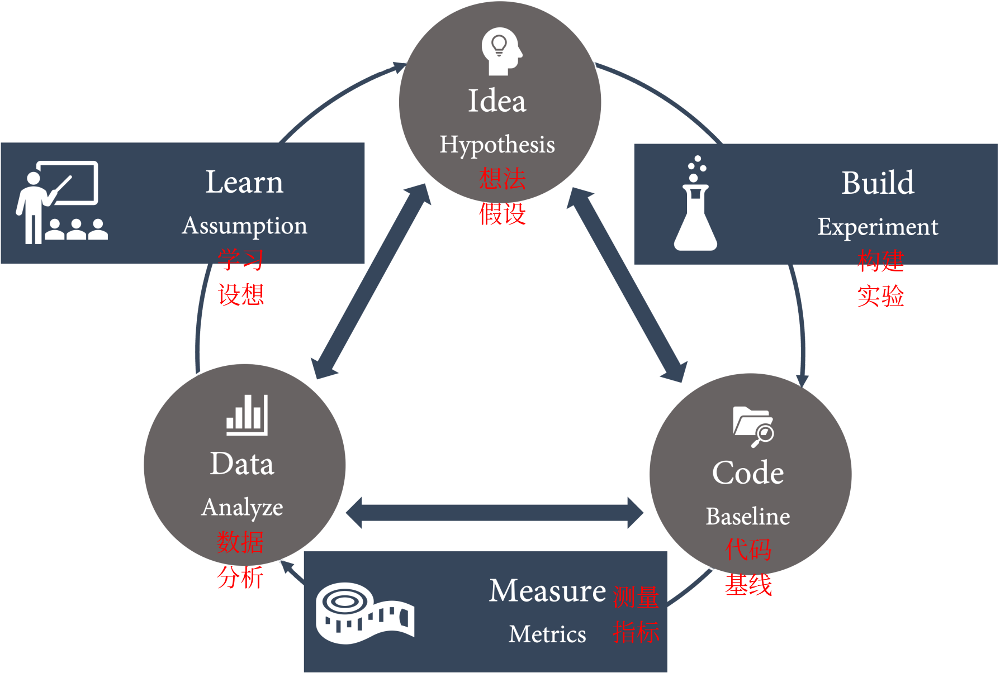
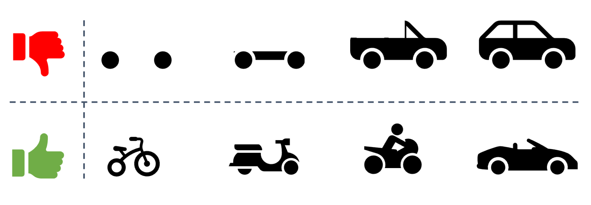
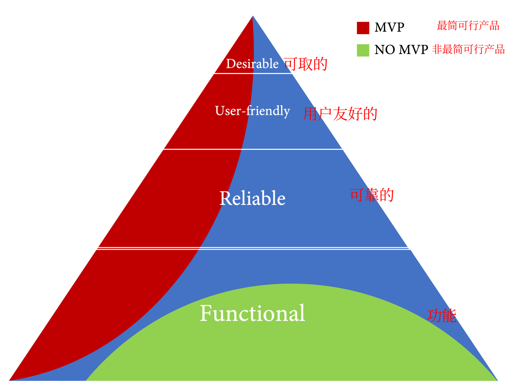
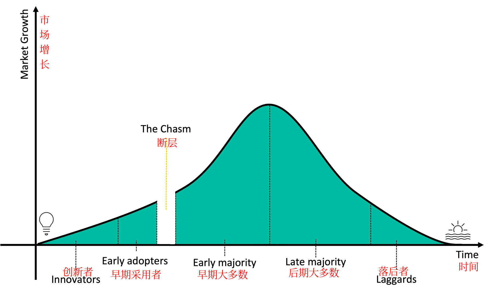
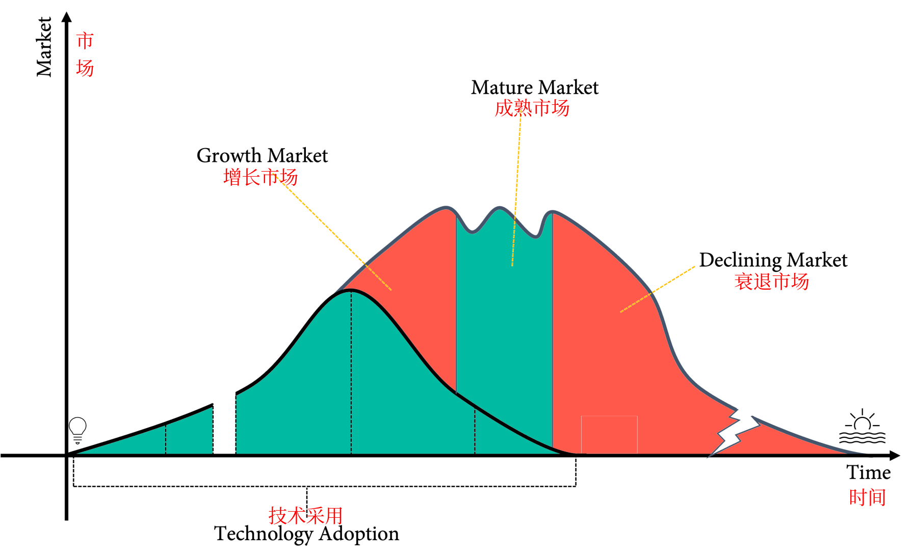
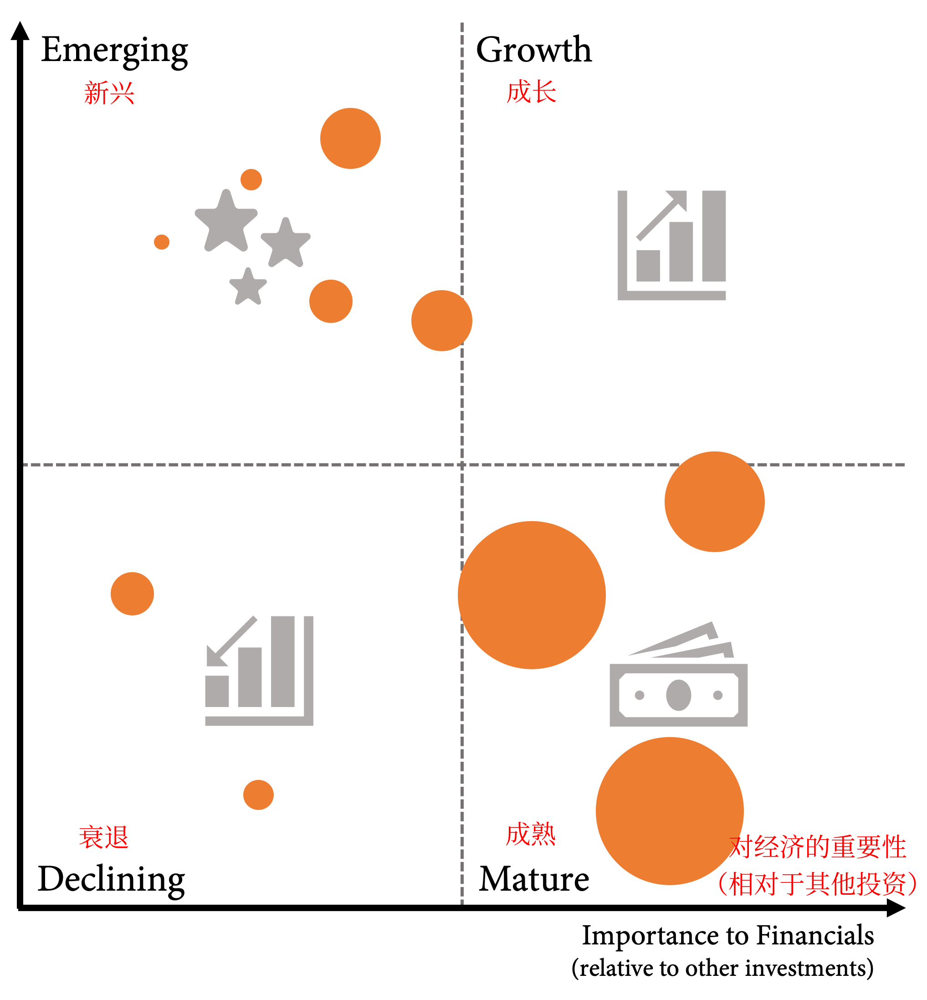
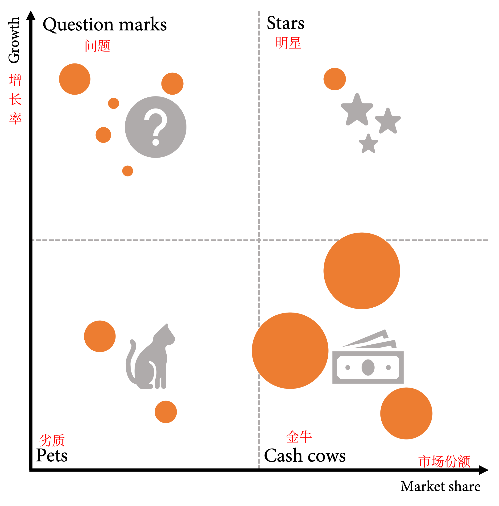
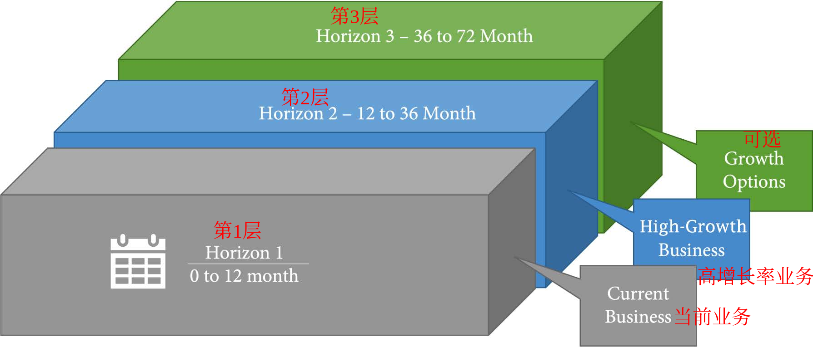
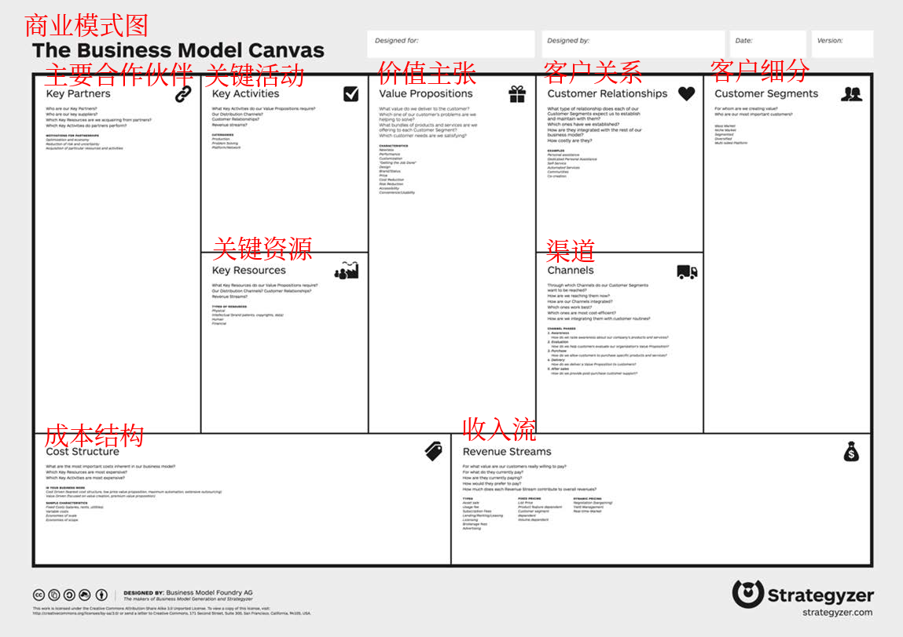

# 第18章 精益产品开发与精益创业

到目前为止，本书只关注应该如何构建和交付软件，但并没有关注到应该构建什么样的软件，以及如何确定所构建的软件是正确的。但是**精益软件开发**实践对软件交付绩效、组织绩效和组织文化有很大的积极影响（Forsgren N., Humble J., & Kim G., (2018), p. 129）。因此，许多 DevOps 转型从分析价值流开始，并尝试在工程实践的同时优化产品管理。但是，在本书看来，这带来了太多的改动，并且也是一个先有鸡还是先有蛋的问题。如果不能以小批量频繁交付，就很难应用精益产品管理实践。

本章将探讨如何应用精益产品开发和精益创业实践来构建使最终用户满意的产品。本章涵盖以下内容：

- 精益产品开发
- 融合客户反馈
- **最简可行产品 (MVP)**
- 企业组合管理
- 商业模式图

## 精益产品开发

构建正确软件的难度经常被低估。开发者不能仅仅问潜在的客户他们想要什么。他们想要什么、他们真正想要什么以及他们愿意为此付费这三件事情是完全不同的。

**精益产品开发**是**丰田**引入的一种方法，旨在解决他们在产品开发中遇到的挑战，尤其是缺乏创新、长时间的开发周期和多次复制周期（Ward, Allen 2007 p. 3）。精益产品开发建立在跨职能团队的基础上，采用增量方法。其主要特点如下：

- 以**小批量**工作。
- 让**工作流程**可见。
- 收集并整合**客户反馈**。
- **团队实验**。

正如以上所看到的，这与在第一部分“精益管理与协作”中学到的完全一致。新的维度是客户反馈和实验。但是，如果没有能力进行小批量工作和可视化的工作流程，就不可能基于客户反馈进行实验。

## 融入客户反馈

但是，要如何收集客户反馈并将从中学习到的反馈整合到产品中呢？最重要的是，团队需要获得**自主权**。只要团队仍然收到交付要求，就无法从客户反馈中学习并将反馈整合到产品中。除此之外，团队中需要有具备合适技能的人员，或者必须培训自己的工程师。**产品管理**和**用户体验设计**是大多数团队不具备的技能，但对于从客户反馈和互动中学习至关重要。

收集客户反馈的一种方法是采访客户或执行**游击可用性测试**（guerrilla usability testing，见第 12 章，Shift Left Testing for Increased Quality）。 但是，在解释结果时必须非常小心，人们所说的和他们的行为通常是完全不同的两件事。

要真正接近反馈循环并从客户行为中学习，需要具备以下条件：

- **客户数据**（不仅包括访谈数据，还包括反馈、使用数据、评估和绩效数据等）
- 解释数据的知识（**产品管理技能**）
- 科学方法

**精益创业**方法论将产品管理从直觉（炼金术）转移到科学方法，使用**构建-测量-学习**循环执行**假设驱动的实验**（参见 Ries，Eric 2011）：

- 根据对当前客户反馈/数据的分析制定一个**假设**：

  ```
  We believe {customer segment},
  wants {product / feature} because
  {value proposition}
  ```

- 为了证明或反驳假设，团队进行一项**实验**，该实验将影响某些指标。
- 团队分析受实验影响的指标并从中学习，通常是通过制定新的假设。

图 18.1 显示了用于假设驱动实验的构建-测量-学习循环：



图 18.1 假设驱动的实验，构建-测量-学习循环

践行假设驱动的开发并不容易，这需要大量指标并很好地了解最终用户如何使用应用程序。仅有使用数据是不够的，必须能够将其与性能指标、错误日志、安全日志和自定义指标结合起来，以全面了解正在发生的事情。有多少人因为太慢而停止使用该应用程序？有多少人无法登录？有多少密码重置是攻击？有多少真实用户无法登录？尝试的越多，就越会发现对用户行为方式的了解存在怎样的差距。但是，在每个循环中都将学习并添加更多指标，从而构建一个更适合用户的应用程序。而且将了解到哪些功能可以为用户带来真正的价值，以及哪些是可以删除以精简产品减少浪费。

假设驱动的实验可以与 **目标和关键结果 (OKR)** 完美结合（请参阅第 1 章）。OKR 通过在某些指标（例如增长、参与度或客户满意度）上设置可衡量的关键结果，使团队与更大的愿景保持一致。

## MVP

过去几年中最常被滥用的术语之一是 MVP。曾经是验证概念 (PoC) 或某一峰值的所有内容现在都称为 MVP。但 MVP 是产品的一个版本，它可以用最少的代价实现构建-测量-学习的完整循环（Ries，Eric 2011，996）。

经常看到的一个引起读者共鸣的图表是这样的：



图 18.2  构建 MVP 的错误示例

它表明应该通过解决问题域（在本例中为运输）来交付每轮迭代。问题是这不是 MVP，这是敏捷交付。自行车不能检验跑车提案的价值，特斯拉不可能创造出电动自行车来对电动跑车的成功进行测试。

如果与真实客户一起测试 MVP，它可能会破坏客户的印象并且为此失去客户。MVP 不能只有最少的功能。它还必须是可靠的、用户友好的和可取的：



图 18.3 MVP 必须测试需求层次结构中的所有级别

因此，如果有现有的产品和客户群，使用 MVP 进行实验会容易得多。对于初创企业和新产品来说，这要困难得多，在将 MVP 付诸实践之前，必须包括可用性和可靠性测试。否则，实验可能会完全出错。但即使对于现有产品，在与客户一起尝试新功能时，也要确保它们可靠、用户友好且令人愉悦！

## 企业组合管理

在初创企业中，这通常很容易——至少在开始时是这样。但是，如果有多个团队和多个产品，要如何确保跨职能、自治的团队朝着同一个方向前进，并做出符合企业长期目标的决策？

要实行精益产品开发，公司需要从命令控制流程转向**使命原则**（Humble J.、Molesky J. 和 O'Reilly B. 2020）。这会影响公司的投资组合管理：

- **预算**：与传统的下一个财政年度预算不同，管理层从多个角度制定高级目标并定期对其进行审查。这种转向可以在多个级别上完成，并允许在需要时动态分配资源。
- **项目管理**：管理层无需制定详细的前期计划，而是在项目级别指定下一阶段的可衡量目标。然后团队自己弄清楚如何才能实现这些目标。

这可以与 OKR 完美结合（参见第 1 章）。

使命原则意味着公司需要了解产品管理和各个层面的市场。最重要的是要理解，就像每个功能（参见第 10 章）一样，每个产品都有一个生命周期。新技术被不同的人群采用。有些**创新者**尝试一切可能，有些**早期采用者**或远见者试图保持领先地位。然后，对于绝大多数——总共大约 70%，可以将其分为**早期多数**（实用主义者）和**晚期多数**（保守派）。最后是没有采用技术的落后者：



图 18.4 技术采用生命周期

这里有一件有趣的事情是：早期采用者和早期大多数人之间的逻辑**断层**。断层是基于许多创新失败的历史，因为它们没有被创新者视为竞争优势的来源，并且也还没有一个充分的完善的体系从而也不被早期大多数认为是安全可靠的。许多产品正是在那个时候失败了。

一旦早期的大多数人开始采用新技术，通常情况下，其他产品和服务就会进入市场。市场总量仍在增长，但随着竞争者的增多以及对质量和价格预期的变化，市场发生了变化：



图 18.5 市场成熟度

了解产品在生命周期中所处的位置非常重要，因为每个阶段都需要不同的策略才能取得成功。

初创企业从**探索**开始。他们寻找符合创始人愿景、提供客户价值并能够推动盈利增长的新商业模式。在此探索阶段，当初创企业发现问题/解决方案契合时，它会尝试使用 MVP 尽快评估它是否也适合产品/市场。

一旦找到商业模式，策略就可以成为**攫取利润的方式**。初创公司通过提高效率来扩大规模和降低成本，从而利用商业模式。

探索和开发是完全不同的策略，需要不同的能力、流程、风险管理和思维方式。初创企业通常善于探索，不善于开发；企业善于开发，但不善于探索。

对于所有公司来说，在利用现有产品和探索新的商业模式之间找到平衡点很重要，因为从长远来看，只有能够同时管理这两者，公司才能生存。这就是为什么现在有这么多企业拥有**创新孵化中心**来模仿初创企业以探索新商业模式的原因。

要管理投资组合，可以在增长矩阵上绘制产品。该矩阵有四个增长象限和产品相对于其他投资的重要性：



图 18.6 投资组合管理的增长矩阵

产品的大小可以是收入或利润。在**新兴**象限中应该始终有足够的产品可以开发到**增长**或**成熟**象限，因为有些产品只会**下降**而不会获得相关性。左侧显示应该探索的产品，右侧显示应该发展和盈利的产品。

该矩阵与**波士顿咨询集团 **(BCG) 的**份额增长矩阵**非常相似，该框架由 Alan Zakon（后来成为 BCG 的首席执行官）于 1970 年创建。增长份额矩阵使用市场份额而不是 x 轴上的财务重要性：



图 18.7 增长份额矩阵

如果对市场有清晰的认识，则该矩阵很适合，它的工作方式是一样的。**问号**是高成长性的产品，必须探索发展成**明星**产品或者**营利**产品。宠物象限要么是失败的实验，要么是衰退的产品。无论哪种情况，迟早都应该关闭它们。

企业面临的挑战是在不收购的情况下创造**新兴**（或成长）象限的产品。原因在于市场动态（图 18.5）和企业管理其投资组合的方式，可以使用**三层模型**来管理企业组合：



图 18.8 三层模型

三层模型如下：

- **第1层**：产生今天的现金流
- **第2层**：今天的收入增长和明天的现金流
- **第3层**：未来高增长业务的选择

**第1层**是成熟产品或盈利产品。对这些项目的投资将在同年产生回报。**第2层**是有潜力成为盈利产品的新兴产品。他们需要大量投资，但不会产生与第1层中的投资相同水平的结果。**第3层**是未来的潜在产品，但失败的可能性很大。

这三个层次完全不同，需要不同的策略才能成功（Humble J., Molesky J. & O'Reilly B. 2020）。但是，不仅需要不同的策略，新产品通常会扰乱市场并夺走现有业务的份额和收入。柯达于 1975 年发明了数码相机，但他们的业务建立在冲印照片而非捕捉记忆上，因此这项发明被管理层拒绝了。柯达于 2012 年申请破产——这一年几乎每个人的口袋里随时都至少有两台数码相机。一个成功的例子是亚马逊，电子书从他们销售实体书的经典商业模式中拿走了市场份额，或者微软的云业务会导致本地产品的许可销售下降。

随着新产品从现有市场夺走市场份额和收入，用一种所有人都朝着共同的长期发展目标的方式来引导企业是很重要的。否则，人们会排斥新产品，以维护他们在企业内部的主导地位。

为了平衡这三个层面，应该有一个透明的资源分配流程和不同的应对策略。对第3层产品投资的一般金额是 10%——通常是每季度一次，根据验证式学习提供资金。表 18.1 显示了三个层面的不同策略和投资：

|              | 第1层                          | 第2层                              | 第3层                                            |
| ------------ | ------------------------------ | ---------------------------------- | ------------------------------------------------ |
| **目标**     | 最大化回报                     | 跨越鸿沟                           | 找到适合的产品/市场                              |
| **关键指标** | 收入、份额、盈利能力、净推荐值 | 增长率、新客户、目标客户、提高效率 | 品牌认知度、受欢迎程度、创新得分、活跃的产品使用 |
| **策略**     | 竞争，利用                     | 规模，加速                         | 创新、探索                                       |
| **投资比**   | 60%—70%                        | 20%—30%                            | 10%                                              |

表 18.1 三个层面的不同策略

但是应该把所有的三个层面应用到不同的业务部门吗？本书不这样认为。这只会导致更多的能力和孤岛。具有平衡短期和长期目标的成长心态和目标的良好公司文化才能够在各个层面进行创新并拥抱创新，但是需要良好的产品管理来可视化哪些产品和功能处于其生命周期的哪个阶段，以便所有人了解所应用的不同策略。

## 提升产品管理技能

产品管理是一项技能，对于想要实践精益产品开发的成功 DevOps 团队来说至关重要。许多敏捷项目之所以失败，是因为产品负责人无法推动愿景并做出必要的艰难决定。产品管理基于三个支柱：

- 了解客户
- 了解业务
- 了解产品

### 了解客户

要打造令客户满意的产品，就必须对使用该产品的人有深刻的同理心。在软件开发中，使用**角色**（虚构人物）来表示自 90 年代以来使用产品的用户群（Goodwin、Kim (2009)）。与仅将客户视为具有混合特征的大群体相比，在设计功能时牢记特定特征有助于理解客户的需求和局限性。

但今天，可以做到更多，可以收集有关客户如何使用产品的数据。可以从该数据中提取哪些角色（可用性集群）？最常见的用例是什么？哪些功能没有使用？哪些用例在完成之前就被终止了？这些是应该通过分析数据定期回答的问题。

### 了解业务

要构建成功的产品，团队必须了解业务。团队所处的市场是什么，市场份额有多大？谁是竞争对手，他们的优势和劣势是什么？

理解业务对于工程师来说通常是一门全新的学科。传统上，这是在不同的层面上完成的，只有很少的信息被传递给工程师。诸如**商业模式图**（请参阅下一节）之类的练习可以在团队中培养这些技能。

### 了解产品

了解产品通常是工程团队的强项。但是了解产品不仅仅意味着知道这个特性，还意味着知道产品是如何运行的，负载均衡和性能如何，以及积累了多少技术负债。

当然，可以将经验丰富的产品经理和用户体验设计师添加到团队中。但是，正如在上一章中讨论的那样，应该让团队保持小规模。创建和发布的每个功能、进行的每个实验以及做出的每个决定都需要这些技能。最好提高团队的技能，例如，拥有可以在需要时帮助团队的用户体验设计师。

## 商业模式图

为了加强工程师的产品管理技能，可以练习使用创建**商业模式图**——用于创建商业模式或记录现有模式的模板。商业模式图由 Alexander Osterwalder 于 2005 年开发。读者可以在此处免费下载模板副本：https://www.strategyzer.com/canvas/business-model-canvas。

Canvas 旨在打印在一张大纸上，团队可以集思广益，共同绘制草图或在上面添加便利贴。它包含商业模式的九个基本组成部分：

- **价值主张**：要解决什么问题？满足什么需求？
- **客户细分**：为谁创造价值？谁是最重要的客户？
- **客户关系**：每个客户期望建立什么样的关系？
- **渠道**：客户希望通过哪些渠道接触到他们？
- **主要合作伙伴**：必须与谁建立伙伴关系？谁是主要供应商？
- **关键活动**：实现价值主张需要哪些活动？
- **关键资源**：价值主张需要哪些资源——例如人员、技术和流程？
- **成本结构**：商业模式最重要的成本驱动因素是什么？它们是固定的还是可变的？
- **收入流**：客户愿意为什么价值支付？多少和多久一次？

Canvas 包含更多提示，可帮助团队创建业务模型，如下图中所见：



通过填写画布的所有区域，考虑整个商业模式方面的任何潜在想法，以整体方式思考所有元素如何组合在一起。

## 总结

本章了解了精益产品管理的重要性以及如何将客户反馈纳入工作流程。了解什么是 MVP 以及如何使用假设驱动的开发来构建正确的东西。下一章将更深入地了解如何通过 A/B 测试来进行实验。

## 延伸阅读

这些是本章中的参考资料，可以使用它们来获取有关这些主题的更多信息：

- Forsgren N., Humble, J., & Kim, G. (2018). Accelerate: The Science of Lean Software and DevOps: Building and Scaling High Performing Technology Organizations (1st ed.) [E-book]. IT Revolution Press

- Ward, Allen (2007). Lean Product and Process Development. Lean Enterprise Institute, US

- Ries, Eric (2011). The Lean Startup: How Today's Entrepreneurs Use Continuous Innovation to Create Radically Successful Businesses [Kindl Edition]. Currency

- Humble J., Molesky J. & O'Reilly B. (2015). Lean Enterprise: How High Performance Organizations Innovate at Scale [Kindle Edition]. O'Reilly Media

- Osterwalder, Alexander (2004). The Business Model Ontology: A Proposition In A Design Science Approach: http://www.hec.unil.ch/aosterwa/PhD/Osterwalder_PhD_BM_Ontology.pdf.

- Goodwin, Kim (2009). Designing for the Digital Age - How to Create Human-Centered Products and Services. Wiley