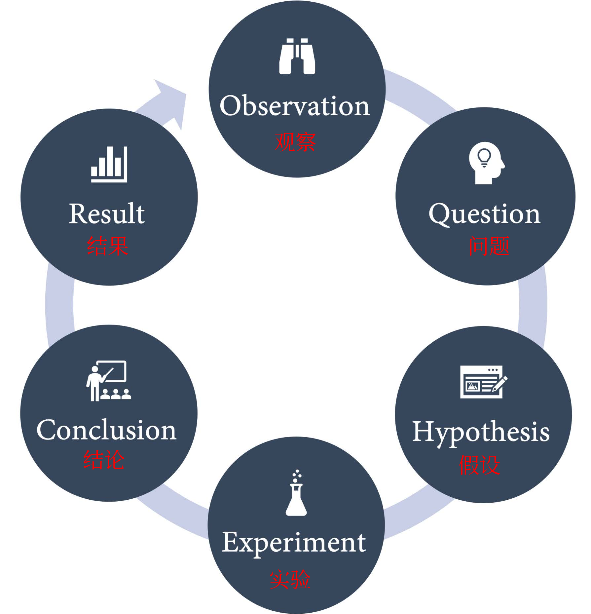
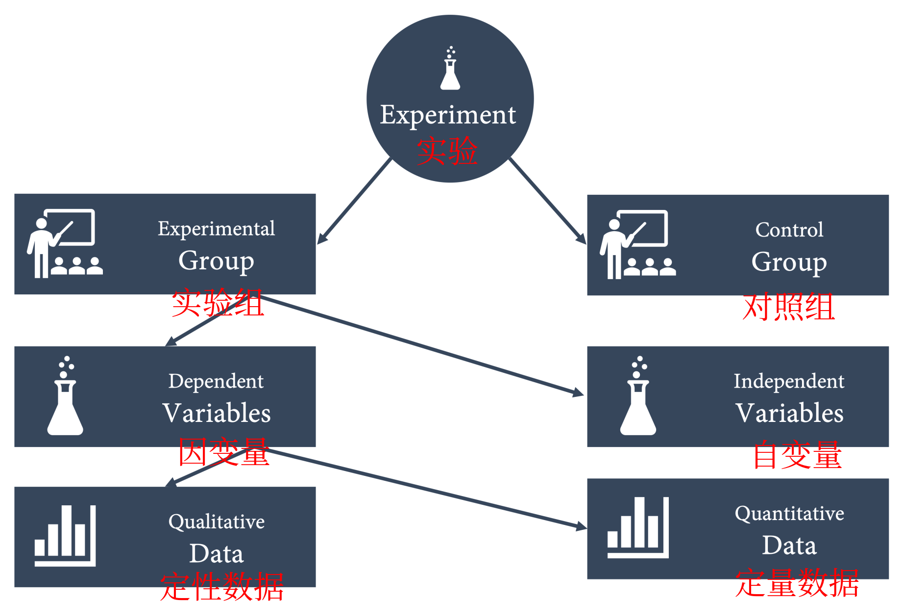
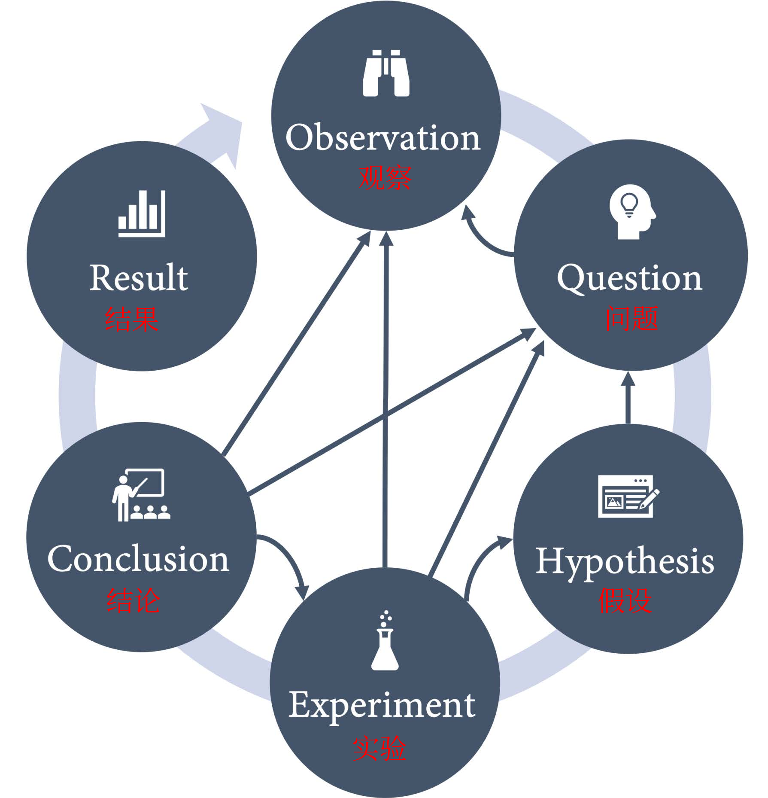
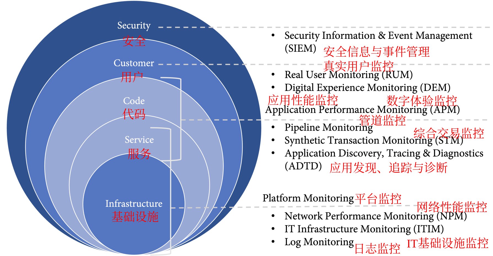
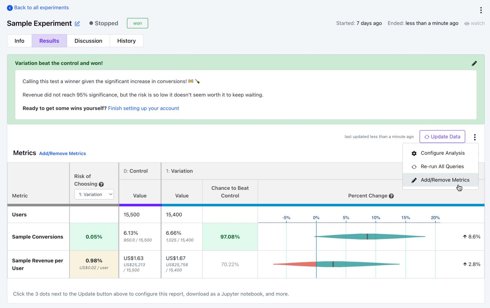

# 第19章 实验和 A|B 测试

在本章中，将讨论如何通过基于验证的 DevOps 实践（例如 **A|B 测试**），即进行实验来验证假设，从而发展和持续改进您的产品，有时也被称为**假设驱动的开发或实验**。

本章将涵盖以下主题：

- 用科学的方法进行实验
- 使用 GrowthBook 和 Flagger 进行有效的 A|B 测试
- 实验和 OKR

## 用科学的方法进行实验

传统上，需求管理更多的是猜测而不是科学。最接近科学方法的一般是访谈或市场研究。这种方法的问题是调查者不能问人们他们还不知道的事情。调查者可以问他们想要什么，但不能问他们需要什么，因为他们可能还不知道，尤其是在一个凌乱的细分市场中。

假设驱动开发的思想是将**科学方法**应用于产品管理，是一种获取循证知识的经验方法。

科学方法是一个实验过程，用于探索、观察和回答旨在发现因果关系的问题。它遵循特定的流程步骤（见图 19.1）：



<center>图 19.1 科学方法</center>

1. **观察**：使用所有的五种感官观察现实：嗅觉、视觉、听觉、触觉和味觉。

2. **问题**：根据观察和现有研究或以前的实验提出问题。

3. **假设**：根据提出问题时获得的知识提出假设。假设是根据观察和研究预测会发生什么。假设通常以 *if … then … from* 的形式编写，例如：“如果我们修改这个变量，那么我们期望这种变化是可观察的。”

4. **实验**：实验证明或反驳假设。在实验中，有不同的变量。**自变量**是更改以触发结果的变量，**因变量**是测量并期望改变的事物。在实验中，通过观察收集**定性数据**，通过测量和收集指标收集**定量数据**。

   实验还使用对照组来证明方差不仅仅是偶然的。要测试药物治疗效果，必须设计一个实验，其中一部分人群（**对照组**）不接受治疗并给予安慰剂，而**实验组**则接受潜在药物治疗（见图 19.2）。

   为了进行良好的实验，应该一次只更改一个变量，同时保持所有其他变量不变；还应该避免偏见，无论多么努力，偏见都可以很容易地影响到观察和结论中。



<center>图 19.2 进行科学实验</center>

5. **结论**：实验结束后，需要分析结果并将实际结果与预期结果进行比较。从实验中学到了什么？能证实或反驳假设吗？是否有新的假设或新的问题需要提出？或者需要更多的实验来确定吗？

6. **结果**：最后一步是分享结果，即使假设被反驳了，它仍然是有价值的学习。

科学方法是一种迭代的、经验性的方法，但步骤不一定按该顺序发生。在任何时候，都可以修改问题并改变假设——观察一直在进行。流程图看起来更像图 19.3，而不是清晰的循环：



<center>图 19.3 科学实验过程中的步骤没有严格的顺序</center>

科学方法在行业中非常重要——不仅是为了打造正确的产品。在查找错误或生产问题时，也应该使用该方法：根据观察到的事实提出假设。通过一次只改变一件事来进行实验，通常是配置值。执行交叉检查以确保没有其他系统或变量干扰实验。在开始下一个假设之前做出结论并记录结果。

下面是如何使用科学方法来改进和持续改进软件。

### 观察——收集和分析数据

可以观察使用应用程序的人。本书在第 12 章“左移测试以提高质量”中讨论了**可用性测试**技术，例如**走廊测试**或**游击可用性**。由于通常用户分散在世界各地，查看他们生成的数据比采访他们更容易。

数据是假设驱动开发的最重要组成部分！实验的越多，随着时间的推移收集的数据就越多。

观察数据时，不应只关注手头的数据点，问问自己数据没有告诉什么信息。如果目标是每月增加活跃用户数，则不应该只关注当前用户的数据。检查尝试登录失败的数据，有多少用户想要使用应用程序但被锁定并且无法恢复他们的密码或第二个身份验证因素？有多少人在需要验证邮件或手机号码后不回来？有多少人取消了注册流程，他们等了多长时间才这样做？

要回答这类问题，不能简单地查看使用数据，必须合并来自所有可用来源的数据（参见图 19.4）：



<center>图 19.4 用于收集数据的日志源</center>

然后可以将这些定量数据与定性数据相结合，例如客户调查、客户服务中心的数据或任何类型的分析数据。图 19.5 显示了不同的数据源，可以使用它们来获得洞察力和制定问题：


<center>图 19.5 观察数据源</center>

考虑到这些问题后，就可以开始提出假设。

### 制定假设

假设是根据观察和研究预测将来可能会发生的事情。假设可以写成一个简单的 `if … then …` 形式：`if <we modify this variable>，then <we expect this change to be observable>`。

如果通过删除电话号码和邮寄地址等字段来缩短的注册表，那么取消注册过程的人数（放弃率）将会减少。

由于我们对于存留积压的工作会有很多假设，因此通常有一个类似于用户信息的修复表单，其中包括客户群和功能名称。这使假设在这些存留的工作中更容易被发现：

```
We believe {customer segment}
want {feature}
because {value proposition}

我们相信{用户字段}
想要{特性}
因为{价值主张}
```

这种形式还将三个方面带入假设：

- **谁（Who）**：我们要为谁更改应用程序？
- **什么（What）**：我们正在改变什么？
- **如何（How）**：这种变化将如何影响用户？

这些成分构成了一个很好的假设：

```
我们相信新用户
想要一个更短的注册表，输入字段更少
因为这允许他们在泄露个人数据之前测试应用程序并获得信心。
```

请注意，关注价值主张会导致对“**如何（How）**”的描述更抽象，而更关注“**为什么（Why）**”。在市场营销中，经常会在假设中发现这样的细节：

- 有什么影响？
- 它有多好？
- 什么时候之后会有？

这导致假设和实验之间存在一对一的关系。尤其是在开始实验时，本书认为将实验与基础假设分开会有所帮助，可能需要多次实验才能最终确定假设是对还是错。

### 构建实验

在定义实验时，应该尽量保持尽可能多的变量不变。最好的办法是查看基线数据（baseline data）。周末和假期将如何影响数据？政治和宏观经济趋势将如何影响实验？

另外，请确保对照组和实验组都足够大。如果只对一小部分人进行实验，结果可能不具有代表性。如果对照组太小，可能没有足够的数据来比较结果，尤其是在存在没有预见到的其他外部因素的情况下。一个好的实验应该包含以下信息：

- 有什么变化？
- 预期的影响是什么？
- 谁是受众或客户群？
- 期望有多少变化？
- 进行多长时间的实验？
- 将数据与（对照组或历史数据）进行比较的基线是什么？

这是一个例子：

与对照组（**基线**）相比，新的、更短的注册表（**有什么变化**）将在 14 天后（**经过多长时间**）将 50% 的新用户（**对谁**）的注册表放弃率（**影响**）降低 15%（**多少**） 。

定义实验后，可以开始实施和执行它。如果使用功能标志进行开发（请参阅第 10 章，Feature Flags and the Feature Lifecycle），就像编写新功能一样简单。唯一的区别是不会为所有用户打开该功能，而是为实验组打开该功能。

### 验证结果

实验结束后，分析结果并将实际结果与预期结果进行比较。从实验中学到了什么？能否验证或证伪假设，或者是否需要更多实验来确定？是否有新的假设或新的问题需要提出？

结果的回顾性研究是重要的一环。不要跳过它，仅仅假设假设是对还是错，因为指标超过了阈值。分析数据并检查意外影响、偏差和统计异常值。

从假设和实验中学习应该会产生新的想法并完成构建-测量-学习循环（见图 19.6）：


<center>图 19.6 使用构建-测量-学习循环的假设驱动实验</center>

有许多工具可以辅助进行有效的 A|B 测试和实验。

## 使用 GrowthBook 和 Flagger 进行有效的 A|B 测试

GitHub 没有可以帮助进行 A|B 测试的工具，但市场上有许多可用的工具。问题是这些工具中有许多具有完全不同的功能范围。有些更像是网络体验工具，可以使用它们的**内容管理系统 (CMS) **构建网站，或使用可视化编辑器构建 A|B 测试以创建和测试变动（例如，**Optimizely** – 请参阅 https://www.optimizely.com/）。有些更侧重于营销、登录页面和活动管理，例如 **HubSpot** ( https://www.hubspot.com/ )。这些工具很棒，但可能不是工程团队的正确选择。

做特征标记的工具提供了更好的解决方案，例如 **LaunchDarkly**、**VWO** 或 **Unleash**。本书已经在第 10 章功能标志和功能生命周期中介绍了这些工具，所以不会在这里再次介绍它们。如果开发者正用这些解决方案之一来做功能标志，那么这也是应该首先寻找 A|B 测试解决方案的地方。

在本章中，将重点介绍 **GrowthBook** 和 **Flagger**，这两个开源项目非常注重实验，但采用了完全不同的方法。

### GrowthBook

**GrowthBook** ( https://github.com/growthbook/growthbook ) 是一个具有免费和开放核心的解决方案。它也可作为 SaaS 和企业计划使用。它为 **React**、**JavaScript**、**PHP**、**Ruby**、**Python**、**Go** 和 **Kotlin** 提供了 SDK。

GrowthBook 的方案设计是完全容器化的。如果想要尝试一下，只需克隆存储库，然后运行以下命令：

```shell
docker-compose up -d
```

启动后，可以访问 http://localhost:3000 上的 Growthbook。

> **在 GitHub Codespaces 中运行 GrowthBook**
> 如果想试用 GrowthBook，可以在 GitHub Codespaces 中运行它。
> 为此，必须配置 docker-compose.yml 以使用正确的 DNS 名称，因为 GrowthBook 使用本地主机连接到其 MongoDB。将environment下的APP_ORIGIN设置为本地的3000端口地址，API_HOST设置为本地的3001端口地址，并使3001端口可见。

连接后，可以使用它来提供功能标志或构建实验。要构建实验，必须将数据源连接到 GrowthBook——例如，**BigQuery**、**Snowflake**、**Redshift** 或 **Google Analytics** 等。如果有预定义的数据模式，也可以构建自己的数据模式。然后，根据个人的数据源创建指标。指标可以是以下任何一项：

- **二项式**：简单的是或否对话（例如，创建帐户）
- **计数**：每个用户的多次对话（例如，页面访问）
- **持续时间**：平均花费多少时间（例如，现场停留时间）
- **收入**：平均获得或损失的收入（例如，每个用户的收入）

要运行实验，通常会使用功能标志位（feature flags），也可以直接使用其中一个 SDK 运行？？内联实验。JavaScript 中的实验如下所示：

```javascript
const { value } = growthbook.run({
    key: “my-experiment”,
    variations: [“red”, “blue”, “green”],
});
```

实验根据开发者定义的指标运行，结果如图 19.7 所示：



<center>图 19.7 GrowthBook 中的一个实验结果</center>

开发者可以在实验中添加和删除指标，也可以将其导出为 Jupyter Notebook。

GrowthBook 还附带了适用于 JavaScript 的 Google Chrome 扩展 **GrowthBook DevTools** 和 React SDK，它允许开发者直接在浏览器中与功能标志位进行交互。可视化编辑器目前处于测试阶段。

GrowthBook 很简单，也基于功能标志，如第 10 章中介绍的解决方案。

### Flagger

**Flagger** 是一种完全不同的方法 ( https://flagger.app/ )。它是 **Kubernetes** 的交付运营商，可以与服务网格 Istio 一起使用。Flagger 更常用于向 Kubernetes 集群发布**金丝雀版本**，但它也可以根据 HTTP 匹配条件路由流量。

它可以使用`内部（insider）`cookie 为所有用户创建一个 20 分钟的实验，如下所示：

```
analysis:
  # schedule interval (default 60s)
  interval: 1m
  # total number of iterations
  iterations: 20
  # max number of failed metric checks before rollback
  threshold: 2
  # canary match condition
  match:
    - headers:
      cookie:
        regex: “^(.*?;)?(type=insider)(;.*)?$”
```

另外，可以将 Flagger 与来自 **Prometheus**、**Datadog**、**Dynatrace** 等的指标相结合。本章不在这里详细介绍，有关更多信息，请参阅 Flagger 文档 (https://docs.flagger.app/)。Stefan Prodan 也有一个很好的教程：使用 Flux v2、Flagger 和 Istio 进行渐进式交付的 GitOps 秘诀（请参阅 https://github.com/stefanprodan/gitops-istio）。

Flagger 和 Istio 的解决方案带来了极大的灵活性，但它也相当复杂，不适合初学者。如果开发者已经在使用 Kubernetes 和 Istio 并执行金丝雀发布，那么 Flagger 可能是适合的强大框架。

如上所见，有许多解决方案可以辅助进行实验和 A|B 测试。从以 CMS 和活动为中心的工具到 Kubernetes 运营商，有各种各样具有完全不同方法的解决方案。最合适的解决方案取决于很多因素——主要是现有的工具链、定价和支持。本书认为更重要的是关注流程和数据分析。为应用程序提供两个版本应该不是挑战——理解数据可能才是。

## 实验和 OKR

在第 1 章“Metrics That Matter,”中，介绍了**目标和关键结果 (OKR)**，它是一个以透明方式定义和跟踪目标及其结果的框架。OKR 帮助组织实现战略目标的高度一致性，同时为各个团队保持最大程度的自主权。

工程团队是一种昂贵的资源，许多利益相关者一直在向他们提出要求：测试人员提交错误，客户要求新功能，管理层希望赶上竞争对手并向重要客户做出承诺。一个团队应该如何找到进行实验的自由？最好从哪些实验开始？

OKR 可以通过同时保留决定构建什么以及如何构建的自主权，使之能够与更高层次的目标保持一致。

假设公司希望成为市场领导者，市场份额达到 75%，并且需要新注册用户的持续增长率才能实现这一目标。所在团队的关键结果是每月 20% 的增长率。这将为所在团队设置优先级。当然，还有其他事情要做，但优先考虑的是 OKR。该团队可能首先调查有多少人来到注册页面，以及来自什么推荐。有多少人点击“**立即注册**”按钮？有多少人完成了对话？他们什么时候不回来？到那时，他们会自动开始提出假设，并可以进行实验来证明它们。

OKR 也有利于跨团队协作，因为团队可能拥有具有高协同效应的 OKR，因为它们与更高级别的目标保持一致。在这个例子中，团队可能想与市场营销人员交谈，因为他们会有类似的 OKR。他们可能有自己的实验想法，以帮助提高指向注册网站的着陆页的参与率。

OKR 是一个很好的工具，它通过确保与其他团队和更高层次的目标保持一致来赋予人们进行实验的自由。

## 概括

实验、A|B 测试和假设驱动的开发是困难的主题，因为它们需要在许多领域具有高度的成熟度：

- **管理**：团队需要自主权来决定自己构建什么以及如何构建它。
- **文化**：团队需要一种信任文化，让人们不惧怕失败。
- **跨团队协作**：必须能够跨学科工作，因为实验通常需要不同部门的协作。
- **技术能力**：必须能够在很短的时间内将更改发布到生产环境并针对各个客户群。
- **洞察力**：必须具有强大的分析能力，并结合来自不同来源的数据和指标。

如果还没有，请不要担心。笔者合作的许多团队都还没有，只需继续提高能力并检查指标是否显示结果。DevOps 是一段旅程而非目标，必须一步一个脚印。

在本章中，介绍了实验、A|B 测试和假设驱动开发的基础知识，并且介绍了一些可以帮助构建解决方案的工具。

在下一章中，将学习 GitHub 的基础知识——托管选项、定价，以及如何将其集成到现有的工具链和企业中。

## 延伸阅读

这些是本章中的参考资料和链接，可以使用它们来获取有关这些主题的更多信息：

- The Scientific method: https://en.wikipedia.org/wiki/Scientific_method
- Ring-based deployments: https://docs.microsoft.com/en-us/azure/devops/migrate/phase-rollout-with-rings
- Optimizely: https://www.optimizely.com/
- Hubspot: https://www.hubspot.com/
- GrowthBook: https://github.com/growthbook/growthbook
- Flagger: https://flagger.app/
- Stefan Prodan: GitOps recipe for progressive delivery with Flux v2, Flagger, and Istio: https://github.com/stefanprodan/gitops-istio