# 第二章 计划、跟踪和可视化你的工作

上一章中讲解了如何衡量工程效率和产出使得开发模式的变化可见，并改变与管理层的交流。

本章将重点关注如何组织团队内的工作并应用精益原则(Lean principles)，并学习如何利用GitHub的问题和项目来简化工作流程。

本章包括如下主题：

- 工作就是工作
- 非计划的工作和返工
- 工作可视化
- 限制在制品
- GitHub的问题(issue)、标签(label)和里程碑(milestone)
- GitHub项目

## 工作就是工作

工作是为了实现目的或结果而进行的活动。这不仅包括正在从事的产品或项目，还包括必须为企业执行的所有活动。在作者与一些团队合作时，有些人要花费高达50%的工作时间在其项目/产品团队之外的任务上。有些人是团队负责人，需要与组织团队成员开会和对团队负责。有些人是劳资委员会的成员。有些人需要进行个人发展路径的培训。有些人不得不需要修复他们过去参与过的项目的错误和现场问题。

许多任务无法从团队成员身上摆脱。团队成员可能喜欢或不喜欢这些任务，但这些通常是他们个人发展的重要组成部分。

这种工作的问题在于，任务的优先级和具体协调由个人决定，并且在他们的团队工作内容之外。谁来决定开发人员对以前系统的问题的处理是否应该优先于当前项目中的问题？通常情况下，每个人都自己制定工作计划和优先级。这通常会导致更多的前期计划。当团队成员在sprint阶段开始时报告他们的可用时间时，团队根据这些事项开始计划目前的任务。这可能会阻止整个团队建立拉动（pull），并迫使他们计划依赖任务并将其分配给单个团队成员（推动，push）。

为了解决这个问题，管理者应该让团队看到所有的工作，并将其添加到团队的待办事项清单中。如果团队成员是劳资委员会的一员？添加到待办事项清单中。团队成员有培训计划吗？也将它添加到待办事项清单中。

因此，第一步是找出团队执行的工作类型，并将其收集到一个待办事项清单中。

第二步是简化。每个人都可以让事情变得更加复杂，但是让事情变得更简单需要一点天赋。这就是为什么在大多数企业中，随着时间的推移，流程和表格变得越来越复杂。作者曾经见过一个有300个字段的表格，以及基于这些字段的复杂路由规则——仅仅是为了处理现场事件。但请不要将其放入到待办事项清单中。将这个过程独立于后台——由团队处理，对团队有明确的触发，并由管理层负责——所以从读者的角度来看，它已经完成了。一个流程或工单可能会导致多个细小工作项在待办事项清单中。每个工作项都应该被简化为待办、正在进行和已完成三个状态。

>注意
>
>在第18章《精益产品开发和精益创业》中，将更加关注价值流、约束理论以及如何优化工作流。本章关注的是团队层面以及如何开始跨团队边界优化。

## 非计划的工作和返工

所有开发人员都知道频繁的情境切换会降低生产力。如果开发人员在编码时受到干扰，那么在恢复到相同的生产力水平时需要一些时间。因此，同时处理多个项目或任务也会降低生产力。杰拉尔德·韦恩伯格（Gerald M. Weinberg）在《优质软件管理：系统思维》（Quality Software Management: Systems Thinking）中，提出了一项研究结果：仅同时在两个项目上工作时，效率下降约20％（Weinberg G.M. 1991）；每增加一个项目，性能下降20％（图2.1）：


图2.1 - 情境切换时生产力的损失

另一项来自2017年的研究表明，在处理两个或三个项目的开发人员平均花费17％的时间进行情境切换（Tregubov A.，Rodchenko N.，Boehm B.，& Lane J.A.，2017）。作者认为实际百分比可能因产品和团队而异。采用小工作批量进行开发的开发人员可以更容易地进行情境切换，而工作批量较大的开发人员则难以进行情境切换。问题越复杂，重新开始工作所需的努力就越大。像测试驱动开发（TDD）这样的实践可以帮助开发者更容易地在情境切换后重新开始工作。

但是，无论实际百分比如何：情境切换都会降低生产力，开发人员如果将时间更多地专注到一个任务上，就会更加高效。这意味着管理层应该减少团队的在制品（WIP） - 尤其是非计划工作和返工。

为了帮助企业以后进行优化，应该从一开始就正确地标记工作项。非计划工作可能起源于项目内部或外部。如果出现错误、技术问题或误解的需求，就可能需要进行返工。确保开发者可以通过正确的标签从一开始就分析工作。这不应该成为一个复杂的治理框架 - 只需选择一些标签，这些标签将有助于以后优化团队工作。表2.1展示了如何对工作项进行分类：

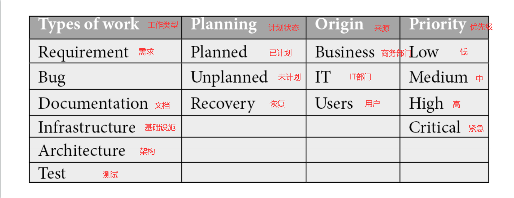

表2.1 - 你的工作项的示例分类法

保持简单，并选择一些措辞简单的分类法，清晰地传达给团队。

## 工作可视化

为了关注重要的工作并减少多任务处理和任务切换，开发者应该可视化工作，通常采用看板的形式。看板源于精益制造，但现在被视为精益软件开发的重要组成部分。看板可以帮助开发者提高系统中工作流的效率。

可视化将帮助完成以下任务：
- 辨别瓶颈、等待时间和交接时间。
- 对工作进行优先排序并首先处理最重要的任务。
- 将工作分解成小批次大小。
- 完成任务。

### 建立拉动(pull)制

没有计划是完美的。如果读者曾经制定过一个项目计划，就知道只有在有很多缓冲时间的情况下，项目计划才能够实现，并且必须经常调整计划。因此即使只计划未来2到3周的工作，计划也会导致等待时间和情境切换。解决方案是停止计划，建立拉动制：团队成员从队列中提取优先级最高的工作并开始处理。理想情况下，任务完成后将其移到完成状态（图2.2）：


图2.2 - 从待办事项中拉取工作以指示状态变更

如果只靠自身无法完成任务，这可能表明任务太大，需要将其拆分为更小的任务。如果必须要同时处理许多任务才能完成一件事情，则这些任务可能太小。随着时间的推移，可视化表示法可以帮助发现瓶颈和等待时间。

### 优先排序

使用可视化看板的好处在于很容易对工作进行优先排序。只需将具有最高优先级的工作项移动到顶部即可。如果在看板上有不同类型的工作，可能需要额外的可视化分离。这可以通过泳道(swimlane)来实现。泳道是看板上工作的水平分组（图2.3）：

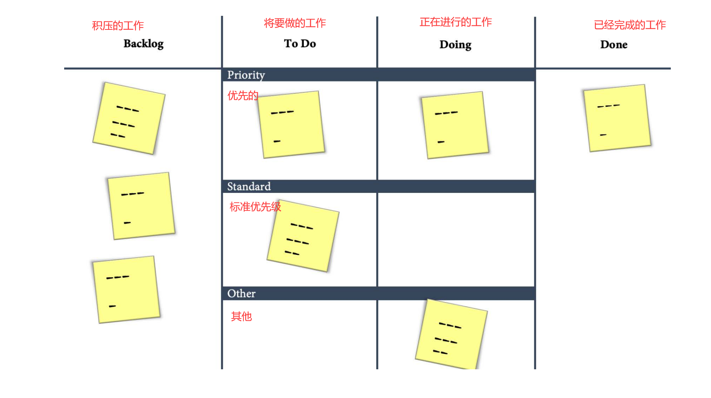

图2.3 - 使用泳道来组织看板上的工作

如果团队需要处理现场问题，可能需要一个优先级泳道以向所有团队成员发出信号，表明当前问题优先于其他工作。或者如果团队成员需要在团队外负责某些事情，也需要将其与团队内正常工作分开。

许多看板还允许为每张卡设置不同的颜色 - 通常是通过对卡片应用标签或标记来实现。这也可以帮助在看板上通过视觉区分不同类型的工作。特别是与泳道结合使用时，有色卡片可以帮助一目了然地看到团队的工作状况，以及需要关注的最重要的任务。

### 保持简单！

从三栏（待办、进行中和已完成）开始，如果需要优化团队的工作流，可以再添加更多的栏和泳道。但要注意保持简单！在每次定制之前问问自己:这是必要的吗?这能带来价值吗?有没有更简单的方法?

复杂的东西往往会很难剔除——实际应用时，有些团队将他们的看板扩大成了一个有着10列、8个泳道（其中大多数时候都是折叠的）和许多字段和卡片信息的怪兽。

看板是关于简化的——尽可能让其保持简单！

## 限制在制品（WIP）

看板（Kanban）的目标之一是限制在制品（WIP）。更少的WIP可以减少情境切换，更加专注于当前工作。这有助于完成工作！停止开展新工作，开始完成当前的工作！

即使在指导Scrum团队时，作者也看到过一些团队在sprint阶段的前几天就开始处理所有他们计划的用户故事（即用户需求）。每当一个开发人员受阻时，他们就会开始处理另一个故事。在sprint阶段结束时，所有故事都已经开始处理，但没有一个完成。

在看板中，开发者会专注于少量的工作，并保持一定的节奏。

### 设置WIP限制

大多数看板都支持WIP限制。WIP限制是指希望在同一列中同时拥有的最大项数的指示器。假设正在进行中的WIP限制为5，此时正在处理三个项目。该列将显示3/5——通常为绿色，因为限制尚未达到。如果继续开始处理另外三个项目，将显示为6/5，因为限制已达到，颜色为红色。

WIP限制可以帮助开发者专注于少量的工作，无需开展太多工作。从小的工作开始，只有在绝对必要时才增加。一个好的WIP限制值是5。

### 减少批次大小

限制WIP将为开发者提供一个很好的指导，以确定工作项目是否合适。如果很难保持WIP的限制，那么开发者进行的工作项目可能仍然太大。可以尝试在增加限制之前将项目拆分为更小的任务。

### 减少交接

同样的情况也适用于交接。如果开发者的工作项目需要许多团队成员或甚至是需要外部团队的参与，那么会产生等待时间并降低流程效率。流程效率是开发者处理工作项目所花费的时间除以完成它所需的总时间（包括等待时间）：

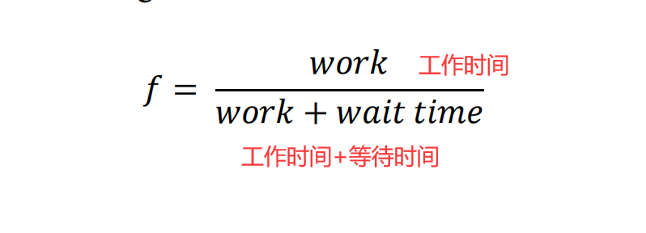

流程效率是软件工程中非常理论化的指标，因为通常不会精确测量工作和等待时间。但是，如果经历了许多交接和阻塞，该指标可能有助于了解开发者的工作如何在系统中流动。如果开发者将项目移动到“进行中”，可以启动工作计时器；如果将其移回，则可以启动等待时间计时器。

## GitHub的Issues、label和milestones

GitHub的issues可以跟踪任务、功能的增强和错误。它们高度集中，并有历史的时间轴。Issues可以链接到提交、拉取请求和其他问题。GitHub issues是开发人员在GitHub上喜欢的体验的一部分。这就是为什么Issues是管理工程团队工作的良好解决方案。

### 创建Issues

读者可以在某个仓库中的Issues | New Issue创建一个新Issue。Issues结构是标题和支持Markdown的正文（图2.4）：

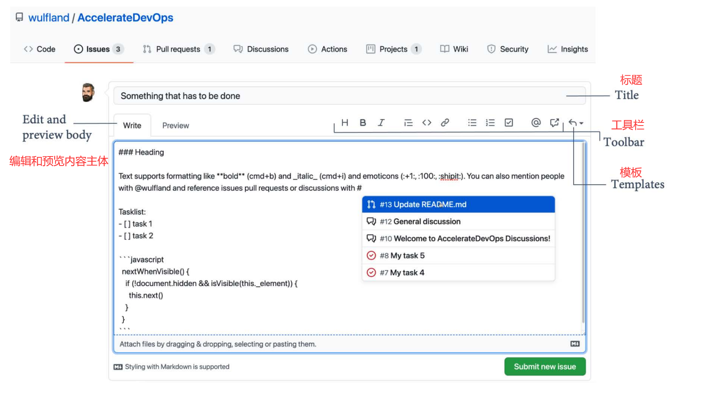

图2.4 - 创建一个新的问题

工具栏可以帮助格式化文本。除了普通的格式化（例如标题、粗体和斜体文本、列表、链接和图片），还有一些值得注意的特点：

-  表情符号：可以在Markdown中添加各种各样的表情符号。例如 :+1: (👍) 、 :100: (💯) 以及GitHub典型的 :shipit: squirrel。读者可以在这里找到完整的列表：https://gist.github.com/rxaviers/7360908#file-gistfile1-md。
-  提及：可以通过GitHub名称提及个别成员或整个团队。只需按@并开始输入。从列表中选择人员或团队。他们会收到通知，并且提及将显示为指向被提及的个人或团队的个人资料的链接。
-  引用：通过按#键并从列表中选择项目，可以引用其他issue、拉取请求或讨论。
-  任务列表：任务列表是一个包含子任务的列表，用于显示问题的进度。列表中的任务可以转换为issue，因此可以用于创建工作项的嵌套层次结构。未完成的任务以 - [ ] 开头。如果已完成，中间加上x：- [x]。
-  源代码：你可以在Markdown中添加带有语法高亮的源代码。只需使用```来打开和关闭代码块。语法高亮由Linguist（https://github.com/github/linguist）完成，大多数语言都受支持。

> Markdown
>
> Markdown是一种非常流行的轻量级标记语言。与JSON或HTML不同，它基于单行格式化文本，不具有开放和关闭标签或括号。这就是为什么它非常适合与Git一起进行版本控制，并使用拉取请求协作更改。这也是为什么YAML是可机器读取文件的事实标准的原因。Markdown是可读性好的文件。在DevOps团队中，一切都是代码：图表、架构、设计和概念文档、配置文件和基础设施。这意味着使用YAML、Markdown或两者混合使用。
> 
> 如果读者还没有学习过Markdown，现在是时候开始学习它了。许多团队使用Markdown与拉取请求广泛协作可读性好的内容。由于大多数工作管理解决方案也支持Markdown，它几乎无处不在。Markdown具有非常简单的语法，易于学习。使用几次后，不会觉得有负担。

读者可以随时切换到预览模式以查看Markdown的输出（图2.5）：


图2.5 - 在新issue中预览Markdown

该链接是关于GitHub上Markdown的一个很好的介绍：https://guides.github.com/features/mastering-markdown/。

> 提示：
>
> 经常使用的文本可以保存至常用语。按Ctrl + .（Windows / Linux）或Cmd + .（Mac），然后从列表中选择回复或创建一个新的保存的回复。要了解更多信息，请参见https://docs.github.com/en/github/writing-on-github/working-with-saved-replies。

### 在 Issue上进行协作

一旦Issue被创建，可以随时添加评论。可以将多达10人分配至该issue，并对issue应用标签进行分类。所有更改都显示为issue历史中的事件（图2.6）：


图2.6 - 编辑Issue

如果Issue包含一个任务列表，用于显示issue的进度。读者可以将每个任务转换为一个单独的issue，然后将其链接到当前issue。如果点击“Open covert to issue”按钮（请注意，鼠标悬停在图2.6中可见），任务将被转换为一个新的issue，并显示为链接。如果点击链接并打开issue，可以看到该issue在另一个issue中被跟踪（图2.7）：

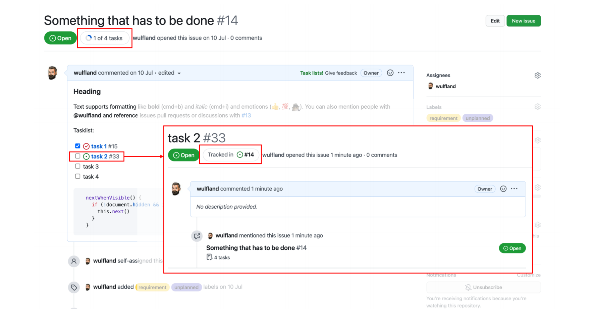

图2.7 - 创建issue层次结构

这样可以创建灵活的工作层次结构，并将工作拆分成更小的任务。

### Issue待办清单

Issue概述不是一个真正的待办清单，因为它不能通过拖放排序。但它具有非常高级的语法，可用于筛选和排序。应用的每个筛选器都会作为文本添加到搜索字段中（图2.8）：

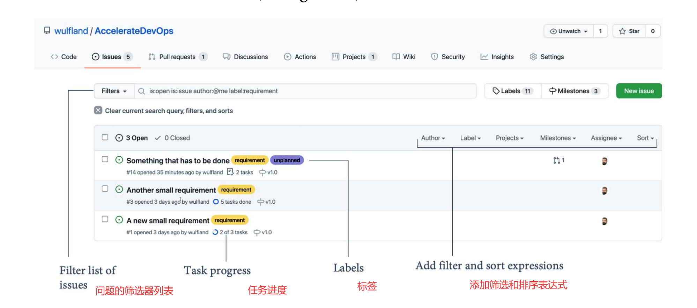

图2.8 - 筛选和排序问题列表

在概述中，可以看到任务的进度和标签，还可以看到与Issue相关联的拉取请求。

### 里程碑

里程碑是一种将问题分组的方式。一个issue只能分配至一个里程碑。里程碑通过关闭的问题数与总问题数的比例来衡量进度。里程碑有一个标题，一个可选的截止日期和一个可选的描述（图2.9）：

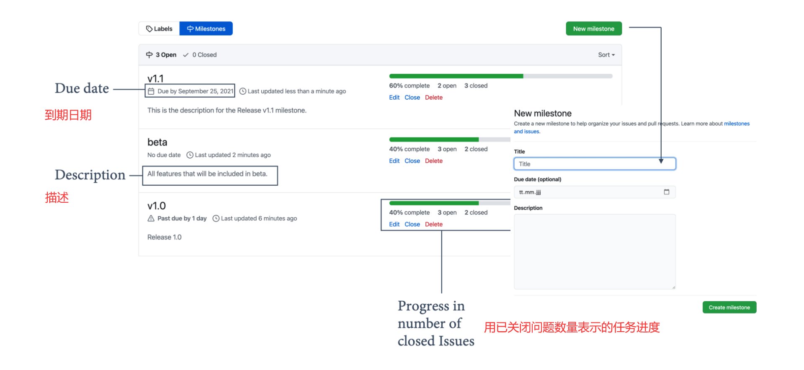

图2.9 - 使用里程碑规划issues

里程碑是将issue分组以便在特定目标日期发布版本的好方法。它们还可以用于将不属于一个发布版本的问题分组在一起。

### 固定Issue

用户可以将最多三个Issue固定到仓库中。这些issues会显示在issue概述的顶部（见图2.10）：

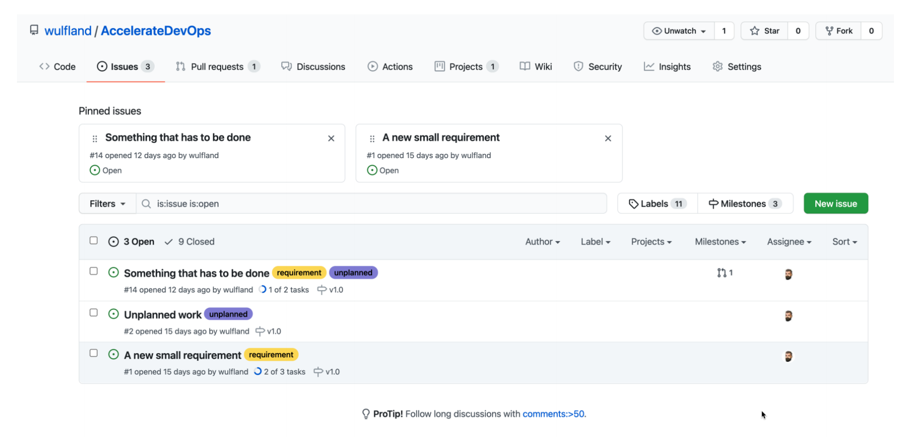

图2.10 - 固定Issue

固定Issue是向其他贡献者或新团队成员传达重要信息的好方法。

### Issue模板

用户可以为Issue配置不同的模板，给出预定义的内容。如果用户创建了一个新issue，他们可以从列表中选择模板（图2.11）：

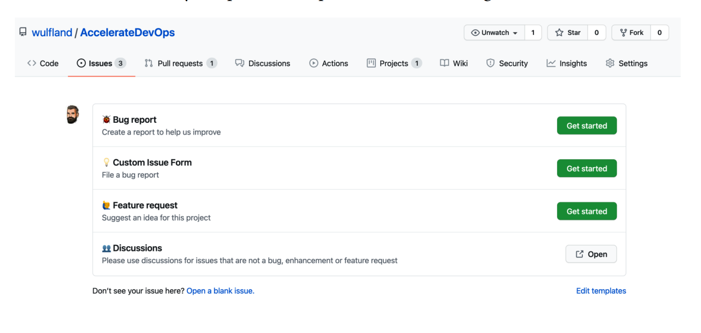

图2.11 - Issue模板

用户可以在仓库的Settings | Options | Issues ｜ Set up templates 下激活issue模板。可以为错误、功能或自定义模板选择一个基本模板。这些模板是存储在仓库中的文件，位于.github/ISSUE_TEMPLATE下。点击“Propose changes”并提交文件到仓库。一旦模板文件在仓库中，用户可以直接在那里编辑或删除它。或者可以添加新的模板文件。没有必要从设置中进行此操作（添加新的模板文件）。

模板可以是Markdown(.md)或YAML文件(.yml)。Markdown包含一个指定名称和描述的头文件。它还可以设置标题、标签和指派人的默认值。以下是Markdown模板的示例：

```markdown
--- 
name: 🐞 Bug report 
about: Create a report to help us improve 
title: ‘[Bug]:’ 
labels: [bug, unplanned]GitHub issues, labels, and milestones 45 
assignees: 
- wulfland 
--- 
**Describe the bug** 
A clear and concise description of what the bug is. 
**To Reproduce** 
... 
```

如果点击Issues | New Issue，可以选择模板并点击“Get started”按钮，这将会生成一个使用模板预设值填充的新issue。如图2.12所示：

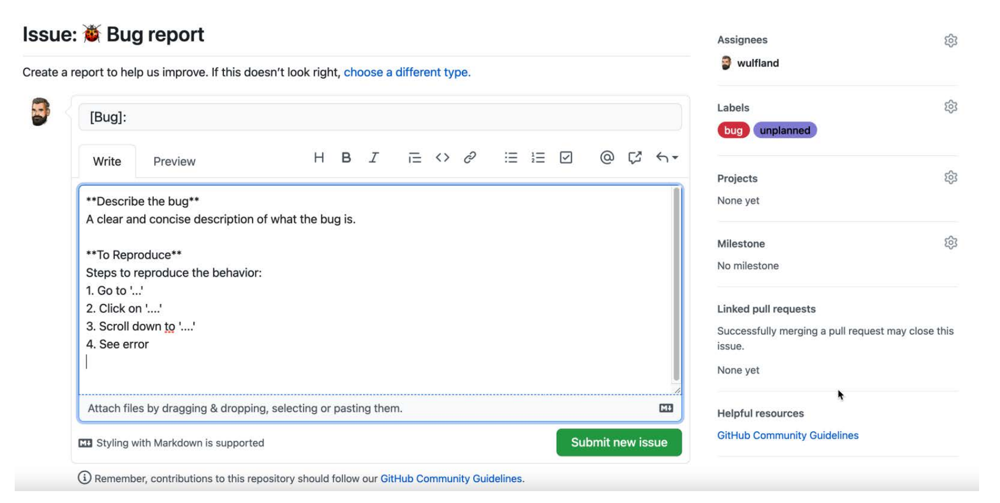

图2.12 - 一个Markdown问题模板。

使用YAML模板，可以定义具有文本框、下拉框和复选框的完整表单。可以配置控件并将字段标记为必填。一个示例表格定义如下：

```yaml
name: 💡 Custom Issue Form
description: A custom form with different fields
body:
 - type: input
 id: contact
 attributes:
  label: Contact Details
 description: How can we get in touch with you if we need 
more info?
 placeholder: ex. email@example.com
 validations:
 required: false
 - type: textarea
 id: what-happened
 attributes:
 label: What happened?
 description: Also tell us, what did you expect to happen?
 placeholder: Tell us what you see!
 value: “Tell us what you think”
 validations:
 required: true
 - type: dropdown
 id: version
 attributes:
 label: Version
 description: What version of our software are you 
running?
 options:
 - 1.0.2 (Default)
 - 1.0.3 (Edge)
 validations:
 required: true
 - type: dropdown
 id: browsers
 attributes:
 label: What browsers are you seeing the problem on?
 multiple: true
 options:
 - Firefox
 - Chrome
 - Safari
 - Microsoft Edge
  - type: checkboxes
 id: terms
 attributes:
 label: Code of Conduct
 description: By submitting this issue, you agree to 
follow our [Code of Conduct](https://example.com)
 options:
 - label: I agree to follow this project’s Code of 
Conduct
 required: true
```

结果如图2.13所示：

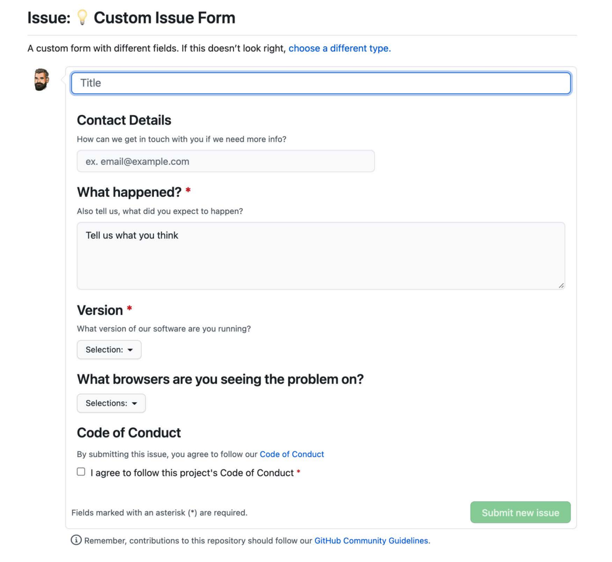

图2.13 - 一个YAML issue模板

此链接包含更多关于YAML问题模板的信息：https://docs.github.com/en/communities/using-templates-to-encourage-useful-issues-and-pull-requests/syntax-for-issue-forms。

用户可以通过将config.yml文件添加到.github/ISSUE_TEMPLATE中来自定义选择issue模板的对话框。也可以选择是否支持空问题并添加其他行：

```yaml
blank_issues_enabled: true 
contact_links: 
- name: 👥 Discussions 
url: https://github.com/wulfland/AccelerateDevOps/ 
discussions/new 
about: Please use discussions for issues that are not a 
bug, enhancement or feature request 
```

结果与图2.11相同，附加的链接显示为“Open”按钮。

> 注意
>
> 在撰写本书时，YAML问题模板仍处于测试阶段，因此可能会发生变化。

## GitHub项目

GitHub issues是协作的绝佳方式 - 但由于仓库范围的限制和缺乏拖放式待办事项清单和视觉看板，并不是可视化和跟踪工作的完美方法。

在GitHub中管理跨仓库工作的中心枢纽是GitHub项目。它建立在GitHub issue之上，支持来自多达50个仓库的issue。

GitHub项目是一个灵活的协作平台。用户可以自定义待办事项清单和看板，并与其他团队或社区分享它们。

> 注意：新的GitHub问题或GitHub项目（测试版）
>
> 在撰写本书时，Git项目正在进行彻底的改造。新部分目前被称为GitHub Projects（beta）或New GitHub Issues，当准备就绪时将取代GitHub项目。目前还不确定最终名称是什么。
> 
> 目前，新的测试体验不像Jira或Azure Boards那样成熟。但是有一个出色的团队正在开发它，作者相信如果准备完善，它将是市场上最好的解决方案之一！
> 
> 请注意，每个月都会推出很多新功能，所有的截图可能很快就会过时。读者应关注变更日志(https://github.blog/changelog/)，以便及时了解发布的所有内容。

### 开始使用

GitHub 项目可以包含来自多个仓库的issue和拉取请求。因此，它们必须在组织级别或在用户个人仓库配置文件中创建。要创建新项目，请导航到组织或 GitHub 配置文件的主页面上的“Projects”并单击“New Project”（图2.14）：


图2.14 - 在配置文件或组织中创建新项目

### 将工作项添加到项目中

项目中的默认视图是表视图。它被优化用于输入数据。按 Ctrl + 空格键或单击表格的最后一行，可以直接输入新工作项的名称，然后稍后将该项转换为issue。或者，你可以键入 # 并选择一个仓库，然后可以选择可用的issue和拉取请求（图2.15）：


图2.15 - 将问题、拉取请求或草稿工作项添加到待办清单中

### 向工作添加元数据

用户可以轻松地向项目添加不同的元数据字段。支持如下类型：

- 日期字段：值必须是有效的日期。
- 数字字段：值必须是数字。
- 单选：值必须从值列表中选择。
- 文本字段：值可以是任何文本。
- 迭代：值必须从一组日期范围中选择。过去的日期被自动标记为完成，日期范围中包括当前日期的将被标记为正在进行。

要添加新字段，请按 Cmd + K（Mac）或 Ctrl + K（Windows/Linux）打开命令面板，然后开始键入“Create new field”。你还可以单击右上角的加号并选择“+ New field”。输入字段名称并选择字段类型。

### 使用表视图工作

项目的默认视图是高度灵活的表视图，用户可以拖放对行进行排序并按优先顺序输入数据。可以通过打开列标题中的菜单或打开命令面板（Cmd + K或Ctrl + K）并选择其中一个命令来对行中的数据进行排序、筛选和分组。

如果将表格视图分组，用户可以直接向组中添加项目或通过将其拖到另一个组中更改项目的值（图2.16）：


图2.16 - 表视图支持分组、筛选和排序

### 使用看板视图工作

用户可以将视图切换到看板视图，将工作显示为可配置的看板。看板可以为视图中的任何字段值显示一列！用户可以使用视图的列字段属性进行设置，将项目拖到另一列中以更改状态。目前还不能分组看板或拥有泳道，但是用户可以筛选看板，以便为不同类型的工作项拥有单独的看板（图2.17）：

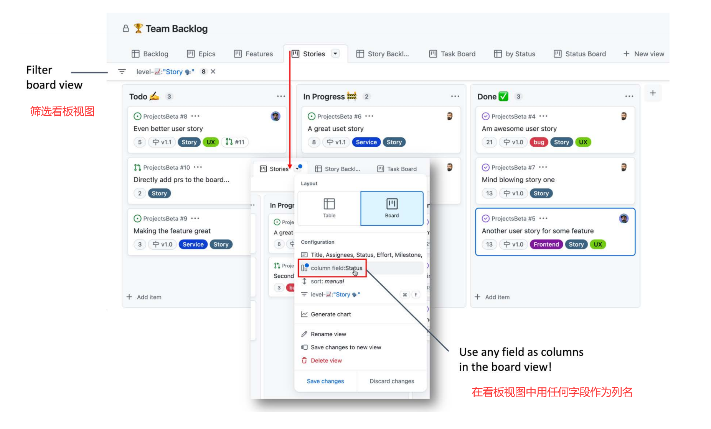

图2.17 - 看板视图

用户可以通过单击看板右侧的加号为任何字段选择作为列字段，以添加新列。这提供了一种非常灵活的可视化工作的方式（图2.18）：


图2.18 - 选择任何字段作为看板的列字段

看板视图被优化用于可视化工作、优化流程和限制 WIP。

### 使用视图

每次在视图中对数据进行排序、筛选或分组，或在表格和看板视图之间切换时，选项卡标题中的蓝色图标都会指示该视图有未保存的更改。用户可以在菜单中查看更改并保存或放弃它们，也可以将它们保存为一个新的视图（图2.19）：


图2.19 - 使用视图修改

创建新的自定义视图，重命名它们并使用拖放进行排列非常简单。

### 工作流

用户可以使用工作流来定义当问题或拉取请求转换到另一个状态时发生什么。目前，用户只能启用或禁用默认的工作流程 - 但将来将能够编写自己的工作流程（图2.20）：

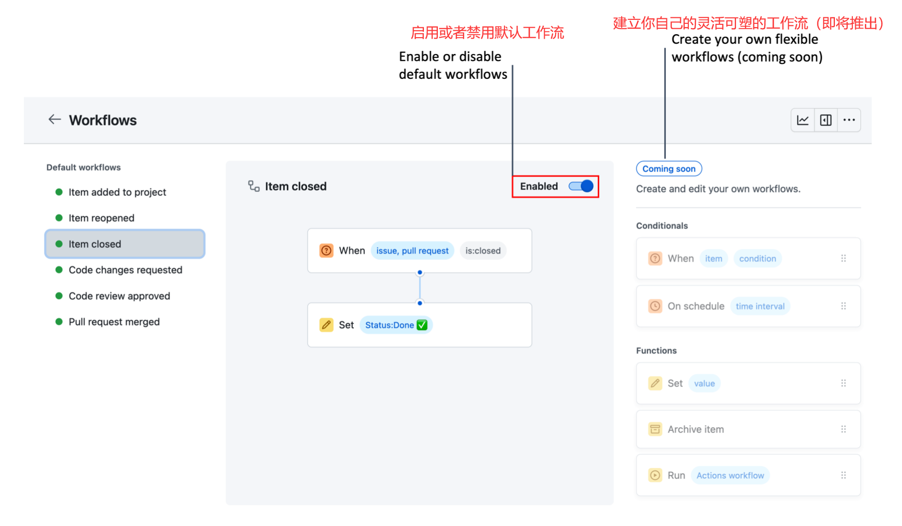

图2.20 - 工作流程定义项目更改时发生的情况

### 洞察

用户可以通过非常灵活的图表报告实时数据来了解进展情况。通过右上角的菜单可以访问洞察，或者从视图创建一个图表。还可以使用预定义的时间范围进行图表，或选择自定义范围。也可以使用宏来筛选图表，例如迭代字段的@current或@next，或指派人字段的@me。用户可以通过单击它们来禁用图表中的状态，可以用鼠标悬停在日期上查看详细信息（图2.21）：


图2.21 - 使用灵活的实时数据图表获取洞察

在撰写本书时，洞察只支持一种类型的图表——燃尽图——并且只支持某些项目和状态。但这种情况很快就会改变，用户将能够创建各种灵活的图表，可以将其更改为各种列。

### 管理访问权限

由于项目可以跨多个仓库共享，因此可以在设置中配置可见性和访问权限。项目可以具有公共或私有的可见性，这使用户可以创建可以与公众共享的路线图。在组织中，可以将组织成员的基本权限设置为不可访问、读取、写入或管理员。这在个人项目中是不存在的，但是可以邀请具体的协作者并授予他们读取、写入或管理员权限。

为了更好的发现性，可以将项目添加到仓库（见图2.22）：

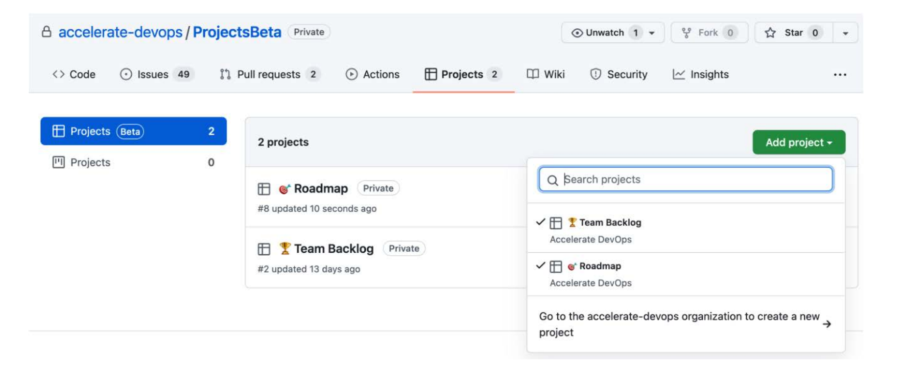

图2.22 - 将项目添加到仓库

GitHub项目是管理工作并根据需求进行调整的非常灵活的解决方案。要了解有关GitHub项目的更多信息，请参见https://docs.github.com/en/issues/trying-out-the-new-projects-experience/about-projects。

项目仍处于测试阶段。但是，已经推出的功能令人印象深刻，在不久的将来，这将是一种最灵活的解决方案，可以轻松地与社区共享个人配置。请关注更新日志中的更新https://github.blog/changelog/label/issues/。

## 第三方集成

如果用户已经熟悉像Jira或Azure Boards这样的成熟解决方案，也可以继续使用这些解决方案。GitHub几乎支持所有可用产品的出色集成。本小节将在这里展示如何与Jira和Azure Boards集成，在GitHub市场上还有许多其他解决方案。

> 这简单吗？
>
> Jira和Azure Boards都是非常好的产品，可以高度定制。如果读者想继续使用当前的工具，请确保在本章中描述的所有内容都适用。操作是否简单？能否将所有工作放入其中？是否从队列中提取工作？是否有WIP限制？流程效率如何？
> 
> 读者可能需要考虑将过程和项目模板调整为更精简的工作方式。转移到新平台总是减少负担的好机会。如果进行集成，请确保不会拖慢速度或增加技术债务。

### Jira

GitHub和Jira都在各自的应用市场中有一个应用程序来连接两。如果用户创建一个新的Jira项目，可以直接在创建过程中添加GitHub（图2.23），也可以稍后在Jira中的Apps|Find new Apps添加它。

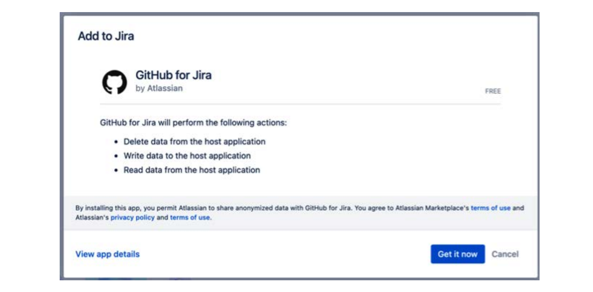

图2.23 - 向Jira项目添加GitHub for Jira

安装很简单，可以访问此链接具体了解：https://github.com/marketplace/jira-software-github。

安装两个应用程序并连接到Jira中的GitHub组织。在GitHub中，用户可以指定选择组织中的所有仓库或仅特定仓库。如果组织有很多仓库，同步可能需要一些时间！

你可以在Jira中的Apps|Manage your apps|GitHub |Get started（图2.24）中检查配置和同步状态：


图2.24 - Jira中的GitHub配置和同步状态

一旦同步处于活动状态，可以通过提及Jira issue的ID来将issue、拉取请求和提交链接到Jira issue。ID始终由项目密钥和表示项的整数组成（例如，GI-666）。

如果在GitHub issue中指定Jira issue[GI-1]和[GI-2]，则文本会自动链接到相应的Jira issue（图2.25）：


图2.25 - 将GitHub issue链接到Jira issue

如果在提交注释中提及Jira issue，将自动链接到Jira issue下的Development（图2.26）。用户还可以深入挖掘提交并查看包含在提交中的更改文件数量。


图2.26 - 在Jira中链接GitHub构件

还可以使用智能提交从提交注释内部执行与Jira issue相关的操作。智能提交具有以下语法：

```bash
<ignored text> <ISSUE_KEY> <ignored text> #<COMMAND> <optional COMMAND_ARGUMENTS>
```

目前，支持三个命令：

- comment：在Jira issue中添加注释。
- time：在Jira issue中添加你工作的时间。
- transition：更改Jira issue的状态。

以下是一些智能提交的示例：

- 以下提交消息将向GI-34issue添加注释“corrected indent issue”：

```bash
GI-34 #comment corrected indent issue
```

- 此提交消息向GI.34添加时间：

```bash
GI-34 #time 1w 2d 4h 30m Total work logged
```

- 此提交消息向GI-66添加评论并关闭该issue：

```bash
GI-66 #close #comment Fixed this today
```

有关智能提交的更多信息，请参见https://support.atlassian.com/jira-software-cloud/docs/process-issues-with-smart-commits。

> 注意！
>
> 只有用户在提交注释中使用的电子邮件地址具有足够的Jira权限，智能提交才会起作用！

Jira和GitHub紧密集成。如果团队已经熟悉Jira，则最好使用Jira并将其集成到GitHub中。

### Azure Boards
Azure Boards与GitHub也有非常紧密的集成，设置非常简单。只需从GitHub市场安装Azure Boards应用程序（参见https://github.com/marketplace/azure-boards），然后按照说明操作即可。

可以在工作项的Development部分（或拥有的任何其他工作项类型）中直接链接GitHub提交和GitHub拉取请求到Azure Boards issue。或者可以使用以下语法引用工作项：AB#<Azure Board问题的ID>（例如，AB#26）。

GitHub链接将显示在带有GitHub图标的卡片上（见图2.27）：


图2.27 - 在Azure Boards中链接GitHub构件

如果在AB引用之前添加了fix、fixes或fixed关键字，则Azure Boards issue将自动转换为Done状态。请参见以下示例：

- 如果提交合并，则以下提交注释将链接到issue666并将该issue切换为已完成：

```bash
Fixes AB#666
Update documentation and fixed AB#666
```

- 以下提交注释将链接issue42和666，但仅将666切换为已完成：

```bash
Implemented AB#42 and fixed AB#666
```

- 关键字仅适用于一个引用。以下提交注释将链接所有三个issue-但只有666将移至已完成：

```bash
Fixes AB#666 AB#42 AB#123
```

- 如果关键字不是直接在引用之前，则不会转换任何问题！

```bash
Fixed multiple bugs: AB#666 AB#42 AB#123
```

用户可以在GitHub的README文件中添加徽章，显示Azure Boards问题的数量。可以从Azure Boards的设置（位于面板上方右侧的小齿轮图标）中的状态徽章部分获取徽章URL。只能显示正在进行中的图标数量或所有项的数量（图2.28）：

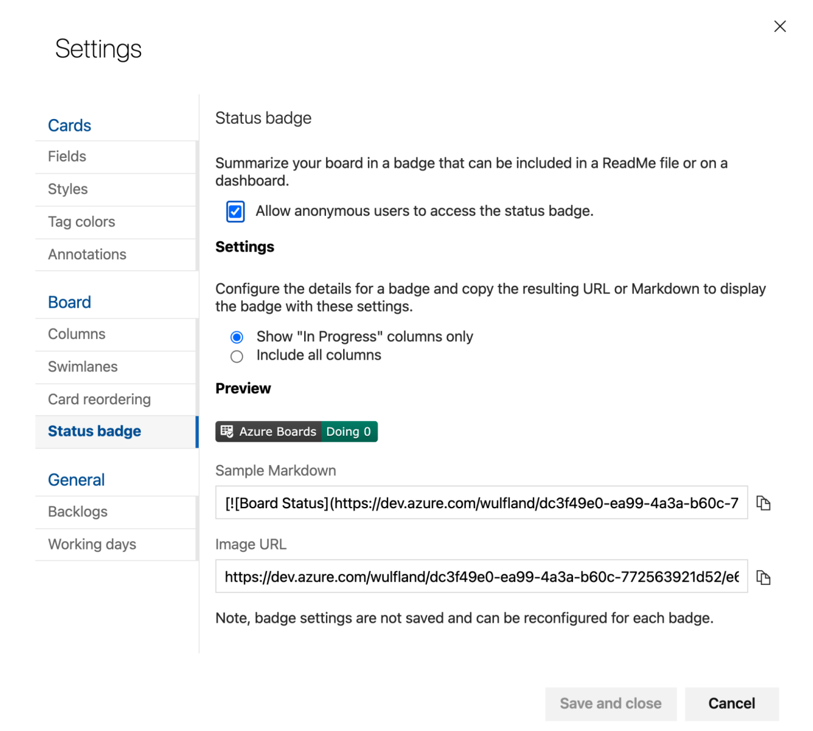

图2.28 - 向GitHub README文件添加徽章

Azure Boards集成设置简单且非常自然。如果团队已经熟悉Azure Boards，则在Azure Boards中使用紧密的GitHub集成是一个不错的选择。

## 案例研究

Tailwind Gears选择了两个团队开始他们的DevOps转型，这两个团队将被迁移到GitHub作为新的DevOps平台。这个战略性的决定是将所有内容都移动到GitHub，并使用GitHub项目和GitHub问题来管理工作。这也使得需要在监管环境下工作的一些团队能够实现端到端的可追溯性。同时，在转移到新平台时，开发流程也应该得到调整。

其中一个试点团队已经使用Scrum一年多了，他们使用Jira来管理他们的待办事项，并以3周的冲刺阶段（sprint）为单位工作。对冲刺阶段的仔细分析显示，在每个冲刺阶段中，有很多问题无法关闭。此外，大多数问题都是从冲刺阶段开始同时处理的。当被问及时，团队报告说他们在冲刺阶段开始时计划了所有的工作，但由于依赖企业的ERP系统，有些工作被阻塞了。当被阻塞时，开发人员开始处理另一个任务。此外，一些开发人员仍然需要为他们的旧项目承担一些职责。他们从帮助台的任务系统中接收任务(ticket)，并必须提供第三级支持。这些任务很难计划，并导致团队中其他依赖这些开发人员工作的开发人员需要等待。

为了在新平台上开始工作，我们将从Jira导入所有未关闭的需求，并将其标记为需求、计划和业务。如果有新的任务出现，我们同意手动添加一个新的问题，并将其标记为错误、未计划和IT。我们创建一个单独的泳道来跟踪这些问题，因为它们通常是具有高优先级的现场问题。为了自动化集成，我们创建了我们的第一个团队问题，并将其标记为基础设施、计划和团队，并将其置于待办事项列表的顶部。

为了减少计划和等待时间，并建立更具拉动性(pull-based)的工作流程，我们同意不计划整个冲刺阶段，而是专注于待办事项列表中前三个需求。团队将这三个项目的工作细分，并为正在进行中的任务建立了一个5个工作项的WIP限制。

第二个团队仍然使用经典的瀑布式开发；他们的需求在IBM Rational DOORS中，他们习惯根据规范文件进行工作。为了转向更加敏捷的方式，团队得到了一些新的团队成员：

- 一位敏捷指导，担任Scrum Master的角色
- 一位需求工程师，担任产品负责人的角色
- 一位来自架构团队的架构师，负责在开发开始之前更新软件架构
- 一位质量工程师，负责在发布应用程序之前进行测试

为了开始工作，我们将需求从DOORS导出并导入GitHub项目中。我们保留DOORS ID以便能够将我们的待办事项追溯回原始需求。

在为第一个需求拆分工作时，我们发现工作量太大，无法在一个冲刺阶段内完成。产品负责人将需求拆分成多个小项，以减少批处理大小。对于最重要的两个项的拆分显示，这些项每个可以在约1周内完成。架构师和质量工程师仍然需要一些等待时间，但团队确信他们有任务可以帮助这两位完成。对于团队而言，这仍然比将工作移交给另一个团队的等待时间更快。

## 总结

背景切换和计划外工作会扼杀生产力。本章学习了如何通过转向精益工作方式来提高工作效率。通过在看板板上建立“拉”而不是“推”，限制在制品(WIP)并专注于完成工作，并减少批处理大小和交接。

本章学习了如何使用GitHub issues和GitHub项目来实现这一目标，以及如果希望继续使用现有的工作管理系统的话，如何集成Jira和Azure Boards。

下一章将更深入地了解团队合作和协作开发。

## 扩展阅读和参考资料

-  Tregubov A.，Rodchenko N.，Boehm B.和Lane J.A.（2017）。任务切换和工作中断对软件开发过程的影响：https://www.researchgate.net/publication/317989659_Impact_of_task_switching_and_work_interruptions_on_software_development_processes
-  Weinberg G.M.（1991年），优质软件管理：系统思维（第1版）。多塞特豪斯
-  GitHub问题：https://guides.github.com/features/issues/和https://docs.github.com/en/issues/tracking-your-work-withissues/about-issues
-  Markdown：https://guides.github.com/features/masteringmarkdown/
-  问题模板：https://docs.github.com/en/communities/usingtemplates-to-encourage-useful-issues-and-pull-requests/about-issue-and-pull-request-templates
-  GitHub项目：https://docs.github.com/en/issues/trying-outthe-new-projects-experience/about-projects
-  GitHub Jira集成：https://github.com/atlassian/github-forjira
-  GitHub Azure Boards集成：https://docs.microsoft.com/en-us/azure/devops/boards/github