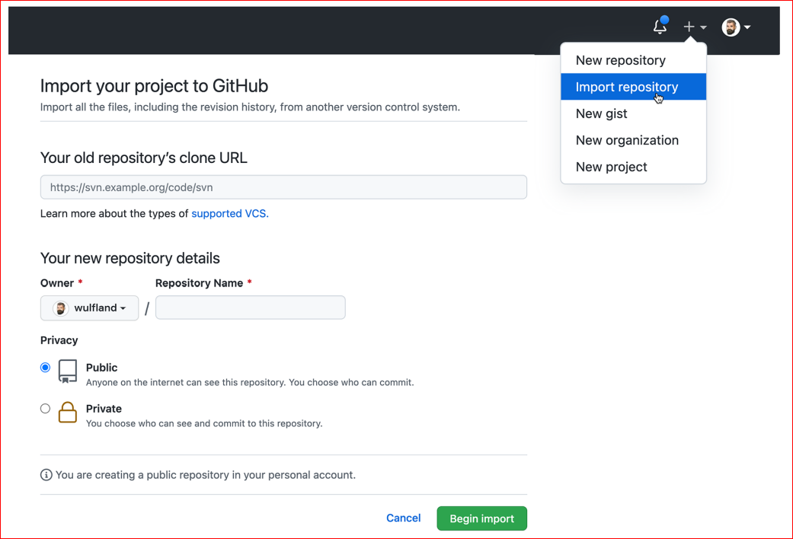

# 21 把代码迁移到 GitHub

若用户不是初创公司，在将迁移到新平台时，则必须考虑现有工具和流程。本章将讨论从不同平台转移到GitHub的不同策略。 

本章包含以下内容：

- 选择合适的迁移策略

- 实现低保真迁移的合规性

- 同步要求以实现平稳过渡

- 使用GitHub企业导入工具从Azure DevOps迁移 

-  使用Valet迁移流水线

  


## 选择正确的迁移策略
在迁移到新平台时，用户有以下不同选项：

- 高保真迁移：尽可能全地迁移到新平台。
- 精简地过渡迁移：仅迁移最基本的必要内容，以便开始在新平台上工作。

高保真迁移到复杂的平台会遇到不同的问题。主要问题是，所有实体之间并不是1：1映射的，且在不同平台上的工作方式也有所不同。如果迁移所有内容，会影响人们使用新系统。数据是针对使用旧流程的旧系统优化的。此外，高保真迁移中的时间、成本和复杂度也不是线性的。试图获得100％的保真度，其复杂性和成本就会增加，通常情况下根本无法实现（参见图21.1）。


图21.1 - 不同保真度的复杂度、时间和成本

精简的迁移方案最优，因为它可以帮助改变行为并最佳地利用新平台。在本书的案例研究中，假设了一种精简的迁移方案：团队从新平台开始，只移动绝对必要的内容。

实际情况介于这两个极端之间。如果想要加速软件交付，则应从精简的迁移开始，但为了在企业中扩展并推广应用，企业需要为团队提供一些迁移路径和工具，使他们快速迁移。此外，还有一些不活跃的项目/产品，企业可能希望将其存档，以便以后重新启用。可以选择保留所有旧系统或迁移它们。


## 实现低保真迁移的合规性

由于合规性的原因，许多客户关心的一个问题是端到端的可追溯性。许多高度管制的行业中，要求必须为所有的需求和最终功能测试提供端到端的可追溯性。低保真迁移的问题在于，可追踪性链将中断。

但这并不意味着唯一的解决方案是高保真迁移。仍然可以进行精简切换，并在必要的时候保持旧系统在只读模式下运行。在新系统中，仍然必须实现端到端的可追溯性。为了保持合规性，用户需要将旧系统的标识符映射到新系统中，以满足跨越两个系统的要求。

在审计时，可以提供两个系统的报告，即旧系统和新系统。对于一些需求，可能必须同时看这两份报告，但如果有允许系统间映射的标识符，这仍将提供有效的可追溯性。

保持旧系统运行所带来的不便通常远小于试图执行高保真迁移，但这取决于很多因素，比如旧系统的许可证。

## 同步需求以平稳过渡

在这种情况下，特别是对于拥有许多不同工具的大企业，一个有趣的选择是用Tasktop (https://www.tasktop.com/)这样的产品在不同平台上同步需求。Tasktop有许多产品的连接器，如Jira、Salesforce、ServiceNow、IBM Rational、IBM DOORS、Polarion ALM、Azure DevOps等等。在工具间同步需求和工作项目可以实现多种用例：

- 在迁移期间同时在旧系统和新系统中工作。这为迁移提供了更多时间，并允许企业在保持完整的可追溯性的同时，将一个又一个团队转移过来。

 - 让不同的角色和团队可以自由地选择使用他们喜欢的工具工作。项目经理喜欢Jira，架构师喜欢IBM Rational，运营偏爱ServiceNow，开发人员想切换到GitHub？通过在这些工具之间同步数据，可以实现这样的工作流。

特别是在多个团队同时工作的复杂环境中，同步需求和工作项目可以帮助优化迁移。

## 迁移代码

迁移到 GitHub 时，最简单的事情就是迁移代码，特别是当代码已经存储在另一个 Git 仓库中时。只需使用 --bare 克隆仓库，确保仓库处于初始状态：

```shell
$ git clone --bare  <URL to old system>
```

接着，将代码推送到仓库：

```shell
$ git push --mirror <URL to new repository>
```

若仓库中已经有代码，则必须添加--force参数以进行覆盖。也可以使用GitHub CLI在推送现有仓库时即时创建一个仓库：

```shell
$ gh repo create <NAME> --private --source <local path>
```

由于在Git中，作者信息是通过电子邮件地址匹配的，所以只需要为所有用户在GitHub上创建用户账户，并为用户账户分配之前Git系统中使用的电子邮件地址。这样，所有作者的信息就能被正确映射了。

此外，还可以使用GitHub导入器导入代码。除了Git，还支持以下类型的仓库：

- Subversion 
- Mercurial
- Team Foundation Version Control (TFVC)

GitHub Importer可以获取源系统的 URL 并创建一个新的仓库。 大于 100 MB 的文件可以被排除在外或添加到 Git 大文件存储空间（LFS）。

要使用 GitHub Importer导入仓库，请点击个人资料图片旁边的加号，选择Import repository（见图 21.2）：



图21.2 - 导入仓库

若是从Subversion迁移过来，可以使用git-svn (https://git-scm.com/docs/git-svn）在Git和Subversion仓库之间同步修改：

```shell
$ git svn <command>
```

若是从Azure DevOps/Team Foundation Server迁移，最好的方法是先从TFVC迁移到Git，再迁移到GitHub。还有一个与git-svn类似的工具：git-tfs（https://github.com/git-tfs/git-tfs）。这也允许企业在Git和TFVC之间同步更改，或直接迁移到GitHub：

```shell
$ git tfs <command>
```

> 注意
>
> Git适用于短期分支，而TFVC则不是。迁移代码时，不应该直接将代码和所有分支迁移过来。应该利用这个机会，从一个新的分支模型开始，进行一个精简切换。将代码迁移到 Git 可以作为保留部分历史的第一步，但在迁移后应该调整分支模型。

将代码迁移到GitHub算不上挑战。有很多工具可以提供帮助。真正的挑战在于如何从旧的分支模式转变为更适合新平台、加速软件交付性能的新的分支模式（见第11章，基于干路径的开发）。

挑战在于那些不直接存储在 Git 中的东西：拉取请求、关联的工作项和流水线。这些都需要比 Git 仓库本身更多的关注。

## 从 Azure DevOps 或 GitHub 迁移

如果企业从GitHub迁移到GitHub或从Azure DevOps迁移到GitHub，可以使用GitHub Enterprise Importer（GEI）（参见https://github.com/github/gh-gei）。它是GitHub CLI的一个扩展，可以使用扩展安装来安装：

```shell
$ gh extension install github/gh-gei
$ gh gei --help
```

可以将个人访问令牌（PAT）设置为环境变量，以便对源系统和目标系统进行认证：

```shell
$ export ADO_PAT=<personal access token>
$ export GH_SOURCE_PAT=<personal access token>
$ export GH_PAT=<personal access token>
```

也可以使用--github-source-pat和--ado-pat参数将它们传递给generate-script。

要创建迁移脚本，根据是从GitHub还是Azure DevOps迁移，执行以下命令之一：

```shell
$ gh gei generate-script --ado-source-org <source> --github-target-org <target>
$ gh gei generate-script --github-source-org <source> --github-target-org <target>
```

这将生成一个PowerShell脚本migrate.ps1，可用于实际迁移。该脚本将调用gh gei migrate-repo以查找Azure DevOps或GitHub组织中的所有团队项目。这将为实际的迁移工作排队。然后执行gh gei wait-for-migration --migration-id，并利用上一个命令的输出来获得状态。

GEI目前支持以下内容： 

- Azure DevOps（ADO） 
- GitHub企业服务器（GHES）3.4.1+ 
- GitHub企业云

对于 Azure DevOps，以下内容将被迁移：

- Git源代码
- 拉取请求
- 拉取请求的用户历史记录
- 拉取请求上的工作项链接
- 拉取请求上的附件
- 仓库的分支保护

对于GitHub企业服务器和云，以下项目可以额外迁移：
- Issues（问题）
- Milestones（里程碑）
-  Wikis（维基
- 仓库级别的项目板
- GitHub Actions 工作流（不包括密钥和工作流运行历史）
- 提交评论
- 活跃的webhooks
- 仓库设置
- 分支保护
- GitHub页面设置
- 上述数据的用户历史

更多信息请参阅https://docs.github.com/en/early-access/github/migrating-with-github-enterprise-importer。请注意，GEI仍处于测试阶段，可能会经常变化。

如果用户使用的是GitHub企业服务器，也可以使用ghe-migrator导入数据，可以从另一个服务器实例，或从GitHub企业云导入。有关 GitHub 企业服务器上的数据导出和导入的更多信息，请参阅 https://docs.github.com/en/enterprise-server@3.4/admin/user-management/migrating-data-to-and-from-your-enterprise/about-migrations。


## 迁移流水线

可以使用一个叫Valet的工具将流水线迁移到GitHub Actions。其支持以下来源：

- Azure DevOps（经典流水线、YAML流水线和发布）。

- Jenkins
- Travis CI
- Circle CI
- GitLab CI


Valet是一个基于Ruby的命令行工具，使用Docker进行安装。

>注意
>
>当前Valet仍处于私有测试阶段，随时可能变更。Valet不是一个能够完全迁移所有内容的100%有效解决方案！它是可扩展的，用户必须编写自己的转换程序，可能还需要在迁移后做一些手工步骤。它是可扩展的，需要编写自己的转换器，并且在迁移后可能仍需做一些手工步骤。

Valet的分发是通过拉下一个容器镜像。并使用两个脚本valet和valet-update与其交互来实现的：


```shell
$ docker pull ghcr.io/valet-customers/valet-cli
```

若获得私人测试的访问权限，需使用用户名和带有read：packages访问权限的PAT令牌对ghcr.io进行身份验证：

```shell
$ docker login ghcr.io -u <USERNAME>
```

最佳方法是将Valet安装为GitHub CLI扩展，但仍需在机器上运行Docker，并对注册表进行认证。要将Valet安装为GitHub CLI扩展，请执行以下命令:


```shell
$ gh extension install github/gh-valet
```

现在，用户可以使用gh valet update轻松更新Valet。

Valet使用环境变量进行配置。最简单的方法是在Valet的文件夹中的.env.local文件中设置这些变量。例如，这是将流水线从Azure迁移到GitHub企业云的配置：

```shell
GITHUB_ACCESS_TOKEN=<GitHub PAT>
GITHUB_INSTANCE_URL=https://github.com
AZURE_DEVOPS_PROJECT=<project name>
AZURE_DEVOPS_ORGANIZATION=<org name>
AZURE_DEVOPS_INSTANCE_URL=https://dev.azure.com/<org>
```
Valet有三种模式：

- gh valet audit将分析所有支持的流水线的源下载信息。它将创建一个审计总结报告（Markdown格式），包括所有发现的流水线、构建步骤和环境。用户可以使用审计来规划迁移。
- gh valet dry-run会将流水线转换为GitHub Actions工作流文件并输出YAML文件。
- gh valet migrate将把流水线转换为GitHub Actions工作流文件，并在目标GitHub仓库中创建一个包含工作流文件修改的拉取请求。
- gh valet forecast会基于流水线的历史利用率预测GitHub Actions的使用情况。

要使用先前的配置运行审计并创建报告，只需运行以下命令：

```shell
$ gh valet audit azure-devops --output-dir .
```

这将为每个支持的流水线生成一份 audit_summary.md报告和三个文件包含配置的 .config.json 文件，包含转换为 YAML 的源流水线的 .source.yml 文件，以及一个包含转换后的 GitHub Actions工作流的 .yml 文件，它们将稍后进行迁移。要执行一条流水线的迁移，运行valet migrate：

```shell
$ valet migrate azure-devops pipeline \
 --target-url https://github.com/<org>/<repo-name> \
 --pipeline-id <definition-id>
```

请记住，这只是尽力迁移！不是所有内容都可以迁移。例如，以下元素不能被迁移：

- 密钥
- 服务连接
- 未知任务
- 自托管运行器
- Variables from Key Vault（Key Vault 中的变量）

用户可以为流水线步骤编写自己的转换器，无论是未知步骤还是覆盖Valet的现有行为。创建一个新的Ruby文件（.rb），并以以下格式添加函数：

```shell
transform "taskname" do |item|
end
```

对于Azure DevOps任务，其名称包含版本号。可以使用puts item将其输出到控制台以查看项目对象所包含的内容。

下面是一个转换器示例，它将覆盖DotNetCoreCLI任务版2，并用Bash的运行步骤替代它，该步骤使用globstar语法遍历所有.csproj文件，并使用源流水线的参数来执行命令：

```shell
transform "DotNetCoreCLI@2" do |item|
 if(item["command"].nil?)
 item["command"] = "build"
 end
 {
 shell: "bash",
 run: "shopt -s globstar; for f in ./**/*.csproj; do dotnet 
#{ item['command']} $f #{item['arguments'] } ; done"
 }
end
```

如果要使用自定义的转换器，可以使用--custom-transformers参数。可以指定单个转换器或多个转换器的整个目录：

```shell
$ valet migrate azure-devops pipeline \
 --target-url https://github.com/<org>/<repo-name> \
 --pipeline-id <definition-id> \
 --custom-transformers plugin/*
```

每个工作流程系统都是不同的! 确保花时间分析希望流水线如何转换，以优化新平台，而不是仅仅把所有内容都迁移到新平台。如果已经考虑清楚，那么Valet将是一个很好的工具，可以帮助更快地将团队转移到GitHub。


## 总结

GitHub 是一个复杂、快速发展的生态系统，对任何种类的迁移来说都是具有挑战性的。在迁移过程中，应该关注新平台的生产力优化，而不是把所有东西都迁移过去，让团队处理混乱。由于组织的规模和源平台不同，迁移过程可能完全不同。

本章介绍了GitHub 和合作伙伴提供的可以帮助完成迁移的不同工具。

下一章将讨论能够实现最佳合作团队和仓库的组织方式。

## 拓展阅读

以下链接可帮助读者获取有关本章讨论主题的更多信息：

- GitHub Importer: https://docs.github.com/en/get-started/importing-your-projects-to-github/importing-source-codeto-github/importing-a-repository-with-github-importer 
- GitHub Enterprise Importer CLI: https://github.com/github/gh-gei and  https://docs.github.com/en/early-access/github/migratingwith-github-enterprise-importer 
- GitHub Enterprise Server Importer: https://docs.github.com/en/enterprise-server@3.4/admin/user-management/migratingdata-to-and-from-your-enterprise/about-migrations 
- ghe-migrator: https://docs.github.com/en/enterprise-server@3.4/admin/user-management/migrating-data-to-and-from-yourenterprise/about-migrations 
- Tasktop: https://www.tasktop.com/ 
- git-svn: https://git-scm.com/docs/git-svn 
- git-tfs: https://github.com/git-tfs/git-tfs
