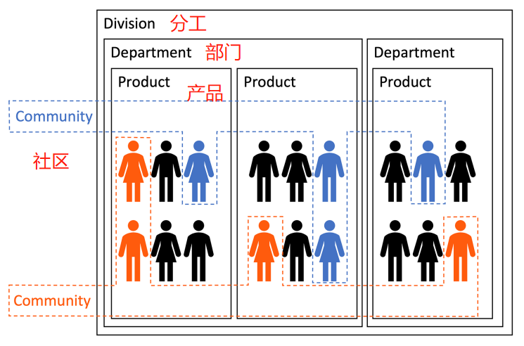
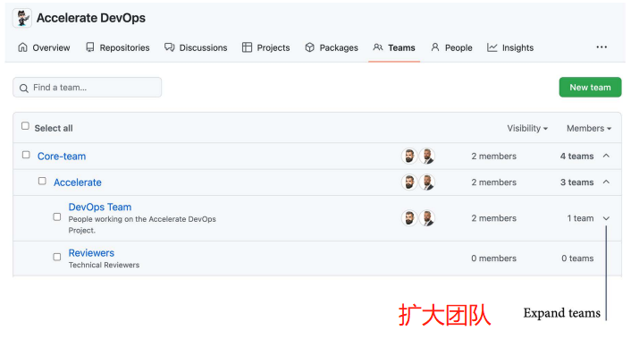
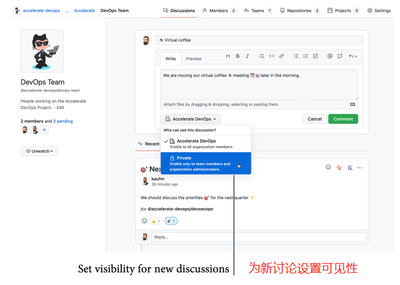
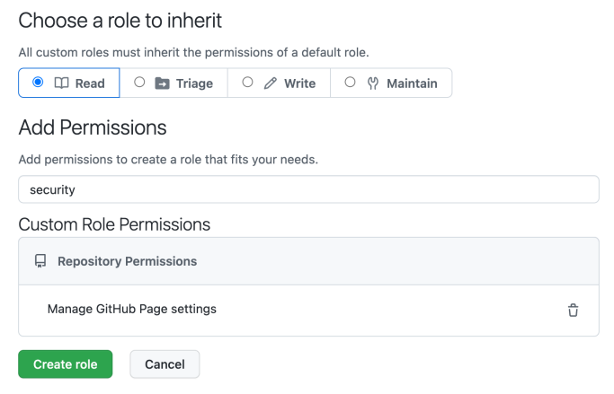
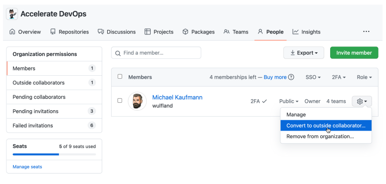

# 22 **组织团队**

在这一章中，读者将了解到将资源库和团队结构化为组织和企业的最佳实践，以促进协作和方便管理。

在本章中，我们将介绍以下内容：

- GitHub 的作用域和命名空间
- 构建 GitHub 团队
- 基于角色的访问
- 自定义角色
- 外部合作者
- 

## **GitHub的作用域和命名空间**

GitHub 的主要实体是仓库。仓库可以为一个用户或一个组织创建。仓库的URL将采用以下格式：

```shell
https://github.com/<username>/<repository>
https://github.com/<organization>/<repository>
```

对于GitHub企业服务器，开发者必须用服务器的URL替换<https://github.com>。一个平台上的用户和组织名称必须是唯一的，因为Github使用了一个命名空间，仓库的名称在其中必须是唯一的。

### **GitHub企业**

在GitHub中，企业是多个组织的集合。组织名称仍然必须是唯一的，因为企业不是一个命名空间。每个企业有一个用来指代的URL slug，看起来像这样:

```shell
https://github.com/enterprises/<enterprise-slug>
```

如果读者拥有的组织是通过发票支付的，那么你可以在**设置->计费和计划**下升级为企业。否则，读者必须联系GitHub的客服。

一个GitHub企业有三个角色:

- **所有者**：对企业有完全的管理权，但对组织没有管理权。
- **成员**：成员或外部合作者，至少有一个组织的访问权。
- **计费管理**：只能查看和管理计费信息。

有一些设置可以在企业级为所有组织配置，如**SAML认证**，**SSH证书授权**，或**IP准许列表**。还有一些企业级的webhooks，读者可以访问整个企业的审计日志。审计日志流向云存储、Splunk或Azure Event Hubs的功能只在企业级可用，但大多数设置都是围绕**计费**和**许可**进行的。

读者还可以为许多在组织层面配置的设置制定策略。如果一个策略已经被设置，组织的所有者就不能改变设置。如果一个策略还没有被定义，该设置可以由组织的所有者来配置。

### **Github组织**

管理存储库和团队的主要方式是使用组织。它们也可以在没有企业的情况下存在，而且可以在不同的企业之间移动它们。组织机构并不是作为一种自助服务发放给团队来组织自己。有些公司有超过2000个组织——这是一个很大的问题，特别是对于管理整合。例如，GitHub应用程序只能在组织层面配置，而不是在企业层面。如果读者想配置与Jira实例的集成，那么你必须为所有组织做这件事，而不能在企业层面上进行配置。

对于大多数客户来说，一个组织应该是足够的。如果读者的公司有不同的法律实体，必须分开，那么可以使用多个组织。除此之外，如果读者想把开放源代码和内部源代码分开。然而，你不应该为所有部门设立一个组织。最好是用团队来做这件事。

一个组织有以下角色:

- **所有者**：拥有对团队、设置和资源库的完全访问权
- **成员**：可以看到成员和非秘密团队，以及创建存储库
- **外部合作者**：这些人不是该组织的成员，但他们可以访问一个或多个资源库

组织有项目、包、团队和存储库。可以为存储库配置许多设置。如果读者不在组织层面配置这些设置，这些设置可以在版本库层面设置。

构建组织的主要方式是使用团队。我们将在下一节中讨论这些问题。


## **构建GitHub团队**

团队不仅仅是对资源库授予权限的更方便的方式，允许更快的加入和退出。它们还可以用来分享知识和通知某些群体的变化。

团队进行讨论，开发者可以看到他们的资源库和项目。团队可以有以下两种显示方式:

- **可见的**:一个可见的团队可以被这个组织的每个成员看到和提及。
- **私密的**:一个秘密的团队只能被其成员看到，并且不能被嵌套。

一个团队存在于一个组织的命名空间中。这意味着该团队的名称在组织内部必须是唯一的。可以使用以下语法提及一个团队或将其添加为代码所有者:

```bash
@<organization>/<team-name>
```

？？（这一句不太顺：==可以使用团队来反映公司或集团的结构，通过层层递进的访问权限，并通过嵌套它们来提及==）。可以通过在创建一个新的团队时指定一个父团队来做到这一点。这使得新团队成为一个子团队。子团队也可以是父团队——这样，可以创建一个深层次的层次结构。团队从他们的父团队继承权限和通知，但不是反过来。

通过嵌套团队，可以创建公司的结构。可以为所有员工、每个部门、每个部门和每个产品团队创建一个团队（**垂直团队**）。也可以为**横向团队**使用团队——兴趣小组，如实践社区（_见图22.1_）：



图22.1 - 使用团队构建组织

这使得读者可以在价值流团队中分享知识和所有权。如果适合你的社区结构，读者也可以嵌套横向团队。

嵌套的团队可以在一个组织的**Teams**标签中展开（_见图22.2_）：



图22.2 - 一个组织的Teams标签中的嵌套团队

团队有讨论的页面。组织成员可以创建并参与团队的讨论，但团队也可以有私人讨论，对组织的其他成员不可见（_见图22.3_）：



图22.3 - 带有讨论的团队页面

团队可以被提及并被分配为审查员和代码所有者。它是一个非常强大的工具，可以简单地构建组织。但要尽量保持简单，使用人们容易理解的名称。拒绝臃肿，保持简单！


## **基于角色的访问**

在版本库层面，可以给团队或个人授予基于角色的访问权。读者可以使用以下默认角色之一：

- **读取**：读取和克隆存储库，打开并评论问题和拉动请求。
- **审视**：读取权限，以及管理问题和拉取请求。
- **编写**：筛选权限，加上阅读、克隆和推送到存储库。
- **维护**：写权限，加上管理问题和拉取请求。写入权限，加上管理问题、拉取请求，以及配置一些储存库设置。
- **管理**：对存储库的完全访问权，包括敏感和破坏性的操作。

请注意，"**读**"的角色不仅仅可以做"读"!它可以打开并评论问题和拉取请求。**分流**和**维护**是开源项目中的典型角色。它们在企业场景中并不那么常用。

开发者可以为一个组织设置一个基本权限，即读、写或管理。这将授予所有成员对所有存储库的相应权限。外部合作者不继承基本权限（详见<https://docs.github.com/en/organizations/managing-access-to-your-organizationsrepositories/setting-base-permissions-for-an-organization>）。


## **自定义角色**

读者可以在组织设置中的**存储库角色**（</settings/roles>）下自定义角色。点击**Creat a role**为新角色指定一个名称和描述。然后，选择一个默认角色来继承权限，并向其添加权限（_见图 22.4_）:



图22.4 - 在GitHub中创建自定义角色

权限是分类的。因此，如果在搜索框中输入安全，列表中会显示所有与安全有关的可用权限。

权限可在以下类别中使用:

- 讨论
- 问题
- 拉取请求
- 存储库
- 安全性

请注意，并不是所有的东西都是可以配置的。例如，在撰写本报告时，没有针对GitHub包的特定权限。

如果一个人被赋予不同级别的访问权限，较高的权限总是覆盖较低的权限。如果一个人被赋予了多个角色，GitHub上会在拥有**混合角色**的人旁边出现一个警告。

再说一遍：尽量不要在自定义角色方面做得太疯狂。也就是说尽可能地保持简单。


## 外部合作者

**外部合作者**是指不是你的组织的成员，但可以访问你的组织的一个或多个存储库的人。

> **注意事项**：
>
> 在私有存储库中添加外部合作者将消耗你的一个付费许可证

外部合作者不是读者组织的**成员**。他们看不到内部资源库，也不能继承基本权限。

开发者不能在组织层面上邀请外部合作者——你只能邀请成员加入组织，然后将他们转化为外部合作者（_见图22.5_）:



图22.5 - 将成员转换为外部合作者

作为版本库管理员，如果读者在**Settings|Collaborators and teams**下**添加人员**，如果他们已经属于组织，他们将被自动添加为成员。如果不是，他们将被添加为外部合作者。

外部合作者是一种很好的方式，可以轻松地与合作伙伴和客户进行合作，而不需要他们成为你的组织的一部分。但请记住，如果使用**企业管理用户**，这将不起作用。如果启用了**SAML单点登录**，外部合作者将绕过这一点。这就是为什么组织所有者可以在组织的设置中阻止存储库管理员邀请外部合作者进入存储库的原因。

## **总结**

在本章中，读者了解了在企业中构建组织、资源库和团队的最佳实践。我们谈到了嵌套团队，为兴趣小组使用团队，基于角色的访问，以及外部合作者。

在最后一章，我们将把本书的所有内容放在一起，指导读者使用GitHub来改造企业，并利用它来加速企业的DevOps。

## **拓展阅读**

请参考以下链接和进一步的GitHub文档，以了解本章所涉及的更多主题：

- _关于团队_: <https://docs.github.com/en/organizations/organizing-members-into-teams/about-teams>
- _关于基础权限_: <https://docs.github.com/en/organizations/managing-access-to-your-organizations-repositories/setting-base-permissions-for-an-organization>
- _关于自定义角色_: <https://docs.github.com/en/enterprise-cloud@latest/organizations/managing-peoples-access-to-yourorganization-with-roles/managing-custom-repository-rolesfor-an-organization>
- _关于外部合作者_: <https://docs.github.com/en/organizations/managing-access-to-your-organizations-repositories/addingoutside-collaborators-to-repositories-in-your-organization>
- _关于管理存储库的访问_: <https://docs.github.com/en/repositories/managing-your-repositorys-settings-andfeatures/managing-repository-settings/managing-teams-andpeople-with-access-to-your-repository#inviting-a-team-orperson>
