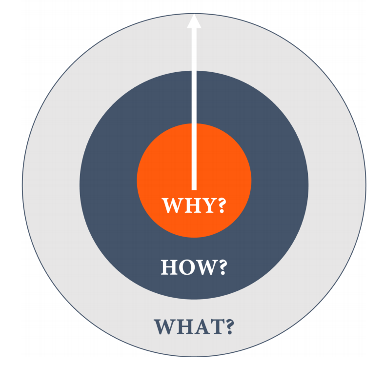
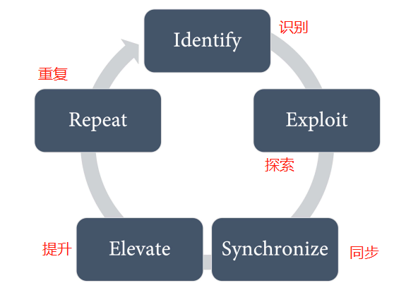
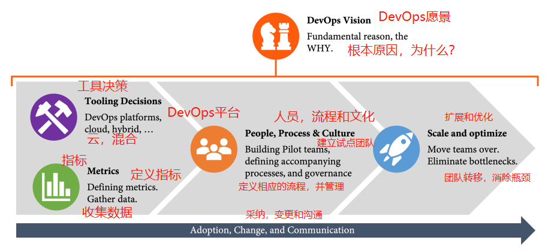

# 23 **企业转型**

在最后一章,本书将讨论企业转型。本章节将解释如何将本书中所阐述的所有内容结合在一起，来将读者的企业转变为一个具有工程文化并且可以提高开发速度的企业。

本章节将讨论以下主题：

- 转型失败的原因
- 从“为什么？”开始
- 数据驱动的转型

## **转型失败的原因**

软件是每个行业中每个产品和服务的核心——从客户体验到供应链管理（*见第1章，重要的指标*）。这意味着很多企业必须转型，成为数字化的高性能公司，但许多转型都失败了。角色被重命名，管理层被重组，托管被重命名为私有云，但往往文化和绩效并没有改变。转型失败的原因有很多，本章节会在这里给大家举几个例子。

### **假设您的公司或行业是特殊的**

我遇到的许多客户都认为他们很特殊，但事实并非如此。而且，我很抱歉地说，很可能您的公司和行业都不特殊。至少，在涉及到数字化转型时不是这样。如果您的产品有缺陷，那它会杀人吗？汽车、飞机、卡车、医疗器械等也一样。这些产品生产的所有零件也是如此。它们没有什么特别的。您必须遵守某些标准吗？您制造军用产品吗？您是公开交易的吗？您为政府工作吗？无论什么让您认为您的公司与众不同，很可能有很多公司面临着与你相同的挑战，在DevOps转型方面，同样的规则也适用于他们。

如果你看看第1章中提到的研究，你会发现它们适用于所有公司：从小型初创企业到大型企业，从尖端互联网公司到高度受监管的行业，如金融、医疗和政府（*Forsgren N.，Humble，J.，&Kim，G.，2018，第22页*）。

但这实际上是一件好事：这意味着你在自己的转型过程中可能面临的许多问题已经被其他人解决了。你可以从他们的失败中吸取教训，而不必亲自经历。

### **没有紧迫感**

转型的最大障碍是自满情绪。如果你的企业中的人感到自满，他们将倾向于抵制变革，继续*照常工作*。

你必须建立一种真正的紧迫感，让人们现在就解决关键问题。在这种情况下，紧迫性并不意味着来自管理层的压力会造成焦虑。真正的紧迫感应该促使人们带着获胜的坚定决心去改变——而不是带着对失败的焦虑。（*John P.Kotter，2008*）。

如果没有真正的紧迫感，人们将抵制转型，更有可能保持他们以前的行为。请注意，在一个组织的不同级别，紧迫感可能出于完全不同的原因。管理层可能会感受到来自市场的压力，以及缺乏对频繁发布的反应的敏捷性。工程师可能会感到技术短板的压力，以及由于旧的流程和工具，怎么吸引和留住人才的问题。重要的是，要用一个清晰的愿景将这些故事与一个共同的根基课程联系起来。只有当你设法将不同的紧迫感整合成一股朝着同一方向前进的力量，你才能确保不同的力量不会自我抵消。

### **没有清晰的愿景**

更换工具、流程和角色是很容易的，但改变行为、文化和故事却很难。如果没有清晰的愿景，转型将不会产生预期的结果。

如果我听到客户说*我们不是微软或谷歌，或者我们不是一家尖端的互联网公司*，这告诉我，他们缺少一个清晰的愿景。如果你的愿景明确表明你想成为行业的数字化领导者，或者从产品公司转变为服务公司，人们就不敢说与之相悖的话。

推动转型的一个好愿景是明确而有力地说明所有转型的方向（*John P.Kotter 2012*）。

我认为值得注意的是，DevOps转型并不总是由高层管理层驱动的。我知道很多公司的DevOps转型是由各个部门甚至团队推动的。尽管如此，同样的规则也适用——您需要对团队或部门中的团队有一个清晰的愿景，并建立一种紧迫感，以确保转型成功。

### **障碍阻碍你的进步**

当开始转型时，许多障碍会阻碍您的转型。我经常遇到的好例子是某些行业的某些规定。许多规定，如ISO26262或GxP，提出了软件工程的**V-Model**。V-Model基于**瀑布模型**，因此它基本上与我们研究了很多年的DevOps中所学到的一切相矛盾。如果您坚持保持瀑布模型，您的DevOps转型很可能会失败，但这是由于您对规定的内部解释。如果您仔细观察他们，您会发现他们只是坚持最佳实践。如果您的实践优于推荐的实践，您可以证明这一点，并仍然可以通过审核。

读者会遇到的大多数障碍都是由读者的组织造成的，例如，您的组织架构、严格的工作类别、流程，或者工作委员会和管理层之间的战壕战。不要让这些障碍阻碍您的转变。

### **缺少帮助**

咨询师在许多公司的声誉很差，主要是因为糟糕的经历。我曾经帮助一位客户将产品数字化。客户习惯于按照瀑布模型做任何事情，我向他们介绍了Scrum和CI/CD。我们进行了一些培训，并在接下来的几年中成功地使用了敏捷开发。两年后，管理层选择了一家昂贵的顾问公司来引入Scrum。他们基本上使用相同的演示文稿，讲着我两年前给大家讲过的故事。这种咨询会导致了不好的声誉。

但是，如果您想学习一项新的运动，您不仅仅需要购买设备和在YouTube上观看一些视频。您要加入一个俱乐部或为自己找一个教练来指导您。体育不仅仅是知识和工具——而是培养技能。而如果没有一个有经验的教练，在某些运动中您很难甚至不可能取得成功。

在企业中培养技能和能力也是如此。从更有经验的人那里获得帮助并不可耻，他们可以指导你完成转型。基于您节省的时间和精力，帮助很有可能不是昂贵的，更不用说失败的代价了。

## **从“为什么？”开始**

要使转型成功，读者需要清晰的愿景和紧迫感。愿景应准确、引人注目、简短，并且应该激励人们去遵循它。为了传达愿景，您可以遵循*黄金圈*（*Simon Sinek 2011，第38页*），从内到外进行沟通（*见图23.1*）：

图23.1 – 传达愿景应从“为什么？”开始

让我们更详细地了解黄金圈：

- **为什么？**：贵公司将进行转型的原因。这给了它一个目的，并建立了一种紧迫感。为什么有人会在意？
- **怎样做？**：您将如何在转型过程中取得成功？
- **做什么？**：您想要改变的现实。你在做什么？

### **目标驱动的任务**

千万不要低估愿景的力量！如果您是一家内燃机汽车制造商，那么您向电动汽车的转型并不容易，这个过程会存在阻力，因为人们会害怕失去工作的动力。

如果要成功，您需要清晰的愿景，并且需要传达**为什么？**——正如大众汽车集团在2019年的*goTOzero*任务声明中所述，该声明集中于四个主要行动领域：气候变化、资源、空气质量和环境合规。

到2050年，整个**大众汽车集团**都希望实现资产负债表的二氧化碳中和。到2025年，该公司计划将其车队的碳足迹在整个生命周期内比2015年减少30%（*大众汽车 2019*）。

这完美地解释了**为什么？**，确立了紧迫性，并符合他们的整体更新的愿景：*使这个世界成为一个移动的、可持续的、所有公民都能使用的地方。*

同样，**梅赛德斯-奔驰**在2019年的 *“2039年雄心”* 声明中表示，他们的目标是在未来20年内实现汽车车队和生产的碳中和（*Mercedes-Benz Group Media 2019*）。

当您将一家产品公司转变为一家软件或服务公司时也是如此。即使你只是从一个瀑布模型组织转变为一个DevOps组织，如果你不能描绘出一个理想的未来，并解释*为什么*你必须进行转型，人们也会害怕这种变化，那么就会有阻力。

### **建立工程文化**

拥有目标驱动的愿景将帮助您在转型过程中建立一种**工程文化**：一种包容和安全的组织文化，培养人才，并由共享和平等一起驱动（*de Vries，M.，&van Osnabrugge，R.2022*）。

这是一种文化，当人们觉得有什么不对劲时，他们可以放心地说出来，人们可以放心地进行实验，毫无恐惧地进行创作，每个人都感到受欢迎和安心——不受传统、性别或宗教的影响。

组织文化是一组共识，指导组织内的行为（*Ravasi，D.&Schultz，M.2006*）。这就是为什么很难改变它的原因。创建带有价值观和使命陈述的PPT幻灯片可能会影响文化，但可能不会影响管理层打算这样做的方式。

作为一名工程师，您可能会问自己为什么组织的文化对你很重要。这不是管理层的任务吗？然而，这种文化是组织中每个人的假设和行为的结果，这意味着每个人都可以改变它。作为一名工程师，您应该意识到您的文化，如果您发现有问题，您应该大声说出来。然后开始做正确的事情，并且讲述正确的故事。

文化是在企业行为中根深蒂固的，并且文化使用一些具有更深含义的小语录和原则。它们很容易记住，并鼓励人们做正确的事情。以下是一些在具有优秀工程文化的公司中经常听到的例子：

- *请求原谅，而不是允许*：鼓励人们做正确的事情，即使这违反了当前的规则或流程。
- *建立一种文化，并且让它运转起来*：为构建的东西建立端到端的责任和所有权。
- *尽早失败，快速失败，经常失败（或快速失败，向前滚动）*：尝试尽早快速失败，而不是让一切都100%有准备。
- *拥抱失败*：鼓励人们进行尝试和承担风险，并确保从失败中无责地学习。*承担责任，不要责怪他人*。
- *协作而非竞争或合作而非对抗*：促进跨组织边界以及与客户和合作伙伴的协作。
- *修复*：鼓励人们拥有所有权并修复问题，而不仅仅是抱怨，但你必须确保创新不被压制。确保人们也有能力真正解决他们抱怨的问题
- *对待服务器就像对待牛，而不是宠物*：鼓励人们将*一切自动化*。
- *如果这很痛苦，那就多做一些*：激励人们去实践那些难以培养技能的事情。这个短语经常用于发布或测试应用程序。

这些只是几个例子。当您改变您的文化并建立DevOps时，会出现更多的故事和说法。

好的工程文化不仅仅是管理层的责任。他们必须让它发生并提供愿景，但最好的文化是由工程师自己在转型过程中创造的。

## **数据驱动的转换**

如果您希望能够转型成功，那么衡量一个正确的指标并且证明转型确实比之前产生了更好的结果是至关重要的。这就是为什么，在*第1章“重要的指标”*中，我介绍了您可以收集的数据点。您可以通过这些数据点来了解首先要优化哪些内容，并实现小的成功。这将帮助到您，让每个人都保持继续进行DevOps转型的动力。我们应该始终首先衡量正确的数据。优化不受约束的内容不仅是在浪费资源，甚至可能产生负面影响。让我们以在应用程序中添加缓存为例，而无需证明操作一开始就减慢了系统的速度，或者在缓存某些数据时可以更快。缓存带来了复杂性，同时也是错误的来源。所以，也许您根本没有优化系统，而是通过基于假设的工作使系统变得更糟。您的DevOps实践也是如此。

### **约束理论**

**约束理论（TOC）**基于系统理论。假设如果没有限制约束，系统的吞吐量将是无限的。TOC试图在当前约束条件下使得系统的吞吐量最大化，或者通过减少这些约束条件来优化系统。

解释这一理论的典型例子是高速公路（*Small World 2016*）。假设我们有一条五车道的高速公路，但有两个建筑工地限制了两车道的通行能力（*见图23.2*）：

图23.2–车辆较少的高速公路，受其限制

交通流通过约束条件，但这仅在一定的吞吐量内有效。如果汽车太多，它们将开始相互影响并使彼此减速，从而导致交通堵塞（*见图23.3*）：

图23.3–如果吞吐量过高，则会使流量停止

为了优化最大的交通流量，您必须将交通量限制在最大限度的容量内（*见图23.4*）：

图23.4 – 最大流量等于约束能力

优化最大约束以外的任何其他约束都不会导致任何改进。许多城市都试图在隧道前后增加车道，但基本上没有改善交通流量或减少交通堵塞。对于您的价值流也是如此————优化除最大约束之外的任何东西都不会带来任何改进。

### **除瓶颈**

TOC提供了消除约束的五个重点步骤（*见图23.5*）：

图23.5 – 识别和消除约束的五个重点步骤

五个步骤的更多细节如下：

- **识别**：识别限制您当前吞吐量的约束
- **探索**：提高约束的吞吐量
- **同步**：审查系统中的其他活动并使其处于从属地位，确保它们一致并以最佳方式支持约束
- **提升**：尝试消除约束并解决问题的根本原因
- **重复**：通过确定限制当前吞吐量的下一个约束条件，持续改进系统

系统地消除工作流程中的瓶颈是成功DevOps转型的关键！

### **DevOps是一个持续改进的旅程**

DevOps是一个通过消除瓶颈来不断拓展软件交付性能边界的旅程。在他们自己的DevOps转型的开始阶段，微软展示了一些不同地区的进站视频，从1950年的印第安纳波利斯（67秒）到2013年的墨尔本（2.96秒）。它是DevOps的一个很好的比喻，通过自动化和优化流程不断提高性能。

*DevOps是一个人员、流程和产品的联盟，能够为最终用户持续提供价值（Donovan Brown 2015）。*

它是一种研究、开发、协作、学习和所有权的工程文化，只有当您将所有方面都结合起来时，它才能发挥作用。您不能只选择DevOps的一个方面，并在没有其他方面的情况下实现它。

只有当读者知道最大的瓶颈时，才能改进一个与流量有关的系统。试图优化其他事情不会产生任何结果，而且是浪费时间和资源。这就是为什么执行数据驱动的转换并衡量正确的指标以持续监控您的改进是否真正产生预期结果非常重要。找出一个瓶颈，利用它，改进它，然后重复它。

### **为价值流一致的团队进行优化**

在本书中，我没有讨论过任何**DevOps团队拓扑**（*Matthew Skelton 2013*）。我看到它们经常被用于更多IT驱动的转型中，在实现更高的DevOps成熟度（*Martyn Coupland 2022，第27页*）后，开始您的转型之旅是很常见的。相反，我专注于**价值流一致**的团队（*见第17章，团队赋权*）

您的DevOps之旅应该从他们开始，并优化一切使它们能够提供价值。这将自动导致**开发人员首先思考**（开发人员是这里提供价值的工程师）。如果您实施数据驱动的转换，并通过消除瓶颈实现价值优化，则会出现平台团队或启用团队等拓扑结构。没有必要提前计划。DevOps组织应该是一个自我完善的系统，所以一旦你达到了这一点，其余的都会很好地到位。

成功的数据驱动DevOps转换有三个主要阶段（*如图23.6所示*）：

图23.6–数据驱动DevOps转型的阶段

各阶段的更多详情如下：

- **度量标准**：首先定义度量标准并收集数据（*参见第1章，无光泽的度量标准*）。
- **工具决策**：您必须做出一些基本的工具决策。在本书中，我假设GitHub是DevOps平台，但关于云的使用和与当前治理流程的一致性，还有更多的决定要做。
- **人员、流程和文化**：仔细挑选您的试点团队，通过将他们的工作方式转变为**精益管理**和**更高的协作**，将他们带到新平台。教授并使他们能够采用**工程DevOps实践**，如自动化和基于主干的开发，并使他们能以**保密的方式频繁发布**。这些指标应该迅速提高。这些都是你保持每个人积极性所需的快速胜利。
- **扩展和优化**：随着试点团队的成功，您可以通过创建更多的团队，使用新的流程和工具在新平台上工作，从而开始扩展。这也是您开始优化更多功能的时候，例如**软件架构**和**精益产品管理**技术。一次抓住一个瓶颈，始终观察度量是否证实了期望的结果。  
由于DevOps是一个旅程，而不是一个目标，所以这个阶段基本上永远不会结束。您可以在一段时间后调整度量，您将优化团队规模和自主性，但优化不会结束。结果越来越小，因为你已经处于更高的水平。
- **DevOps愿景**：在所有阶段中，转型的核心是一个强有力的愿景，它解释了*为什么？*并建立紧迫感。确保您制定了良好的沟通和变更管理策略。任何改变都有阻力，你必须解决恐惧，并传达*为什么？*，*怎样？*，*什么？*在激励每个人前进的过程中，你收集了许多成功的故事。

## **总结**

为了保持竞争力，公司不能只解决客户的问题。他们需要提供令客户满意的产品和服务，并且必须能够与市场互动并快速响应不断变化的需求。这使得今天的每一家公司都是一家软件公司。如果你的公司无法转型，它可能会在几年内倒闭。

许多转型都失败了，但也有许多成功了，这些公司证明，即使是在高度监管的环境中的大型企业或公司也能够转型并采用DevOps。

有了GitHub，您就拥有了市场上最好的产品之一，全球7300多万开发人员、所有大型开源社区以及超过84%的财富500强公司都喜欢它。这意味着更少的培训、更快的入职和更高的开发人员满意度，从而更好地吸引和留住人才。但是，开源社区也为您的应用程序、工具和管道提供了构建块，它们还将为您的流程模板提供模板。利用社区的力量将有助于你加速，GitHub让你有机会通过贡献自己或赞助你所依赖的项目来回报社区。

我希望这本书有助于作为使用GitHub的力量成功实现DevOps转型的实用指南。对我来说，没有什么比看到工程师们在DevOps文化中愉快地解决实际的工程问题更值得的了，而不是与生产中的bug作斗争，或者估计他们认为是愚蠢的需求。

## **拓展阅读**

以下是本章中的参考资料，您也可以使用这些资料获取有关相关主题的更多信息：

- Simon Sinek (2011), *Start With Why – How Great Leaders Inspire Everyone to Take Action*, Penguin Further reading 485
- Simon Sinek (2019), *The Infinite Ga*, Penguin
- Nadella, S., Shaw, G. & Nichols, J. T. (2017), *Hit Refresh: The Quest to Rediscover Microsoft’s Soul and Imagine a Better Future for Everyon*, Harper Business
- Srivastava S., Trehan K., Wagle D. & Wang J. (April 2020). *Developer Velocity: How software excellence fuels business performanc*. <https://www.mckinsey.com/industries/technology-media-and-telecommunications/our-insights/developer-velocity-how-software-excellence-fuels-business-performance>
- Forsgren N., Humble, J., & Kim, G. (2018). *Accelerate: The Science of Lean Softwar and DevOps: Building and Scaling High Performing Technology Organizations* (1st ed.) [E-book]. IT Revolution Press.
- John P. Kotter (2008), *A Sense of Urgency*, Harvard Business Review Press
- John P. Kotter (2012), *Leading Change*, Harvard Business Review Press
- Volkswagen (2019): *Volkswagen with New Corporate Mission Statement Environment “goTOzero”*: <https://www.volkswagenag.com/en/news/2019/07/goTOzero.html>
- Mercedes-Benz Group Media (2019): *“Ambition2039”: Our path to sustainable mobility*: <https://group-media.mercedes-benz.com/marsMediaSite/ko/en/43348842>
- *Theory of constraint*: <https://www.leanproduction.com/theory-of-constraints>
- Small World (2016): *Theory of constraints——Drum-Buffer-Ro*: <https://www.smallworldsocial.com/theory-of-constraints-104-balance-flow-not-capacity/>
- de Vries, M., & van Osnabrugge, R. (2022): *Together we build an Engineering Culture*. XPRT Magazine #12: <https://xpirit.com/together-we-build-an-engineering-culture/>
- Ravasi, D., & Schultz, M. (2006). *Responding to organizational identity threats: Exploring the role of organizational culture*. Academy of Management Journal.
- Donovan Brown (2015): *What is DevOps?* <https://www.donovanbrown.com/post/what-is-devops>
- Matthew Skelton (2013): *What Team Structure is Right for DevOps to Flourish?* <https://web.devopstopologies.com/>
- Martyn Coupland (2022): *DevOps Adoption Strategies: Principles, Processes, Tools, and Trends*, Packt
