# 第3章 团队合作与协作开发

一个出色的团队不只是其成员的简单总和，并且打造人们喜爱的产品需要一个高效的团队。

在本章中，你将学习如何建立你的团队使用pull requests以达到高度协作开发的目的。你将了解什么是pull request以及哪些功能可以帮助你的团队获得优秀的代码评审工作流。

在本章中，我们将涵盖以下核心主题:

* 软件开发是一项团队运动
* 协作的核心:pull request
* 动手实现:创建一个pull request
* 提交更改
* pull request审查
* 动手实现: 提出建议
* 代码审查的最佳手段

## 软件开发是一项团队运动

设计师兼工程师彼得·斯基尔曼(Peter Skillman)做了一个实验:他让四人一组的人在棉花糖挑战中相互竞争。挑战的规则很简单——用以下材料构建能支撑棉花糖的最高结构:

* 20块生意大利面
* 1个透明胶带
* 1根绳子
* 1个棉花糖

这个实验并不是针对问题本身，而是关于团队如何共同努力解决问题。在实验中，来自斯坦福大学和东京大学的商科学生团队与幼儿园的孩子们竞争。猜猜谁是赢家？

商科学生检查材料，讨论最佳策略，仔细挑选最有前途的想法。他们以专业的、理性的和智慧的方式行事，但幼儿园的孩子们总是赢家。幼儿园的孩子们并没有决定最好的策略—他们只是尝试并开始试验。他们紧紧地站在一起，简短地交流：这里，不，这里!

幼儿园的人并没有因为他们更聪明或更熟练而获胜。他们获胜是因为他们作为一个团队合作得更好(Coyle D.(2018)).

你也可以在体育运动中观察到同样的情况:你可以把最好的球员放在一个队中，但如果他们不能组成一个好的团队，他们就会输给一个技术不那么好但能完美合作的团队。

在软件工程中，我们需要具有高凝聚力的团队，而不仅仅是一起工作的一个个专家，而是像棉花糖实验中的幼儿园老师那样一起实验的团队成员。我们通过寻找所谓的E型团队成员作为T型团队成员的演化来做到这一点。I型专家在一个领域有很深的经验，但在其他领域的技能或经验很少。T型人员是在一个领域内拥有深厚经验的通才，并且还拥有跨越多个领域的技能。他的进化体是E型人员 —— E表示经验、专长、探索和执行。他们在多个领域拥有丰富的经验，具有成熟的执行技能。他们总是勇于创新，渴望学习新技能。E型人是将不同领域的专业知识结合成一个高协作团队的最佳方式( Kim G .、Humble J .、Debois P .和Willis J.)。

通过观察一些pull requests，你可以很快观察到你的团队是如何合作的。谁来审查代码，审查的主题是什么？人们在讨论什么问题？语气如何？如果你曾经见过杰出团队的pull requests，你就会很容易发现进展不顺利的事情。以下是一些你很容易就能看到的pull request反面事例:

* Pull requests 数量过大，变化较多(batch size)。
* Pull requests仅在某个功能已经完成或在冲刺的最后一天产生 (last-minute approvals)。
* Pull requests被批准但没有任何评论。这通常是因为人们只是同意而不干扰其他团队成员 (auto-approvals)。
* 评论很少包含问题。这通常意味着讨论的是不相关的细节，比如格式和样式，而不是架构设计问题。

之后会向你阐述代码检查的最佳方式，以及如何避免这些反面事例。让我们先更进一步理解什么是pull request。

## 协作的核心–pull request

一条pull request不仅仅是一项经典的代码审查。还能实现以下几点：

* 代码协作
* 分享知识
* 创建代码的共享所有权
* 跨团队协作

但pull request到底是什么？pull request (也称为merge request)是将来自其他分支的更改集成到Git代码仓库中的目标分支的过程。更改可以来自仓库的分支，也可以来自分支(仓库的副本)。pull request通常缩写为PR。没有写权限的人也可以派生你的仓库并创建PR。这使得开源仓库的所有者无需给每个人对仓库的写访问权限就能参与贡献。这就是为什么在开源世界中，pull request是将更改集成到代码仓库中的默认方式。

pull request还可以用于以一种称为内部源代码的开源风格进行跨团队协作(参见第5章，开放和内部源代码对软件交付性能的影响)。

> 关于 Git
>
> Git是一个分布式版本控制系统(revision control system，RCS)。与中央RCS相比，每个开发人员都将整个存储库存储在他们的机器上，并与其他存储库同步更改。Git基于一些简单的架构决策。每个版本都存储为整个文件，而不仅仅是更改部分。使用哈希算法跟踪更改。修订和文件系统存储为有向无环图(DAG)，该图使用父对象的散列进行链接。这使得分支和合并更改非常容易。这就是为什么Git声明了以下内容: git – the stupid content tracker (参见图3.1中的Git手册页)。  
Git是Linus Torvalds在2005年为Linux内核创建的RCS。直到2005年，BitKeeper一直用于此目的，但由于许可证的变更，BitKeeper不能再免费用于开源项目了。  
Git是当今最流行的RCS，有很多关于Git的书(参见echacon S.和Straub B.,2014; Kaufmann M., 2021;以及其他)。Git是GitHub的核心，但在这本书中，我把GitHub作为一个DevOps平台，而不是RCS。  
在第11章，基于主干的开发中，我将讨论与工程速度相关的分支工作流，但我不会深入讨论分支和合并。请参阅补充书目和参考文献部分来了解相关内容。

图3.1 Git的手册页：

图3.1 – Git手册页 – the stupid content tracker

Git按行对文本文件进行版本管理。这意味着拉取请求关注已更改的行:可以添加、删除或同时添加和删除一行。在本例中，你可以看到更改前后旧行和新行之间的差异。在合并之前，pull request允许你做以下事情:

* 审查更改并对其进行评论
* 在源存储库中构建并测试更改和新代码，而不需要首先合并它。只有当更改通过所有审查时，它们才会被pull request自动合并回来。

在现代软件工程中一切都是代码，它不仅仅是关于源代码。你们还可以在以下方面进行合作:

* 架构、设计和概念文档
* 源代码
* 测试
* 基础设施(以代码形式)
* 配置(以代码形式)
* 文档

任何事情都可以在文本文件中完成。在前一章中，我已经讨论过将markdown作为人类可读文件的标准。它非常适合协作概念文档和文档。如果你需要存档或发送给客户的物理文档，还可以将markdown转变为可移植文档格式(PDF)。你可以使用图表扩展markdown。例如，使用Mermaid(参见https://mermaid-js.github.io/mermaid/)。markdown是针对人类可读的文件，而YAML Ain't Markup Language (YAML)是针对机器可读的文件。因此，通过源代码、markdown和YAML的组合，你可以自动创建开发生命周期的所有工件，并在更改上进行协作，就像在源代码上协作一样!

> 例子  
> 在GitHub，所有东西基本上都是用markdown来处理。甚至法律团队和人力资源(HR)也使用markdown、issues和pull requests来协作合同。一个例子是招聘流程:职位描述存储为markdown，并且使用issue跟踪完整的招聘流程。还有一个例子是GitHub网站政策(如服务条款或社区指南)。它们都是markdown格式，而且都是开源的(https://github.com/github/site-policy)。 
如果你想了解更多关于GitHub团队协作的信息，请参阅https://youtu.be/HyvZO5vvOas？t=3189。

## 动手实现:创建一个pull request
如果你是pull request的新手，最好自己创建一个来体验它是关于什么的。如果你已经熟悉pull request，你可以跳过这一部分，并继续阅读有关pull request特性的内容。按以下步骤进行:

1.	打开以下相应的仓库，通过点击右上角的Fork创建一个仓库分支:https://github.com/wulfland/ AccelerateDevOps。在Fork中，导航到第三章|创建一条pull request (ch3_pullrequest / Create-PullRequest.md)。该文件还包含了指令，这样你不需要总是在浏览器和这本书之间来回切换。编辑该文件，点击内建内容上方的Edit铅笔图标。
2.	删除文件中标记的行。
3.	添加几行随机文本。
4.	通过删除超过允许长度的字母来修改一行。
5.	提交你的更改，但不要直接提交到主分支。将它们提交到一个新的分支，如图3.2所示：

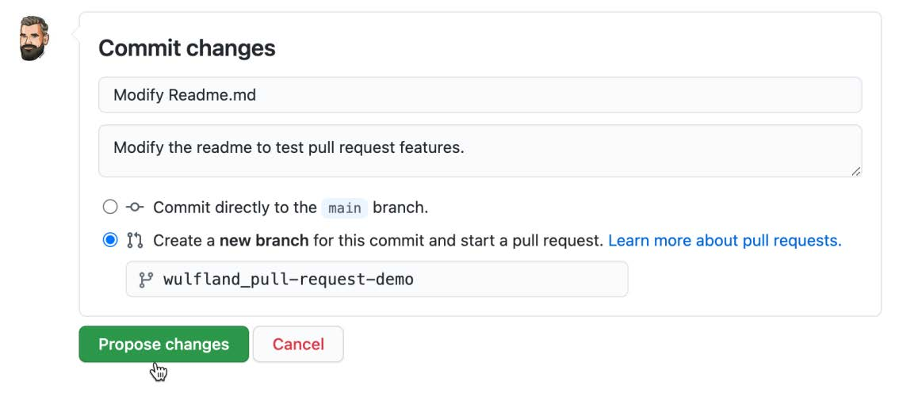

图3.2 – 将更改提交到新分支

6.	你将自动重定向到一个可以创建pull request的页面。输入标题和说明。请注意，issue中使用的Chapter 2，Planning，Tracking，and Visualizing your Work都可以被markdown支持：表情符号（：+1：）、提及（@）、引用（#）、任务列表（- [ ]）和语法突出显示的源代码（“''）。你还可以指配工作负责人、标签、项目和里程碑。
在页面的顶部，你可以看到目标分支（base）是main，而要集成的源分支是你刚刚创建的分支。“Create pull request”按钮是一个下拉列表。你还可以选择创建拟定pull request。现在，我们跳过此步骤，通过单击“Create Pull Request”按钮创建一个Pull Request（参见图3.3）。

图3.3 -为对文件所做的更改创建pull request

7.	在pull request中，导航到“Files changed”，并注意你对文件所做的更改：删除的行是红色的，添加的行是绿色的，修改的行是删除的行后面跟着添加的行。如果将鼠标悬停在这些线上，左侧会出现一个加号+图标。如果单击该图标，则可以添加单行注释。如果按住图标并拖动它，则可以为多行添加注释。同样，注释具有与所有丰富特性的问题相同的标记支持！添加一条备注，点击添加单条备注（见图3.4）：

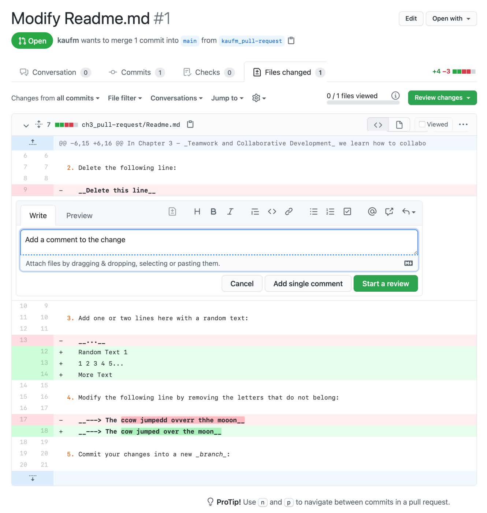

图3.4 -向更改行添加comment

经典的代码审查和pull request之间的重要区别在于你可以更新pull request。这使你可以处理comment并共同处理问题，直到问题关闭为止。为了显示这一点，你将编辑文件并提交到新分支，以查看pull request是否会反映更改。

8.	你可以通过打开右上角的菜单并选择Edit file（请参见图3.5），直接从拉取请求编辑文件：

图3.5 - 在pull request中编辑文件

9.	通过添加新的文本行来修改文件。在创建pull request之前，将更改提交到你创建的分支（请参见图3.6）：

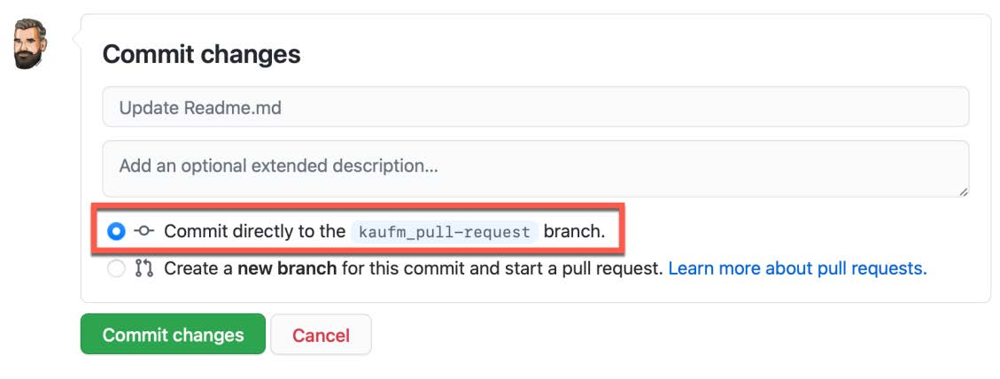

图3.6 - 提交对分支的更改

10.	定位回pull request，注意系统会自动显示你所做的更改。你可以在Files changed下查看文件中的所有更改，也可以在Commits下查看单个提交中的更改（参见图3.7）：
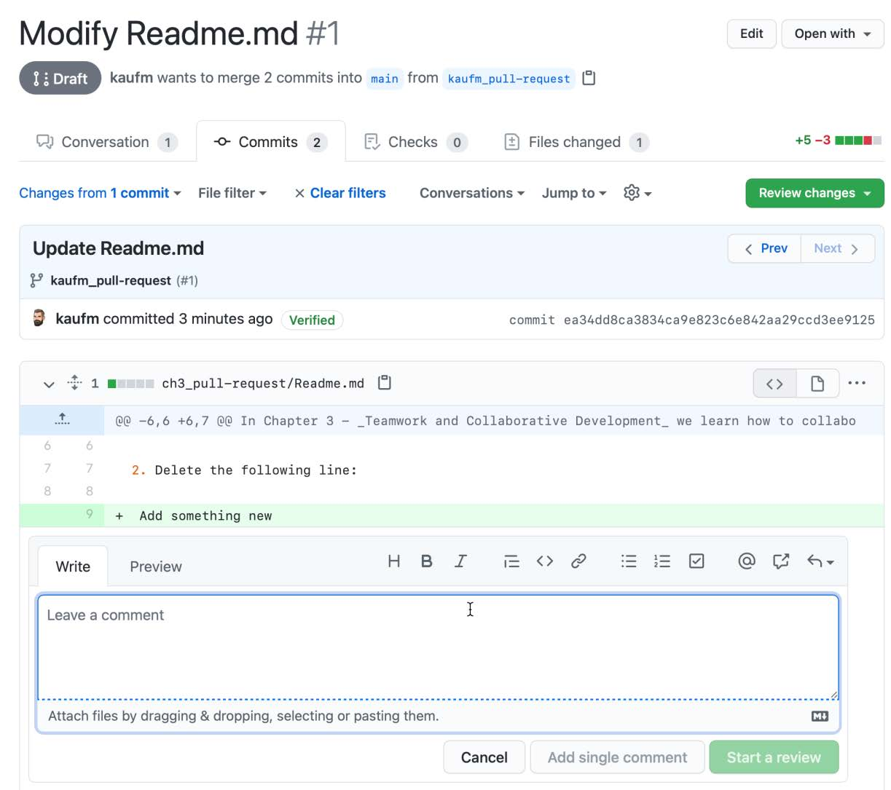

图3.7 -对单个提交中的更改进行comment

11.	如果你是GitHub上对于pull request的新手，有以下几个要点：
	* pull request是关于一个分支到一个基本分支的更改。如果更新分支，则拉取请求将自动更新。
	* 你可以使用GitHub中的丰富功能来协作完成所有更改：任务列表、提及、参考、源代码等。
	* 你可以查看基于每个文件或基于每个提交的更改。这有助于区分重要的更改和不重要的更改（例如：重构）。

## 提交更改
GitHub pull request有丰富的功能集，可以帮助你改进协作流程。

### 创建pull request草案
创建pull request的最佳时间是什么时候？每个人的观点可能都不同，但我认为：越早越好!理想情况下，你可以在开始处理某项工作时创建pull request。这样，你的团队只需查看打开的pull request，就可以知道每个人都在做什么。但是如果你过早地开启pull request，审阅者就不知道何时给出反馈。这就是pull request的好处。你可以尽早创建pull request，但是每个人都知道工作仍在进行中，评审人员还没有得到通知，但是你仍然可以在注释中提到相关人员，以便尽早获得代码反馈。
创建pull request时，可以直接在草稿状态下创建（见图3.8）：

图3.8 - 以草案形式创建pull request

Pull request草案会被明确标记为草稿，并有自己的图标（参见图3.9）。你还可以使用draft：true或draft：false作为搜索参数来过滤搜索中的pull request：

图3.9 - pull request草案标记示例

如果你的pull request已处于审阅状态，你仍然可以通过单击"审阅者"下的链接随时将状态更改回原来的状态|仍在进行中？| 转换为草稿。

如果你的pull request已准备好接受审阅，只需点击“Ready for review”（见图3.10）：
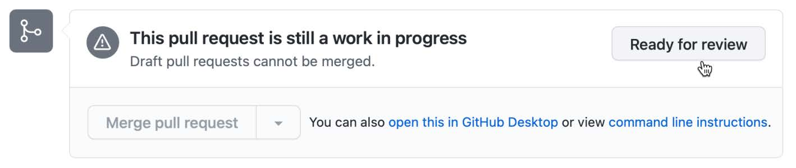

图3.10 - 删除pull request的草稿状态

pull request草案是一个很好的功能，可以以透明的方式在仓库内容变更早期进行团队协作。

### 代码所有者
当存储库中的某些文件发生更改时，代码所有者（Code owners）可以自动将审阅者添加到pull request中。这个特性还可以用于跨团队协作，并且还可以在早期开发阶段添加许可，而不需要在发布阶段来要求许可。假设你将代码视为存储库中的基础，你可以使用Code owners的功能要求协作团队中的某个人进行审阅。假设你有可以定义应用程序外观的文件，每次修改它们可能需要获得设计团队的批准。Code owners不仅仅是给以许可;它们还可用于在跨团队的协作社区中传播知识。

Code owners可以是团队或个人。他们需要写权限才能成为Code owners。如果pull request不是草稿状态，则Code owners将被添加为审阅者。

要定义Code owners，你需要在存储库的根目录、docs/folder或者.github/folder中创建一个名为CODEOWNERS的文件。该文件的语法很简单，如下所示：

*	使用@username或@org/team-name定义代码所有者。你还可以使用用户的电子邮件地址。
*	使用模式匹配文件以指派代码所有者。顺序很重要：最后匹配的模式优先。
*	使用#表示注释，！表示对模式求反，[ ]表示定义字符范围。

下面是Code owners文件的示例：

	# The global owner is the default for the entire repository
	* @org/team1
	# The design team is owner of all .css files
	*.css @org/design-team
	# The admin is owner of all files in all subfolders of the
	# folder IaC in the root of the repository
	/IaC/ @admin
	# User1 is the owner of all files in the folder docs or
	# Docs – but not of files in subfolders of docs!
	/[Dd]ocs/* @user1

关于"Code owners"的详细信息，请参阅下面的链接：https://docs.github.com/en/github/creating-cloning-and-archiving-repositories/creating-a-repository-on-github/about-code-owners。

Code owners是一个很好的方式，可以跨越团队共享知识，并将发布阶段的许可权限转变到变更发生时的早期许可。

### 审阅设置
在合并pull request之前，你可以要求指定数量的审阅。这是在可应用于多个分支的分支保护规则上设置的。在Settings | Branches | Add rule下，你可以创建分支保护规则。在规则中，你可以设置合并前所需的审阅数量，选择是否要在更改代码时取消审批，以及强制执行代码所有者（code owners）的审批（参见图3.11）：
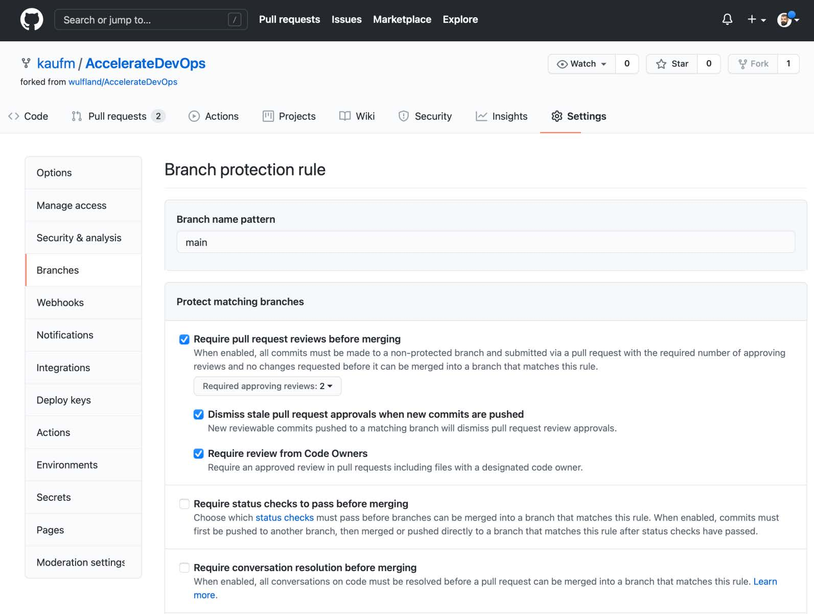

图3.11 -某一分支的审阅设置

有关分支保护的更多信息，请参见https://docs.github.com/en/github/administering-a-repository/defining-the-mergeability-of-pull-requests/about-protected-branches#about-branch-protection-rules。我将在第7章“基于主干的开发”中更详细地介绍这一内容。

### 设置pull request审阅
如果你的代码已准备好接受审阅，你可以手动添加所需数目的检阅者。GitHub会根据修改代码的作者提供审阅者的推荐（见图3.12）。你只需单击“请求”，也可以手动搜索人员以执行审核：

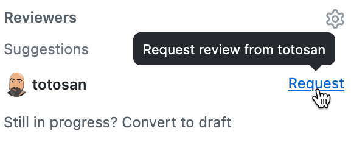

图3.12 - GitHub审阅人推荐示意图

你也可以让GitHub自动为你的团队分配审阅者。在Settings | Code review assignment下，你可以进行相关配置。你可以选择自动分配的审阅者数量，并选择以下两种算法之一：

*	Round robin：选择到目前为止收到最少请求的审阅者作为此次的审阅者。
*	Load balance：根据每个成员的审阅请求总数（考虑未完成的审阅）选择审阅者。

你可以将某些成员排除在审阅之外，也可以选择在指定审阅者时不通知整个团队。请参见图3.13了解如何为你的团队配置代码审阅任务：

图3.13 -管理团队的代码审阅任务

### 自动合并

Pull request中我最喜欢的特性之一是自动合并（auto-merge）。这允许你在处理小的更改时提高速度，特别是在启用了连续部署（continuous deployment，CD）的情况下。如果满足所有策略，自动合并将自动合并更改。如果你已经完成了更改，则可以启用自动合并来处理其他更改。如果pull request通过了一定数量的许可并且通过了所有的自动检查，则pull request将自动合并并部署到生产环境中。

## pull request审阅

如果你已被选中为审阅者，你可以对许多更改进行注释、提出建议，并在最后提交带有以下标记之一的审阅：

*	Comment
*	Approve
*	Request changes

在上一节中，我重点介绍了与pull request作者相关的功能。在本节中，我将描述一个帮助审阅者执行审阅并向作者提供适当反馈的功能。

### 审阅pull request中提议的修改

你可以通过一次查看一个文件的更改来开始审阅。如果将鼠标悬停在行上，则会在左侧看到+图标。它可用于添加单行注释，或者将其拖动到多行上来创建多行注释。如果你有注释，请选择Start review（开始审阅）以开始审阅而无需提交注释。如果你要添加更多评论，则按钮变为Add review comment（添加审阅评论）;你可以添加任意数量的注释到审阅。评论只对你可见，直到你提交审阅!你可以随时取消审阅。

### 将文件标记为已查看

审阅时，你会在文件顶部看到进度条。完成一个文件后，你可以选择“已查看”复选框。文件将被折叠，进度条将显示进度（参见图3.14）：

图3.14 - 将文件标记为已查看

### 动手实现-提出suggestions

提供反馈的最佳方式是提出使pull request作者可以轻松融入其分支的suggestion。suggestions这个功能非常重要，如果你从来没有尝试过，那么值得一试。下面是你应该怎么做：

1.	在上一个实践练习过程里创建的存储库中打开fork：https://github.com/<your user name>/AccelerateDevOps。 
在分叉中，导航至Chapter 3 | Review Changes（ch3_pull-request/Review-Changes.md）。该文件还包含操作指南，这样你就不必一直在浏览器和图书之间切换。
通过单击源代码块右上角的“Copy”图标复制示例源代码。

2.	导航到src/app.js（使用markdown中的链接）。选择你在上一个动手练习中创建的分支，并通过单击右上角的Edit图标（铅笔）来编辑该文件（参见图3.15）：
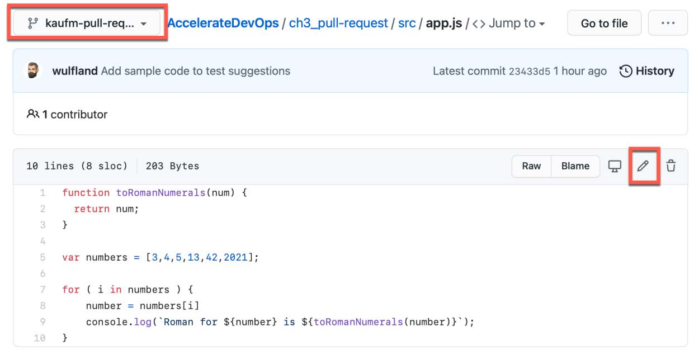

图3.15 -编辑代码文件以添加示例代码

3.	删除第2行，然后按Ctrl + V插入代码。

4.	直接提交到pull request的源分支。

5.	导航回pull request并在Files changed下查找src/app.js。请注意，第6到9行中的嵌套循环没有正确缩进。标记第6到9行并创建多行注释。点击Suggestion按钮，你会看到代码在comment块中，包括空格（见图3.16）：

图3.16 - 为多行注释创建建议

6.	注意，comment代码块包含完整的代码，包括空格。在每一行的开头加四个空格以修正缩进。 
你可以将comment作为审阅的一部分（Start a review）或将comment直接提交给作者（Add single comment）。对于此次实践练习，我们将建议直接提交给作者。

### 将反馈合并到pull request中

由于你是审阅者和作者，因此可以直接切换角色。作为作者，你可以查看pull request的所有建议。
你可以直接向分支提交建议，或者可以将多个建议批量提交到一个提交中，然后一次性提交所有更改。将更改添加到批处理并在文件顶部应用批处理（参见图3.17）：
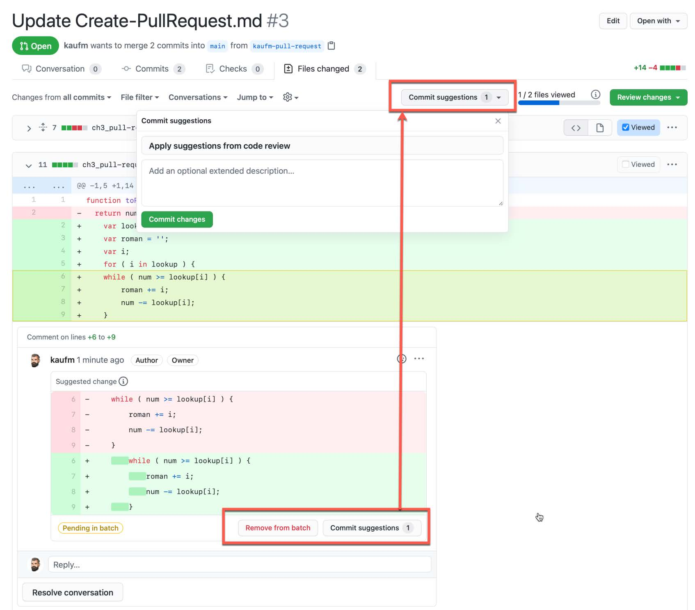

图3.17 - 将建议整合到代码中

建议是提供反馈和提议代码更改的好方法。对于作者来说，将它们合并到代码中是非常容易的。

### 提交审阅

如果你已完成审阅并添加了所有注释和建议，则可以提交审阅。作者将被告知审阅结果，并可以回答你的注释。你可以留下最后评论并选择以下三个选项之一：

*	Approve（批准）：批准更改。这是计数到所需审阅者计数的唯一选项！
*	Comment（评论）：提交反馈而不批准或拒绝。
*	Request changes（请求更改）：指明需要你批准更改。

单击“Submit review”完成审核（参见图3.18）：

图3.18 - 完成审阅

### 完成pull request
如果要放弃分支中的更改，可以关闭pull request而不进行合并。要将更改合并到基本分支中，你有三个合并选项，概述如下：

*	Create a merge commit（创建合并提交）：这是默认选项。它创建一个合并提交，并将分支中的所有提交作为一个单独的分支显示在历史记录中。如果你有许多长期运行的分支，这可能会使历史记录变得混乱。你可以在此处看到此合并选项的表示：

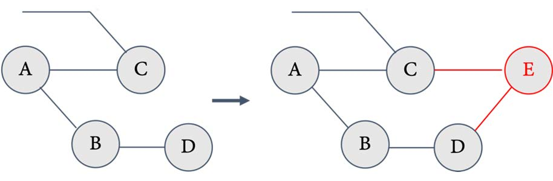

图3.19 - 合并提交时的Git历史记录

*	Squash and merge(挤压和合并)：分支中的所有提交都将合并为一个提交。这将创建一个干净的线性历史记录，如果在合并后删除分支，这是一个很好的合并方法。如果继续处理分支，则不建议使用此方法。你可以在此处看到此合并选项的表示：

图3.20 -进行了压缩和合并后的Git历史记录

*	Rebase and merge（重定基准和合并）：将分支的所有提交应用到基础分支的头。这也创建了一个线性历史记录，但保留了单个提交。如果你继续在分支上工作，也不建议使用此方法。你可以在此处看到此合并选项的表示：
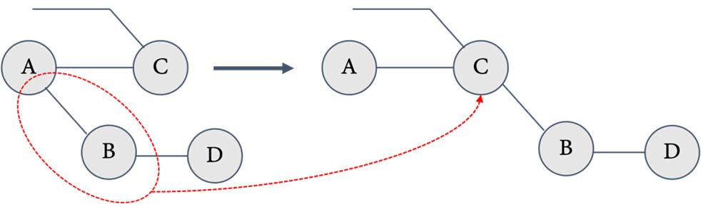

图3.21 - 如果你进行了一次变基和合并，Git历史看起来是线性的

选择所需的合并方法，然后单击“Merge pull request”（参见图3.22）：

图3.22 -完成pull request

修改合并消息并单击“Confirm merge”以确认合并。合并后，可以根据需要删除分支。

## 代码审阅的最佳实践

Pull request是在所有类型的代码上进行协作的好方法。本章只触及协作工作流的可能性的表面，但是为了让你的团队有效地协作，你应该考虑一些有效代码评审的最佳实践。

### Git培训

这一点可能看起来很明显，但要确保你的团队在Git方面训练有素。与随机分布在多个提交中的许多更改相比，具有良好提交消息且仅服务于一个目的的精细的提交更容易审查。特别是将重构和业务逻辑混合在一起会使审查成为一场噩梦。如果团队成员知道如何修改提交、修补他们在不同提交中所做的更改，以及如何精心制作好的提交消息，那么最终的pull request将更容易审查。

### 将pull request链接到问题

将pull request链接到启动工作的相应问题。这有助于为pull request给予背景。如果你使用第三方集成，请将pull request链接到Jira票证、Azure Boards工作项或你已连接到GitHub的任何其他源。

### 使用pull request草案

让团队成员在开始处理某项工作时立即创建一个拉取请求草案。这样，团队就知道谁在做什么。这也鼓励人们在审阅开始之前使用带有提示的评论来征求人们的反馈。尽早对更改进行反馈有助于在最后进行更快地审查。

### 至少有两名批准人

你至少需要两名批准人。人数越多越好，具体取决于团队规模，但一个是不够的。拥有多个审阅者会使审阅具有某种动态性。我注意到一些团队的审阅有很大成效，这仅仅是由于把批准人员从一个变成了两个！

### 进行同级审阅

将审阅视为同级审阅。不要让高级架构师审阅其他人的代码！年轻的同事也应该进行同级审阅来学习。一个好的方法是将整个团队添加为审阅者，并要求一定比例的批准（例如，50%），然后人们选择他们想要的pull request。或者，你可以使用自动审阅在团队中随机分发审阅。

### 自动审阅步骤

许多审阅步骤可以自动化，尤其是格式设置。使用linter检查代码的格式（例如https：//github.com/github/super-linter），或者编写一些测试来检查文档是否完整。使用静态和动态代码分析自动查找问题。你越多地自动化平庸的检查，越多的审查可以集中在重要的事情上。

### 部署和测试更改

合并前自动生成和测试更改。如有必要，使用代码进行测试。人们越是相信改变不会破坏任何东西，他们就越是信任改变这个过程。如果所有审批和验证均通过，则在进行自动合并后发布你的更改。高度自动化使人们只需关注较小的批量，这使得审阅变得容易得多。

### 审阅准则/行为守则

一些工程师对某些事的正确做法很有自己的看法，因此很容易发生激烈的争论。你希望进行激烈的讨论以获得最佳解决方案，但又希望这些讨论以包容的方式进行，以便团队中的每个人都能平等地参与。制定审阅准则和行为守则有助于达到这一目的，如果人们行为不当，你可以通过规则指出错误。

## 总结

软件开发是一项团队运动，拥有一个共享代码所有权的团队是很重要的，这个团队在新的变更上紧密合作。如果使用得当，GitHub pull request可以帮助实现这一点。

在下一章中，你将了解异步和同步工作，以及异步工作流如何帮助你随时随地进行协作。

## 延伸阅读和参考文献

以下是本章中的延伸阅读和参考文献，你也可以使用这些资料来获取有关内容的更多详细信息：

* Coyle D. (2018). The Culture Code: The Secrets of Highly Successful Groups (1st ed.).Cornerstone Digital.
* Kim G., Humble J., Debois P. and Willis J. (2016). The DevOps Handbook: How toCreate World-Class Agility, Reliability, and Security in Technology Organizations (1sted.). IT Revolution Press.
* Scott Prugh (2014). Continuous Delivery. https://www.scaledagileframework.com/guidance-continuous-delivery/
* Chacon S. and Straub B. (2014). Pro Git (2nd ed.). Apress. https://git-scm.com/book/de/v2
* Kaufmann M. (2021). Git für Dummies (1st ed., German). Wiley-VCH.
* Git: https://en.wikipedia.org/wiki/Git
* Pull requests: https://docs.github.com/en/github/collaboratingwith-pull-requests/proposing-changes-to-your-work-withpull-requests/about-pull-requests
* Code owners: https://docs.github.com/en/github/creatingcloning-and-archiving-repositories/creating-a-repositoryon-github/about-code-owners
* Branch protection: https://docs.github.com/en/github/administering-a-repository/defining-the-mergeabilityof-pull-requests/about-protected-branhes#about-branchprotection-rules
* Code review assignments: https://docs.github.com/en/organizations/organizing-members-into-teams/managingcode-review-assignment-for-your-team
* Auto-merge:https://docs.github.com/en/github/collaboratingwith-pull-requests/incorporating-changes-from-a-pullrequest/automatically-merging-a-pull-request
* Pull request reviews: https://docs.github.com/en/github/collaborating-with-pull-requests/reviewing-changes-inpull-requests/about-pull-request-reviews
