# 第4章 异步工作：随地协作

上一章中介绍了通过pull request的协作开发，以及如何利用它们为代码和构建的产品创建共享所有权。本章将重点关注同步和异步工作，以及如何利用异步工作流程的优势，在分布式、远程和混合团队中更好地协作，以及更好地跨团队协作。

本章将涵盖以下的主题：

- 比较同步和异步工作
- 分布式团队
- 跨团队合作
- 向异步工作流程转变
- 团队和 Slack 集成
- GitHub 讨论
- 页面和维基
- 通过 GitHub Mobile 随时随地工作
- 案例研究

## 同步和异步工作的比较

信息工作者进行的每一项工作本质上都是交流。包括关于编程的一切：开发者必须对未来的开发者（包括自己）沟通他们正在编码的内容，架构，甚至代码本身，以明确如何程序的更改。因此，开发者的沟通方式直接影响开发者完成任务的方式。

### 通信的历史

在人类的历史上，互动和交流方式经常发生变化。在1450年约翰内斯-古腾堡（Johannes Gutenberg）发明印刷术之前，交流大多是纯粹的口头交流，有一些有限的书面交流，这引起了一场印刷革命，让更多的人获得信息，并对宗教和教育产生了很大影响。17世纪，报纸的发明通过极大地缩短从发送者到接收者的时间，再次彻底改变了通信方式。在18世纪，公共邮政系统变得高效，以至于越来越多的通信是通过信件进行的。这使得私人通信迅速发展，就像报纸一样。在19世纪，电报的发明第一次允许人们在很远的距离上进行实时通信。第一部电话是由Philipp Reis于1861年在法兰克福发明的。当时的信息传输仍有波动，因此大多数人没有重视这项发明。直到15年后的1876年，亚历山大-格雷厄姆-贝尔终于为电话申请了专利，这次通讯革命使得实时口头交流成为可能。

以前通信的发展的跨度更多的是与几个世纪有关，而不是与几十年有关。人们有时间去适应对于哪种通信形式是最好的选择，并且人们的选择总是相当清楚和直观的。在过去的30年里，这种情况发生了迅速的变化。在20世纪90年代末，移动电话变得袖珍且价格合理。任何人都可以在任何时间与任何人交谈。有趣的是，这导致了一个新的现象：人们开始给对方发短信，而且往往喜欢异步通信而不是同步通信。随着互联网的兴起，电子邮件迅速取代了信件。但在一开始，互联网并不具有移动性，所以对电子邮件的预期回应仍然是几天的时间。这种情况在2005年左右发生了变化。互联网变得“移动”起来，智能手机允许随时随地访问电子邮件。同时，新的通信形式开始流行。Facebook、Twitter、Instagram和Snapchat。它们允许以文字、语音和视频的形式进行不同种类的沟通，有不同的受众群体（覆盖面和隐私）和不同的信息持久性（生存时间，简称TTL）。

图4.1说明了世界人口的指数增长与人们的通信行为变化之间的关系

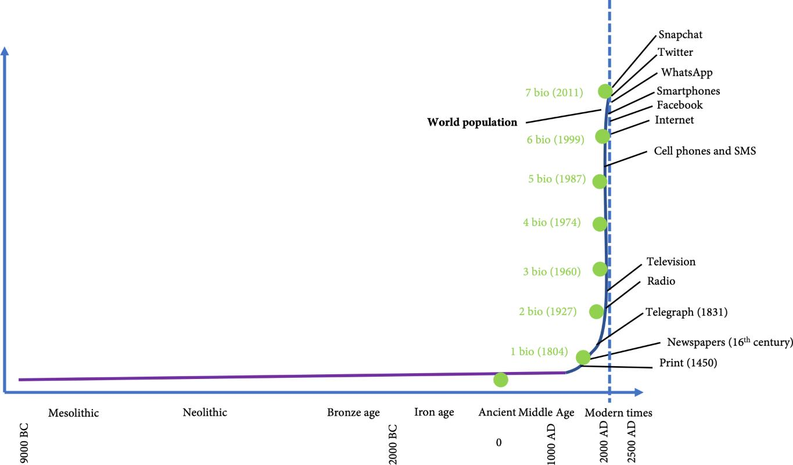

图4.1 - 通信技术的指数式发展与变化

过去30年的快速发展导致了不同类型的通信模式。无论是选择写短信，还是选择打视频电话，或者向一个群组发送一个故事，更多的是取决于个人的喜好，而不是信息的内容。对于特定种类的信息，什么是正确的沟通形式，并没有形成社会的共识。

### 工作和交流

工作不仅仅是沟通。信息工作为对话增加了所需的输出。读者可以把工作分为同步工作和异步工作。同步工作指的是当两个或更多的人实时互动以实现预期的产出。异步工作是指当两个或更多的人通过交换信息以实现预期的产出。

如果读者在一个传统企业工作，异步和同步工作的组合可能仍然像图4.2那样。至少在几年前是这样的。大部分工作是通过电子邮件或会议完成的，而会议通常是在同一个房间里进行的。

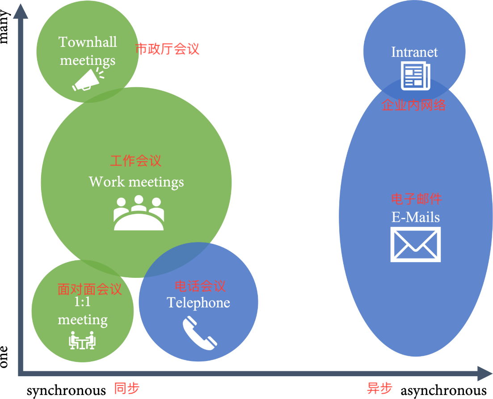

图4.2 - 传统企业中的工作和沟通

大多数异步工作是通过电子邮件和远程方式完成的，而大多数同步工作则是在面对面的会议上完成。主导的工作方式在很大程度上取决于公司的文化。在具有强烈的电子邮件文化的公司里，人们通常会在几分钟内回复收到的电子邮件。在这些公司里，许多人在开会时打开笔记本电脑，人们通常抱怨电子邮件太多。在会议文化浓厚的公司，人们往往不会及时回复电子邮件，因为他们正在参加会议，这导致了更少的电子邮件，更多的会议。

在过去的几年里，这种情况发生了巨大的变化。特别是小公司和初创公司，已经放弃了基于电子邮件的工作模式，而选择了其他异步媒介，如即时通讯。许多公司也发现了远程工作的好处，有些公司只是在大流行病的影响下被迫这样做。

第二章向开发者展示了环境切换是如何扼杀生产力的。因此，对于开发团队来说，异步工作是可取的，因为它允许开发者建立工作项目的拉动，减少环境切换。一个更现代的、为开发者优化的工作组合可以是这样的。

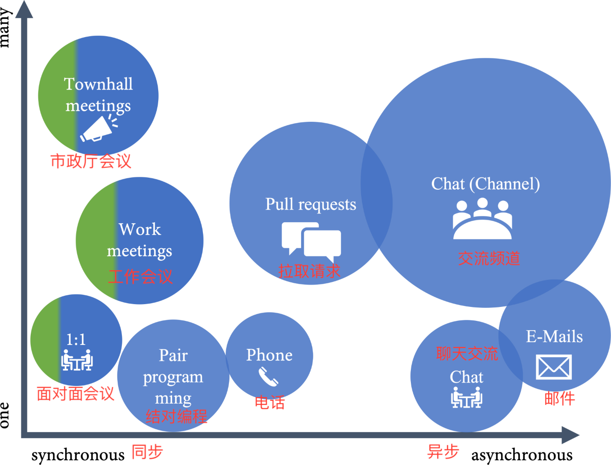

图4.3 - 对开发者工作和交流的优化模式

开发者同步工作时间越少，他们就能更专注地投入到工作中，而不需要进行环境切换和额外计划。重要的是要有这个意识：人们以同步的方式执行什么样的工作，人们可以异步地做什么？人们当面进行什么样的工作，人们可以远程进行什么样的工作？

### 面对面和远程工作

同步工作可以当面进行，也可以远程进行。两者都有其优点和缺点。

如果要必须说服某人，亲自会面是可取的。与电话或远程会议相比，销售人员总是更喜欢当面会谈，因为他们更适合社交和关系/团队建设。对于关键的反馈和敏感的问题，当面讨论也比远程讨论好。复杂的讨论或需要创意的问题也可以从当面会谈中受益。

远程会议的优势在于，由于减少了通勤时间，所以效率更高。人们可以在实际所在地点独立参与，这使得公司可以拥有一个跨越多个时区的团队。远程会议可以被记录下来，这使得人们即使不能参与，也可以观看会议。

远程会议的计划应与面对面的会议不同。一个8小时的研讨会（2x4）在面对面的情况下效果很好，但在远程的情况下就不行。远程会议应该更短，更集中。如果他们面对的是他们的计算机，人们往往会迅速分心。

在未来几年里，我们将看到越来越多的混合工作模式。混合工作模式使员工能够在不同的地点自主工作：在家，在路上，或在办公室。66%的公司正在考虑为混合工作模式重新设计办公空间，73%的员工希望有更灵活的远程工作选择（参见https://www.microsoft.com/en-us/worklab/work-trend-index/hybrid-work）。在组织会议时，混合工作将是一个很大的挑战。远程会议适合个人，而现场会议适合团队。将两者结合起来将是一个挑战，不仅是对会议室的技术设备，而且对负责组织会议的人来说也是如此。

## 分布式团队

那些几乎100%远程办公、团队分布在全球各地的科技公司已经存在了相当长的一段时间了。作者认识一家公司，它有一个完全的远程招聘流程。每位员工都有预算来投资他们的家庭办公室或者在联合办公空间租一些物品。公司分布在全球各地，每年只在一起开一次会。

随着大流行病以及远程和混合工作的兴起，越来越多的公司开始看到拥有分布式团队的好处，其中包括：

- 不限制在某个大都市地区招聘，有更多的人才和更多的专家可供招聘（人才战）；
- 在其他地区招聘往往伴随着降低成本；
- 如果产品针对多个市场，有来自这些不同背景的团队成员帮助了解客户是有益的。(多样性)；
- 通过提供支持，可以自动拥有更多的覆盖时间，这意味着工程师在正常工作时间之外的无用任务减少。

分布式团队也有其挑战，最大的挑战是语言问题。非母语人士在沟通上有更多问题，如果想跨越许多国家，需要一个好的基础语言--最可能是英语。此外，文化方面的问题可能会使沟通更加困难。在远程招聘过程中，团队建设和文化适应必须发挥更大的作用。

如果想用更多的远程工程师来增加团队规模，一定要对时区进行相应的规划。这取决于会议数量，至少在时区正常工作时间的工作时间有1-2小时的重叠。这意味着通常最多可以在一个方向上开展大约8个小时，才能有1小时的重叠。如果在一个方向已经有4小时，只能在另一个方向增加一个最多4小时(图4.4)。


图4.4 - 根据跨时区覆盖安排会议

考虑到夏令时和不同的工作时间，使跨时区的重叠规划成为一项相当复杂的任务!

分布式团队有其优势，在未来几年将会看到更多这样的情况。如果已经开始方式实践，这是很好的，它允许从其他国家、其他时区聘请专家。这意味着让所有的沟通用英语或公司所在地区的另一种通用语言，并有尽可能多的异步工作流程。

## 跨团队合作

为了加速软件交付，公司希望团队可以尽可能地自主。能否在任何时候向最终用户提供价值而不依赖其他团队是对速度的最大影响因素之一，然而这需要在各团队之间进行一些协调：设计、安全和架构是一些必须跨越团队界限的共同关注点。良好的跨团队合作是整个团队健康一致性的标志。

好的跨团队合作通常不需要管理层的参与，而是直接将正确的人员聚集在一起解决问题。日常工作所需的会议越少，效果越好。

## 向异步工作流程的转变

为了更多地向异步工作方式转变，并允许远程和混合工作，有一些最佳做法，可以很容易地采用，例如：

- __更喜欢聊天而不是电子邮件。__ 依靠电子邮件的工作流程有很多缺点：没有共同的历史记录；如果一个团队成员生病或离开，另外的成员的工作可能会受阻等等。尝试将所有与工作有关的对话转移到聊天平台，如微软团队或Slack。 
- __让（大多数）会议变得可有可无。__ 让所有与工作有关的会议成为可有可无的。如果他们认为会议没有价值就离开。这有助于使会议更加集中，准备更加充分，因为没有人愿意成为自己会议的唯一参与者。当然，有一些团队建设或行政会议不应该是可选的。
•__记录所有的会议。__ 录制所有的会议，让人们有机会了解，即使他们不能参与。录制的会议可以用更快的速度观看，这有助于在更短的时间内消化会议内容。
•__要有目的性。__ 要有意了解什么是会议,什么是异步工作流程（聊天、issues、pull requests和维基）。
•__审查设置。__ 一定要了解自己的指标，并定期检查自己的设置。会议是否成功，或者它们是否可以转移到issues或pull requests的讨论中？在issues和pull requests中的讨论是否要花很长时间，有些事情是否可以在会议上更快解决？不要太频繁地改变设置，因为人们需要一些时间来采用，但要确保至少每2或3个月审查和调整设置。
•__使用提及和代码所有者。__ 使用提及和代码所有者（第3章）来动态地召集合适的人完成任务。这两个功能对跨团队协作也很有帮助。
•__把一切都当做代码。__ 试着把一切都当作代码，像对待代码一样进行协作:基础设施、配置、软件架构、设计文件和概念。

## 团队和Slack整合

如果开发者喜欢即时通讯而不是电子邮件，可以使用GitHub for Microsoft Teams (https://teams.github.com) 或Slack (https://slack.github.com) 的集成功能。这些功能允许开发者在聊天频道中直接接收通知，并与issues、pull requests或部署进行互动。Slack和Teams的功能非常相似：

- __通知:__ 订阅版本库中的事件。开发者可以用分支或标签过滤器来过滤通知。
- __GitHub链接的细节:__ GitHub链接会自动展开，并显示链接指向的项目的细节。
- __打开新的issue:__ 直接从开发者的对话中创建新issue。
- __互动:__ 从开发者的渠道直接处理issues、pull requests或部署批准。
- __安排提醒:__ 在开发者的频道中接收代码审查的提醒。

安装很简单，开发者必须在Microsoft Teams或Slack中安装GitHub应用，并在GitHub中安装组织中相应的Teams或Slack应用。

安装完毕后，开发者就可以与GitHub机器人互动并发送消息了。在Teams中，可以用 @GitHub 提到机器人，而在Slack中，可以用/GitHub 来做。如果开发者提到机器人，会收到一个可以使用的命令列表（见图4.5）。

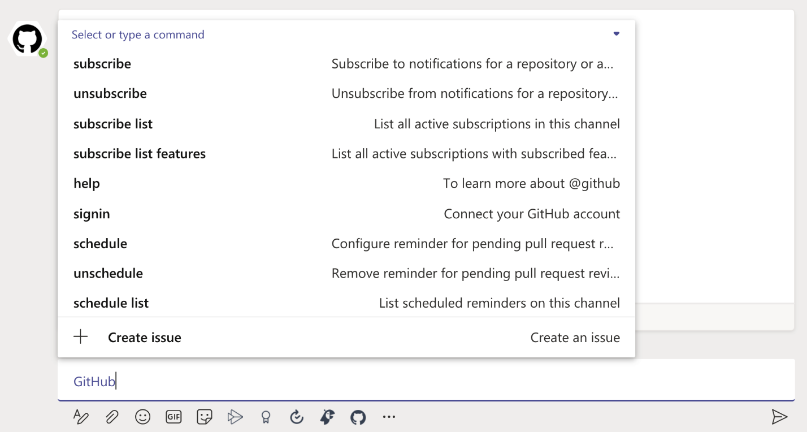

图4.5 - 向GitHub机器人发送消息

开发者必须使用的第一个命令是signin。这将把GitHub账户和Teams/Slack账户连接起来。

```bash
@GitHub登录
```

之后，开发者可以订阅通知或安排提醒。链接的展开和与问题的互动无需配置任何东西就可以进行。图4.6显示了Team中的一个issue，它是由对话创建的。开发者可以直接对该issue进行评论或关闭它。

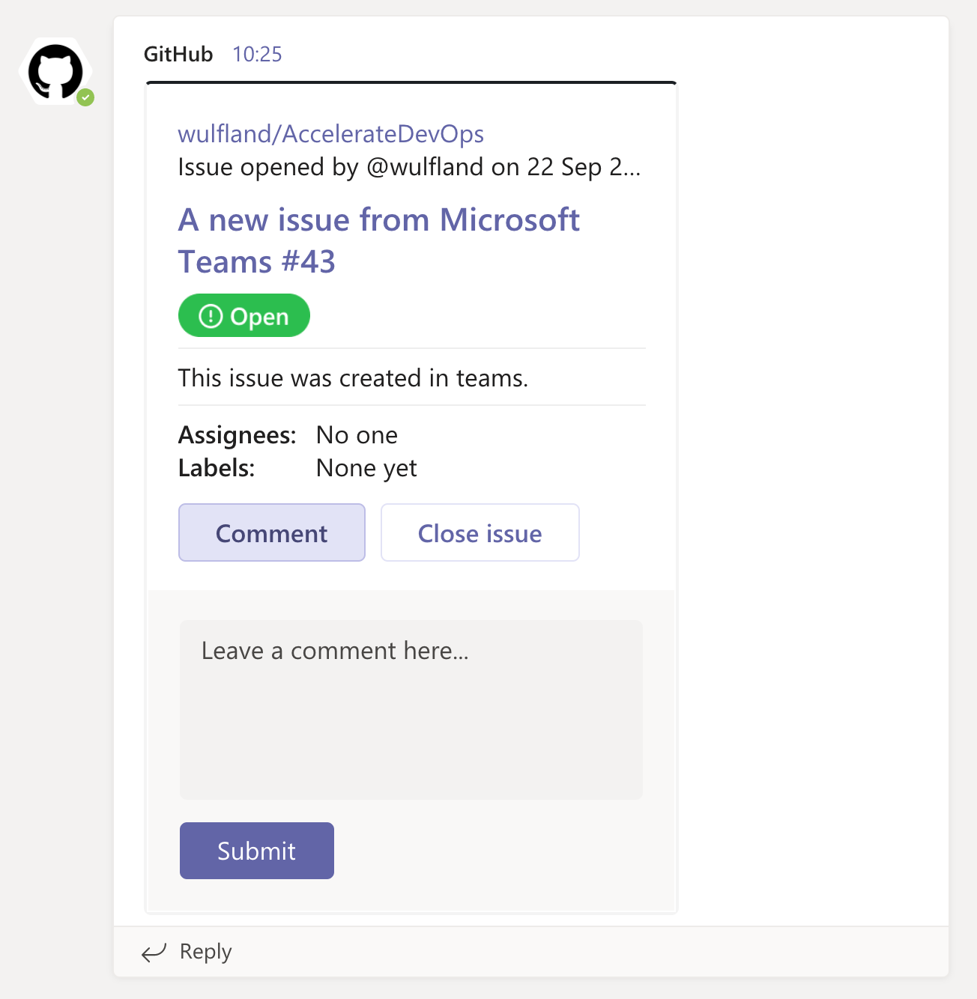

图4.6 - 与Microsoft Teams进行issue互动

聊天集成是一个强大的功能，当工作流程越来越多地通过聊天而不是通过会议或电子邮件启动和管理时，它就会派上用场。

## GitHub讨论

在第二章中介绍了如何使用GitHub问题和GitHub项目来管理工作。GitHub讨论是一个社区论坛，允许成员提出问题，分享更新，并进行开放式的对话。讨论会是一个很好的方式，通过提供一个不同的地方进行长时间的讨论和问答(Q&A)来减少问题和拉取请求的负荷。

### 开始使用讨论区

要开始使用 GitHub讨论，则必须在仓库的 "Settings|Options|Features中勾选Discussions将其启用。一旦勾选了这个选项，开发者的仓库里就会有一个新的主菜单项，即Discussions。

> 注意
> 
> GitHub讨论是在本书编写时仍处于Beta版的功能。有些功能后来可能已经改变。可以在https://github.com/github/feedback/discussions/ 参与讨论，当然，这本身就是一个GitHub讨论。

讨论是按类别组织的。开发者可以在讨论中搜索和过滤，就像可以搜索和过滤问题一样。讨论本身可以被加注，并标明评论的数量，并标明是否被认为是回答。开发者可以将最多四个讨论固定在页面的顶部，以发布一些重要的公告。排行榜显示了在过去30天内回答问题最多的用户，对他们最有帮助。图4.7显示了讨论的界面。

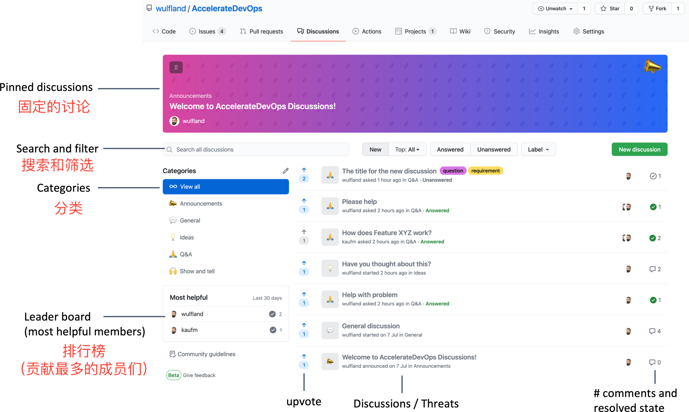

图4.7 - GitHub 讨论区界面

### 讨论类别
开发者可以通过点击类别旁边的编辑按钮来管理类别。可以编辑、删除或添加新的类别。一个类别包括以下内容：

- 图标
- 标题
- 描述（可选）

有三种类别：

1. 问题/答案:
   
    讨论类别可以提出问题，建议答案，并对最佳建议答案进行投票。该类别是唯一允许将评论标记为已回答的类型。

2. 不限成员名额的讨论:

    一个可以进行对话的类别，不需要一个明确的问题答案。很适合分享技巧和窍门或只是交流。

3. 公告:
    
    与开发者的社区分享更新和新闻。只有维护者和管理员可以在这些类别中发布新的讨论，但任何人都可以评论和回复。

### 开始讨论

开发者可以通过点击 __Discussion|New discussion-__ 来启动一个讨论。要开始一个新的讨论，必须选择一个类别，并输入一个标题和一个描述。开发者也可以选择给讨论添加标签。描述有完整的Markdown支持。这包括对issue、pull request和其他讨论的引用(#)，以及对其他人的提及(@)，带有语法高亮的代码，和附件(见图4.8)。

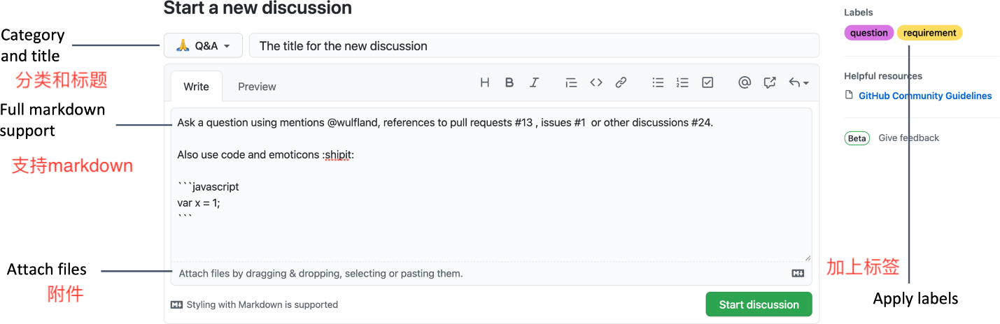

图4.8 - 新建讨论

### 参与讨论

开发者可以评论或直接回答原始的讨论描述，或者可以回答现有的评论。在每一种情况下，都有完整的Markdown支持。开发者可以在所有评论和原始描述中添加表情符号形式的反应，还可以给讨论或评论/回答加分。在右边的菜单中，可以将一个讨论转换成一个issue。作为管理员或维护者，还可以锁定谈话，把它转移到另一个资源库，把讨论固定在论坛的顶部，或删除它。图4.9给出了一个正在进行的讨论的界面。

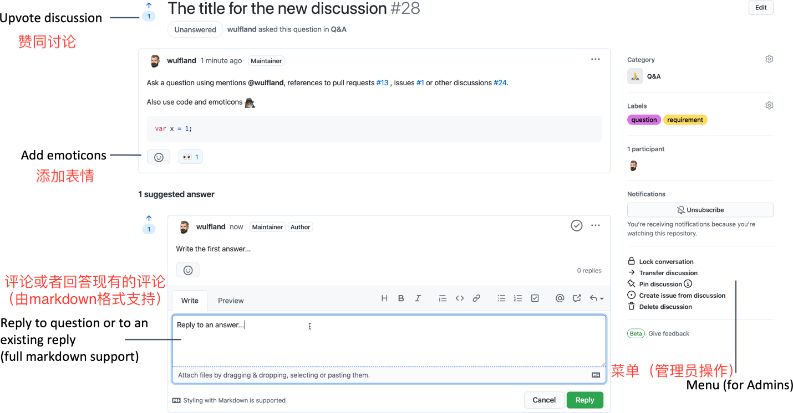

图4.9 - 参与讨论

讨论是一个与同行和跨团队边界进行异步协作的好地方。有关讨论的更多信息，请参阅https://docs.github.com/en/discussions。

## Pages和维基(wikis)

开发者有很多以协作的方式分享内容的选择。除了issue和讨论之外，还可以使用GitHub Pages和维基。

### GitHub Pages

GitHub Pages 是一种静态网站托管服务，可以直接从 GitHub 的仓库中提供文件。开发者可以托管普通的超文本标记语言（HTML）、层叠样式表（CSS）和JavaScript文件，自己建立一个网站。也可以利用内置的预处理器Jekyll(https://jekyllrb.com/)，它可以用Markdown建立好看的网站。

GitHub Pages网站默认托管在github.io域名下（如https://wulfland.github.io/AccelerateDevOps/），但也可以使用一个自定义域名。

GitHub Pages 是为公共存储库提供的免费服务。对于内部使用（私人仓库），需要GitHub Enterprise版。

> 注意
> GitHub Pages 是一项免费服务，但它不能用来运行商业网站。官方禁止运行网店或任何其他商业网站。仓库配额为1GB，每月的带宽限制为100GB。详情请参考https://docs.github.com/en/pages/getting-started-with-github-pages/about-github-pages 获取更多信息。

了解GitHub页面的最好方法是看它的实际操作：

1. 如果读者已经在前几章的实战练习中fork了https://github.com/wulfland/AccelerateDevOps 仓库，可以直接进入fork的仓库。如果没有，请点击版本库右上角的Fork按钮，创建一个分支。这将在https://github.com/<USER>/AccelerateDevOps下创建一个分支。

2. 在复制的仓库分支中，导航到 __Settings|Pages__。选择想运行网站的分支main并选择 /docs 目录作为网站的根目录。读者只能选择版本库的根目录或/docs，不能使用其他文件夹。点击保存来初始化网站（见图4.10）。

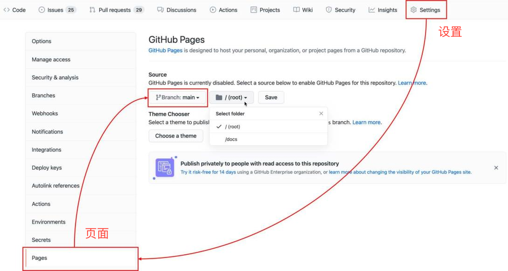

图4.10 - 在仓库中建立GitHub Pages

3. 几分钟后网站创建完成。点击链接，如图4.11所示，如果还不能使用，请刷新页面。
 
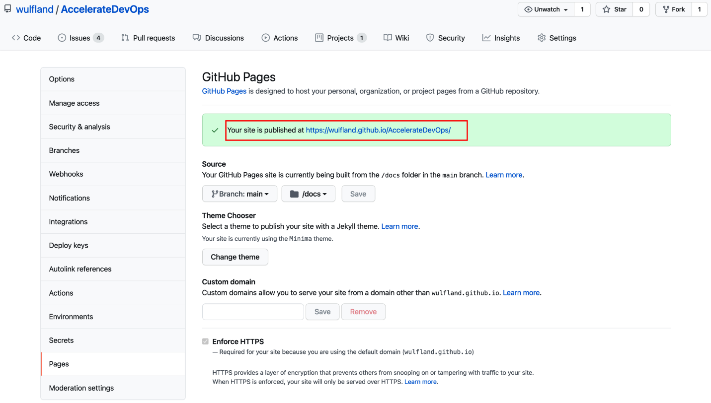

图4.11 - 导航至Web页面

4. 检查网站，页面有一个带有静态页面的菜单和一个显示带有摘录的帖子的菜单（见图4.12）。

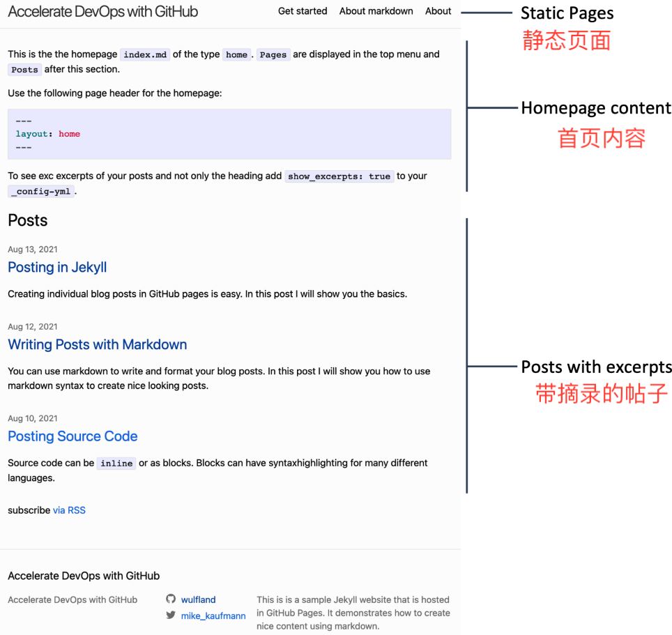

图4.12 - Jekyll网站

5. 在代码中检查 /docs/_config.yaml 配置文件。在这里可以为网站全局配置，如标题和描述：

```bash
title: Accelerate DevOps with GitHub
description: >-
 This is a sample Jekyll website that is hosted in GitHub Pages.
 ...
```

开发者可以选择主题用来渲染网站，每个主题都有自己的特点，建议查看文档。本书有默认的Jekyll主题minima。要渲染Markdown，可以使用Kramdown或GitHub Flavored Markdown（GFM）。Jekyll也支持不同的插件。
minima主题支持jekyll-feed，通过show_excerpts选项，可以设置是否在主页上显示文章的摘录：

```bash
theme: minima
Markdown: kramdown
plugins:
 - jekyll-feed
show_excerpts: true
```

许多主题支持附加选项。例如可以设置在网站上显示的社交媒体账户：

```bash
twitter_username: mike_kaufmann 
github_username: wulfland
```

通常情况下，静态页面按字母顺序显示在顶部导航栏。为了对页面进行过滤和排序，可以在配置中添加一个部分。由于要添加一个新的页面，在About.md之前添加一个my-page.md条目：

```bash
header_pages:
- get-started.md
- about-Markdown.md
- my-page.md
- About.md
```

直接将修改提交到main分支。

6. 在/docs文件夹中，在右上角选择 __Add file|Create new file__ 。输入my-page.md作为文件名，并在该文件中添加以下内容：
   
```bash
---
layout: page
title: "My Page"
permalink: /my-page/
---
```

用户可以再添加一些Markdown内容并直接提交到main分支。

7. 前往/docs/_posts/文件夹。在右上角再次选择 __Add file|Create new file__。输入YYYY-MM-DD-my-post.md作为文件名，其中YYYY是当前年份，MM是两位数字的月份，DD是该月的两位数字的日期。添加以下内容，并将日期替换为当前日期：

```bash
---
layout: post
title: "My Post"
permalink: /2021-08-14_writing-with-Markdown/
---
```

在页面上添加一些更多的Markdown内容，并直接提交到main分支。

8. 后台进行编译处理，然后刷新页面，就可以在起始页上看到页面和帖子，用户可以点击它们（见图4.13）。

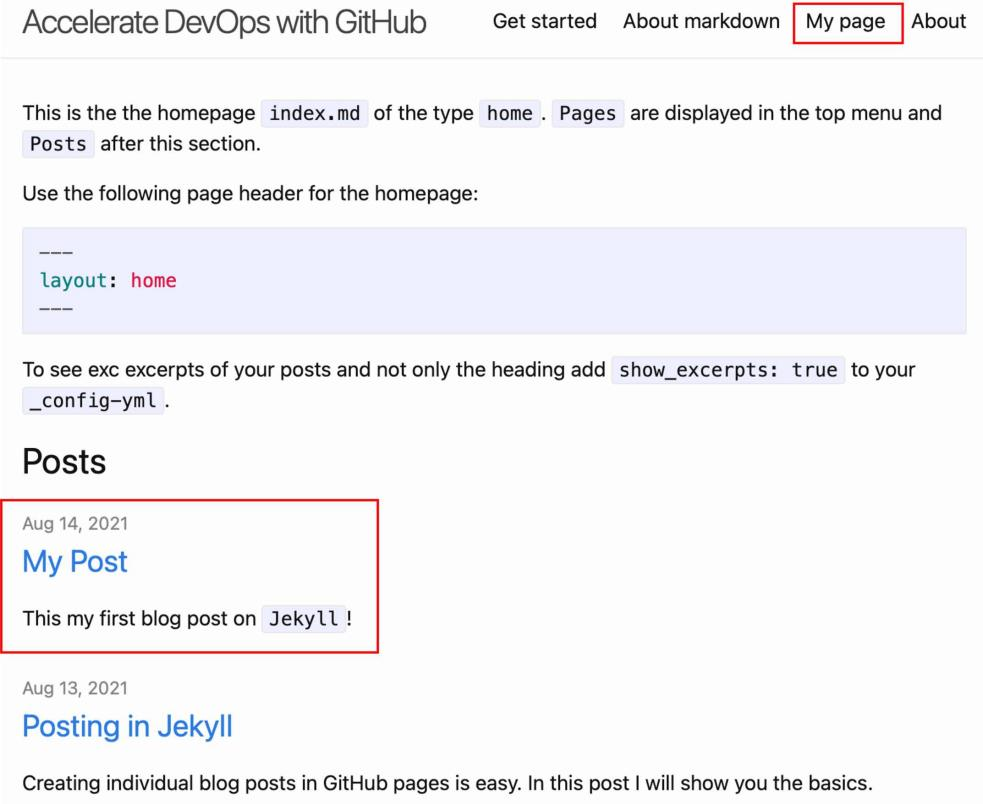

图4.13 - 在Jekyll上创建新页面并推送

现在可以看到在GitHub Pages中发布内容是多么容易。Jekyll是一个非常强大的工具，几乎可以定制一切，包括主题。安装Ruby和Jekyll时，还可以离线运行网站进行测试（见https://docs.github.com/en/pages/setting-up-a-github-pages-site-with-jekyll/testing-your-github-pages-site-locally-with-jekyll 以了解更多细节）。然而，这是一个非常复杂的话题，超出了本书的范围。

使用Jekyll的GitHub页面是一种很好的方式来展示内容，并像在代码上一样通过pull request对内容进行协作。读者可以把它作为一个技术博客或用户文档使用。在一个分布式的团队中，可以用它来发布每个冲刺阶段的结果，还可以发布短视频。这有助于与他人交流成果，即使他们不能参加冲刺审查会议。

### 维基(Wikis)

GitHub在每个仓库中都有一个简单的维基，也可以选择在代码旁边创建开发者自己的基于Markdown的维基。

### GitHub的维基(wiki)

每个资源库中都有一个非常简单的维基。可以选择以不同的格式来编辑页面。Markdown, AsciiDoc, Creole, MediaWiki, Org-mode, Prod, RDoc, Textile, 或reStructuredText。由于GitHub中的其他内容都是Markdown，本书认为这是最好的选择，但如果已经有其他格式的维基内容，它可以帮助把内容转移过来。

> 注意
> 
> 其他的编辑格式，如AsciiDoc或MediaWiki，有更高级的功能，如自动生成的目录（ToC）。如果开发者的团队已经熟悉了语法，可能更有意义，但同时学习Markdown本身和另一种Markdown语言可能弊大于利。

维基是非常简单的。有一个可以编辑的主页，开发者可以添加一个自定义的侧边栏和页脚。与其他页面的链接在双括号中被指定为[[页面名称]]。如果创建一个单独的链接文本，可以使用[[链接文本|页面名称]]格式。如果创建了一个还不存在的页面的链接，会被显示为红色，开发者可以通过点击该链接来创建一个页面。

wiki是一个Git仓库，其名称与仓库相同，扩展名为.wiki（<name_of_repository>.wiki）。开发者可以克隆一个仓库，在本地用wiki的分支工作。但到现在为止，还没有办法使用pull request来协作修改，这是Wiki最大的缺点，也是GitHub wikis的最大缺点！

另外，维基不支持嵌套页面。所有页面都在资源库的根目录。开发者可以使用侧边栏来创建一个使用Markdown嵌套列表的层次结构的菜单:

```bash
[[Home]]
* [[Page 1]] 
 * [[Page 1.1]] 
 * [[Page 1.2]]
```

如果开发者想让菜单的部分内容可折叠，可以使用<details></details> GitHub Markdown功能。这将在Markdown中创建一个可折叠的部分，通过<summary></summary>可以定制标题:

```bash
* [[Page 2]]
 * <details>
    <summary>[[Page 2.1]] (Click to open)</summary>
     * [[Page 2.1.1]] 
     * [[Page 2.1.2]] 
   </details>
```

请注意，空行不能删除。结果如图4.14所示。

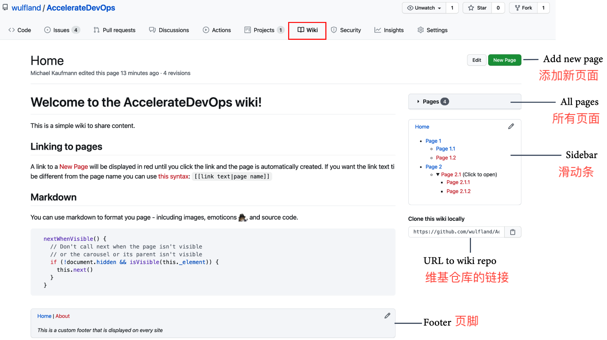

图4.14 - GitHub wiki结构

GitHub维基是一个非常简单的维基解决方案，但缺乏其他维基解决方案所具有的许多功能，尤其是不能使用pull request，这限制了它在异步工作流程中的优势。但幸运的是，可以在自己的仓库中托管Markdown，自己建立一个自定义的wiki。

### 一个自定义的维基(wiki)

如果开发者不喜欢GitHub Pages的复杂性，但又想在维基上处理pull request，则可以直接把Markdown文件放到仓库里。GitHub会为开发者所有的Markdown文件自动渲染一个自动生成的目录ToC（见图 4.15）。可能读者已经在GitHub仓库的README文件中注意到了这一点。

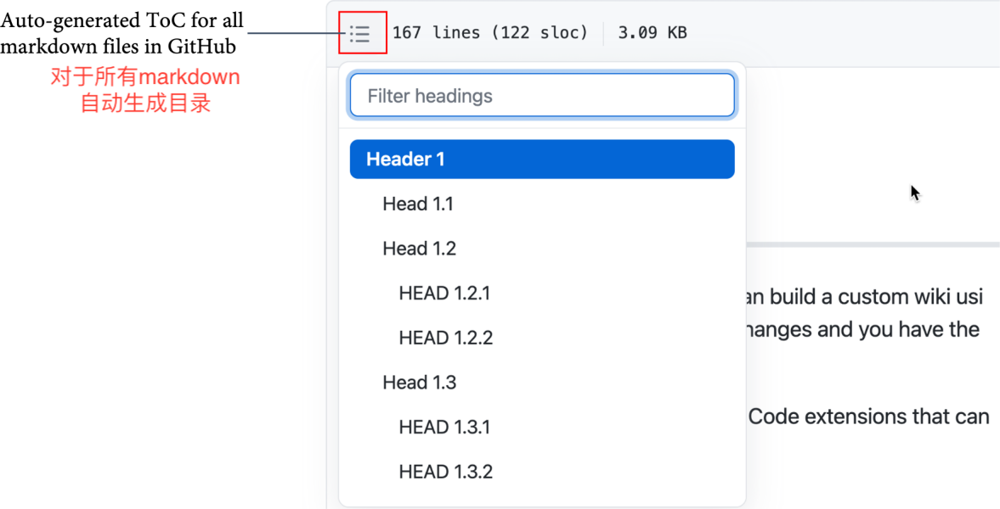

图4.15 - GitHub Markdown文件自动目录

自定义维基的问题在于导航。使用Markdown嵌套列表和相对链接来建立一个导航系统是很容易的。开发者也可以用细节使其可折叠：

```bash
<details>
    <summary>Menu</summary>
* [Home](#Header-1) 
* [Page1](Page1.md) 
 * [Page 1.1](Page1-1.md)
 * [Page 1.2](Page1-2.md)
* [Page2](Page2.md)
</details>
```

但如果开发者需要它出现在每个页面上，必须在改变它时将其复制粘贴到所有页面上。开发者可以将其自动化，但它仍然会使历史记录变得混乱。最好是在每个页面上都有类似面包屑的导航，人们可以用它来导航回到主页，并从那里使用菜单。读者可以在这里看到一个Markdown的自定义导航的例子：https://github.com/wulfland/AccelerateDevOps/blob/main/ch4_customWiki/Home.md。

从社区论坛，到简单的Markdown维基，再到用Jekyll制作的完全可定制的网页，在GitHub上为开发者的工作托管额外内容有很多选择。为手头的工作选择合适的方案并不容易。开发者需要尝试找出适合自己的团队的方法。

## 通过 __GitHub Mobile__ 随时随地的工作

大多数时候，开发者会在浏览器上协作处理 GitHub 的issues、pull requests和讨论。但也有其他选择，可以帮助开发者随时随地浏览GitHub。

GitHub Mobile 是一款移动应用程序，可通过其市场平台（https://github.com/mobile） 在安卓和苹果上使用。这款应用可以让开发者访问所有的issues、pull requests和所有仓库的讨论。它有夜晚模式和日间模式，并可以把开发者喜欢的仓库固定在开始屏幕上（见图4.16）：


图4.16 - GitHub Mobile首页的夜间模式和日间模式

作者非常喜欢GitHub的移动应用--它做得非常好，可以帮助开发者在日常工作中在工作站或笔记本电脑以外进行issues和讨论的协作。开发者可以配置通知，这样当被提及和分配时，或者当有人要求审查时，就会得到通知。通知会出现在开发者的收件箱中，开发者可以使用可配置的轻扫动作，将通知标记为完成、阅读或未读；保存通知；或取消订阅通知源。默认的标记选项是完成和保存。收件箱界面如图4.17所示。

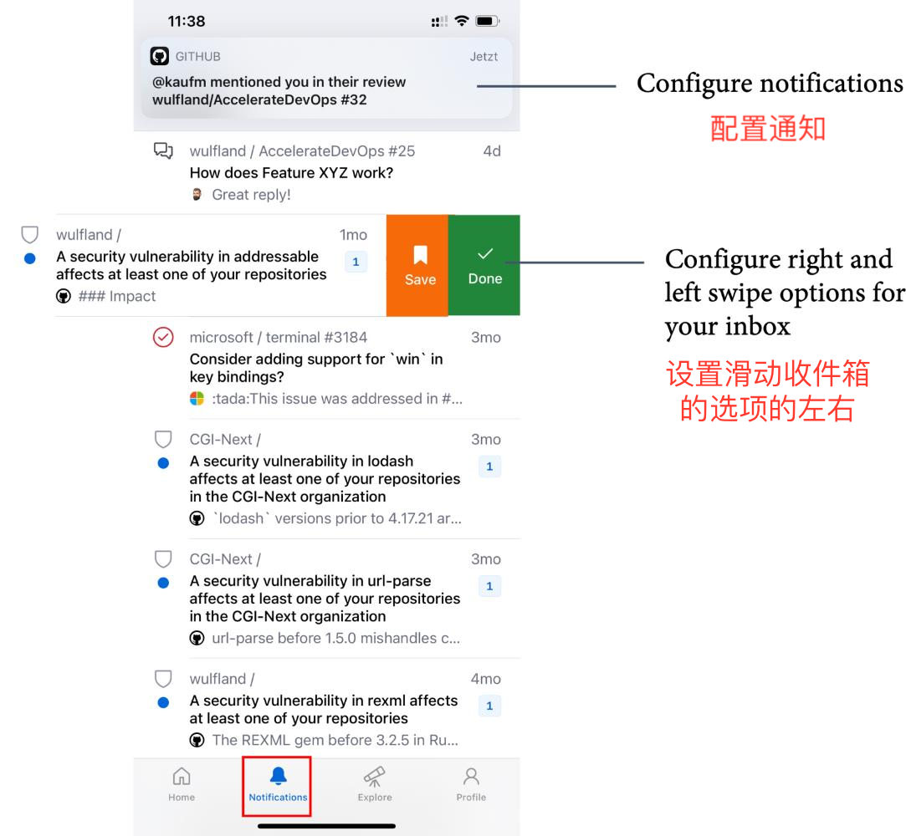

图4.17 - GitHub Mobile通知界面

第一次使用该应用程序时留下最深刻印象的是代码审查体验在移动设备上的效果。开发者可以打开换行功能，这样就可以很容易地阅读代码，看到改动，并对其进行评论（见图4.18）。

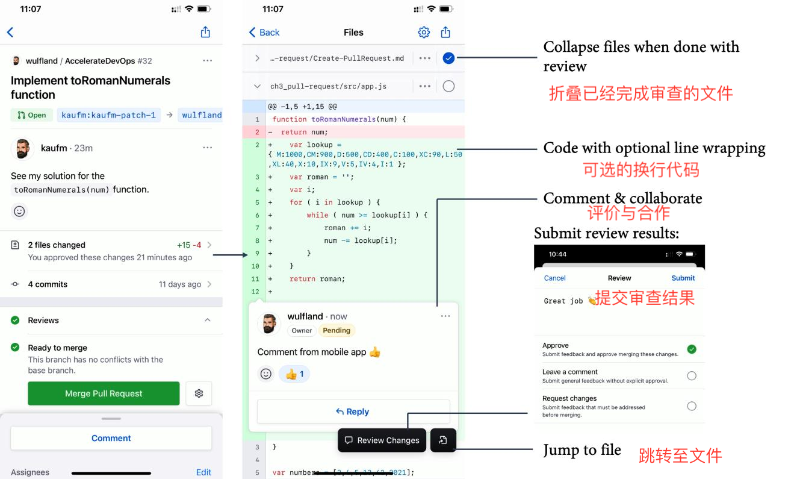

图4.18 - GitHub Mobile 上的Pull request审查

GitHub移动版是一个很好的工具，即使开发者不在办公室，也可以为团队成员解围。它允许开发者参与讨论，并对代码修改和问题进行评论。在旅途中审查小改动可能性可以帮助开发者的团队转向小批量的工作，开发者的审批等待时间更短。

## 案例研究

在Tailwind Gears的两个试点团队做的第一件事就是把他们的代码转移到GitHub仓库。一个团队已经在Bitbucket服务器上使用Git。对该团队来说，迁移就像把仓库推送到一个新的远程仓库一样容易。另一个团队使用的是团队基础服务器（TFS）的版本控制，在推送到GitHub之前，必须先在服务器上将代码迁移到Git上。两个团队都决定参加为期两天的Git培训，以便能够充分利用Git的力量，制作易于审查的良好提交。他们使用pull request草稿，以便团队中的每个人总是知道其他人在做什么，而且他们暂时设定了至少两个必要的审查员。

许多工作仍在仓库之外，例如在Word、Excel和Visio文档中，这些文档存储在公司的SharePoint服务器上。一些文件被转换为便携式文件格式（PDF），并由管理层签字确认。在发布符合某些规定的产品之前。有太多的文件需要一次性转换Markdown。这些团队在他们的代码库中创建了一个基于Markdown的自定义维基，以使所有东西都接近代码。他们添加链接到SharePoint中的当前文档。每当需要对文件进行修改时，内容就会被移到Markdown文件中，链接也会被删除。而不是签署PDF文件，管理层被添加为相应文件的代码所有者，并直接在拉取请求中批准更改。与审计日志一起，这对所有必要的合规性审计都是有效的。

当迁移到新平台时，许多方面都与两个团队有关，以后也会与其他团队有关，因为他们也会迁移到新平台上。这就是为什么他们要创建一个共享的平台仓库。该仓库包含GitHub讨论，以便与所有工程师合作，即使是那些还不在这两个团队中的人。一个技术博客是使用GitHub页面建立的，以分享技巧和窍门。Jekyll网站也被用来合作制定共同的审查准则和行为守则。

## 总结

本章介绍了同步和异步工作的优势和劣势。读者可以用它来创建有效的异步工作流程，从而实现更好的跨团队协作，使远程和混合团队能够跨越多个地区和时区。通过本章，可以了解到GitHub讨论、Pages和维基如何帮助开发者为代码和需求以外的主题制定异步工作流程。

下一章将解释开放和内部资源对软件交付性能的影响。

## 阅读和参考

以下是本章的参考资料，可以通过它们获取更多信息：

- History of communication: https://en.wikipedia.org/wiki/History_of_communication, https://www.g2.com/articles/history-of-communication, and https://www.elon.edu/u/imagining/time-capsule/150-years/
- History in general: https://www.dhm.de/lemo/kapitel (German)
- World population growth: https://ourworldindata.org/world-population-growth
- Hybrid work: https://www.microsoft.com/en-us/worklab/work-trend-index/hybrid-work
- Work trend index: https://www.microsoft.com/en-us/worklab/work-trend-index
- GitHub Discussions: https://docs.github.com/en/discussions
- GitHub Pages: https://docs.github.com/en/pages
- GitHub Mobile: https://github.com/mobile
