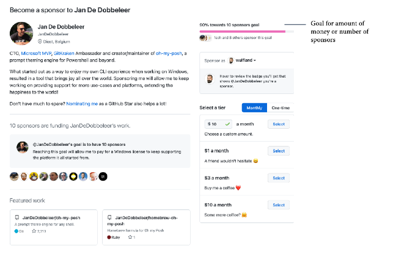

# 第5章 开源和内部开源对软件交付性能的影响
在20年前，也就是2001年6月1日，微软前首席执行官史蒂夫·鲍尔默在接受《芝加哥星期日泰晤士报》的采访中发表了以下言论：

“Linux可以说是一种癌症，从知识产权的意义上来讲，它会把自己附着在它所接触的一切事物上。”（Greene T.C.（2001））

他关注的不仅仅是Linux，而是所有的开源许可证。在20年后的今天，微软超过了Facebook、Google、Red Hat和SUSE成为了世界上最大的开源贡献者。微软不仅有许多开源产品，例如PowerShell、Visual Studio Code和.NET，而且他们还为Windows 10提供了一个完整的Linux内核，以便读者可以在其上运行任何发行版本。微软总裁布拉德·斯米特承认，“当开源在本世纪初呈爆发式出现时，微软站在了历史的错误一边”（沃伦·T（2020））。
如果读者去看对开源贡献最大的10家公司，会发现里面有所有制造商业软件的大型科技公司：

|        |  Company   | Active Contributors  | Total Community |
|  ----  |  ----  | ----  | ----  |
|    1   | Microsoft  | 5,368 | 10,924 |
|    2   | Google  | 4,907 | 9,635 |
|    3   | Red Hat  | 3,211 | 4,738 |
|    4   | IBM  | 2,125 | 5,062 |
|    5   | Intel  | 1,901 | 3,982 |
|    6   | Amazon  | 1,742 | 4,415 |
|    7   | Facebook  | 1,350 | 4,017 |
|    8   | GitHub  | 1,122 | 2,871 |
|    9   | SAP  | 811 | 1,606 |
|    10   | VMware  | 786 | 1,604 |

表5.1 -开源贡献指数，2021年8月2日(https://opensourceindex.io/)

到底在过去二十年发生了什么变化，以至于有影响力的科技公司现在都开始拥抱开源？

在本章中，将解释自由和开源软件的历史，以及为什么在过去几年中它变得如此重要。并且本章还将解释开源对读者的项目速度的影响，以及在开发者的公司如何使用开源的原则来实现更好的跨团队协作（内部开源）。

本章将涵盖以下主题：
- 自由和开源软件的历史
- 开源与开放开发的区别
- 公司采用开源的好处
- 实施开源战略
- 开源和内部开源
- 内包的重要性
- GitHub赞助商

## 自由和开源软件的历史
如果想要理解开源，必须回到计算机科学的早期。

### 公共领域的软件
在20世纪50年代和60年代，与必要的硬件相比，软件的价格很低。软件都是主要由学者和企业研究团队开发出来。源代码与软件一起发布是很正常的——通常是公共领域软件。这意味着软件是免费的，没有所有权、版权、商标或专利。这些开放与合作的原则对当时的黑客文化产生了巨大影响。

在20世纪60年代末，操作系统和编译器的兴起增加了软件成本。这是由不断增长的软件行业推动的，该行业与硬件供应商竞争，硬件供应商将其软件与硬件捆绑在一起。

在20世纪70年代和80年代，销售软件使用许可证开始变得普遍，1983年，IBM停止将其源代码与购买的软件一起发布。

### 自由软件
理查德·史泰尔曼认为这在道德上是错误的，他于1983年创立了GNU项目，在不久后，他创立了自由软件运动。自由软件运动认为，如果软件的使用者被允许执行以下操作，则认为软件是自由的：
- 可以出于任何目的运行程序。
- 研究软件并以任何方式更改它
- 重新发布程序并制作副本。
- 改进软件并发布改进

Richard在1985年创建了自由软件基金会（FSF）。FSF因为以下说法闻名：
“自由是指像言论自由一样，而非是畅饮啤酒那样。”

这意味着“自由”一词意味着分配的自由，而不是成本的自由（开源是自由的，而不是免费的）。由于大部分自由软件已经是免费的。软件（自由软件）与免费软件和零成本有关系。

自由软件运动创造了一个概念叫做copylef。这授予用户使用和修改软件的权利，但保留了软件的自由状态。这些许可证的示例包括GNU通用公共许可证（GPL）、Apache许可证和Mozilla公共许可证。

今天仍在数百万设备上运行的大多数优秀软件都是使用这些版权许可证发布的；例如，Linux内核（由Linus Torvalds于1992年发布）、BSD、MySQL和Apache。
### 开源软件

1997年5月，在德国维尔茨堡举行的Linux大会上，埃里克·雷蒙介绍了他的论文《The Cathedral and the Bazaa》（Raymond，E.S.1999）。他在论文里介绍了自由软件原则、黑客文化以及软件开发的好处。这篇论文引起了大量关注，并促使Netscape公司将其浏览器Netscape作为免费软件发布。
Raymond和其他人希望将自由软件原则介绍给给更多的商业软件供应商，但“自由软件”一词对商业软件公司也有负面影响。

1998年2月3日，自由软件运动的许多重要人士在帕洛阿尔托举行了一次战略会议。在会议上讨论了自由软件的未来。与会者包括埃里克·雷蒙、迈克尔·铁曼和克里斯汀·彼得森，他们提出了开源一词，支持自由软件。
开放源代码倡议（OSI）是由埃里克·雷蒙德和布鲁斯·佩雷斯于最近创立的.1998年2月，雷蒙德担任第一任主席（OSI 2018）。

1998年，在出版商蒂姆·奥莱利（Tim O'Reilly）的历史性自由软件峰会（后来被命名为开源峰会）上，该术语迅速被早期支持者采纳，如莱纳斯·托瓦尔兹（Linus Torvalds）、拉里·沃尔（Larry Wall）（Perl的创建者）、布莱恩·贝伦多夫（Brian Behlendorf）（Apache）、埃里克·奥尔曼（Eric Allman）（Sendmail）、吉多·范·罗森（Guido van Rossum）（Python）和菲尔·齐默尔曼（Phil Zimmerman）（PGP)（O'Reilly 1998）。

但是Richard Stallman和FSF拒绝了新的开源术语（Richard S.2021）。这就是为什么自由开源软件（FOSS）运动存在分歧，今天仍然使用不同的术语。

在20世纪90年代末和21世纪初，在网络泡沫中，开源和开源软件（OSS）这两个术语被公共媒体广泛采用，并最终成为更流行的术语。
### 开源软件的兴起

在过去的二十年中，开源越来越流行。Linux和Apache等软件很大程度上驱动着互联网的发展。在一开始，OSS很难进行商业化。因此本章节的第一个想法是围绕开源产品提供企业级支持服务。在这个方面，做得比较成功的公司是红帽和MySQL。但这是很困难的，而且没有商业许可所提供的规模。因此，大量投资于构建OSS的开源公司开始创建开放核心产品：一种免费的开源核心产品，以及商业附加组件，客户可以购买这些产品。

软件商业模式从传统许可证向软件即服务（SaaS）订阅的转变帮助开源公司将其OSS商业化。这促使传统软件供应商发布他们的软件——至少是核心软件——开源来和社区互动。

不仅微软、谷歌、IBM和亚马逊等大型软件公司成为了大型开源公司，而且像红帽和MuleSoft这样的纯开源公司也获得了很多价值和市场认可。例如，红帽于2018年被IBM以320亿美元收购。同年，Salesforce以65亿美元收购了MuleSoft。

因此，今天的开源并不是来自于创造替代自由软件的革命思想。为云提供商提供软件和平台服务的大多数顶级软件都是开源软件（Volpi M.2019）。

## 开源与开放开发的区别

因此，OSS指的是根据许可证发布的计算机程序，该许可证授予用户使用、研究、修改和共享软件及其源代码的权利。

但将源代码公开在版权许可下只是第一步。如果一家公司想要拥有开源的所有收益，它必须采用开源的价值观，这就导致了一种叫做开放开发的东西。这意味着开发者不仅可以访问源代码，而且开发者必须使整个开发和产品管理透明。这包括以下内容：
- 要求
- 架构和研究
- 会议
- 标准

.NET团队是一个很好的例子，他们在Twitch和YouTube上主持社区站（参见https://dotnet.microsoft.com/live/community-standup)。
开放式发展还意味着创造一个开放和包容的环境，让每个人都能安全地提出变革。这包括一个强大的道德规范和一个干净的代码库，该代码库具有高度自动化，允许每个人快速轻松地做出贡献。

## 为公司提供开源的好处
那么，开源如何与更好的开发绩效相联系，以及您的公司如何从良好的开源战略中获益？

### 使用开源软件更快地交付
根据来源的不同，新产品已经包含70%到90%的开源代码。这意味着开发者自己编写的代码将减少70%到90%，这可以显著减少开发者的上市时间。

除了在产品中重用开源代码之外，还有很多平台工具可以作为开源工具使用。可重复使用的GitHub操作、测试工具或容器编排······在大多数情况下，开发者可以使用开源软件来更快地交付软件。

### 通过吸引社区参与，打造更好的产品
如果开发者在公开环境中开发产品的某些部分，读者可以利用社区的蜂巢思维来构建更好、更安全的软件。它还可以帮助读者从世界各地的优秀工程师那里获得有关读者正在做什么的早期反馈。

特别是对于复杂、关键和安全相关的软件，与社区合作通常会带来更好的解决方案：

“问题越大，开源开发人员就越被吸引，就像磁铁一样，一起致力于解决这个问题。”
（Ahlawat P.、Boyne J.、Herz D.、Schmieg F.和Stephan M.（2021））

### 使用报废风险较低的工具
使用开源可以降低工具过时的风险。如果读者可以自己构建工具，那么必须自己维护它们————这不是读者的首要任务。使用小供应商提供的工具或由合作伙伴构建工具会带来工具无法维护或合作伙伴退出市场的风险。相反，投资于开源工具可以显著降低这些风险。

### 吸引人才
让工程师能够在工作中利用开源，并在工作时间为开源项目做出贡献，这会对读者的招聘能力产生重大影响。参与社区并参与开源将有助于吸引人才。

### 影响新兴技术和标准
许多新兴技术和标准都是公开开发的。对这些计划的贡献使您的公司能够影响这些技术，并成为前沿开发的一部分。

### 通过学习开源项目来改进流程
当然，如果您接受开源，您的公司可以学习协作开发，并应用这些原则来改善公司内部的跨团队协作（称为内部开源）。

## 实施开源战略

但是，尽管拥抱开源的好处很多，但也有一些风险必须解决。在您的产品和工具链中使用开源软件时，您必须严谨并且遵守许可证。如果开源组件造成损害，您还必须自己承担责任，因为您没有可以起诉的供应商。此外，如果您承担了太多的依赖关系（直接或间接），其中一个依赖关系中断，也会带来风险。
> 笔记
>
> 在第14章“保护您的代码”中，读者将了解软件包中的11行代码和一个名称的冲突是如何造成严重破坏并摧毁互联网的大部分内容的。

这就是为什么你的公司应该制定开源战略。该策略应该定义什么类型的开源软件开发人员可用于何种目的。对于不同的目的，可能有不同的规则。如果您想在产品中包含开源，您将需要某种治理策略来管理相关风险。

该策略还应定义是否允许开发人员在工作时间为开源做出贡献，以及这方面的条件。

本章节将不深入探讨该战略的细节。这在很大程度上取决于读者的计划如何使用开源以及如何开发和发布产品。只要确保您的公司有一份关于您的开源战略的文档————即使它一开始很简短。它将随着开源的成熟度和经验的增长而发展。

本章节的一个建议是实施一个精英中心或社区，它帮助您制定一个策略，如果开发人员有疑问或不确定开源组件是否符合要求，他们可以求助于该策略（Ahlawat P.、Boyne J.、Herz D.、Schmieg F.、Stephan M.2021）。

## 开放和内部开源
开源的成功在于其开放和协作的文化。让合适的人自愿进行远程异步协作，有助于以最佳方式解决问题。原则如下：
- 开放式协作
- 开放式沟通
- 代码评审

将这些原则应用于组织内的专有软件称为内部开源。这一术语从2000年开始由蒂姆·奥莱利（Tim O'Reilly）提出。内部开源可以是打破与企业其他部分隔绝的部分并促进团队和产品之间强大协作的好方法。

但是像开源和开放开发一样，仅仅使代码可用不足以创建内部开源文化。成功因素影响内部开源方法能否成功：
- 模块化产品架构：如果您有一个大型的整体架构，这将使人们无法做出贡献。此外，代码的质量、文档以及您理解代码和贡献的速度对内部源代码的采用有很大影响。
- 标准化工具和流程：如果每个团队都有一个工具链和工作流，我也会避免其他工程师参与其中。拥有一个通用的工程系统和类似的分支和CI/CD方法将有助于其他人专注于问题，而不必首先学习其他工具和工作流
- 自主性和自组织性：只要您的组织向您的团队提出需求，并且工程师忙于在他们的截止日期完成工作，那么对其他团队的贡献就不会发生。只有当团队能够自主地确定优先级并以自组织的方式工作时，他们才能自由地参与其他社区——无论是开源还是开源。
内部开源可以帮助打破企业部门之间的壁垒，提高工程速度。但这也与高水平的DevOps成熟度有关。内部开源是随着您的DevOps能力和开源成熟度的提高而发展的。因此，将其视为对于你的加速是输出而不是输入。
> 笔记
> 从技术上讲，内部开源通常是通过在企业中激活分叉来完成的。这与您的分支工作流紧密相连，我们将在第11章“基于主干的开发”中介绍。

## 内包的重要性
许多公司认为软件开发不是他们的核心业务，因此他们倾向于将其外包。外包意味着一家公司雇佣另一家公司或自由职业者来执行特定的功能。外包通常不是一个坏方法：如果读者您有另一家专门从事一项工作的公司为您做这项工作，这样您就可以把您的员工和投资专门放在您的核心产品上。专业公司通常会做得更便宜、更好————自己培养这些技能可能需要花费大量时间和金钱。

但现在，软件基本上是所有产品的关键区别。不仅是数字客户体验，智能制造或供应链管理也能给您带来竞争优势。定制软件正在成为您核心业务的一部分。由于这一点，许多公司已经制定了软件开发的内包战略——即内部招聘和雇佣软件开发人员和DevOps工程师。

问题是软件开发人员和DevOps工程师的市场竞争激烈（所谓的人才争夺战）。这通常会导致合作伙伴在核心产品上工作，开发人员维护工具的分散局面。

一个好的内包策略是问问自己，软件是否是您业务的核心，也就是说，它是否能给您带来竞争优势：
- 核心软件应由内部开发人员开发。如果你不能雇佣足够熟练的开发人员，你可以与你信任的合作伙伴之一的工程师共同寻找并扩充你的员工。但目标应该始终是以后用您的工程师替换这些开发人员。
- 辅助软件可以外包。在最好的情况下，您可以使用现有的产品。如果没有这样的产品，您可以让合作伙伴构建它。这里是开源发挥作用的地方：您可以利用现有的开源解决方案，或者让您的合作伙伴在开放环境中构建解决方案。这降低了您成为唯一客户和解决方案过时的风险。由于软件只是对您的业务的补充，您不在乎其他公司是否也使用它。相反，您的软件使用得越多，软件过时的风险就越小。此外，如果软件是在操作环境中开发的，质量是可靠的。

支付给其他公司或个人为您开发特殊的开源软件，或为现有的开源解决方案添加功能，这并不常见。但随着越来越多的公司采用内包战略，以及人才争夺战的持续，这将在未来几年显著增加。

## GitHub赞助商
一开始，开源策略似乎与内包策略相冲突。但问题更为复杂。对于核心软件来说，为开源项目提供一个小功能可能比自己实现一个解决方案更有用。但在许多公司，团队层面在自己做还是向别人买的决策中总是倾向于做，因为用金钱购买或资助某些东西的过程太复杂。一个好的内包策略应该始终包括一个轻量级和快速的过程，并在工具和软件供应链上投入一定的预算。如果您的公司内部开发人员不足，购买软件或赞助开源贡献者应该没有问题。

让您的团队能够投资于开源项目的一个好方法是利用一个名为GitHub赞助商的功能。它允许您投资于产品依赖的项目（您的软件供应链），并保持这些项目的活力。它还可以让维护人员自由地编写新请求的特性，而不必自己实现它们。

一个积极的副作用是赞助对开源社区来说是显而易见的。这是一个很好的营销，给了你的公司信誉，可以帮助你吸引新的人才。

如果个人开发者或组织是GitHub赞助商计划的一部分，您可以为他们提供赞助。你也可以代表你的组织赞助他们。这种赞助可以是一次性或每月支付，并且可以在您的个人资料或组织的个人资料中看到（见图5.1）：

Sponsor a project  or person 赞助一个项目或者个人

Sponsors of a project or person 一个项目或者个人的赞助者

图5.1–GitHub赞助商中启用的组织配置文件

GitHub赞助商不会从用户帐户收取任何赞助费用，因此这些赞助中的100%归受赞助的开发者或组织所有。

### 赞助商级别
赞助商可以设置不同的赞助级别。这可以通过一次性赞助或者是每月定期付款来实现（见图5.2）：

Sponsor as a yourself for on behalf of your organization 代表您的组织作为自己的赞助商

Sponsoring can be monthly or one-time 赞助可以是每月或一次性的

Select one of the tiers the owner has created 选择所有者创建的层之一

图5.2–月度或一次性赞助的选项

所有者每月最多可以设置10层，一次性付款最多可设置10层。这使他们能够将制定的回报链接到不同的层。例如，回报如下：

- 知名度：可以在网站或社交媒体上提及赞助商。也可能有徽章（如银牌、金牌和白金赞助商）用于区分不同级别的赞助
- 访问：赞助商可以访问私有存储库或早期版本。
- 优先排序：赞助商的bug或功能请求可以优先排序。
- 支持：一些赞助商也为解决方案提供支持（在一定程度上）

接下来我们来看一下赞助目标。

### 赞助目标

赞助账户可以设定融资目标。目标可以基于赞助商数量或每月的赞助金额（美元），并显示在赞助页面上（见图5.3）：

Goal for amount of money or number of sponsors 对于金额或者是赞助商数量的目标

图5.3–Python的赞助目标是每月获得12000美元

赞助目标可以与某些里程碑联系起来。例如，维护人员可以在他们辞去日常工作并开始全职工作时设置一定的金额。组织还可以设置雇佣新开发人员以帮助维护项目所需的金额。

## 总结
在本章中，读者了解了自由和开源软件的历史、价值观和原则，以及它对软件交付性能的影响。一个好的开源战略，再加上一个良好的内包战略，以及您的团队赞助和资助开源项目的能力，可以帮助您显著缩短上市时间，并让您的工程师开发对您公司至关重要的功能。将这些原则应用于公司内部资源，可以帮助您建立协作文化，实现更好的跨团队协作。

在下一章中，我们将学习GitHub操作的自动化。

## 进一步阅读和参考
有关本章内容的更多信息，请参阅以下材料：
- Greene T. C. (2001). Ballmer: Linux is a cancer: https://www.theregister.com/2001/06/02/ballmer_linux_is_a_cancer/. 
- Warren T. (2020). Microsoft: we were wrong about open sourc: https://www.theverge.com/2020/5/18/21262103/microsoft-open-source-linux-history-wrong-statement. 
- Raymond, E. S. (1999). The Cathedral and the Bazaar: Musings on Linux and OpenSource by an Accidental Revolutionary. O'Reilly Media.
- O'Reilly (1998). FREEWARE LEADERS MEET IN FIRST-EVER SUMMIT O'Reilly 
- Brings Together Creators of Perl, Apache, Linux, and Netscape's Mozilla (Press Release): https://www.oreilly.com/pub/pr/636. 
- OSI (2018). Open Source Initiative - History of the OSI: https://opensource.org/history. 
- Richard S. (2021). Why Open Source Misses the Point of Free Softwar: https://www.gnu.org/philosophy/open-source-misses-the-point.en.html. 
- Volpi M. (2019). How open-source software took over the worl: https://techcrunch.com/2019/01/12/how-open-source-software-took-over-the-world/. 
- Ahlawat P., Boyne J., Herz D., Schmieg F., & Stephan M. (2021). Why You Need an Open Source Software Strateg: https://www.bcg.com/publications/2021/open-source-software-strategy-benefits. 
- Inner Source: https://en.wikipedia.org/wiki/Inner_source. 
- GitHub Sponsors: https://github.com/sponsors.

