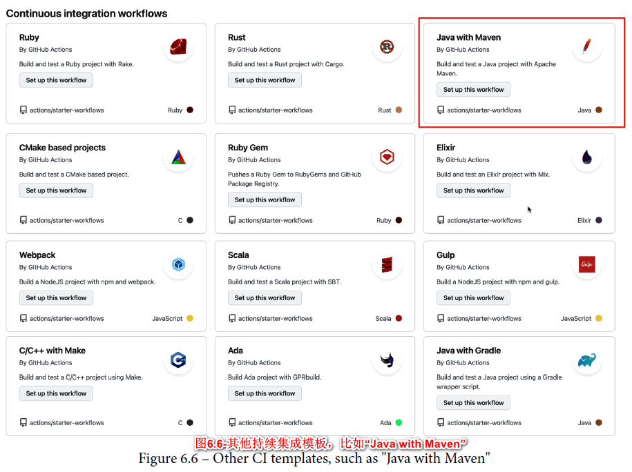
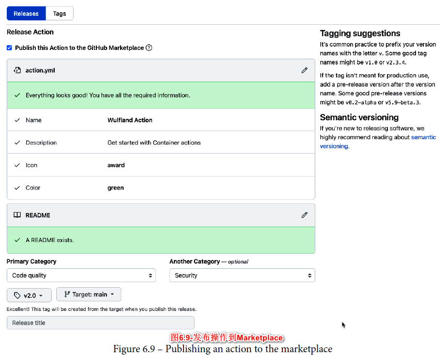

# 第6章 使用Github Actions实现自动化

很多敏捷方法的使用者认为工程实践不如管理和团队实践重要。但是像持续集成(CI)、持续交付(CD)和基础设施即代码(IaC)等工程能力是实现更频繁、更稳定和更低风险发布的支撑因素(Humble, J., &amp; Farley, D. 2010)。这些做法降低了部署的难度，从而让开发者减少加班，使工作更加轻松。

从本质上讲，这些做法都与自动化有关，即让计算机执行重复任务，使人们可以专注于解决重要问题和进行一些创造性工作。

*“计算机执行重复任务，人们解决问题。”*

*Forsgren, N., Humble, J., & Kim, G. 2018*

自动化对企业文化和人们的工作方式有很大的影响，因为许多习惯是为了避免手动、重复的任务而养成的，尤其是一些非常容易出错的任务。本章将介绍GitHub自动化引擎——GitHub Actions，该引擎具有包括CI/CD在内的多种功能。

本章将包含以下话题：

- GitHub Actions概述
- 工作流、管道和操作
- YAML基础
- 工作流语法
- 使用密钥工作
- 动手实践——第一个工作流
- 动手实践——第一个操作
- GitHub Marketplace

## GitHub Actions概述

**GitHub Actions**是GitHub原生自动化引擎，不仅是提交代码进行版本控制，它还允许用户在GitHub中的任何事件上都可以运行工作流。GitHub可以在以下情况下触发的工作流：Issue状态更改或被添加到里程碑、卡片在GitHub项目中被移动、仓库被他人点亮星标或讨论中新增了评论，几乎所有事件都可以触发工作流。工作流本身是为重用而构建的，用户只需将代码提交到仓库中即可构建可重用的操作。也可以分享自己的操作到拥有约10,000个操作的GitHub Marketplace(https://github.com/marketplace)上。

工作流可以在Linux、macOS、Windows、ARM和容器这些主流平台的云端中执行，甚至可以在云端或自己的数据中心配置和托管运行器，而无需对外暴露端口。

> **GitHub Learning Lab**
>
> **GitHub Learning Lab**(https://lab.github.com) 是一门通过实操来学习Github的课程，课程通过issue和pull request不断推进，其中有一条完整的 **DevOps with GitHub Actions** 学习路线(https://lab.github.com/githubtraining/devops-with-github-actions) 。读者也可以单独参加一些课程，比如 **GitHub Actions：Hello World** ( https://lab.github.com/githubtraining/github-actions:-helloworld ) 。所有课程都是免费的，如果读者之前没接触过Github并且喜欢在实践中学习，这值得一试！

## 工作流、管道和操作

GitHub**工作流**是一个可配置的自动化过程，由不同的**作业**组成，可以在**YAML**文件中配置，并放在仓库的 *.github/workflows*目录中。工作流可用于构建并部署软件到不同的环境或平台，在其他CI/CD系统中通常称为**管道**。

**作业**是在配置好的运行器上执行的工作流的一部分，运行器环境使用*runs-on*属性进行配置。默认情况下作业并行运行，不同作业可以通过依赖（使用*needs*关键字）链接在一起来顺序执行，每个作业可以在指定环境中运行。**环境**是资源的逻辑分组，可以由多个工作流共享，还可以使用**保护规则**进行保护。

作业由一系列称为**步骤**的任务组成，每个步骤可以运行命令、脚本或**GitHub操作**。**操作**是工作流的可重用部分，并非所有步骤都是操作，但所有操作都作为作业中的步骤执行。

表6.1展示了工作流中的一些重要术语：


> 表6.1-GitHub Actions中的一些关键术语
>
> | 名词   | 描述                                                         |
> | ------ | ------------------------------------------------------------ |
> | 工作流 | 自动化流程，通常称为管道                                     |
> | 作业   | 工作流的一部分，由一系列在运行器上执行的任务组成             |
> | 运行器 | 执行作业的虚拟或物理计算机或容器，可以云托管或自托管，也称为代理 |
> | 步骤   | 单个任务，作为作业的一部分执行                               |
> | 操作   | 一个可用于不同作业和工作流的可重用步骤，可以是Docker容器、JavaScript或由其他步骤组成的复合操作，可分享在GitHub Marketplace。 |
> | 环境   | 可以共享相同保护规则和密钥的一组逻辑资源，可用于多个工作流   |

## YAML基础

工作流是用扩展名为 *.yml*或 *.yaml*的YAML文件编写的。**YAML**(即*YAML Ain&#39;t Markup Language*)是一种优化后的可供人类直接写入和读取的数据序列化语言。它是**JSON**的严格超集，但是使用换行符和缩进代替大括号进行语法表示。与markdown一样，它也适用于pull request，因为更改总是以行为单位。以下将介绍一些可以帮助读者入门的YAML基础知识。

### 注释

YAML中的注释以“#”开头：

```yaml
# A comment in YAML
```

### 标量类型

可以使用以下语法定义单个值：

```yaml
key: value
```

支持很多数据类型：

```yaml
integer: 42
float: 42.0
string: a text value
boolean: true
null value: null
datetime: 1999-12-31T23:59:43.1Z
```

注意键和值可以包含空格且不需要引号,但是可以用单引号或双引号来引用键和值：

```yaml
'single quotes': 'have ''one quote'' as the escape pattern'
"double quotes": "have the \"backslash \" escape pattern"
```

跨越多行的字符串，例如脚本块，可以使用管道符号 | 和缩进：

```yaml
literal_block: |
    Text blocks use 4 spaces as indentation. The entire
    block is assigned to the key 'literal_block' and keeps
    line breaks and empty lines.
    
    The block continuous until the next element.
```

### 集合类型

嵌套数组类型（也称映射）经常用于工作流中，使用两个缩进空格：

```yaml
nested_type:
  key1: value1
  key2: value2
  another_nested_type:
    key1: value1
```

序列在每个项目之前使用破折号 -：

```yaml
sequence:
  - item1
  - item2
```

由于YAML是JSON的超集，还可以使用JSON语法单行表示序列和映射：

```yaml
map: {key: value}
sequence: [item1, item2, item3]
```

以上基础足以使读者在GitHub上编辑工作流，如果想了解有关YAML的更多信息，可查看 https://yaml.org/ 。接下来介绍工作流语法。

## 工作流语法

工作流文件中首先映入眼帘的是它的名称，GitHub在存储库的“操作”选项卡上会显示工作流的名称：

```yaml
name: My first workflow
```

名称后面紧跟着触发器。

### 工作流触发器

触发器是指*on*键对应的值：

```yaml
on: push
```

触发器可以包含多个值：

```yaml
on: [push, pull_request]
```

触发器可能包含其他可配置的值：

```yaml
on:
  push:
    branches:
      - main
      - release/**
  pull_request:
    types: [opened, assigned]
```

触发器可分为三类：

- Webhook事件
- 计划事件
- 手动事件

**Webhooks事件**几乎包含到目前为止接触到的所有事件，比如将代码推送到GitHub(push)、创建或更新拉取请求(pull_request)、创建或修改问题 (issues)等都属于Webhooks事件。完整Webhooks事件列表可见 https://docs.github.com/en/actions/reference/events-thattriggerworkflows 。

**计划事件**与cron作业使用相同的语法，由五个字段组成，分别代表分钟(0–59)、小时(0–23)、日期(1–31)、月份(1–12或JAN–DEC)和星期(0–6或SUN-SAT)。表6.2展示了用户可以使用的运算符：


> 表6.2-计划事件相关运算符
>
> | 运算符 | 描述       |
> | ------ | ---------- |
> | *      | 任何值     |
> | ,      | 列表分隔符 |
> | -      | 取值范围   |
> | /      | 增量值     |

以下是一些示例：

```yaml
on:
  schedule:
    # Runs at every 15th minute of every day
    - cron: '*/15 * * * *'
    # Runs every hour from 9am to 5pm
    - cron: '0 9-17 * * *'
    # Runs every Friday at midnight
    - cron: '0 0 * * FRI'
    # Runs every quarter (00:00 on day 1 every 3rd month)
    - cron: '0 0 1 */3 *'
```

**手动事件**允许用户手动触发工作流：

```yaml
on: workflow_dispatch
```

用户可以定义用户在启动工作流时的可选(或必需)**参数**。以下示例定义了一个名为*homedrive*的变量，可以使用 *${{ github.event.inputs.homedrive }}* 表达式在工作流中使用该变量：

```yaml
on:
  workflow_dispatch:
    inputs:
      homedrive:
        description: 'The home drive on the machine'
        required: true
        default: '/home'
```

也可以使用GitHub API触发工作流。为此，用户必须定义一个*repository_dispatch*触发器并指定一个或多个相关事件的名称：

```yaml
on:
  repository_dispatch:
    types: [event1, event2]
```

该工作流会在发送*HTTP POST*请求后触发，以下是使用*curl*命令发送HTTP POST请求的示例：

```yaml
curl \
  -X POST \
  -H "Accept: application/vnd.github.v3+json" \
  https://api.github.com/repos/<owner>/<repo>/dispatches \
  -d '{"event_type":"event1"}'
```

以下是相应的JavaScript示例（有关JavaScript的Octokit API客户端的更多详细信息可见 https://github.com/octokit/octokit.js ）：

```yaml
await octokit.request('POST /repos/{owner}/{repo}/dispatches',
{
  owner: '<owner>',
  repo: '<repo>',
  event_type: 'event1'
})
```

使用*repository_dispatch*触发器，用户可以在任意系统中使用任意webhook来触发工作流，这有助于工作流的自动化和集成到其他系统。

### 工作流作业

工作流本身在作业中进行配置，作业是映射，而不是列表，并且作业默认是并行运行的。如果用户想按照一定顺序链接它们，可以使用*needs*关键字让一个作业依赖于其他作业：

```yaml
jobs:
  job_1:
    name: My first job
  job_2:
    name: My second job
    needs: job_1
  job_3:
    name: My third job
    needs: [job_1, job_2]
```

每个作业都在运行器上执行，运行器可以是自托管的，也可以从云端选择，云端有各种适用于不同平台的版本。如果想一直使用最新版本，用户可以使用*ubuntu-latest*、*windows-latest*或*macos-latest*。读者将在第7章中了解有关运行器的更多信息：

```yaml
jobs:
  job_1:
    name: My first job
    runs-on: ubuntu-latest
```

如果要运行具有不同配置的工作流，可以使用**矩阵策略**。工作流将执行配置矩阵值的所有组合对应的多个作业，矩阵中的键可以是任意值，可以使用 *${{ matrix.key }}* 表达式进行引用：

```yaml
strategy:
 matrix:
    os_version: [macos-latest, ubuntu-latest]
    node_version: [10, 12, 14]
jobs:
 job_1:
    name: My first job
    runs-on: ${{ matrix.os_version }}
    steps:
      - uses: actions/setup-node@v2
        with:
          node-version: ${{ matrix.node_version }}
```

### 工作流步骤

一个作业包含了一系列步骤，每个步骤可以执行一条命令：

```yaml
steps:
  - name: Install Dependencies
    run: npm install
```

语句块可以运行多行脚本。如果用户不想让工作流在默认shell中运行，则可以对shell进行配置，也可以同时配置其他值(如*working-directory*)：

```yaml
- name: Clean install dependencies and build
  run: |
    npm ci
    npm run build
  working-directory: ./temp
  shell: bash
```

表6.3展示了工作流中可用的shell：


> 表6.3-工作流中的可用shell
>
> | 参数       | 描述                                                         |
> | ---------- | ------------------------------------------------------------ |
> | bash       | Bash shell是所有非Windows平台的默认shell，可以兼容sh。在Windows平台指定时，将使用Git中包含的Bash shell。 |
> | pwsh       | PowerShell核心，Windows平台的默认shell                       |
> | python     | Python shell，可以运行Python脚本                             |
> | cmd        | Windows平台专属，Windows命令提示符                           |
> | powershell | Windows平台专属，传统的Windows PowerShell                    |

*bash*是非Windows系统上的默认shell，可以兼容*sh*，Windows上的默认shell是*cmd*。用户还可以使用语法 *command [options] {0}* 来自定义shell：

```yaml
run: print %ENV
shell: perl {0}
```

大多数用户会重用步骤。可重用的步骤称为**GitHub操作**，可以使用*uses*关键字和以下语法引用操作：

```yaml
{owner}/{repo}@{ref}
```

*{owner}/{repo}* 是GitHub上操作的目录路径。*{ref}* 指代版本：它可以是标签、分支或某个提交的哈希值，一个常见的应用是使用标签对主要版本和次要版本进行显式版本控制：

```yaml
# Reference a version using a label
- uses: actions/checkout@v2
- uses: actions/checkout@v2.2.0
# Reference the current head of a branch
- uses: actions/checkout@main
# Reference a specific commit
- uses: actions/checkout@a81bbbf8298c0fa03ea29cdc473d45769f953
675
```

如果操作与工作流在同一仓库内，则可以使用操作的相对路径：

```yaml
uses: ./.github/actions/my-action
```

用户可以使用 *docker//{image}:{tag}* 引用存储在容器镜像仓库(如Docker Hub或GitHub Packages)中的操作：

```yaml
uses: docker://alpine:3.8
```

### 上下文和表达式语法

矩阵策略中有一些表达式，表达式的语法如下：

```yaml
${{ <expression> }}
```

表达式可以获取上下文数据并将其与运算符组合，许多对象(如matrix、github、env和runner)都可以提供上下文。举例来说，可以通过*github.sha*来获取触发工作流的提交的SHA值，可以通过*runner.os*来获取运行器的操作系统，可以通过*env*访问环境变量等。完整列表可见 https://docs.github.com/en/actions/reference/context-and-expressionsyntaxfor-github-actions#contexts 。

用户可以使用两种语法获取上下文数据，其中第二种语法较为常见：

```yaml
context['key']
context.key
```

根据键的格式，在某些情况下用户可能必须使用第一种语法，比如键以数字开头或键中包含特殊字符。

表达式经常在*if*对象中使用，以便根据不同条件决定是否运行作业：

```yaml
jobs:
  deploy:
    if: ${{ github.ref * 'refs/heads/main' }}
    runs-on: ubuntu-latest
    steps:
      - run: echo "Deploying branch $GITHUB_REF"
```

有许多预定义的函数可供使用，比如*contains(search, item)*：

```yaml
contains('Hello world!', 'world')
# returns true
```

其他函数的例子有 *startsWith()* 或 *endsWith()* 等，还有一些特殊的函数可用于检查当前作业的状态：

```yaml
steps:
  ...
  - name: The job has succeeded
    if: ${{ success() }}
```

该步骤只有在所有其他步骤都成功后才会执行，表6.4展示了可用于反映当前作业状态的所有函数：


> 表6.4-用于检查作业状态的特殊函数
>
> | 函数        | 描述                                                         |
> | ----------- | ------------------------------------------------------------ |
> | success()   | 如果前面的步骤都没有失败或取消，则返回true                   |
> | always()    | 如果之前某个步骤被取消就会导致该步骤被一直执行，并返回true |
> | cancelled() | 如果工作流被取消，则返回true                                 |
> | failure()   | 如果该作业之前的某一步骤失败，则返回true                     |

除了函数，用户还可以在上下文和函数中使用运算符，表6.5展示了一些常见的运算符：


> 表6.5-表达式中的常见运算符
>
> | 运算符 | 描述     |
> |--------| -------------- |
> | ( )    | 逻辑组合   |
> | !      | 非      |
> | <,<=   | 小于，小于等于 |
> | \>,>=    | 大于，大于等于 |
> | ==     | 等于     |
> | !=     | 不等于    |
> | &&     | 且      |
> | &#124;&#124;     | 或 |

要了解更多关于上下文对象和表达式语法的信息，可访问 https://docs.github.com/en/actions/reference/context-and-expression-syntaxforgithub-actions 。

### 工作流命令

用户可以使用工作流命令在步骤中与工作流交互，工作流命令通常使用*echo*指令传递给进程，向进程发送诸如 *::set-output name={name}::{value}* 的字符串。以下示例指定了一个步骤的输出，并在另一步骤中获取它，注意如何使用步骤ID来获取某个步骤的输出变量：

```yaml
- name: Set time
  run: |
    time=$(date)
    echo '::set-output name=MY_TIME::$time'
  id: time-gen
- name: Output time
  run: echo "It is ${{ steps.time-gen.outputs.MY_TIME }}"
```

另一个例子是 *::error* 命令，可以将错误消息写入日志。该命令还有一些可选配置参数，可以设置文件名、行号和列号：

```yaml
::error file={name},line={line},col={col}::{message}
```

用户还可以输出警告和调试消息、对日志行进行分组或设置环境变量。要了解更多关于工作流命令的信息，可访问 https://docs.github.com/en/actions/reference/workflow-commands-for-github-actions 。

## 使用密钥工作

所有自动化工作流的一个非常重要的环节是管理密钥。无论部署应用还是访问API接口，都需要凭证或密钥，所以它们需要被谨慎管理。

GitHub中可以在仓库层级、组织层级或某个环境中安全地存储密钥。密钥被加密后再进行存储和传输，不会在日志中显示。

对于组织层级的密钥，用户可以决定哪些仓库可以访问密钥。对于环境级别的密钥，可以决定所需的审查者：只有当工作流被他们批准时，才能访问密钥。

> 提示：
>
> 密钥名不区分大小写，由普通字符([a-z] 和 [A-Z])、数字([0-9])和下划线(_)组成，且不能以 *GITHUB\_* 或数字开头。
>
> 推荐使用下划线(_)分隔的大写单词对密钥进行命名。

### 存储密钥

要存储加密的密钥，用户必须拥有仓库的管理员权限，可以通过网页或GitHub CLI创建密钥。

通过网页创建新密钥时，请到仓库页面的**Settings | Secrets**。Secrets有三个选项卡，分别是**Actions**（默认）、**Codespaces**和**Dependabot**。请点击**New repository secret**创建新密钥，接着输入密钥名和密钥值（见图6.1）：


组织层级密钥的创建方法类似，在**Settings | Secrets**页面点击**New organization secret**来创建新的组织密钥，并设置该密钥的访问规则，可选访问规则如下：

- 所有仓库
- 私有仓库
- 指定仓库

当选择的访问规则是**Selected repositories**时，用户可以授予指定仓库对该密钥的访问权限。

如果使用GitHub CLI，则可以通过命令*gh secret set*创建一个新密钥：

```bash
$ gh secret set secret-name
```

输入以上命令后用户将得到一个新密钥。可以从文件中读取密钥，将其传输到命令中，也可以将其指定为密钥的主体（-b 或 --body）：

```bash
$ gh secret set secret-name < secret.txt
$ gh secret set secret-name --body secret
```

如果密钥是用于环境的，可以使用 *--env (-e)* 参数指定。

对于组织密钥，用户可以使用 *--visibility* 或 *-v* 参数将该密钥的可见性设置为*all*、*private*或*selected*。如果设为*selected*，则必须使用 *--repos* 或 *-r* 参数指定一个或多个仓库：

```bash
$ gh secret set secret-name --env environment-name
$ gh secret set secret-name --org org -v private
$ gh secret set secret-name --org org -v selected -r repo
```

### 获取密钥

用户可以在工作流中通过*secrets*上下文获取密钥，将其作为工作流文件的一个**输入** (*with:*) 或**环境变量**(*env:*) 添加到步骤中。当工作流在队列中时，会读取组织和仓库密钥，而在引用环境的作业开始时，会读取环境密钥。

> 注意：
>
> GitHub会自动从日志中删除密钥，但在步骤中进行密钥相关操作时，要十分谨慎！

不同shell和环境获取环境变量的语法不同。在Bash中，通过 *\$SECRET-NAME* 获取；在PowerShell 中，通过 *$env:SECRET-NAME* 获取；而在cmd.exe中，通过 *%SECRET-NAME%* 获取。

以下示例展示了如何在不同shell中获取密钥并将其作为一个输入或环境变量：

```yaml
steps:
  - name: Set secret as input
    shell: bash
    with:
      MY_SECRET: ${{ secrets.secret-name }}
    run: |
      dosomething "$MY_SECRET "
  - name: Set secret as environment variable
    shell: cmd
    env:
      MY_SECRET: ${{ secrets.secret-name }}
    run: |
      dosomething.exe "%MY_SECRET%"
```

> 注意：
>
> 以上示例展示了如何将密钥传递给操作。如果用户的工作流步骤是*run:*，也可以通过 *${{secrets.secret-name}}* 直接访问密钥上下文。如果希望避免脚本注入风险，则不建议这样做。但由于只有管理员可以添加密钥，在评估工作流可读性时需要考虑这点。

### GITHUB_TOKEN密钥

*GITHUB_TOKEN*密钥是一种特殊的密钥，该密钥是自动创建的，可以通过*github.token*或 *secrets.GITHUB_TOKEN*上下文访问。即使工作流没有将其作为输入或环境变量，也可以通过GitHub操作获取它。该令牌可用于在访问GitHub资源时进行身份验证，资源的默认权限可以设置为*permissive*或*restricted*，在工作流中可以调整这些权限：

```yaml
on: pull_request_target

permissions:
  contents: read
  pull-requests: write

jobs:
  triage:
    runs-on: ubuntu-latest
    steps:
      - uses: actions/labeler@v2
        with:
    	  repo-token: ${{ secrets.GITHUB_TOKEN }}
```

要了解更多有关*GITHUB_TOKEN*密钥的信息，可访问 https://docs.github.com/en/actions/reference/authentication-in-a-workflow 。

## 动手实践 - 第一个工作流

现在读者已经具备了足够的基础，本书将在之后的章节中深入研究运行器、环境和安全性。如果读者刚开始接触GitHub Actions，现在可以开始创建第一个工作流和第一个操作了！

> 提示：
>
> 读者可以使用GitHub的代码搜索，设置编程语言过滤条件(*language:yml*)和工作流路径过滤条件(*path:.github/workflows*)，来筛选找到一些现有的GitHub Actions工作流作为模板。
>
> 比如以下搜索请求将返回德国Corona-Warn-App项目的所有工作流程：
>
> *language:yml path:.github/workflows @corona-warn-app*

具体步骤如下：

1. 进入仓库主页(链接 https://github.com/wulfland/getting-started ) ，点击右上角的**Fork**按钮进行将该仓库克隆到个人账号中。

2. 在克隆得到的仓库主页，点击**Actions**选项卡，就能看到所有可使用的工作流模板，这些模板针对仓库内代码进行了优化。在本示例中，选择.NET模板，点击**Set up this workflow**按钮：

 

3. GitHub会在编辑器中创建并打开一个相应的工作流文件，该编辑器支持语法高亮和自动补全（按*Ctrl + Space*），读者也可以在右侧的Marketplace窗口内搜索操作。接着将*dotnet-version*参数设置为3.1.x并提交该工作流文件：


4. 工作流将被自动触发，读者可以在**Actions**选项卡下找到运行的工作流。如果点击该工作流，就可以得到其中的所有作业以及一些其他关键信息：


5. 点击作业可以查看作业内所有步骤的详细信息：


如果读者使用的是其他语言，则可以克隆其他仓库。例如，该仓库使用的是Java和Maven(仓库链接： https://github.com/MicrosoftDocs/pipelinesjava )。

如果克隆了该仓库，当选择工作流模板时，首先向下滚动到**Continuous integration workflows**分类，接着点击**More continuous integration workflows…**按钮，最后选择**Java with Maven**，这样工作流就能正常运行：



Github中有大量的模板，所以可以较容易地设置一个基本工作流来构建代码。

## 动手实践 - 第一个操作

GitHub Actions的强大之处在于它的可重用性，因此了解如何创建和使用操作十分重要。在这个动手实践中，读者将创建一个在Docker容器内运行的容器操作。

> 提示：
>
> 读者可以在 https://docs.github.com/en/actions/creating-actions/creating-a-dockercontaineraction 找到这个示例，并复制粘贴相关文本文件的内容。如果需要，还可以进入模板仓库 (仓库链接： https://github.com/actions/container-action ) 并点击“**Use this template**”按钮，这将自动创建一个包含所有文件的仓库。

具体步骤如下：

1. 创建一个名为*hello-world-docker-action*的新仓库，接着将其克隆到读者个人主机上。

2. 打开终端并进入仓库目录：
   ```bash
   $ cd hello-world-docker-action
   ```

3. 创建一个名为*Dockerfile*的文件，该文件不带扩展名，将以下代码添加到文件中：
   ```yaml
   # Container image that runs your code
   FROM alpine:3.10
   
   # Copies your code file from your action repository to
   the filesystem path '/' of the container
   COPY entrypoint.sh /entrypoint.sh
   
   # Code file to execute when the docker container starts
   up ('entrypoint.sh')
   ENTRYPOINT ["/entrypoint.sh"]
   ```

   在本示例中，该**Dockerfile**文件定义了一个基于Alpine Linux 3.1镜像的容器，并将 *entrypoint.sh*文件复制到这个容器中。如果该容器被执行，就会运行*entrypoint.sh*。

4. 创建一个名为*action.yml*的新文件，文件内容如下：
   ```yaml
   # action.yml
   name: 'Hello World'
   description: 'Greet someone and record the time'
   inputs:
     who-to-greet: # id of input
       description: 'Who to greet'
       required: true
       default: 'World'
     outputs:
       time: # id of output
         description: 'The time we greeted you'
     runs:
       using: 'docker'
       image: 'Dockerfile'
       args:
         - ${{ inputs.who-to-greet }}
   ```

   *action.yml*文件定义了操作及该操作的输入和输出参数。

5. 接着创建*entrypoint.sh*脚本，该脚本将在容器中运行并可以调用其他二进制文件，往其中添加以下内容：
   ```sh
   #!/bin/sh -l
   
   echo "Hello $1"
   time=$(date)
   echo "::set-output name=time::$time"
   ```

   输入参数作为参数传给脚本，并可以通过 *$1* 访问。
   脚本中使用 *set-output* 工作流命令将 *time* 参数设置为当前时间。

6. 必须保证*entrypoint.sh*文件可以执行。在非Windows系统上，只需在终端中运行以下命令，然后添加并提交更改：
   ```bash
   $ chmod +x entrypoint.sh
   $ git add .
   $ git commit -m "My first action is ready"
   ```

   在Windows系统上，上述命令无效，但是当文件被添加到索引中时，可以将其标记为可执行文件：
   ```bash
   $ git add .
   $ git update-index --chmod=+x .\entrypoint.sh
   $ git commit -m "My first action is ready"
   ```

7. 操作的版本控制使用Git标签实现。给操作添加*v1*版本标签并把所有更改推送到远程仓库：
   ```bash
   $ git tag -a -m "My first action release" v1
   $ git push --follow-tags
   ```

8. 操作现在可以在工作流中进行测试了。进入getting-started仓库(.github/workflows/dotnet.yaml) 中的工作流目录并编辑该文件，删除*jobs*（第 9 行）下的所有内容，替换为：
   ```yaml
   hello_world_job:
     runs-on: ubuntu-latest
     name: A job to say hello
     steps:
     - name: Hello world action step
       id: hello
       uses: your-username/hello-world-action@v1
       with:
         who-to-greet: 'your-name'
     - name: Get the output time
       run: echo "The time was ${{ steps.hello.outputs.time}}"
   ```

   工作流现在会调用操作（uses）并指向读者创建的仓库（your-username/hello-world-action），后面跟着标签(@v1)。它将读者的姓名作为一个输入参数传给该操作，并获取当前时间作为输出，然后将其输出到控制台。

9. 最后保存文件，工作流将自动运行。检查作业的详细信息，读者可以看到日志中输出的问候语和时间戳。

> 提示：
>
> 如果想尝试其他类型的操作，可以使用现有模板；如果想尝试JavaScript操作，可参考 https://github.com/actions/javascript-action ；如果想尝试TypeScript操作，可参考 https://github.com/actions/typescript-action 。
>
> 复合操作更加容易，因为只需要一个action.yml文件（可参考 https://docs.github.com/en/actions/creatingactions/creating-a-composite-action）。
> 
> 处理操作是一样的，只是它们的创建方法不同。

## GitHub Marketplace

用户可以使用GitHub Marketplace( https://github.com/marketplace )搜索想在工作流中使用的操作。由于发布操作并不难，Marketplace内已经有将近10,000个可用操作。用户可以按类别过滤操作或输入搜索条件来更快地找到合适的操作（见图6.7）：


操作详情页会显示对应仓库的*README*文件内容和一些其他信息，用户可以查看完整的操作版本列表并了解如何使用当前版本的操作：


发布操作到Marketplace上很容易。首先要确保该操作位于公开仓库中，其名称是唯一的，并且该仓库内有一个描述清楚的*README*文件。接着选择一个图标和图标颜色并将其添加到*action.yml*文件中：

```yaml
branding:
  icon: 'award'
  color: 'green'
```

GitHub会自动检测*action.yml*文件并提供一个“Draft a release”按钮，点击此按钮会进入发布编辑页面。如果用户选择将此操作发布到GitHub Marketplace，则必须同意服务条款，并且Github将自动检查该操作是否包含所有必需的组件。在发布编辑页面可以为该发布选择合适的标签或创建一个新标签，并为其添加标题和描述信息：



最后发布操作或将其保存为草稿。

Marketplace使自动化变得简单，因为几乎所有事件都可以看作为一个操作，所以近年来它迅速发展。

## 总结

本章介绍了自动化的重要性，介绍了GitHub Actions——一种灵活、可扩展且适用于任何类型自动化的引擎。

下一章将学习不同的托管选项以及如何托管工作流运行器。

## 拓展阅读

若要了解本章相关话题的更多信息，可查阅以下参考资料：

- Humble J., & Farley, D. (2010). *Continuous Delivery: Reliable Software Releases through Build, Test, and Deployment Automation*. Addison-Wesley Professional.
- Forsgren, N., Humble, J., & Kim, G. (2018). *Accelerate: The Science of Lean Software and DevOps: Building and Scaling High Performing Technology Organizations* (1st ed.) [E-book]. IT Revolution Press.
- *YAML*: https://yaml.org/
- *GitHub Actions*: https://github.com/features/actions、
  https://docs.github.com/en/actions
- *GitHub Learning Lab*: https://lab.github.com
- *Workflow Syntax*: https://docs.github.com/en/actions/reference/workflow-syntax-for-github-actions
- *GitHub Marketplace*: https://github.com/marketplace
