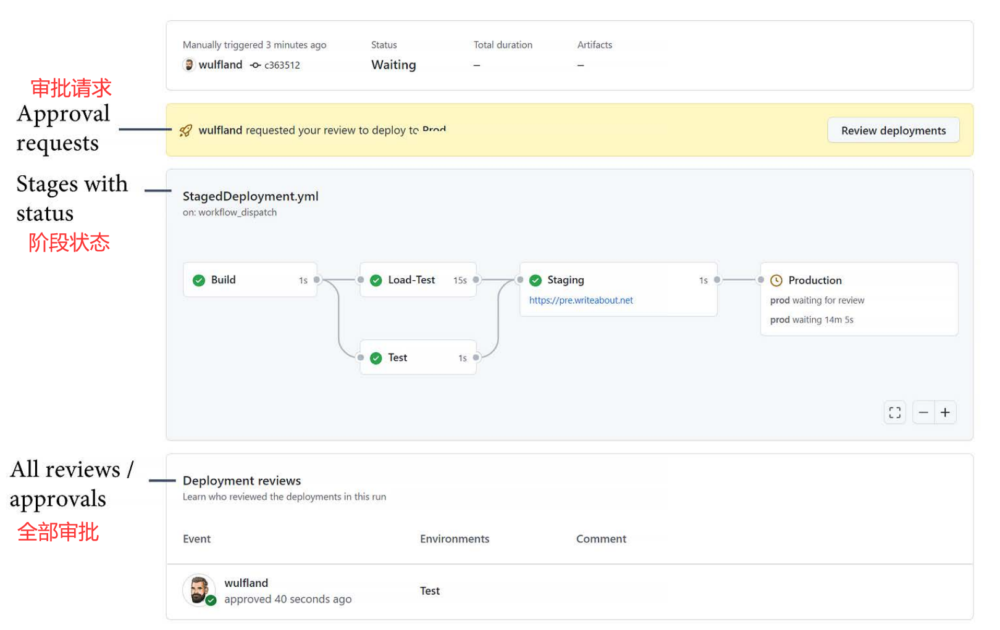
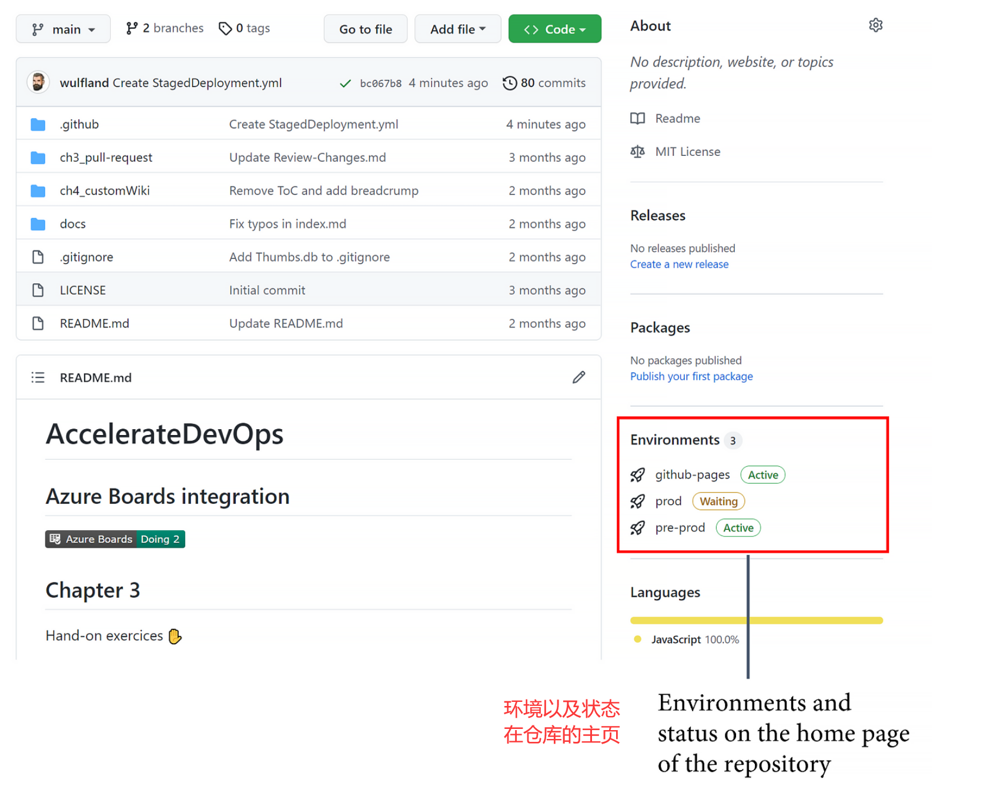
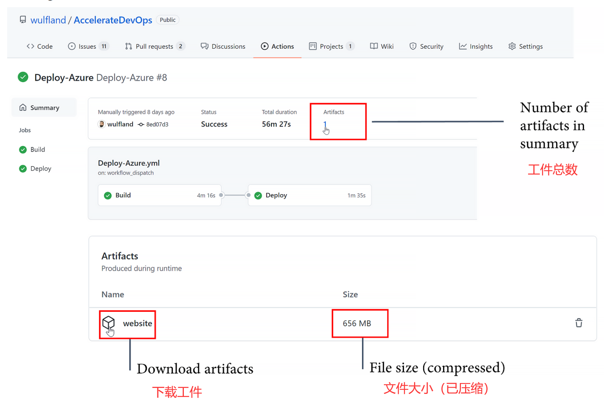
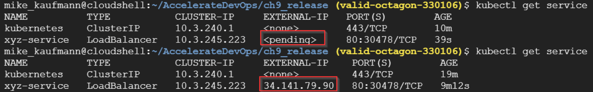
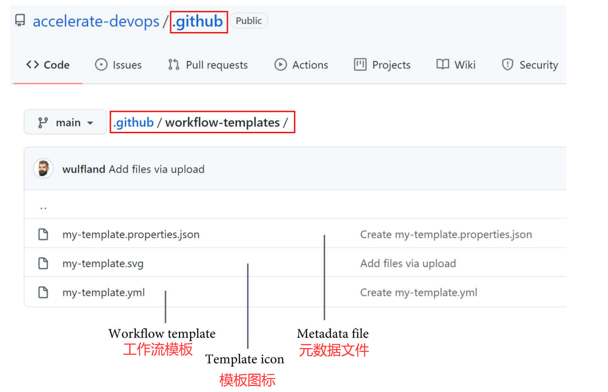
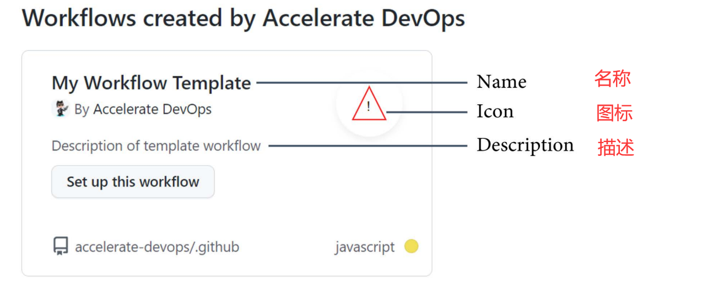
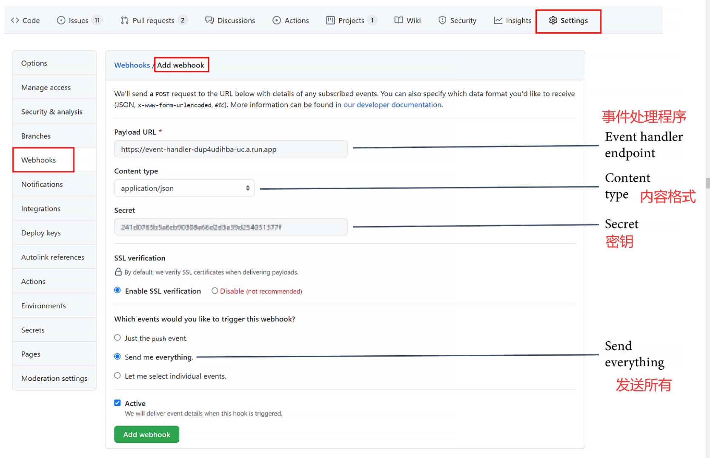
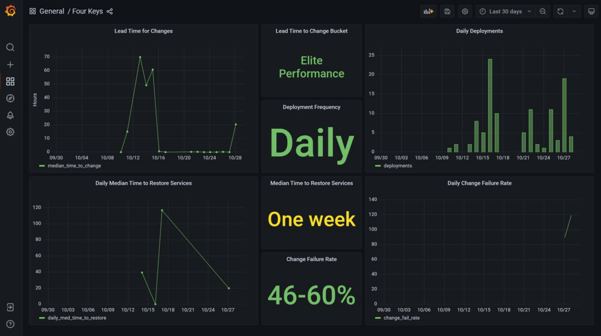

# 第9章 部署到任何平台

现在你已经学会了如何使用GitHub Actions作为自动化引擎和GitHub Packages来轻松共享代码和容器，我们可以通过自动化部署来完成**持续集成/持续交付（CI/CD ）**的功能。 

在本章中，我将向你展示如何以安全和合规的方式轻松部署到任何云或平台。 

在本章中，我们将涵盖以下主要主题：

- 分阶段部署
- 自动化部署
- 基础设施即代码
- 如何部署到Azure App Service
- 如何部署到 **AWS Elastic Container Service (ECS)**
- 如何部署到**Google Kubernetes Engine (GKE)**
- 衡量成功

> CI/CD
> CI意味着每次你把代码修改推送到你的仓库时，代码都会被构建和测试，输出被打包成一个构建工件。在CD中，你每当创建一个新的构建工件时，自动将你的构建工件部署到你的环境中。
>
> 当实行CI/CD时，开发和交付阶段是完全自动化的。代码随时准备好部署到生产环境。
> 存在多种区分**持续交付**和**持续部署**（都属于 CD）的定义 - 但是这些定义在文献中不一致，对该主题的价值几乎没有贡献。

## 分阶段部署

阶段或层是部署和执行软件的环境。典型的阶段包括开发、测试、暂存（或预生产）和生产。通常，暂存（或预生产）阶段是生产环境的完全镜像，有时它用于通过使用负载均衡切换两个环境的零停机部署。通常，接近生产的阶段需要手动批准才能部署。

如果一个公司使用特征标志（请参考第10章，特征标志和特征生命周期）和CD，通常，阶段的数量会减少。我们可以不谈阶段，而谈**基于环形的部署**或**扩展单元**。基于环的部署的想法是，你有客户在不同的生产环。你把你的更新部署到一个环中，并自动监控系统以查找意外的异常或不寻常的指标，例如 CPU 或内存使用情况。此外，你可以在生产环境中运行自动化测试。如果没有错误，发布过程是连续的，并部署到下一个环。在讨论基于环的部署时，通常意味着不涉及手动批准。但是，环之间也可以有手动批准。

在GitHub中，你可以使用**环境**来进行阶段性部署和基于环的部署。你可以在仓库的"**Settings | Environments**"下查看、配置或创建新的**环境**。

对于每个环境，你可以定义以下内容。

- **必要的审批者**：这些包括最多五个用户或团队作为手动批准者。在执行部署前需要其中的一个审批者批准。
- **等待计时器**：这是指部署在执行前等待的宽限期。最大的时间是43,200分钟或30天。此外，如果你在前一个阶段发现任何错误，你可以使用API来取消部署。
- **部署分支**：在此处，您可以限制要部署到环境的分支。您可以选择所有受保护的分支或定义自己的模式。模式可以包括通配符（例如release / *）。
- **环境密钥**：环境中的密钥会覆盖存储库或组织范围内的密钥。仅在必需的审批者批准部署后加载密钥。

配置如图9.1所示：

图9.1 - 在GitHub中配置一个环境

在工作流文件中，你在工作层面指定环境：

```
jobs:
	deployment:
        runs-on: ubuntu-latest
        environment: prod
```

此外，你可以指定一个URL，然后显示在概览页面上：

```
jobs:
    deployment:
        runs-on: ubuntu-latest
        environment:
            name: production
            url: https://writeabout.n
```

通过需求关键字，你可以定义作业之间的依赖关系，因此也可以定义环境之间的依赖关系（见图9.2）：



图9.2 - 阶段性部署的概述页面

环境的状态也显示在仓库的主页上（见 图9.3）：



图9.3 - 主页上的环境

如果你想尝试下环境 ，你可以在 https://github.com/wulfland/AccelerateDevOps/ 的分支中运行Staged Deployment工作流，并将自己添加为某些阶段的必要审批者。


## 实现部署的自动化

如果我询问客户是否已经自动化了他们的部署，通常他们的回答是肯定的。然而，仔细观察后，自动化只意味着我们有一个脚本，或者我们有一个安装程序的文件。这只是部分自动化。只要有人登录到服务器，创建帐户或DNS记录，或手动配置防火墙，您的部署就不是自动的！

人类会犯错误-机器不会！请确保自动化部署的所有步骤，而不仅仅是最后一步。由于GitHub Actions是完美的自动化引擎，因此让工作流执行所有自动化部署是一种好的做法。


## 如何部署到Azure App Service

为了让你开始使用GitHub Actions的自动部署，我创建了三个实际操作实验：

- 部署到 Azure App Service
- 部署到AWS ECS
-  部署到GKE

所有动手实验都假定你在指定的云中设置了一个账户。如果你有单一云策略，你可以直接跳到与你相关的实践步骤，跳过其他步骤。

实践实验的步骤说明位于GitHub中，网址是：https://github.com/wulfland/AccelerateDevOps/blob/main/ch9_release/Deploy_to_Azure_App_Service.md。建议你按照那里的步骤进行，因为它提供的链接很容易复制和粘贴。在这里，我将以逐步指导的方式解释，重点是如何部署应用程序。

### 部署Azure资源

Azure资源的部署是在setup-azure.sh脚本中进行的。它创建了一个资源组，一 个应用服务计划，以及一个应用服务。你可以在工作流中轻松地执行这个脚本。部署完成后，我们从 Web 应用程序获取发布配置文件，并将其存储在 GitHub 的密钥中。您可以在 Azure 门户或 Azure CLI 中获取发布配置文件：

```
$ az webapp deployment list-publishing-profiles \
    --resource-group $rgname \
    --name $appName \
    --xml
```

### 用GitHub Actions部署应用程序

工作流由两个作业组成：构建和部署。构建作业为运行器配置正确的**NodeJS**和**.NET**版本，并构建应用程序。接下来的任务使用dotnet publish将网站发布到名为publish的文件夹中：

```
- name: Build and publish with dotnet
working-directory: ch9_release/src/Tailwind.Traders.Web
run: |
    dotnet build --configuration Release
    dotnet publish -c Release -o publis
```

下一步是将工件上传到GitHub，这样它就可以在以后的工作中使用。这允许你将同一个包发布到多个环境中：

```
- name: Upload Artifact
uses: actions/upload-artifact@v2
with:
    name: website
    path: ch9_release/src/Tailwind.Traders.Web/publis
```

此外，你可以在工作流完成后看到并检查工件（见图9.4）：



图9.4 - 工作流工件

Deploy工作依赖于Build，并部署到prod环境。在环境中，您可以设置密钥并添加必要的审核人：

```
Deploy:
     runs-on: ubuntu-latest
     environment: prod
     needs: Build
```

该工作流将名为website的工件下载到一个名为website的文件夹中：

```
- uses: actions/download-artifact@v2
    with:
	name: website
	path: website
```

然后，它使用azure/webapps-deploy操作使用发布配置文件部署网站：

```
- name: Run Azure webapp deploy action using publish profile
credentials
    uses: azure/webapps-deploy@v2
    with:
        app-name: ${{ env.appName }}
        slot-name: Production
        publish-profile: ${{ secrets.AZUREAPPSERVICE_PUBLISHPROFILE }}
        package: websit
```

最后一步只是如何验证部署的示例。当然，您必须对同时针对数据库的站点进行curl URL：

```
u=https://${{ env.appName }}.azurewebsites.net/
status=`curl --silent --head $u | head -1 | cut -f 2 -d' '`
if [ "$status" != "200" ]
then
    echo "Wrong HTTP Status. Actual: '$status'"
    exit 1
fi
```

如果你完成了实践实验的逐步指导，你将拥有一个可以添加额外环境并部署到不同的应用服务部署槽（更多信息，请访问 https://docs.microsoft.com/en-us/azure/app-service/deploystaging-slots）。


## 如何部署到AWS ECS

在 **AWS** 上，我们将部署相同的代码，但这次我们将从 **Docker** 容器到 **ECS** 进行部署。ECS是一个高度可扩展的容器管理服务，允许你在集群上运行、停止和管理容器。你可以在 https://github.com/wulfland/AccelerateDevOps/blob/main/ch9_release/Deploy_to_AWS_ECS.md找到逐步指导。

以下是一些补充说明和背景资料。

### 部署AWS资源

我找不到一个简单的脚本，可以把所有的东西部署到AWS，而不包括一些复杂的JSON。这就是为什么我在实践实验中使用手动操作的原因。

首先，您可以创建一个**弹性容器注册表（ECR）**存储库，以便将容器部署。我们用于部署的密钥称为访问密钥，它们由两个值组成：访问密钥 ID 和密钥值。 

部署完成后，容器在存储库中，您可以使用它与向导一起设置 ECS 资源。 

您必须提取任务定义并将其保存到 aws-task-definition.json 文件中。第二次工作流运行时，它成功将容器部署到 ECS。

### 用GitHub Actions部署容器

我还把工作流分成了一个构建阶段和一个部署阶段。这使你能够在以后轻松地添加环境和更多阶段。要做到这一点，你必须把Build作业中的镜像名称传递给 Deploy作业。要做到这一点，你可以使用作业输出：

```
jobs:
	Build:
		runs-on: ubuntu-latest
		outputs:
			image: ${{ steps.build-image.outputs.image }}
```

为了配置认证，我们使用configure-aws-credentials操作，并使用密钥ID和密钥值。 

请注意，GitHub 会屏蔽部分镜像名称，并不将其传递给下一个作业。为了避免这种情况，你必须阻止configure-aws-credentials操作掩盖你的账户ID：

```
- name: Configure AWS credentials
  uses: aws-actions/configure-aws-credentials@v1
  with:
      aws-access-key-id: ${{ secrets.AWS_ACCESS_KEY_ID }}
      aws-secret-access-key: ${{ secrets.AWS_SECRET_ACCESS_KEY }}
      aws-region: ${{ env.AWS_REGION }}
      mask-aws-account-id: no
```

登录ECR会返回你在后续行动中使用的注册表的名称：

```
- name: Login to Amazon ECR
  id: login-ecr
  uses: aws-actions/amazon-ecr-login@v1
```

在下一步，你建立镜像并将其推送到ECR。此外，你还要为下一项作业设置输出：

```
- name: Build, tag, and push image to Amazon ECR
  id: build-image
  env:
      ECR_REGISTRY: ${{ steps.login-ecr.outputs.registry }}
      IMAGE_TAG: ${{ github.sha }}
  working-directory: ch9_release/src/Tailwind.Traders.Web
  run: |
      imagename=$ECR_REGISTRY/$ECR_REPOSITORY:$IMAGE_TAG
      echo "Build and push $imagename"
      docker build -t $imagename .
      docker push $imagename
      echo "::set-output name=image::$imagename"
```

下一个作业取决于Build，并在prod环境下运行：

```
Deploy:
     runs-on: ubuntu-latest
     environment: prod
     needs: Build
```

此外，它必须配置AWS凭证，然后使用通过需求上下文传递给作业访问的镜像名称配置aws-task- definition.json文件：

```
- name: Fill in the new image ID in the ECS task definition
  id: task-def
  uses: aws-actions/amazon-ecs-render-task-definition@v1
  with:
  task-definition: ${{ env.ECS_TASK_DEFINITION }}
      container-name: ${{ env.CONTAINER_NAME }}
      image: ${{ needs.Build.outputs.image }}
```

最后一步是用前面任务的输出来部署容器：

```
- name: Deploy Amazon ECS task definition
  uses: aws-actions/amazon-ecs-deploy-task-definition@v1
  with:
      task-definition: ${{ steps.task-def.outputs.task-definition }}
      service: ${{ env.ECS_SERVICE }}
      cluster: ${{ env.ECS_CLUSTER }}
      wait-for-service-stability: true
```

如果你执行完了一步步的指导，你就有了一个阶段性的工作流，可以部署到ECS 上。你可以添加更多的阶段，您可以添加更多阶段并在不同服务中运行容器的不同版本。


## 如何部署到GKE

我们还将系统代码部署到GKE 。你可以在 https://ithub.com/wulfland/AccelerateDevOps/blob/main/ch9_release/Deploy_to_GKE.md中找到实践步骤。 在你执行这些实践步骤之前，这里有一些需要注意的细节。

### 谷歌资源的部署

完整的部署发生在setup-gke.sh脚本中，你在Cloud Shell中执行。该脚本创建了一个有一个节点的GKE集群。对于测试的目的足够了：

```
gcloud container clusters create $GKE_CLUSTER --num-nodes=1
```

此外，该脚本还为Docker容器创建了一个工件库，以及一个服务账户来执行部署 。

 在Kubernetes中，有一个**pods**的概念。这包含容器，并使用YAML文件部署，在本例中是Deployment.yaml。部署定义了容器并将其绑定到一个镜像上：

```
spec:
	containers:
- name: $GKE_APP_NAME
  image: $GKE_REGION-docker.pkg.dev/$GKE_PROJECT/$GKE_PROJECT/$GKE_APP_NAME:$GITHUB_SHA
  ports:
  - containerPort: 80
  env:
  	- name: PORT
  	value: "80"
```

我在文件中使用环境变量，并在传递给kubectl apply命令之前用envsubst替换它们：

```
envsubst < Deployment.yml | kubectl apply -f -
```

服务公开了pod--在本例中，公开到互联网。 服务以同样的方式部署，使用Service.yml文件：

```
spec:
	type: LoadBalancer
	selector:
		app: $GKE_APP_NAME
	ports:
		- port: 80
		targetPort: 80
```

服务的部署需要一些时间。你可能要多次执行以下命令：

```
$ kubectl get service
```

如果你得到一个外部IP地址，你可以用它来测试你的部署（见图9.5）：



图9.5 - 获取GKE LoadBalancer的外部IP

服务账户的凭证在key.json文件中。你必须对其进行编码，并将其保存在GitHub 中的一个加密密钥中，命名为GKE_SA_KEY：

```
$ cat key.json | base64
```

脚本已经做到了这一点。所以，你可以直接复制输出并粘贴到密钥中。

## 用GitHub Actions部署容器

在 GitHub Actions 工作流中的部署是直接的。认证和 gcloud CLI 的设置在 setup-gcloud 动作中进行：

```
- uses: google-github-actions/setup-gcloud@v0.2.0
  with:
	service_account_key: ${{ secrets.GKE_SA_KEY }}
	project_id: ${{ secrets.GKE_PROJECT }}
	export_default_credentials: true
```

然后，该工作流构建并将容器推送到注册表。它使用gcloud来认证到Docker注册表：

```
gcloud auth configure-docker \
	$GKE_REGION-docker.pkg.dev \
	--quiet
```

为了将新镜像部署到GKE，我们使用get-gke-credentials操作进行认证：

```
- uses: google-github-actions/get-gke-credentials@v0.2.1
	with:
	cluster_name: ${{ env.GKE_CLUSTER }}
	location: ${{ env.GKE_ZONE }}
	credentials: ${{ secrets.GKE_SA_KEY }}
```

接下来，我们只需要在部署文件中替换变量，并将它们传递给 kubectl 应用：

```
envsubst < Service.yml | kubectl apply -f -
envsubst < Deployment.yml | kubectl apply -f –
```

至此。按照实践的步骤，你应该有一个部署到GKE的工作副本了！

> **部署到Kubernetes上** 
>
> 在Kubernetes中部署可能非常复杂，这超出了本书的范围。 你可以使用不同的策略：**重新创建、滚动更新**（也称为斜坡式更新） 、**蓝/绿部署**、**canary部署**和**A/B测试**。一个好的起点是官方文档 ，可以在https://kubernetes.io/docs/concepts/workloads/controllers/找到。此外，还可以在https://github.com/ContainerSolutions/k8s-deployment-strategies上找到策略的可视化以及如何执行部署的实际示例。
>
>  在使用Kubernetes时，还有许多其他工具可以利用。例如，**Helm**（ https://helm.sh/）是Kubernetes的一个包管理器，**Kustomize**（ https://kustomize.io/）是一个可以帮助你管理多种配置的工具

# 基础设施即代码

**基础设施即代码（IaC）**是通过机器可读文件来管理和配置所有基础设施资源的过程。通常，这些文件是以类似Git的代码进行版本管理的。在这种情况下，它通常被称为**GitOps**。 

IaC可以是命令式的，也可以是声明性的，或者两者的混合。命令式意味着文件是程序性的，如脚本，而声明式是指一种功能性的方法，用YAML或JSON等标记语言描述所需的状态。为了充分利用IaC的功能，你应该以能够应用更改（不仅完成配置和去配置）的方式管理它。这通常被称为**连续配置自动化（CCA）**。

### 工具

有许多工具可以用于IaC和CCA。例如，有一些特定的云工具，如**Azure ARM、 Bicep**或**AWS CloudFormation**。然而，也有许多可用于本地基础设施的独立工具。一些最受欢迎的工具列举如下。

- **Puppet**: This was released by Puppet in 2005 (https://puppet.com)
- **Chef**: This was released by Chef in 2009 (https://www.chef.io)
- **Ansible**: This was released by RedHat in 2021 (https://www.ansible.com)
- **Terraform**: This was released by HashiCorp in 2014 (https://www.terraform.io)
- **Pulumi**: This was released 2017 by Pulumi (https://www.pulumi.com)

>**IaC 和多云部署** 
>
>请注意，支持多个云提供商的 IaC 工具并不意味着它可以在多个云上部署相同的资源！这是一个常见的错误认识。您仍然必须编写特定于云的自动化。但是您可以使用相同的语法和工具。

这只是冰山一角。市场上有许多工具。寻找最佳组合的过程可能非常复杂，超出了本书的范围。 如果你有一个单一的云战略，那么最好使用云原生工具。如果你有一个复杂的环境，有多个云和本地资源的复杂环境，你想用同一个工具来管理它们 ，则必须进行详细分析。

### 最佳做法

无论你使用的是什么工具，在实施IaC时，有一些必须要考虑的点：

- 将配置存储在Git 中，并使用受保护的分支、拉取请求和代码所有者将其视为代码。代码所有者是确保合规性的一个好方法，特别是如果你将其与应用程序代码配合使用。
- 使用GitHub Actions执行部署。在编写和调试你的IaC时，以交互方式发布资源是可以的。然而，一旦你完成了，你应该通过工作流完成完全自动化的发布。IaC是代码，和应用程序代码一样，从开发者机器上部署它也有不可复制的风险。
- 密码和密钥管理是IaC的最关键部分。确保你不把它们保存在代码中，而是把它们放在一个安全的地方（如GitHub Secrets）。诸如**Hashicorp Vault**或 **Azure KeyVault**这样的保险库，可以在你的一个密钥被泄露的情况下方便地进行密钥轮换。此外，它解耦了您的安全管理与资源配置。
- 在可能的情况下，使用OpenID Connect（OIDC）。这是为了使用短暂的令牌而不是凭证来访问云资源，，这些令牌也可以被轮换（更多信息，请参考 https://docs.github.com/en/actions/deployment/securityhardening-your-deployments）。

在本书中，我使用了云原生工具。从它们转换到 IaC 或 CCA 工具比反过来要容易。

### 策略

如何以可管理、可扩展和符合要求的方式组织你的基础设施代码，有不同的策略。 从本质上讲，这取决于你的组织结构，以及哪一个是最适合你的。它们如下。

- **中心化**：基础设施资源存在于中央资源库中，功能团队可以通过自助服务（ 即触发一个工作流）从那里提供。这种方法的好处是所有资源都在一个地方，负责单位对它有很强的控制力。缺点是对开发者来说不是很灵活，从代码到基础设施的距离会影响工程师如何处理基础架构。

- **分散式**：基础设施资源与代码并存。你可以使用模板（请参考工作流模板部分）来帮助工程团队建立基础设施。此外，你可以使用**CODEOWNERS**和受保护的分支来要求一个共享的、负责任的团队进行批准。这种方法非常灵活，但对成本的控制和治理却比较困难。

  你可以在每次构建时部署或确保基础设施的正确状态。但这将减慢构建时间，并花费宝贵的构建时间。在大多数情况下，最好是在一个单独的工作流中按需部署资源。

- **模板化**：负责共享基础设施的团队提供固定的模板，可供各功能团队使用。这些模板可以是动作，也就是带有预配置的本地动作或在Docker或 JavaScript中完全定制的复合动作。另外，你也可以使用一个可重用的工作流（请参考可重用工作流部分）。在任何情况下，重用工作流或操作的所有权都属于中央团队。如果你限制企业内允许的操作数量，这种方法效果很好。
- 混合型：这是前三种策略的混合。例如，测试和开发基础设施可以是分散的，而生产环境可以是模板化的。

无论你使用哪种策略，都要用心去做。该解决方案将极大地影响团队的合作方式，以及在价值交付中如何使用基础设施!

### 工作流模板

工作流模板是工作流文件，与元数据文件和图标文件一起存储在一个组织的.github资源库中的工作流-模板文件夹中（见图9.6）：



图9.6 - 组织的工作流模板

工作流模板本质上是一个普通的工作流文件。你可以使用$default-branch 变量为触发器进行过滤，以筛选默认分支。

除了模板外，还需要保存一个.svg格式的图标和一个属性文件。属性文件的格式如下：

```
{
	"name": "My Workflow Template",
	"description": "Description of template workflow",
	"iconName": "my-template",
	"categories": [
		"javascript"
 	],
	"filePatterns": [
 		"package.json$",
		"^Dockerfile",
		".*\\.md$"
	]
}
```

在这里，name、description和iconName值是必需的。请注意，iconName的值是没有扩展名的。在categories 数组中，你可以指定这个工作流模板所对应的编码语言。对于文件模式也是如此：您可以为用户存储库中的某些文件指定模式。如果存储库包含与模式匹配的文件，则模板将更加突出显示。 现在，如果组织的用户创建了新的工作流，他们将会看到该组织的模板（见图9.7）：



图9.7 - 从模板创建一个工作流

模板已经被复制并且可以被修改！这就是为什么工作流模板不适合使用模板策略。

要了解更多关于工作流模板的信息，请访问https://docs.github.com/en/actions/learn-github-actions/creating-workflow-templates。

### 可重用的工作流

可重用的工作流是一个可以被其他工作流调用的工作流。一个工作流必须有workflow_call触发器才能被重用：

```
on: 
	workflow_call:
```

你可以定义可以传递给工作流的输入。输入可以是布尔值、数字、字符串或一个**密钥**：

```
on:
	workflow_call:
		inputs:
			my_environment:
				description: 'The environment to deploy to.'
				default: 'Prod'
				required: true
				type: string
		secrets:
			my_token:
				description: 'The token to access the environment'
				required: true
```

可以使用 inputs 上下文（${{ inputs.my_environment }}）和 secrets 上下文（${{ secrets.my_token }}）访问可重用工作流中的输入。

要使用一个可重用的工作流，你必须以下列格式引用该文件：

```
{owner}/{repo}/{path}/{filename}@{ref}
```

该工作流在一个作业中被调用，您可以按照以下方式指定输入和密钥：

```
jobs:
	call-workflow-1:
		uses: org/repo/.github/workflows/reusable.yml@v1
		with: 
			my_environment: development
	secrets:
			my_token: ${{ secrets.TOKEN }}
```

可重用的工作流是避免重复的完美选择。再加上语义版本和标签，这是一个很好的方式来发布可重用的工作流给你组织中的团队。 

想要了解更多关于可重用的工作流，请访问https://docs.github.com/en/actions/learn-github-actions/reusing-workflows。

## 衡量成功

在第一章 "重要的指标 "中，我向你介绍了 "四要素"仪表盘。这是一个显示DORA指标的仪表板。如果你自动部署到生产中，是时候从调查转向真正的衡量标准了。仪表板是实现这一目标的一种方法。

要安装仪表盘，请按照https://github.com/GoogleCloudPlatform/fourkeys/blob/main/setup/README.md上的说明进行。首先，在谷歌云中创建一个已启用计费的项目，并记下项目ID（不是名字！）。然后，打开**Google Cloud Shell**（位于https://cloud.google.com/shell），克隆资源库，并执行部署脚本。

```
$ git clone \
	https://github.com/GoogleCloudPlatform/fourkeys.git
$ cd fourkeys
$ gcloud config set project <project-id>
$ script setup.log -c ./setup.sh
```

脚本会问你一些问题，你可以用这些问题来定制化你的部署。如果一切顺利，你应该在Grafana中看到一个的仪表盘。为了配置GitHub向Google的事件处理程序发送数据，你必须获得事件处理程序的端点和密钥。只需在Cloud Shell中执行以下两个命令并复制输出即可：

```
$ echo $(terraform output -raw event_handler_endpoint)
> https://event-handler-dup4ubihba-uc.a.run.app
$ echo $(terraform output -raw event_handler_secret)
> 241d0765b5a6cb80208e66a2d3e39d254051377f
```

现在，前往GitHub中你想发送数据到仪表盘的仓库，在**Setting | Webhooks | Add webhook**下创建一个webhook。把事件处理程序的URL和密钥粘贴到字段中，然后选择 **Send me everything**。单击**Add webhook**以开始将所有事件发送到事件处理程序（请参见图9.8）：



图9.8 - 添加一个webhook来发送数据到”四要素“仪表盘上。

不幸的是，你目前只能将部署数据发送到仪表板。在以前的版本中，你能够将单个事件发送到工作流中。 要表明一个现场问题，你必须在一个开放的问题上添加一个名为 Incident 的标签 。在正文中，你要添加根本原因：后面是造成事件的SHA提交。 

”四要素“仪表板是查看DevOps指标的好方法（见图9.9）：



图9.9 - ”四要素“仪表盘

然而，不要忘记，这些并不是用来相互比较团队的指标。不要让指标成为目标!

## 案例研究

随着CI的建立，我们在**Tailwind Gears**的两个试点团队接下来需要将软件的部署和发布过程自动化。第一个团队运行一些仍然在企业内部托管的网络应用。该团队没有在企业内部进行自动部署，而是将这些应用转移到云端的Kubernetes托管服务中。集群实例、网络和其他云资源已经在上一个迭代中由IT部门设置好了。因此，团队可以轻松将部署转换为阶段性部署流程。他们部署到测试实例，并运行他们所有的自动化测试。他们还添加了一个使用curl的测试，它调用了一个检查数据库和后端可访问性的网站，以确保一切按预期工作。如果所有的测试都通过，则部署将自动使用滚动更新部署到生产环境，以确保用户的零停机时间。

网络应用程序的一些代码，包含共享的关注点，需要调整以在云中工作。这些代码也包含在其他团队的网络应用中。该团队决定将代码移至**GitHub Packages**（ JavaScript的NPM和.NET的NuGet），并有自己的发布周期和语义版本，以使其他团队在未来迁移到云端时可以轻松重用代码。

第二个团队为硬件产品生产软件，这些产品被用于机器的安全关键功能。这意味着开发过程受到高度监管。他们被要求对他们所做的所有修改都要有端到端的可追溯性。由于所有的需求都被导入到GitHub的问题中，并使用嵌套的问题进行链接，因此这不是问题。他们只需要在提交信息中引用最低级别的问题。除了端到端的可追溯性之外，还有一些不同层次需求的测试文档没有被自动化。另外还有一些用于风险管理的文件。为了确保在发布产品之前满足所有这些标准，需要审核员手动批准发布，以确保所有需求都符合要求。与**protected branches**和**codeowners**（所需的文件已被转换为markdown格式）结合使用，可以大大减少发布的努力。

公司拥有的自定义工具在生产机器上运行，用于在硬件上安装二进制文件。该工具用于从文件共享中提取二进制文件。这对于端到端的可追踪性并不是最佳的，并且依赖于日志文件。部署到测试环境是手动执行的，这意味着二进制文件的分发方式不一致。为了解决这个问题，团队把二进制文件和工具一起放入**Docker容器**中，并把镜像发布到GitHub Packages的**容器注册表**中。然后，Docker镜像可以用来将版本传输到测试机器上，并以同样的方式进行装配。

## 摘要

在本章中，你学到了如何使用**GitHub环境**来实现阶段性并保护你的部署，以及如何使用GitHub Action来以安全的方式部署到任何云平台。我演示了如何使用工作流模板和可重用的工作流来帮助你在IaC上进行协作。 

在下一章中，你将学习如何使用FeatureFlags/FeatureToggles来优化功能推出和整个功能生命周期。

## 进一步阅读

下面是本章的参考文献列表，你也可以用它来获得更多有关信息:

- CI/CD: https://azure.microsoft.com/en-us/overview/continuous-delivery-vs-continuous-deployment/ 
- Deployment rings: https://docs.microsoft.com/en-us/azure/devops/migrate/phase-rollout-with-rings 
- Deploying to Azure App Service: https://docs.github.com/en/actions/deployment/deploying-to-your-cloud-provider/deploying-to-azure-app-service 
- Deploying to Google Kubernetes Engine: https://docs.github.com/en/actions/deployment/deploying-to-your-cloud-provider/deploying-to-google-kubernetes-engine 
- Deploy to Amazon Elastic Container Service: https://docs.github.com/en/actions/deployment/deploying-to-your-cloud-provider/deploying-to-amazon-elastic-container-service 
- Security hardening your deployments: https://docs.github.com/en/actions/deployment/security-hardening-your-deployments 
- Kubernetes deployments: https://kubernetes.io/docs/concepts/workloads/controllers/ 
- Kubernetes deployment strategies: https://github.com/ContainerSolutions/k8s-deployment-strategies 
- Helm: https://helm.sh/ 
- Kustomize: https://kustomize.io/ 
- Infrastructure as code: https://en.wikipedia.org/wiki/Infrastructure_as_code 
- IaC and environment or configuration drift: https://docs.microsoft.com/en-us/devops/deliver/what-is-infrastructure-as-code 
- Creating workflow templates: https://docs.github.com/en/actions/learn-github-actions/creating-workflow-templates 
- Reusable workflows: https://docs.github.com/en/actions/learn-github-actions/reusing-workflows 
- The four keys project: https://github.com/GoogleCloudPlatform/fourkeys